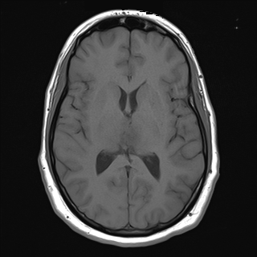

## 문제
A 28-year-old man comes to the physician because of headaches for 3 weeks. The headaches are worse in the morning and are accompanied by nausea. He has no history of seizures or head trauma and takes no medications. He is alert and oriented; visual fields, cranial nerves, strength, sensation, and gait are normal, and there is no papilledema. MRI of the brain is ordered. An axial image at the level of the lateral ventricles, obtained before administration of contrast material, is shown. Which of the following pulse sequences was used to obtain this image?

- A. T2-weighted fast spin echo
- B. Fluid-attenuated inversion recovery (FLAIR)
- C. Diffusion-weighted imaging (DWI)
- D. Susceptibility-weighted imaging (SWI)
- E. T1-weighted spin echo

_Axial MRI of the brain at the level of the lateral ventricles, standard display orientation (patient's right on the viewer's left) (The Cancer Imaging Archive, CC BY 4.0; converted from DICOM without cropping)_

## 정답 및 해설
> 정답: E

- **정답 핵심**: On the image the cerebrospinal fluid in the lateral ventricles and sulci is dark, the white matter is brighter than the gray matter, and the subcutaneous fat of the scalp is bright. Dark CSF excludes a T2-weighted image, in which CSF is the brightest structure. FLAIR also suppresses CSF, but on FLAIR the gray matter is brighter than the white matter (the reverse of what is seen here). DWI has low spatial resolution with faint gray-white contrast, and SWI shows dark veins and no such gray-white differentiation. Bright fat, bright white matter, darker gray matter and black CSF are the signature of a T1-weighted image.
- **원리**: MR contrast comes from two tissue time constants. <b>T1</b> is the time for longitudinal magnetization to recover; a T1-weighted image uses a short repetition time and a short echo time, so tissues that recover quickly (fat, white matter with its myelin lipids, methemoglobin, gadolinium-enhanced tissue) are bright and tissues that recover slowly (free water, CSF, edema) are dark. <b>T2</b> is the time for transverse magnetization to decay; a T2-weighted image uses long repetition and echo times, so free water and CSF stay bright while myelinated white matter is darker than gray matter.  <b>Why the gray-white pattern is the key</b> — CSF brightness separates T2 from everything else, but T1, FLAIR and DWI all show dark CSF. What separates them is the direction of gray-white contrast. On T1 the myelin-rich white matter is <b>brighter</b> than the cortex; on FLAIR (a T2-weighted image with an inversion pulse timed to null CSF) and on DWI the cortex is brighter than the white matter because their contrast is still T2-based. SWI exaggerates magnetic susceptibility, so veins, blood products and calcification appear black on a gray background without meaningful gray-white differentiation.  <b>Why a precontrast T1 is obtained</b> — it is the baseline for the postcontrast T1: intrinsic T1 shortening (fat, blood, melanin, proteinaceous fluid) must be known before enhancement can be attributed to gadolinium. In a young patient with morning headaches and nausea the study is done to look for a mass; on this slice the ventricles are symmetric and there is no midline shift, but a single precontrast slice never excludes a lesion, so the postcontrast T1, T2/FLAIR and diffusion images are read together.
- **비교**: <table><thead><tr><th style="width:24%">Sequence</th><th style="width:22%">CSF</th><th style="width:30%">Gray vs white matter</th><th>Other clues</th></tr></thead><tbody> <tr><td><b>T1-weighted (answer)</b></td><td><b>dark</b></td><td><b>white matter brighter than gray</b></td><td><b>scalp fat bright; baseline for enhancement</b></td></tr> <tr><td>FLAIR (closest wrong answer)</td><td>dark (nulled)</td><td>gray matter brighter than white</td><td>edema and periventricular lesions bright; fat bright</td></tr> <tr><td>T2-weighted</td><td>bright</td><td>gray matter brighter than white</td><td>flow voids in vessels</td></tr> <tr><td>DWI</td><td>dark</td><td>gray slightly brighter; low resolution, distorted</td><td>acute infarct bright (dark on ADC)</td></tr> <tr><td>SWI</td><td>dark to intermediate</td><td>little gray-white contrast</td><td>veins, hemorrhage and calcification black</td></tr> </tbody></table> The <b>closest wrong answer is FLAIR</b> because its CSF is also dark. The discriminator is the <b>direction of gray-white contrast</b>: here the white matter is the brighter tissue, which happens only on T1-weighted images. If the cortex were brighter than the white matter with dark CSF, FLAIR would be the answer; if the CSF were the brightest structure, T2.
- **오답 이유**:
  - (A) On a T2-weighted image the CSF in the ventricles and sulci is the brightest structure and the cortex is brighter than the white matter. Here the CSF is black, so the image cannot be T2-weighted. This option would be correct if the ventricles were bright white and vessels showed dark flow voids.
  - (B) FLAIR nulls the CSF signal, so dark ventricles are compatible with it; but FLAIR contrast remains T2-based, so the cortex is brighter than the white matter and edema is conspicuous. Here the white matter is the brighter tissue. This option would be correct if dark CSF were combined with bright cortex and bright periventricular signal.
  - (C) Diffusion-weighted images are echo-planar acquisitions with low spatial resolution, geometric distortion near the skull base and only faint gray-white contrast, with acute infarcts standing out as bright. The crisp anatomic detail and bright white matter here are not those of DWI. This option would be correct for a blurry image with a bright wedge of restricted diffusion.
  - (D) Susceptibility-weighted imaging shows cortical veins, blood products and calcification as black structures on a background with little gray-white differentiation. This image shows clear gray-white contrast and no prominent dark veins. This option would be correct if the image were dominated by black linear veins and dark foci of hemorrhage.
- **함정**: Do not stop at 'CSF is dark'. T1, FLAIR and DWI all have dark CSF; look at which tissue is brighter — white matter brighter than cortex means T1, cortex brighter than white matter means a T2-based sequence (FLAIR, DWI).
- **학습목표**: 뇌 MRI 축상면에서 뇌척수액·회질·백질의 상대 신호로 T1 강조영상을 T2·FLAIR·DWI·SWI 와 구분한다
- **근거·출처**: TCIA UPENN-GBM series description: 'AX T1 PRE' (precontrast T1-weighted axial) — Grade A for sequence identity (acquisition metadata); teacher-only: patient in a glioblastoma cohort, 28 M, this slice at ventricular level without visible mass · 작성자 판독(2026-09-20): 조영 전 T1 축상, 가쪽뇌실 몸통·삼각부 높이, 뇌척수액 검고 백질이 회질보다 밝음, 대칭, 이 단면에 종괴효과·중심선 이동 없음 · Osborn AG. Osborn's Brain, 2nd ed., ch. 'Introduction to brain imaging' — T1: CSF dark, white matter bright; T2/FLAIR: gray matter brighter than white; DWI/SWI characteristics · Bitar R et al. MR pulse sequences: what every radiologist wants to know but is afraid to ask. RadioGraphics 2006;26:513 · Blumenfeld H. Neuroanatomy through Clinical Cases, 3rd ed., ch. 4 'Neuroimaging' — recognizing T1 vs T2 vs FLAIR

## 출처
- The Cancer Imaging Archive (CC BY 4.0) · series …33765516 · Creative Commons Attribution 4.0 International · https://www.cancerimagingarchive.net/data-usage-policies-and-restrictions/
