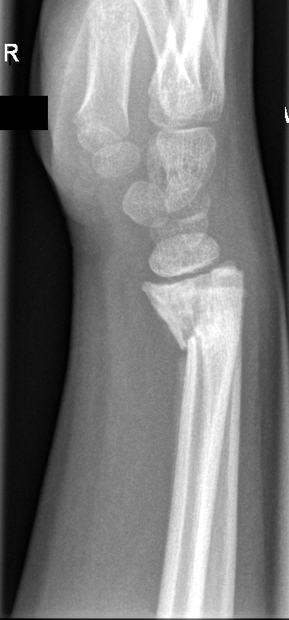

## 문제
8세 여아가 3주 전 자전거에서 넘어져 오른손을 짚은 뒤 손목이 아파 다른 병원에서 부목을 대고 지내다가, 손목이 조금 휘어 보인다며 부모와 함께 병원에 왔다. 통증은 처음보다 많이 줄었고 손가락 움직임과 감각은 정상이다. 진찰에서 오른쪽 손목 등쪽이 약간 튀어나와 있고 압통은 경미하며 피부 손상은 없다. 오른쪽 손목 측면 단순 X선 사진은 그림과 같다. 가장 적절한 처치는?

- A. 골간단 절골술로 각형성을 교정한다
- B. 부목을 제거하고 즉시 관절운동을 시작한다
- C. 부목 고정을 유지하며 재형성을 기다리고 성장을 추적한다
- D. 마취 후 도수 정복하고 장상지 석고 고정을 한다
- E. 관혈적 정복과 금속핀 고정을 한다

_오른쪽 손목 측면 단순 X선, 원본 그대로 크기 조정만 (GRAZPEDWRI-DX, figshare, CC BY 4.0)_

## 정답 및 해설
> 정답: C

- **정답 핵심**: 측면 X선에서 원위 요골 골간단의 골절선이 성장판까지 이어지고 삼각형 골간단 조각이 골단 쪽에 붙은 채 원위 골편이 배측으로 각형성되어 있으며, 요골 간부 배측을 따라 골막 신생골이 보이고 고정에 따른 골감소가 있다. 성장판을 지나면서 골간단 조각을 동반한 이 형태는 Salter-Harris II형 원위 요골 골절이고, 골막 신생골은 수상 3주가 지나 이미 치유가 진행 중임을 뜻한다. 성장판 골절은 수상 7~10일이 지나면 골절면이 미끄러지지 않고 붙어 있어 도수 정복을 하려면 힘을 가해야 하고, 그 힘이 성장판 연골을 다시 손상시켜 성장 정지를 일으킬 수 있다. 8세 여아는 성장이 4~5년 이상 남아 있고 각형성이 성장판 가까이의 시상면(손목 운동면)에 있으므로 재형성 능력이 크다. 따라서 정복하지 않고 고정을 유지해 유합을 마친 뒤 성장 정지 여부를 추적하는 것이 적절하다.
- **원리**: <b>Salter-Harris 분류</b>는 골절선이 성장판(physis)과 어떤 관계에 있는가로 나눈다. I형은 성장판만 따라 분리, <b>II형은 성장판을 지나다 골간단 쪽으로 꺾여 삼각형 골간단 조각(Thurston-Holland 조각)이 골단에 붙어 있는 형태</b>, III형은 골단을 지나 관절면까지, IV형은 골간단·성장판·골단을 모두 관통, V형은 성장판 압궤다. 원위 요골은 소아 성장판 골절이 가장 흔한 부위이고 그중 II형이 대부분이며, II형은 증식층·비대층 사이의 약한 층을 지나기 때문에 성장을 담당하는 <b>배아층(reserve zone)과 증식층이 골단 쪽에 온전히 남아</b> 예후가 좋다.  <b>왜 3주 뒤의 각형성을 정복하지 않는가</b> — 성장판 골절은 첫 며칠은 부드럽게 정복되지만 <b>7~10일이 지나면 골절면에 가골이 자리 잡아</b> 도수 정복에 큰 힘이 든다. 그 힘은 성장판 연골을 다시 갈라 놓고 배아층을 손상시켜 골교(bony bar)와 성장 정지를 만든다. 그래서 늦게 온 II형 골절의 각형성은 「받아들이고 재형성을 기다리는 것」이 원칙이다. 재형성은 (1) 남은 성장 기간이 길수록, (2) 각형성이 성장판에 가까울수록, (3) 각형성이 그 관절의 운동면(손목은 시상면의 굴곡·신전)에 있을수록 잘 되며, 8세 여아의 원위 요골 시상면 각형성은 세 조건을 모두 만족한다 — 10세 미만에서는 시상면 25~30° 까지도 재형성된다. 사진의 골막 신생골(간부 배측을 따라 얇게 덮인 새 뼈)은 이미 유합이 진행 중이라는 증거이고, 골감소는 3주간의 고정에 따른 폐용성 변화다.  <b>언제 수술하는가</b> — 성장이 거의 끝난 청소년의 큰 각형성, 정복되지 않는 III·IV형(관절면 단차), 개방골절이나 신경혈관 손상, 그리고 나중에 성장 정지로 변형이 진행될 때(골교 절제·절골술)다. 그 판단은 유합 뒤 6~12개월의 성장판 추적에서 이루어진다.
- **비교**: <table><thead><tr><th style="width:26%">상황</th><th style="width:42%">근거</th><th>처치</th></tr></thead><tbody> <tr><td><b>II형, 수상 3주, 8세, 시상면 각형성(정답)</b></td><td><b>골막 신생골로 치유 진행, 성장 4~5년 이상, 성장판 근처 운동면 각형성 → 재형성 기대; 늦은 정복은 성장판 재손상</b></td><td><b>고정 유지 → 유합 후 성장 추적</b></td></tr> <tr><td>같은 골절, 수상 당일~1주(가장 가까운 오답의 조건)</td><td>가골 형성 전, 골절면이 부드럽게 미끄러짐 — 부드러운 정복이 안전</td><td>마취 후 도수 정복 + 석고</td></tr> <tr><td>III·IV형(관절면 단차 ≥ 2 mm)</td><td>관절면 부조화와 성장판 관통 — 해부학적 정복이 필요</td><td>관혈적 정복 + 핀·나사 고정</td></tr> <tr><td>성장이 거의 끝난 청소년의 큰 각형성</td><td>재형성 능력 없음</td><td>정복·고정(필요 시 수술)</td></tr> <tr><td>유합 후 성장 정지로 변형 진행</td><td>골교 형성, 요골 단축·척골 돌출</td><td>골교 절제 또는 절골술</td></tr> </tbody></table> <b>가장 가까운 오답은 「도수 정복 후 석고」</b>다 — 사진에 각형성이 뚜렷해 바로잡고 싶어진다. 갈림길은 <b>수상 후 시간과 남은 성장</b>이다. 7~10일이 지난 성장판 골절을 힘으로 정복하면 성장판을 다시 다치고, 8세 아이의 원위 요골 시상면 각형성은 스스로 곧아진다. 반대로 수상 당일이거나 성장이 끝난 청소년이었다면 정복이 정답이 된다.
- **오답 이유**:
  - ① 절골술은 성장이 끝나 재형성이 불가능하거나, 성장 정지로 변형이 진행해 기능 장애를 남길 때 정답이 된다. 8세 여아의 성장판 근처 시상면 각형성은 스스로 교정되므로 지금 절골할 대상이 아니다. 유합 후 추적에서 골교와 진행성 변형이 확인되면 이 선지가 맞다.
  - ② 부목 제거와 즉시 관절운동은 유합이 완료된 뒤의 재활 단계다. 수상 3주는 골막 신생골이 막 생기는 시기로 원위 요골 II형 골절의 보통 고정 기간(4~6주)에 못 미치고, 골감소가 있는 뼈에 하중을 주면 재골절·재전위 위험이 있다. 6주 뒤 압통이 없고 가골이 성숙했다면 이 선지가 정답이 된다.
  - ④ 도수 정복은 성장판 골절이 아직 미끄러지는 수상 7~10일 이내에 부드럽게 시행할 때 정답이 된다. 3주가 지나 골막 신생골이 생긴 골절을 힘으로 정복하면 성장판 연골을 다시 손상시켜 골교와 성장 정지를 일으킨다. 같은 골절로 수상 당일 왔다면 이 선지가 맞다.
  - ⑤ 관혈적 정복과 핀 고정은 관절면 단차가 있는 III·IV형, 정복이 유지되지 않는 불안정 골절, 개방골절·신경혈관 손상에서 정답이 된다. 이 골절은 관절면을 침범하지 않은 II형이고 이미 치유 중이며 재형성이 기대되므로 수술로 성장판 주위를 열 이유가 없다.
- **함정**: X선의 각형성만 보고 「정복」을 고르지 않는다. 골막 신생골 = 이미 치유 중, 수상 3주 = 늦은 정복은 성장판을 다시 다친다, 8세 = 재형성이 남아 있다 — 세 가지가 「기다린다」를 가리킨다.
- **학습목표**: 소아 손목 측면 X선에서 성장판을 지나 골간단 조각이 골단에 붙은 Salter-Harris II형 골절과 골막 신생골(치유 중)을 읽고, 수상 3주가 지난 시상면 각형성은 재형성을 기대하며 고정을 유지하고 성장판 손상 위험이 있는 늦은 도수 정복을 피한다
- **근거·출처**: GRAZPEDWRI-DX (Nagy E et al. Sci Data 2022) expert annotation: fracture, periosteal reaction, AO 23r-E/2.1 (distal radius, epiphyseal, Salter-Harris II) — Grade A; teacher-only: 8.7 F, right wrist, lateral, osteopenia flag · 작성자 판독(2026-09-20): 측면, 원위 요골 골간단 골절선이 성장판까지 이어지고 삼각형 골간단 조각이 골단에 붙은 채 원위 골편 배측 각형성, 요골 간부 배측 골막 신생골, 고정에 따른 골감소 · Rockwood and Wilkins' Fractures in Children, 9th ed., ch. 'Fractures of the distal radius and ulna' — Salter-Harris II distal radius; avoid manipulation after 7–10 days; remodeling potential in children < 10 with sagittal-plane angulation · Salter RB, Harris WR. Injuries involving the epiphyseal plate. J Bone Joint Surg Am 1963;45:587 · Nelson Textbook of Pediatrics, 22nd ed., ch. 'Common fractures' — physeal fractures, growth arrest risk of late reduction, remodeling

## 출처
- GRAZPEDWRI-DX (figshare, CC BY 4.0) · Creative Commons Attribution 4.0 International · https://creativecommons.org/licenses/by/4.0/
