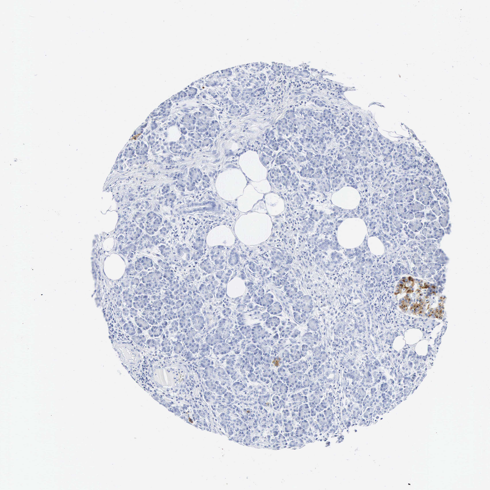

## 문제
A 73-year-old woman with type 2 diabetes mellitus undergoes distal pancreatectomy for a mucinous cystic neoplasm of the pancreatic tail. Her diabetes has been treated with metformin for 8 years; hemoglobin A1c is 8.4%. She has no history of pancreatitis and does not drink alcohol. Her body mass index is 31 kg/m2, blood pressure is 134/82 mm Hg, and serum creatinine is 0.9 mg/dL. A photomicrograph of a section of uninvolved pancreas from the specimen, stained by immunohistochemistry for insulin (brown), is shown. Which of the following drugs acts directly on the brown-stained cells to lower her blood glucose?

- A. Glimepiride
- B. Metformin
- C. Empagliflozin
- D. Pioglitazone
- E. Acarbose

_Immunohistochemistry (DAB brown, hematoxylin counterstain) of a tissue-microarray core, original magnification (Human Protein Atlas, CC BY 4.0; no cropping or adjustment)_

## 정답 및 해설
> 정답: A

- **정답 핵심**: The section shows exocrine acinar tissue that is negative (blue counterstain only) and, at the lower right, a compact cluster of cells that stain strongly brown for insulin: an islet of Langerhans, whose insulin-positive cells are beta cells. Sulfonylureas such as glimepiride bind the SUR1 subunit of the ATP-sensitive potassium channel on the beta-cell membrane, close the channel, depolarize the cell, open voltage-gated calcium channels and trigger insulin exocytosis independently of the blood glucose level. Metformin acts mainly on hepatocytes (reduced gluconeogenesis), empagliflozin on the proximal tubule (SGLT2), pioglitazone on adipocyte PPAR-γ, and acarbose on intestinal brush-border α-glucosidase; none of them acts on the beta cell directly.
- **원리**: The pancreas is two glands in one. The <b>exocrine acini</b> (about 98 % of the mass) make digestive enzymes and are negative for insulin, while the <b>islets of Langerhans</b> are scattered endocrine clusters in which beta cells (60–70 % of islet cells, insulin), alpha cells (glucagon), delta cells (somatostatin) and PP cells sit around a rich capillary network. An immunostain for insulin therefore lights up the islet as a brown island in a blue sea of acini — exactly what the section shows. In long-standing type 2 diabetes the islets are still present but their functional beta-cell mass is reduced, which is why glycemia drifts upward on metformin alone.  <b>Why glimepiride</b> — beta cells sense glucose through metabolism: glucose enters via GLUT2, is phosphorylated by glucokinase, and the resulting rise in ATP/ADP closes the <b>ATP-sensitive potassium channel (Kir6.2 + SUR1)</b>. The membrane depolarizes, voltage-gated calcium channels open and calcium triggers exocytosis of insulin granules. Sulfonylureas bind the SUR1 subunit and close the same channel <b>pharmacologically, regardless of glucose</b>, so they raise insulin secretion even when glucose is normal — the reason they cause hypoglycemia and weight gain and require residual beta cells to work.  <b>Why not the others</b> — metformin lowers hepatic gluconeogenesis (AMPK activation, mitochondrial complex I and glycerophosphate dehydrogenase inhibition) and improves peripheral insulin sensitivity; empagliflozin blocks SGLT2 in the proximal renal tubule so glucose is excreted; pioglitazone activates PPAR-γ in adipocytes and reprograms lipid handling; acarbose inhibits α-glucosidase at the intestinal brush border and slows carbohydrate absorption. Incretin drugs (GLP-1 receptor agonists, DPP-4 inhibitors) do act on beta cells, but through the GLP-1 receptor and cAMP in a <b>glucose-dependent</b> way, and they are not among the options.
- **비교**: <table><thead><tr><th style="width:22%">Drug</th><th style="width:26%">Target cell / site</th><th style="width:30%">Mechanism</th><th>Characteristic effects</th></tr></thead><tbody> <tr><td><b>Glimepiride (answer)</b></td><td><b>pancreatic beta cell</b></td><td><b>closes K-ATP channel (SUR1) → depolarization → Ca2+ influx → insulin release</b></td><td><b>hypoglycemia, weight gain; needs residual beta cells</b></td></tr> <tr><td>Metformin (closest wrong answer)</td><td>hepatocyte (and muscle)</td><td>↓ gluconeogenesis, ↑ insulin sensitivity</td><td>no hypoglycemia, weight neutral, GI upset, lactic acidosis with renal failure</td></tr> <tr><td>Empagliflozin</td><td>proximal tubule</td><td>SGLT2 inhibition → glycosuria</td><td>weight and BP loss, genital infections, euglycemic DKA</td></tr> <tr><td>Pioglitazone</td><td>adipocyte nucleus</td><td>PPAR-γ agonist → insulin sensitization</td><td>edema, weight gain, heart failure, fractures</td></tr> <tr><td>Acarbose</td><td>intestinal brush border</td><td>α-glucosidase inhibition</td><td>flatulence, lowers postprandial glucose only</td></tr> </tbody></table> The <b>closest wrong answer is metformin</b>: it is her current drug and the most familiar one, but it lowers glucose by acting on the liver, not on the islet. The discriminator is the question's wording — <b>'acts directly on the brown-stained cells'</b> — which requires recognizing the brown cluster as insulin-positive beta cells and matching it to the one drug whose receptor (SUR1) sits on that cell. If the question asked which drug acts on the proximal tubule, empagliflozin would be the answer.
- **오답 이유**:
  - (B) Metformin is the drug she already takes and the usual first-line agent, but it lowers glucose by suppressing hepatic gluconeogenesis and improving insulin sensitivity; it does not stimulate beta cells and does not cause hypoglycemia on its own. This option would be correct if the question asked which drug acts on hepatocytes.
  - (C) Empagliflozin inhibits SGLT2 in the proximal renal tubule so that filtered glucose is excreted in the urine; it lowers glucose independently of insulin and of the beta cell. This option would be correct if the question asked which drug acts on the kidney or which drug reduces heart-failure hospitalization.
  - (D) Pioglitazone is a PPAR-γ agonist acting in adipocyte nuclei to redistribute lipid and increase insulin sensitivity in muscle and liver; it has no direct effect on insulin secretion. This option would be correct if the question asked which drug acts on adipose tissue or which causes edema and heart failure.
  - (E) Acarbose inhibits α-glucosidase at the intestinal brush border, delaying carbohydrate digestion and blunting postprandial glucose peaks; it never reaches the islet. This option would be correct if the question asked which drug acts in the intestinal lumen or which causes flatulence as its main adverse effect.
- **함정**: The brown cluster is not 'pancreas' in general — it is the islet, and insulin-positive means beta cells. Match the cell to the receptor: sulfonylureas bind SUR1 on the beta cell; metformin, SGLT2 inhibitors, glitazones and acarbose all work somewhere else.
- **학습목표**: 췌장 면역조직화학에서 인슐린 양성 세포군을 랑게르한스섬의 베타세포로 알아보고, 베타세포에 직접 작용해 인슐린 분비를 늘리는 약(설폰요소제)을 간·콩팥·지방·장에 작용하는 약과 구분한다
- **근거·출처**: Human Protein Atlas tissue IHC: INS antibody, pancreas — pancreatic endocrine cells 'high', exocrine glandular cells 'not detected' (pathologist annotation, Grade B; tissue identity Grade A); teacher-only: 73 F · 작성자 판독(2026-09-20): 선포 조직 음성(파란 대조염색), 오른쪽 아래 랑게르한스섬 세포군 갈색 강양성, 산발적 갈색 세포, 지방 침윤 · Katzung BG. Basic & Clinical Pharmacology, 16th ed., ch. 41 'Pancreatic hormones and antidiabetic drugs' — sulfonylureas bind SUR1 and close the K-ATP channel of the beta cell; mechanisms of metformin, SGLT2 inhibitors, thiazolidinediones, α-glucosidase inhibitors · Goodman & Gilman's The Pharmacological Basis of Therapeutics, 14th ed., ch. 'Endocrine pancreas and pharmacotherapy of diabetes mellitus' · Ross MH, Pawlina W. Histology: A Text and Atlas, 8th ed., ch. 'Digestive system III: liver, gallbladder, and pancreas' — islets of Langerhans, beta cells

## 출처
- Human Protein Atlas, INS / Pancreas (CC BY 4.0), https://images.proteinatlas.org/48/1694_A_2_3.jpg · Creative Commons Attribution 4.0 International · https://www.proteinatlas.org/about/licence
