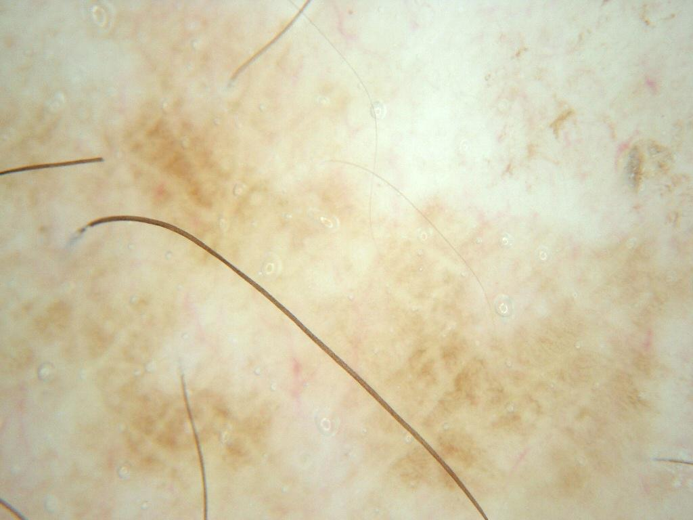

## 문제
75세 남자가 3년 전부터 왼쪽 아래팔 손등 쪽에 있던 갈색 반점이 최근 조금 커진 것 같다며 병원에 왔다. 평생 야외에서 농사를 지었고, 가려움이나 출혈은 없으며 흑색종 가족력은 없다. 진찰에서 지름 9 mm 의 편평한 옅은 갈색 반이 있고 만져지는 부분이나 궤양은 없다. 이 병변의 더모스코피 사진은 그림과 같다. 가장 적절한 진단은?

- A. 접합모반
- B. 표재확산흑색종
- C. 일광흑자
- D. 악성흑자
- E. 지루각화증

_더모스코피 사진, 원본 그대로 크기 조정만 (ISIC Archive, CC-0 — 크롭·색보정 없음)_

## 정답 및 해설
> 정답: C

- **정답 핵심**: 더모스코피에서 옅은 갈색 색소가 균질하게 깔려 있고 그 위에 미세하고 규칙적인 그물·지문 모양 무늬가 보이며, 털과 모낭 개구부는 정상이다. 모낭 개구부 주위의 비대칭 색소, 마름모 구조, 회색 점·과립, 청백색 베일, 비정형 색소망, 면포양 개구부나 뇌회 모양은 없다. 고령의 햇빛 노출부(아래팔)에 생긴 편평하고 균질한 갈색 반은 일광흑자이며, 최근 조금 커진 것처럼 느끼는 것은 일광흑자에서도 흔하다. 악성흑자를 시사하는 모낭 주위 구조가 없고, 지루각화증의 각질 구조와 접합모반·흑색종의 색소망 이상도 없다.
- **원리**: <b>일광흑자(solar lentigo)</b>는 만성 자외선 노출로 표피 기저층의 멜라닌이 늘고 표피능(rete ridge)이 길어진 병변이다. 멜라닌세포 수는 정상이거나 약간 늘 뿐 <b>둥지를 만들지 않고 비정형도 없다</b>. 그래서 더모스코피에서는 색소가 표피 전체에 고르게 퍼진 <b>균질한 옅은 갈색</b>으로 보이고, 길어진 표피능이 모낭 개구부 사이를 채우면서 <b>미세하고 규칙적인 그물 무늬(위색소망)나 지문 모양의 평행선</b>이 나타난다. 가장자리는 벌레 먹은 듯 (moth-eaten) 불규칙할 수 있지만 색은 한 가지다.  <b>왜 악성흑자와 갈리는가</b> — 악성흑자(lentigo maligna)는 햇빛으로 손상된 피부의 기저층을 따라 <b>비정형 멜라닌세포가 모낭 상피까지 내려가며</b> 퍼지는 제자리 흑색종이다. 그래서 모낭 개구부 주위에 색소가 <b>비대칭으로 고리처럼</b> 쌓이고(비대칭 색소 모낭 개구부), 모낭 사이가 색소로 이어져 <b>마름모(rhomboidal) 구조</b>를 만들며, 진피로 떨어진 멜라닌을 큰포식세포가 삼켜 <b>회색 점·과립(annular-granular)</b>이 보이고, 진행하면 모낭이 막혀 균질한 검은 반이 된다. 이 사진에는 그런 모낭 중심 구조가 없다.  <b>다른 감별</b> — 지루각화증은 표피 증식으로 면포양 개구부·좁쌀종양 낭·뇌회 모양·경계 명확한 「붙여 놓은」 모양을 보인다. 접합모반은 규칙적 색소망을 갖지만 젊은 나이에 생기고 크기가 작다. 표재확산흑색종은 비대칭·다색·비정형 색소망·청백색 베일·퇴행 구조가 있다.
- **비교**: <table><thead><tr><th style="width:24%">진단</th><th style="width:46%">더모스코피의 결정적 구조</th><th>이 증례</th></tr></thead><tbody> <tr><td><b>일광흑자(정답)</b></td><td><b>균질한 옅은 갈색, 미세·규칙적 그물 또는 지문 무늬, 모낭 개구부 정상</b></td><td><b>모두 있음</b></td></tr> <tr><td>악성흑자(가장 가까운 오답)</td><td>모낭 개구부 주위 비대칭 색소, 마름모 구조, 회색 점·과립, 모낭 폐쇄</td><td>모낭 주위 구조 없음</td></tr> <tr><td>지루각화증</td><td>면포양 개구부, 좁쌀종양 낭, 뇌회 모양, 명확한 경계</td><td>각질 구조 없음, 편평</td></tr> <tr><td>접합모반</td><td>규칙적 색소망, 젊은 나이, 작은 크기</td><td>75세 햇빛 노출부의 9 mm 반</td></tr> <tr><td>표재확산흑색종</td><td>비대칭, 여러 색, 비정형 색소망, 청백색 베일, 퇴행</td><td>단색·균질</td></tr> </tbody></table> <b>가장 가까운 오답은 「악성흑자」</b>다 — 고령·햇빛 노출부·「커진다」는 병력이 그쪽을 떠올리게 한다. 갈림길은 <b>모낭 개구부 주위의 색소 분포</b>다. 모낭 주위에 비대칭 고리·마름모·회색 과립이 있으면 악성흑자를 의심해 생검하고, 색소가 균질하고 모낭이 정상이면 일광흑자다. 편평 병변이라도 이 구조가 하나라도 보이면 나이와 크기에 관계없이 조직검사가 필요하다.
- **오답 이유**:
  - ① 접합모반은 표피·진피 경계의 멜라닌세포 둥지로 규칙적 색소망을 보이지만 대개 젊은 나이에 생기고 크기가 작으며 새로 생기거나 커지는 일이 드물다. 75세 햇빛 노출부의 9 mm 반에는 맞지 않는다. 젊은 환자의 작은 반에서 규칙적 색소망이 뚜렷했다면 이 선지가 맞다.
  - ② 표재확산흑색종은 비대칭·여러 색·비정형 색소망·청백색 베일·퇴행 구조 같은 흑색종 특이 구조를 보인다. 이 사진은 한 가지 옅은 갈색으로 균질하고 그런 구조가 없다. 병변이 비대칭이고 색이 여럿이며 비정형 색소망이나 청백색 구조가 있었다면 이 선지가 정답이 된다.
  - ④ 악성흑자는 고령의 햇빛 노출부에 생기는 제자리 흑색종으로 이 증례와 배경이 같지만, 더모스코피에서 모낭 개구부 주위 비대칭 색소·마름모 구조·회색 점과 과립이 있어야 한다. 이 사진은 색소가 균질하고 모낭이 정상이다. 모낭 주위에 그런 구조가 보였다면 이 선지가 정답이 되고 생검이 필요하다.
  - ⑤ 지루각화증은 표피가 두꺼워진 각화성 병변으로 면포양 개구부·좁쌀종양 낭·뇌회 모양과 「붙여 놓은 듯한」 경계를 보이며 만져진다. 이 병변은 편평하고 그런 각질 구조가 없다. 표면이 오톨도톨하고 면포양 개구부가 여럿 보였다면 이 선지가 정답이 된다.
- **함정**: 「고령 + 햇빛 노출부 + 커진다」에서 멈추고 악성흑자로 가지 않는다. 판단은 모낭 개구부 주위의 색소 분포로 한다 — 균질하고 모낭이 정상이면 일광흑자, 비대칭 고리·마름모·회색 과립이면 악성흑자.
- **학습목표**: 노인의 햇빛 노출부 편평 갈색 반의 더모스코피에서 균질한 옅은 갈색 색소와 규칙적인 미세 그물 무늬를 읽고, 악성흑자의 모낭 주위 비대칭 색소·마름모 구조·회색 과립이 없음을 근거로 일광흑자를 진단한다
- **근거·출처**: ISIC Archive ISIC_0010045 — diagnosis: Lentigo NOS (histopathology-confirmed), 75 M, upper extremity — Grade A; teacher-only · 작성자 판독(2026-09-21): 균질한 옅은 갈색 색소, 미세·규칙적 그물·지문 무늬, 모낭 개구부 정상, 비대칭 모낭 주위 색소·마름모·회색 과립·청백색 구조 없음, 털 외 식별 표지 없음 · Marghoob AA, Malvehy J, Braun RP (eds). Atlas of Dermoscopy, 2nd ed. — solar lentigo (homogeneous light brown, fingerprint pattern, moth-eaten border) vs lentigo maligna (asymmetric pigmented follicular openings, rhomboidal structures, annular-granular pattern) · Schiffner R et al. Improvement of early recognition of lentigo maligna using dermatoscopy. J Am Acad Dermatol 2000;42:25 · Bolognia JL et al. Dermatology, 5th ed., ch. 'Benign melanocytic neoplasms' and 'Melanoma' — lentigo, lentigo maligna

## 출처
- ISIC Archive ISIC_0010045 (CC-0) · CC0 1.0 Universal · https://creativecommons.org/publicdomain/zero/1.0/
