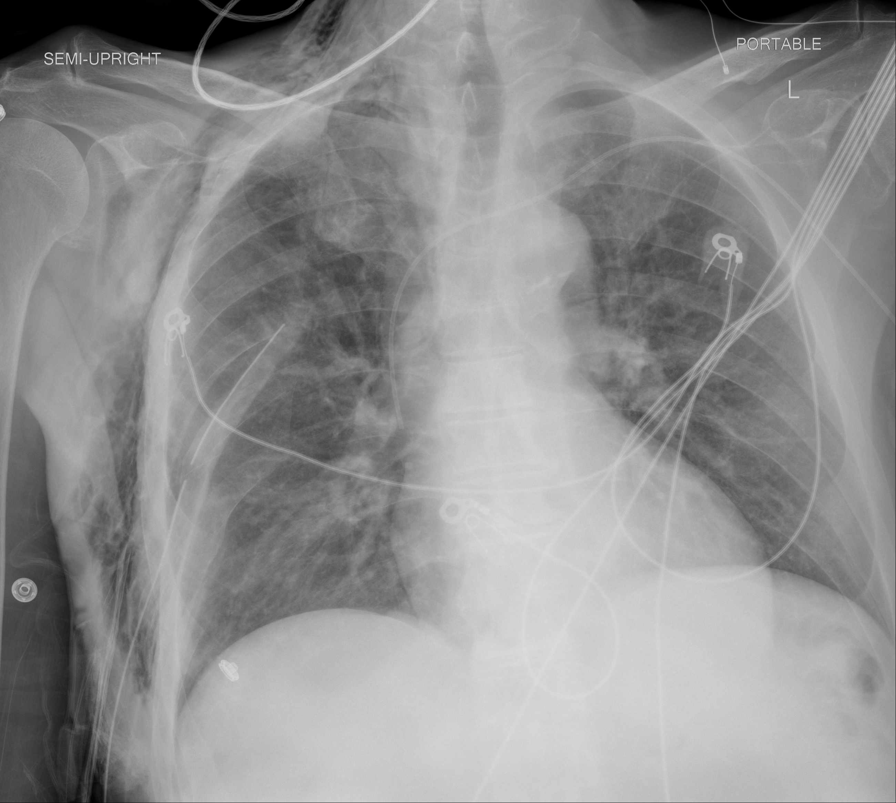

## 문제
A 59-year-old man is brought to the emergency department by his wife because of fever, productive cough, and progressive shortness of breath for 4 days and confusion since this morning. He has hypertension treated with amlodipine, has never smoked, and has not been hospitalized or received antibiotics in the past year. His temperature is 39.0°C, pulse is 118/min, respirations are 32/min, and blood pressure is 88/54 mm Hg; after a 2-L bolus of crystalloid, blood pressure is 104/66 mm Hg. Oxygen saturation is 90% on 6 L/min of oxygen by nasal cannula. He is disoriented to time and place. Crackles are heard over both lung fields. Laboratory studies show a leukocyte count of 21,000/mm3, platelet count of 180,000/mm3, blood urea nitrogen of 32 mg/dL, serum creatinine of 1.4 mg/dL, and lactate of 2.4 mmol/L. Arterial blood gas analysis on 6 L/min of oxygen shows a PaO2/FiO2 ratio of 230. A portable chest radiograph is shown. Which of the following is the most appropriate management?

- A. Discharge home with oral amoxicillin-clavulanate plus azithromycin
- B. Admission to the intensive care unit and intravenous ceftriaxone plus azithromycin
- C. Admission to the medical ward and intravenous ceftriaxone plus azithromycin
- D. Admission to the medical ward and oral levofloxacin
- E. Admission to the intensive care unit and intravenous vancomycin plus piperacillin-tazobactam

_Portable anteroposterior chest radiograph obtained in the semi-upright position, unaltered apart from scaling (The Cancer Imaging Archive, CC BY 4.0; no cropping or window adjustment)_

## 정답 및 해설
> 정답: B

- **정답 핵심**: The portable radiograph shows patchy opacities in the right mid and lower lung zones and around the left hilum, that is, multilobar bilateral infiltrates without a large effusion or pneumothorax. Together with the vignette the patient meets at least six IDSA/ATS minor criteria for severe community-acquired pneumonia: confusion, respiratory rate ≥ 30/min, BUN ≥ 20 mg/dL, multilobar infiltrates, PaO2/FiO2 ≤ 250, and hypotension requiring aggressive fluid resuscitation. Three or more minor criteria (or one major criterion) define severe pneumonia that should be admitted to the intensive care unit, because delayed ICU transfer in such patients increases mortality. He has no risk factors for MRSA or Pseudomonas (no prior hospitalization, antibiotics, or known colonization), so the recommended regimen is an intravenous β-lactam plus a macrolide (or plus a respiratory fluoroquinolone), not vancomycin plus an antipseudomonal agent.
- **원리**: <b>Site of care is the first decision in pneumonia</b>, because it determines monitoring, the route and breadth of antibiotics, and outcome. Two tools are used in sequence. Scores such as CURB-65 (confusion, urea > 20 mg/dL, respiratory rate ≥ 30, blood pressure < 90/60, age ≥ 65) or the PSI decide <b>outpatient versus inpatient</b>; this patient already has confusion, uremia, tachypnea and hypotension (CURB-65 = 4), so discharge is not an option. The <b>IDSA/ATS 2007 severe-CAP criteria</b> then decide <b>ward versus ICU</b>: one major criterion (mechanical ventilation, or septic shock requiring vasopressors) or three or more minor criteria — respiratory rate ≥ 30, PaO2/FiO2 ≤ 250, multilobar infiltrates, confusion, BUN ≥ 20 mg/dL, leukopenia &lt; 4,000, thrombocytopenia &lt; 100,000, hypothermia &lt; 36°C, and hypotension requiring aggressive fluids. He has six, so he belongs in the ICU even though he does not yet need a ventilator or a vasopressor; patients who meet these criteria but are admitted to the ward and later transferred have higher mortality.  <b>Why a β-lactam plus a macrolide</b> — severe CAP is most often caused by Streptococcus pneumoniae, Legionella, Haemophilus, Staphylococcus aureus and gram-negative bacilli; the β-lactam covers the pneumococcus and Haemophilus while the macrolide adds atypical coverage (Legionella, Mycoplasma) and an immunomodulatory effect that has been associated with lower mortality in severe disease. A respiratory fluoroquinolone may replace the macrolide, but fluoroquinolone <b>monotherapy</b> is not recommended in the ICU. Coverage for MRSA (vancomycin, linezolid) or Pseudomonas (piperacillin-tazobactam, cefepime) is added only when locally validated risk factors are present — prior respiratory isolation of the organism, or recent hospitalization with intravenous antibiotics — none of which this patient has.  <b>The radiograph's role</b> — it supplies one of the minor criteria (multilobar infiltrates) and excludes alternatives that would change management, such as a large parapneumonic effusion needing drainage or a pneumothorax.
- **비교**: <table><thead><tr><th style="width:30%">Management</th><th style="width:40%">When it is correct</th><th>This patient</th></tr></thead><tbody> <tr><td><b>ICU + IV ceftriaxone + azithromycin (answer)</b></td><td><b>≥ 3 minor or 1 major IDSA/ATS criterion; no MRSA/Pseudomonas risk factors</b></td><td><b>6 minor criteria; no risk factors</b></td></tr> <tr><td>Ward + IV ceftriaxone + azithromycin (closest wrong answer)</td><td>Needs admission (CURB-65 ≥ 2) but fewer than 3 minor criteria</td><td>Undertriage — confusion, RR 32, BUN 32, multilobar, P/F 230, fluid-requiring hypotension</td></tr> <tr><td>Ward + oral levofloxacin</td><td>Non-severe inpatient who can take oral drugs</td><td>Confused, hypoxemic, hypotensive — not oral, not ward</td></tr> <tr><td>ICU + vancomycin + piperacillin-tazobactam</td><td>Severe CAP with prior MRSA/Pseudomonas isolation or recent hospitalization with IV antibiotics</td><td>No such risk factors — unnecessary breadth</td></tr> <tr><td>Discharge with oral amoxicillin-clavulanate + azithromycin</td><td>CURB-65 0–1, normal oxygenation, able to take oral medication</td><td>CURB-65 = 4</td></tr> </tbody></table> The <b>closest wrong answer is ward admission with the same antibiotics</b>, because the regimen is right and the patient is not intubated or on a vasopressor. The discriminator is the <b>count of minor criteria</b>: three or more means ICU regardless of whether a major criterion is present. Had he been alert with a respiratory rate of 24, a BUN of 15 and a single lobar infiltrate, the ward would have been appropriate; had he needed norepinephrine despite fluids, a major criterion would have made the ICU decision immediate.
- **오답 이유**:
  - (A) Outpatient therapy is appropriate only for CURB-65 0–1 with adequate oxygenation and reliable oral intake. This patient has confusion, uremia, tachypnea and hypotension (CURB-65 = 4) and needs supplemental oxygen. This option would be correct for a young, alert patient with normal vital signs and oxygen saturation.
  - (C) The antibiotic choice is correct, but this patient meets six IDSA/ATS minor criteria for severe pneumonia (confusion, respiratory rate 32, BUN 32, multilobar infiltrates, PaO2/FiO2 230, hypotension requiring fluids), and three are enough for ICU admission. This option would be correct for a patient needing admission with fewer than three minor criteria.
  - (D) Oral fluoroquinolone monotherapy on the ward is reasonable for non-severe inpatients who can take oral medication, but a confused, hypoxemic, recently hypotensive patient cannot be relied on to absorb oral drugs and needs intravenous combination therapy in a monitored setting. This option would be correct for an alert, normotensive patient with a single lobar infiltrate.
  - (E) Vancomycin plus piperacillin-tazobactam adds coverage for MRSA and Pseudomonas, which is indicated only with prior isolation of those organisms from the respiratory tract or recent hospitalization with intravenous antibiotics. He has none of these, so the broader regimen adds toxicity without benefit. This option would be correct if he had been hospitalized with IV antibiotics in the past 90 days.
- **함정**: Do not equate 'no ventilator, no vasopressor' with 'no ICU'. Count the minor criteria — confusion, RR ≥ 30, BUN ≥ 20, multilobar infiltrates, P/F ≤ 250, fluid-requiring hypotension — three or more is severe pneumonia and belongs in the ICU.
- **학습목표**: 지역사회획득 폐렴에서 다엽 침윤·착란·빈호흡·요소질소 상승·수액이 필요한 저혈압·PaO2/FiO2 저하 같은 IDSA/ATS 중증 기준을 세어 중환자실 입원을 결정하고, 위험인자가 없으면 β-락탐과 마크로라이드 병합을 선택한다
- **근거·출처**: TCIA COVID-19-AR (UAMS) series label: chest radiograph with bilateral opacities — Grade B; teacher-only: patient in a confirmed COVID-19 cohort, 59 M · 작성자 판독(2026-09-21): 이동식 반좌위 AP, 오른쪽 중·하부 폐야와 왼쪽 폐문 주위의 다발성 반점상 음영(다엽), 큰 흉수·기흉 없음, 감시 전극·선 다수, 번인 문자 'SEMI-UPRIGHT'·'PORTABLE'·'L' 뿐 · Metlay JP et al. Diagnosis and treatment of adults with community-acquired pneumonia: ATS/IDSA clinical practice guideline. Am J Respir Crit Care Med 2019;200:e45 — severe CAP criteria (1 major or ≥ 3 minor), β-lactam + macrolide for severe CAP, MRSA/Pseudomonas coverage only with risk factors · Mandell LA et al. IDSA/ATS consensus guidelines on the management of community-acquired pneumonia in adults. Clin Infect Dis 2007;44:S27 — minor criteria list · Lim WS et al. Defining community acquired pneumonia severity on presentation to hospital: CURB-65. Thorax 2003;58:377 · Harrison's Principles of Internal Medicine 21st ed., ch. 'Pneumonia'; Tintinalli's Emergency Medicine 9th ed., ch. 'Community-acquired pneumonia'

## 출처
- COVID-19-AR, The Cancer Imaging Archive (CC BY 4.0) · series …45135712 · Creative Commons Attribution 4.0 International · https://www.cancerimagingarchive.net/data-usage-policies-and-restrictions/
