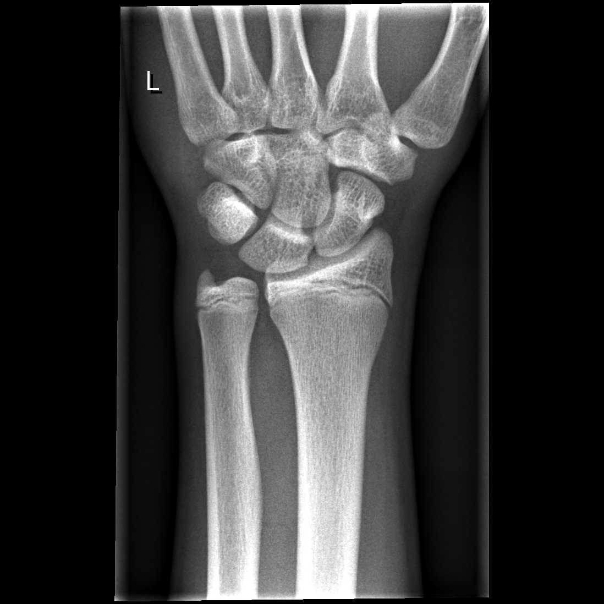

## 문제
A 12-year-old boy is brought to the emergency department 2 hours after falling from a skateboard onto his outstretched left hand. He has pain in the left wrist and does not want to move it. He has no other injuries and no history of fractures. Examination shows mild soft-tissue swelling over the dorsal aspect of the left wrist without deformity or ecchymosis. There is marked point tenderness over the distal radius about 1 cm proximal to the wrist joint line; the anatomic snuffbox is nontender. Finger motion, sensation, and capillary refill are normal, and the radial pulse is present. An anteroposterior radiograph of the left wrist is shown. Which of the following is the most appropriate next step in management?

- A. MRI of the left wrist
- B. Closed reduction and long-arm casting
- C. Thumb spica cast for a suspected scaphoid fracture
- D. Immobilization in a short-arm cast and re-evaluation in 2 to 3 weeks
- E. Reassurance, ice, and return to activity as tolerated

_Anteroposterior radiograph of the left wrist, unaltered apart from scaling (GRAZPEDWRI-DX, figshare, CC BY 4.0)_

## 정답 및 해설
> 정답: D

- **정답 핵심**: The radiograph shows a skeletally immature wrist: the distal radial and ulnar physes are open, the carpal bones are normally aligned, and there is no cortical break, buckle, widening of the physis, or periosteal reaction. In a child, however, the physis is the weakest part of the bone, and a fall on the outstretched hand with marked point tenderness directly over the distal radial growth plate is treated as a Salter-Harris type I fracture even when the radiograph is normal, because a nondisplaced separation through the physeal cartilage is radiolucent. The correct management is immobilization in a short-arm cast (or splint) for about 3 weeks with re-evaluation, when periosteal new bone or physeal widening on repeat films confirms the diagnosis. Reassurance risks displacement of an unrecognized physeal fracture; MRI is not needed for a clinically evident, nondisplaced injury; there is no deformity to reduce; and the nontender snuffbox argues against a scaphoid fracture.
- **원리**: <b>Why the physis matters</b> — in a growing child the ligaments are stronger than the cartilaginous growth plate, so the same fall that would sprain an adult's wrist tends to <b>separate the physis</b>. The Salter-Harris classification describes the path of the fracture line: <b>type I runs only through the physis</b> (through the hypertrophic zone, sparing the germinal reserve zone on the epiphyseal side), type II exits through the metaphysis leaving a triangular Thurston-Holland fragment, type III exits through the epiphysis into the joint, type IV crosses metaphysis, physis and epiphysis, and type V is a crush injury. Type I is the injury of the youngest and, when nondisplaced, is <b>invisible on radiographs</b> because cartilage is radiolucent and nothing has moved; only subtle physeal widening or soft-tissue swelling may be seen.  <b>Why point tenderness over the physis is treated as a fracture</b> — the diagnosis of a nondisplaced Salter-Harris I fracture is clinical. Reading the film as 'normal' and reassuring the family leaves an unrecognized fracture unprotected; it may displace with further use and, rarely, injure the growth plate. Immobilization for about 3 weeks costs little, and repeat radiographs at 2–3 weeks show periosteal new bone along the metaphysis or subchondral sclerosis if the physis was indeed fractured, which also documents the injury for follow-up of growth. Prognosis for type I injuries of the distal radius is excellent; growth arrest is rare because the reserve zone stays with the epiphysis.  <b>Why not the other options</b> — the snuffbox is nontender and the tenderness is proximal to the joint line over the radius, so scaphoid immobilization (thumb spica) addresses the wrong bone; there is no deformity or displacement to reduce, so closed reduction and a long-arm cast are unnecessary; MRI can show physeal edema but does not change management for a nondisplaced injury and is reserved for persistent symptoms or diagnostic uncertainty.
- **비교**: <table><thead><tr><th style="width:30%">Management</th><th style="width:40%">When it is correct</th><th>This patient</th></tr></thead><tbody> <tr><td><b>Short-arm cast, re-evaluate in 2–3 weeks (answer)</b></td><td><b>Point tenderness over the distal radial physis with a normal radiograph — presumed Salter-Harris I</b></td><td><b>Tenderness 1 cm proximal to the joint over the radius; open physes, no fracture line</b></td></tr> <tr><td>Reassurance and return to activity (closest wrong answer)</td><td>Diffuse mild tenderness without physeal point tenderness, normal film — wrist sprain (uncommon in children)</td><td>Marked point tenderness over the physis argues against a sprain</td></tr> <tr><td>MRI of the wrist</td><td>Persistent pain after 2–3 weeks of immobilization with normal repeat films, or suspected occult scaphoid/ligament injury</td><td>Not needed initially — clinical diagnosis, nondisplaced</td></tr> <tr><td>Closed reduction, long-arm cast</td><td>Displaced or angulated distal radius/physeal fracture</td><td>No deformity, normal alignment</td></tr> <tr><td>Thumb spica for scaphoid</td><td>Anatomic snuffbox tenderness after a fall on the outstretched hand</td><td>Snuffbox is nontender; tenderness is over the radius</td></tr> </tbody></table> The <b>closest wrong answer is reassurance</b>, because the radiograph is genuinely normal. The discriminator is the <b>location of tenderness</b>: focal tenderness over the growth plate in a child with open physes means a Salter-Harris I fracture until proven otherwise, and the film cannot exclude it. Had the tenderness been in the anatomic snuffbox instead, a thumb spica cast with repeat imaging for an occult scaphoid fracture would have been the answer.
- **오답 이유**:
  - (A) MRI can demonstrate physeal edema, but it does not change the management of a nondisplaced physeal injury, which is immobilization either way. It is reserved for persistent pain after 2–3 weeks with normal repeat radiographs or for suspected occult scaphoid or ligamentous injury. This option would be correct if pain persisted after the period of casting with negative repeat films.
  - (B) Closed reduction is needed only when a fracture is displaced or angulated beyond what remodeling will correct, and a long-arm cast is used to control forearm rotation after reduction. This wrist has no deformity and the radiograph shows normal alignment, so there is nothing to reduce. This option would be correct for a dorsally displaced Salter-Harris II fracture with visible angulation.
  - (C) A thumb spica cast is the treatment for a suspected scaphoid fracture, which presents with anatomic snuffbox tenderness after a fall on the outstretched hand and is also often radiographically occult at first. Here the snuffbox is nontender and the tenderness is over the distal radius proximal to the joint line. This option would be correct if the snuffbox had been tender.
  - (E) Reassurance is appropriate for a wrist sprain, but ligamentous sprains are uncommon in children because the physis fails before the ligaments do. Marked point tenderness directly over the distal radial growth plate with a normal radiograph is a nondisplaced Salter-Harris I fracture until proven otherwise, and leaving it unprotected risks displacement. This option would be correct if the tenderness were diffuse and mild, away from the physis.
- **함정**: A normal radiograph does not exclude a fracture in a child with open growth plates. Where the tenderness is decides: over the physis → treat as Salter-Harris I and immobilize; in the anatomic snuffbox → treat as an occult scaphoid fracture.
- **학습목표**: 소아 손목 외상에서 원위 요골 성장판 위의 점 압통과 정상 X선을 조합해 방사선학적으로 보이지 않는 Salter-Harris I형 골절로 판단하고, 안심시키기 대신 고정과 2~3주 뒤 재평가를 선택한다
- **근거·출처**: GRAZPEDWRI-DX (Nagy E et al. Sci Data 2022) — pediatric radiologists' annotation: wrist radiograph without fracture, 12.9-year-old male, left, AP — Grade A; teacher-only · 작성자 판독(2026-09-21): 왼쪽 손목 전후면, 원위 요골·척골 성장판 열려 있음, 피질 단절·융기·성장판 벌어짐·골막반응 없음, 수근골 정렬 정상, 'L' 표지 외 문자 없음 · Salter RB, Harris WR. Injuries involving the epiphyseal plate. J Bone Joint Surg Am 1963;45:587 · Nelson Textbook of Pediatrics, 21st ed., ch. 'Common fractures' — Salter-Harris type I fractures are often radiographically occult; treat clinically suspected injuries with immobilization · Rockwood and Wilkins' Fractures in Children, 9th ed., ch. 'Fractures of the distal radius and ulna' — nondisplaced physeal fractures: cast 3 weeks, repeat radiographs

## 출처
- GRAZPEDWRI-DX (figshare, CC BY 4.0) · Creative Commons Attribution 4.0 International · https://creativecommons.org/licenses/by/4.0/
