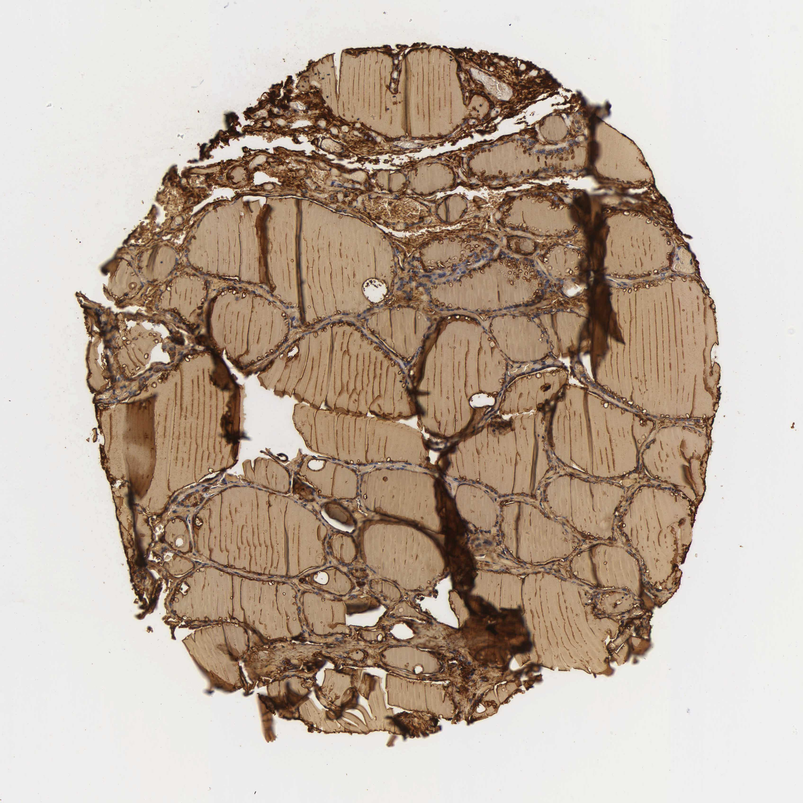

## 문제
34세 남자가 건강검진 초음파에서 발견된 갑상샘 오른엽의 2.5 cm 결절로 병원에 왔다. 목의 압박감이나 갑상샘기능 이상 증상은 없고, 갑상샘자극호르몬 1.8 μU/mL 로 정상이다. 세침흡인검사에서 여포성 종양이 의심되어 오른쪽 갑상샘엽절제술을 받았다. 절제한 갑상샘의 결절 밖 정상 부위 조직 절편에 한 가지 단백질에 대한 면역조직화학염색을 시행한 사진은 그림과 같다. 갈색으로 염색된 단백질의 기능으로 가장 적절한 것은?

- A. 타이로신 잔기가 요오드화되어 갑상샘호르몬 합성의 골격이 된다
- B. 여포세포 정단막에서 요오드를 산화하고 타이로신에 결합시킨다
- C. 여포세포 기저측막에서 나트륨과 함께 요오드를 세포 안으로 들여온다
- D. 여포곁세포에서 분비되어 혈중 칼슘 농도를 낮춘다
- E. 혈액에서 티록신과 결합하여 운반한다

_조직 마이크로어레이 코어의 면역조직화학염색(DAB 갈색, 헤마톡실린 대조염색), 원 배율 (Human Protein Atlas, CC BY 4.0 — 크롭·보정 없음)_

## 정답 및 해설
> 정답: A

- **정답 핵심**: 사진에서 여포 내강을 채운 콜로이드가 균질하게 강한 갈색으로 염색되어 있고 여포상피도 갈색이며, 사이질과 혈관은 옅고 핵만 파랗다. 여포 내강, 즉 세포 밖 공간에 대량으로 저장되는 단백질은 타이로글로불린뿐이다. 타이로글로불린은 여포세포에서 합성돼 정단막을 통해 내강으로 분비되고, 그 타이로신 잔기가 갑상샘과산화효소에 의해 요오드화·짝지음을 거쳐 T3·T4 를 품은 채 콜로이드로 저장되었다가 다시 세포로 흡수되어 단백분해로 호르몬을 내놓는다. 갑상샘과산화효소는 정단막에, 나트륨-요오드 공동수송체는 기저측막에 위치해 세포 경계를 따라 선상으로 염색되고, 칼시토닌은 여포 사이에 흩어진 소수의 여포곁세포에만 염색되며, 티록신결합글로불린은 간에서 만들어지는 혈장 단백질이라 갑상샘 조직에는 염색되지 않는다.
- **원리**: <b>갑상샘호르몬 합성의 지도</b> — 여포세포는 극성이 있다. <b>기저측막</b>(혈관 쪽)에는 나트륨-요오드 공동수송체(NIS)가 있어 Na⁺ 농도기울기를 이용해 요오드를 세포 안으로 끌어들이고, <b>정단막</b>(내강 쪽)에는 펜드린이 요오드를 내강으로 내보내며 <b>갑상샘과산화효소(TPO)</b>가 H₂O₂ 를 써서 요오드를 산화해 타이로글로불린의 타이로신에 붙인다(유기화). 그 타이로글로불린은 여포세포의 조면소포체·골지에서 합성돼 정단막으로 분비된 <b>660 kDa 의 당단백</b>이며, 요오드화된 MIT·DIT 잔기가 짝지어져 T4·T3 가 된 상태로 <b>내강의 콜로이드로 저장</b>된다. 필요할 때 TSH 자극으로 콜로이드가 세포 안으로 다시 흡수되고 리소좀에서 단백분해되어 T4·T3 가 혈액으로 나간다.  <b>왜 염색 양상이 단백질을 가르는가</b> — 면역조직화학은 단백질이 「어디에 있는가」를 보여 준다. 콜로이드 전체가 균질하게 강양성이면 <b>세포 밖 내강에 저장되는 단백질</b>이고, 이는 타이로글로불린뿐이다. TPO 와 NIS 는 막단백질이라 각각 정단막·기저측막을 따라 세포 경계에 얇은 선으로 염색되고 내강은 비어 보인다. 칼시토닌은 여포 사이 또는 여포벽에 드문드문 박힌 여포곁세포(C 세포)의 세포질에만 양성이라 점상 분포를 보인다. 티록신결합글로불린(TBG)은 간세포가 만들어 혈장에 있는 운반단백이라 갑상샘 조직에서 세포 안 염색이 없다.  <b>임상 연결</b> — 콜로이드에 저장된 타이로글로불린은 분화 갑상샘암의 전절제·방사성요오드 치료 뒤 <b>재발 표지자</b>로 쓰이고(정상 갑상샘 조직이 없으면 혈중 농도가 검출되지 않아야 한다), 갑상샘염에서 여포가 깨지면 혈중으로 새어 나온다. TPO 는 하시모토 갑상샘염 자가항체의 표적이고, NIS 는 방사성요오드가 갑상샘과 그 암세포에 모이는 이유다.
- **비교**: <table><thead><tr><th style="width:24%">단백질</th><th style="width:30%">면역조직화학 염색 위치</th><th>기능</th></tr></thead><tbody> <tr><td><b>타이로글로불린(정답)</b></td><td><b>여포 내강 콜로이드 전체가 균질 강양성 + 여포세포질</b></td><td><b>타이로신 잔기가 요오드화·짝지음되어 T4·T3 의 골격, 콜로이드에 저장</b></td></tr> <tr><td>갑상샘과산화효소(가장 가까운 오답)</td><td>여포세포 정단막을 따라 얇은 선상, 내강은 음성</td><td>요오드 산화·유기화·짝지음</td></tr> <tr><td>나트륨-요오드 공동수송체</td><td>기저측막을 따라 선상</td><td>요오드 능동 흡수</td></tr> <tr><td>칼시토닌</td><td>여포 사이 소수 여포곁세포의 세포질에 점상</td><td>혈중 칼슘 저하</td></tr> <tr><td>티록신결합글로불린</td><td>갑상샘 조직에 염색 없음(간 합성 혈장 단백)</td><td>T4·T3 혈중 운반</td></tr> </tbody></table> <b>가장 가까운 오답은 「갑상샘과산화효소」</b>다 — 타이로글로불린과 같은 정단막·내강 쪽에서 일하고 갑상샘호르몬 합성의 핵심 효소이기 때문이다. 갈림길은 <b>염색이 내강을 채우는가, 세포 경계에 선으로 남는가</b>이다. 콜로이드가 균질하게 갈색이면 저장 단백인 타이로글로불린이고, 내강은 비어 있고 정단막만 선처럼 갈색이면 TPO 다. 반대로 사진에서 콜로이드가 음성이고 여포 사이에 점점이 갈색 세포만 보였다면 칼시토닌(여포곁세포)이 정답이 된다.
- **오답 이유**:
  - ② 갑상샘과산화효소는 요오드를 산화하고 타이로글로불린의 타이로신에 결합시키며 MIT·DIT 를 짝짓는 핵심 효소이지만, 정단막에 박힌 막단백질이라 면역조직화학에서 여포세포의 내강 쪽 경계를 따라 얇은 선으로만 염색되고 콜로이드는 비어 보인다. 사진처럼 내강 전체가 균질하게 강양성이면 저장 단백이다. 내강이 음성이고 정단막만 선상으로 염색되었다면 이 선지가 정답이 된다.
  - ③ 나트륨-요오드 공동수송체는 여포세포 기저측막에서 Na⁺ 농도기울기를 이용해 요오드를 세포 안으로 들여오는 막단백질이며, 염색은 혈관 쪽 세포 경계를 따라 선상으로 나타나고 콜로이드는 음성이다. 방사성요오드가 갑상샘에 모이는 근거이지만 이 사진의 내강 충만 염색과는 맞지 않는다. 기저측막만 갈색으로 보였다면 이 선지가 정답이 된다.
  - ④ 칼시토닌은 여포 사이 또는 여포벽에 드물게 박힌 여포곁세포(C 세포)에서 분비되어 파골세포를 억제하고 혈중 칼슘을 낮추며, 면역조직화학에서는 그 소수 세포의 세포질에만 점상으로 양성이고 콜로이드는 음성이다. 사진은 내강 전체가 염색되어 있다. 콜로이드가 음성이고 여포 사이에 점점이 갈색 세포만 있었다면(수질암 표지) 이 선지가 정답이 된다.
  - ⑤ 티록신결합글로불린은 간세포가 합성해 혈장에서 T4·T3 를 운반하는 단백질로, 갑상샘 조직에서는 합성되지도 저장되지도 않아 여포세포나 콜로이드에 염색되지 않는다. 사진의 강한 콜로이드 염색을 설명하지 못한다. 간 조직 절편에서 간세포 세포질이 염색되었다면 이 선지가 맞는 방향이 된다.
- **함정**: 「갑상샘호르몬 합성」에서 TPO 로 바로 가지 않는다. 면역조직화학은 위치를 보여 준다 — 콜로이드(세포 밖 내강)를 균질하게 채우면 저장 단백인 타이로글로불린, 세포 경계의 선이면 막효소·수송체다.
- **학습목표**: 갑상샘 조직의 면역조직화학에서 여포 내강 콜로이드가 균질하게 강양성인 염색 양상을 읽고, 세포 밖 내강에 저장되는 단백질인 타이로글로불린으로 판단해 그 기능(타이로신 잔기의 요오드화로 갑상샘호르몬의 골격이 됨)을 고른다
- **근거·출처**: Human Protein Atlas, TG (thyroglobulin) / thyroid gland, image 306_B_1_5 (CC BY 4.0) — tissue identity from sample metadata (fact), staining annotation 'glandular cells: high' (HPA pathologist, Grade B); teacher-only: 34 M · 작성자 판독(2026-09-21): TMA 코어, 여포 내강 콜로이드 균질 강양성(갈색), 여포상피 양성, 사이질·혈관 옅음, 핵 파랑, 식별 표지 없음 · Guyton and Hall Textbook of Medical Physiology, 14th ed., ch. 77 'Thyroid metabolic hormones' — thyroglobulin synthesis, NIS, pendrin, TPO, colloid storage and hormone release · Ross MH, Pawlina W. Histology: A Text and Atlas, 8th ed., ch. 'Endocrine organs' — thyroid follicle, colloid, parafollicular cells · Robbins & Cotran Pathologic Basis of Disease, 10th ed., ch. 'The endocrine system' — thyroid; thyroglobulin as tumor marker · Williams Textbook of Endocrinology, 14th ed., ch. 'Thyroid physiology and diagnostic evaluation'

## 출처
- Human Protein Atlas, TG / Thyroid gland (CC BY 4.0), https://images.proteinatlas.org/77/306_B_1_5.jpg · Creative Commons Attribution 4.0 International · https://www.proteinatlas.org/about/licence
