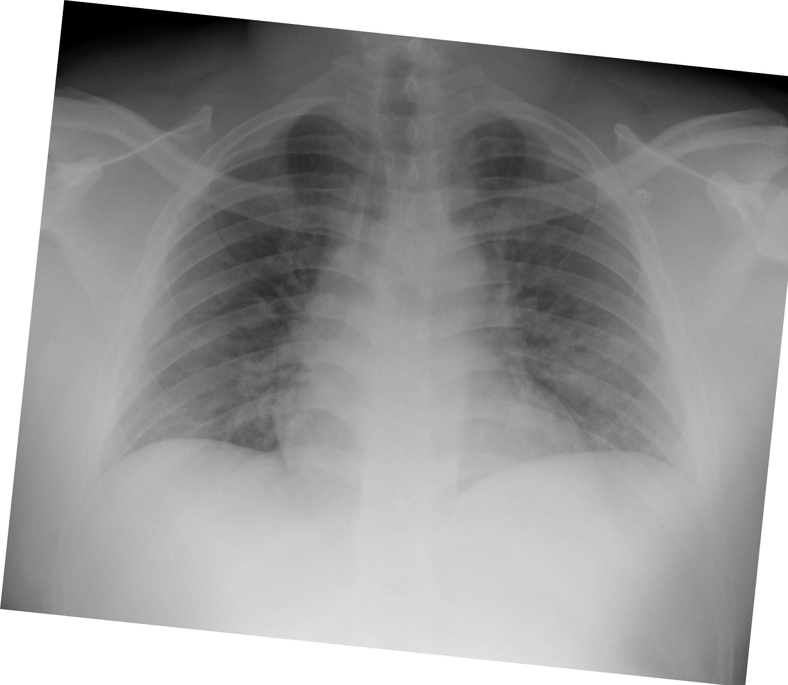

## 문제
36세 남자가 5일 전부터 열이 나고 마른기침과 근육통이 있다가 어제부터 숨이 차서 병원에 왔다. 1주 전 같이 사는 아내가 열과 기침을 앓았다. 흡연·음주는 하지 않고 만성 질환은 없으며 수술력이나 약물 복용력도 없다. 혈압 118/74 mmHg, 맥박 104회/분, 호흡 24회/분, 체온 38.6℃, 실내 공기에서 산소포화도 92% 이다. 양쪽 폐 아래쪽에서 거친 수포음이 들리고 심잡음과 경정맥 확장은 없다. 혈액검사에서 백혈구 5,200/mm³(림프구 11%), 혈소판 165,000/mm³, C반응단백 6.8 mg/dL, 젖산탈수소효소 420 U/L, 프로칼시토닌 0.08 ng/mL 이다. 흉부 X선은 그림과 같다. 가장 가능성이 높은 진단은?

- A. 급성 과민폐렴
- B. 바이러스 폐렴
- C. 폐렴사슬알균 대엽폐렴
- D. 폐포자충 폐렴
- E. 심인성 폐부종

_정면 흉부 X선, 원본 그대로 크기 조정만 (The Cancer Imaging Archive, CC BY 4.0 — 크롭·창 조정 없음)_

## 정답 및 해설
> 정답: B

- **정답 핵심**: 흉부 X선에서 양쪽 폐야 전반, 특히 중·하부와 폐문 주위에 미만성 반점상·그물결절 음영이 거의 대칭으로 퍼져 있고, 한 엽에 국한된 경화·공동·큰 흉수는 없으며 심장 크기는 정상이다. 발열·마른기침·근육통으로 시작해 닷새째 호흡곤란으로 진행한 경과, 가족 내 선행 환자, 백혈구 정상에 림프구 감소, 젖산탈수소효소 상승, 낮은 프로칼시토닌은 세균성보다 바이러스성 폐렴을 가리킨다. 면역저하 배경이 없어 폐포자충 폐렴은 뒤로 밀리고, 심잡음·경정맥 확장이 없고 심장이 크지 않아 심인성 폐부종도 아니다.
- **원리**: <b>바이러스 폐렴은 기관지·폐포 상피를 광범위하게 침범</b>하므로 병변이 한 엽의 폐포강을 삼출물로 채우는 대엽폐렴과 달리 <b>양쪽 폐에 미만성·다발성</b>으로 퍼진다. 영상에서는 간질 비후를 반영하는 그물 음영과 폐포 침윤을 반영하는 반점상·간유리 음영이 섞여 나타나고, 병변은 폐문 주위와 중·하부에서 두드러지며 공기기관지조영이 뚜렷한 균질한 대엽 경화는 드물다. <b>검사실 소견</b>도 방향을 준다 — 바이러스 감염에서는 백혈구가 정상이거나 낮고 <b>림프구 감소</b>가 흔하며 (림프구의 폐 조직 이동과 세포자멸사), 광범위한 폐포 상피 손상으로 <b>젖산탈수소효소</b>가 오르고, 세균 독소·사이토카인 반응으로 유도되는 <b>프로칼시토닌은 낮게</b> 머문다(0.25 ng/mL 미만이면 세균성 가능성이 낮다).  <b>왜 감별이 중요한가</b> — 세균성 대엽폐렴이면 경험적 항생제가 핵심이고, 바이러스 폐렴이면 원인 바이러스에 따른 항바이러스제와 저산소증 정도에 따른 산소·스테로이드가 치료의 축이 된다. 폐포자충 폐렴은 같은 양측 간질 양상을 보이지만 <b>HIV·이식·장기 스테로이드 같은 면역저하 배경</b>이 전제이고 아급성으로 진행하며, 심인성 폐부종은 심장 비대·상엽 혈관 재분포·Kerley B선·흉수 같은 심부전의 흔적을 같이 보인다.
- **비교**: <table><thead><tr><th style="width:24%">진단</th><th style="width:44%">영상·검사의 결정적 소견</th><th>이 증례</th></tr></thead><tbody> <tr><td><b>바이러스 폐렴(정답)</b></td><td><b>양측 미만성 반점상·그물결절 음영, 림프구 감소, 낮은 프로칼시토닌, 가족 내 유행</b></td><td><b>모두 있음</b></td></tr> <tr><td>폐렴사슬알균 대엽폐렴(가장 가까운 오답)</td><td>한 엽의 균질한 경화와 공기기관지조영, 백혈구 증가·호중구 좌방이동, 프로칼시토닌 상승, 고름가래·오한</td><td>양측 미만성, 백혈구 정상, 프로칼시토닌 0.08</td></tr> <tr><td>폐포자충 폐렴</td><td>면역저하 배경(HIV·이식·스테로이드), 수주에 걸친 아급성 진행, 양측 간유리 음영</td><td>면역저하 요인 없음, 닷새의 급성 경과</td></tr> <tr><td>심인성 폐부종</td><td>심장 비대, 상엽 혈관 재분포, Kerley B선, 양측 흉수, 경정맥 확장·심잡음</td><td>심장 크기 정상, 흉수·경정맥 확장 없음</td></tr> <tr><td>급성 과민폐렴</td><td>항원 노출 4~8시간 뒤 증상, 노출 회피로 호전, 반복 노출력</td><td>노출력 없음, 발열·근육통의 감염 경과</td></tr> </tbody></table> <b>가장 가까운 오답은 「폐렴사슬알균 대엽폐렴」</b>이다 — 발열·기침·수포음·CRP 상승이 겹치기 때문이다. 갈림길은 <b>분포와 염증 지표</b>다. 병변이 한 엽에 국한된 균질한 경화이고 백혈구·프로칼시토닌이 오르면 세균성, 양쪽에 미만성으로 퍼지고 림프구 감소·낮은 프로칼시토닌이면 바이러스성으로 본다. 두 가지가 겹치는 세균 중복감염도 있으므로 프로칼시토닌이 다시 오르면 항생제를 더한다.
- **오답 이유**:
  - ① 급성 과민폐렴은 곰팡이·새 항원 등에 노출된 지 4~8시간 뒤 발열·기침·호흡곤란과 양측 결절 음영이 생기고 노출을 피하면 좋아진다. 이 증례는 그런 노출력이 없고 가족 내 감염 전파 경과다. 새를 기르거나 습한 작업장에 다녀온 뒤 반복해서 같은 증상이 생겼다면 이 선지가 맞다.
  - ③ 폐렴사슬알균 대엽폐렴은 발열·기침·수포음·CRP 상승이 이 증례와 겹쳐 떠올릴 수 있지만, 한 엽의 균질한 경화와 공기기관지조영, 백혈구 증가와 프로칼시토닌 상승이 특징이다. 이 증례는 양측 미만성 음영에 백혈구 정상, 프로칼시토닌 0.08 ng/mL 다. 오른쪽 아래엽에 국한된 경화와 백혈구 18,000, 프로칼시토닌 2.0 이었다면 이 선지가 정답이다.
  - ④ 폐포자충 폐렴은 양측 간질·간유리 음영과 젖산탈수소효소 상승이 겹치지만, HIV·장기이식·장기 스테로이드 같은 면역저하 배경이 전제이고 수주에 걸쳐 서서히 진행한다. 이 증례는 만성 질환·약물력이 없고 닷새의 급성 경과다. HIV 감염이 확인되고 CD4 세포가 200/mm³ 미만이며 수주간 진행했다면 이 선지가 맞다.
  - ⑤ 심인성 폐부종은 양측 폐문 주위 음영이 겹치지만 심장 비대, 상엽 혈관 재분포, Kerley B선, 흉수와 함께 경정맥 확장·심잡음·기좌호흡이 있어야 한다. 이 증례는 심장 크기가 정상이고 경정맥 확장·심잡음이 없으며 발열·근육통이 앞선다. 심근경색 뒤 급성 호흡곤란에 심장 비대와 흉수가 있었다면 이 선지가 정답이 된다.
- **함정**: 「발열 + 기침 + CRP 상승」에서 세균성 폐렴으로 바로 가지 않는다. 판단은 영상의 분포(양측 미만성 vs 한 엽 경화)와 염증 지표(림프구 감소·낮은 프로칼시토닌 vs 백혈구·프로칼시토닌 상승)로 한다.
- **학습목표**: 젊은 성인의 발열·마른기침·호흡곤란에서 흉부 X선의 양측 미만성 반점상·그물결절 음영을 읽고, 림프구 감소·낮은 프로칼시토닌·가족 내 유행과 함께 바이러스 폐렴을 대엽폐렴·폐포자충폐렴·심인성 폐부종과 감별한다
- **근거·출처**: TCIA COVID-19-AR (CC BY 4.0) — 36 M, chest radiograph, human-confirmed bilateral opacities — Grade B; teacher-only · 작성자 판독(2026-09-22): 양측 폐야 전반, 특히 중·하부와 폐문 주위의 미만성 반점상·그물결절 음영, 대엽성 경화·공동·큰 흉수·기흉 없음, 심장 크기 정상, 번인 문자 없음 · Harrison's Principles of Internal Medicine, 21st ed., ch. 'Pneumonia' — viral vs bacterial pneumonia, radiographic patterns, procalcitonin · Metlay JP et al. Diagnosis and treatment of adults with community-acquired pneumonia. ATS/IDSA guideline. Am J Respir Crit Care Med 2019;200:e45 · Schuetz P et al. Procalcitonin to initiate or discontinue antibiotics in acute respiratory tract infections. Cochrane Database Syst Rev 2017;10:CD007498

## 출처
- COVID-19-AR, The Cancer Imaging Archive (CC BY 4.0) · series …38073466 · Creative Commons Attribution 4.0 International · https://www.cancerimagingarchive.net/data-usage-policies-and-restrictions/
