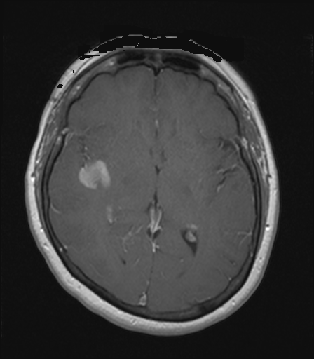

## 문제
A 56-year-old woman comes to the physician because of 3 weeks of progressively worsening headaches that are most severe in the morning and 1 week of clumsiness of her left hand. She has no history of cancer, seizures, or head trauma and takes no medications. She does not smoke. Her temperature is 36.8°C, pulse is 76/min, and blood pressure is 134/82 mm Hg. Neurologic examination shows mild weakness of the left hand with slowed rapid alternating movements; the remainder of the examination, including funduscopy, is unremarkable. An axial T1-weighted MRI of the brain obtained after intravenous gadolinium is shown. The bright signal within the lesions on this image most directly reflects which of the following?

- A. Presence of methemoglobin from subacute hemorrhage
- B. Dystrophic calcification within the lesion
- C. Restricted diffusion of water in densely packed cells
- D. Increased free-water content from vasogenic edema
- E. Disruption of the blood-brain barrier with leakage of contrast into the interstitium

_Axial T1-weighted MRI of the brain obtained after intravenous gadolinium, unaltered apart from scaling (The Cancer Imaging Archive, CC BY 4.0; no cropping or window adjustment)_

## 정답 및 해설
> 정답: E

- **정답 핵심**: On a T1-weighted image acquired after intravenous gadolinium, tissue becomes bright only where the paramagnetic contrast agent reaches the extravascular space. Normal brain capillaries have tight junctions that keep gadolinium intravascular, so parenchyma stays gray; the lesions in the right frontal white matter and periventricular regions (and the small one near the left atrium) enhance because their neovessels lack a competent blood-brain barrier and contrast leaks into the interstitium, shortening T1. Methemoglobin also shortens T1 but would be bright before contrast as well; calcification is usually dark on T1; restricted diffusion is a diffusion-weighted finding; vasogenic edema is dark on T1 and bright on T2/FLAIR, not on contrast-enhanced T1.
- **원리**: <b>Gadolinium is a paramagnetic agent that shortens the T1 relaxation time of nearby water protons</b>; on a T1-weighted image, anything with short T1 is bright. Because gadolinium chelates are hydrophilic and are confined to the intravascular compartment by the tight junctions of normal cerebral capillaries, the parenchyma of a healthy brain does not enhance; only structures that lie outside the blood-brain barrier (pituitary, choroid plexus, dura, venous sinuses) become bright. A parenchymal lesion enhances when its capillaries are <b>abnormal — leaky neovessels of a tumor, inflamed vessels of an abscess capsule or demyelinating plaque, or reperfused vessels of a subacute infarct</b> — so contrast enters the interstitium and shortens T1 there. Enhancement is therefore a map of <b>blood-brain barrier disruption</b>, not of the tumor itself; it explains why the same drug-permeability defect lets corticosteroids reduce edema and why enhancing volume, not total lesion volume, is what is followed after treatment.  <b>Why the other signals are different</b> — <b>methemoglobin</b> (subacute blood, days 3–14) also shortens T1 and is bright on T1, but that brightness is present on the pre-contrast image too, which is why a pre-contrast T1 is always compared with the post-contrast one. <b>Calcification</b> has few mobile protons and is usually dark on T1 and T2 and is best seen on CT. <b>Restricted diffusion</b> is a property measured by diffusion-weighted imaging (bright on DWI, dark on the ADC map), typical of acute infarct, abscess pus, or hypercellular tumor — it says nothing about T1 signal. <b>Vasogenic edema</b> is an increase in free water, which lengthens T1 and T2: it appears <b>dark</b> on T1 and bright on T2/FLAIR, and it does not enhance because its capillaries in the surrounding white matter are intact.
- **비교**: <table><thead><tr><th style="width:30%">Signal mechanism</th><th style="width:40%">What the image would look like</th><th>Why not here</th></tr></thead><tbody> <tr><td><b>Blood-brain barrier disruption (answer)</b></td><td><b>Bright on post-contrast T1 only; gray on pre-contrast T1</b></td><td><b>Ring- and nodule-shaped enhancement in the lesions after gadolinium</b></td></tr> <tr><td>Methemoglobin (closest distractor)</td><td>Bright on T1 <i>before</i> contrast; blooming on gradient-echo/SWI</td><td>The stem states the image was obtained after gadolinium; no trauma or sudden ictus; T1 shortening by blood must be shown on the pre-contrast scan</td></tr> <tr><td>Dystrophic calcification</td><td>Usually dark on T1 and T2, dense on CT</td><td>The lesions are bright, not dark</td></tr> <tr><td>Restricted diffusion</td><td>Bright on DWI with low ADC</td><td>This is a T1-weighted, not a diffusion-weighted, image</td></tr> <tr><td>Vasogenic edema (free water)</td><td>Dark on T1, bright on T2/FLAIR, no enhancement</td><td>Free water lengthens T1 — it cannot make a T1 image bright</td></tr> </tbody></table> The <b>closest distractor is methemoglobin</b>, because it is the one other common cause of intrinsic T1 brightness in the brain. The dividing line is <b>the pre-contrast image</b>: brightness that is present before gadolinium is blood, fat, protein, or melanin; brightness that appears only after gadolinium is barrier breakdown. That is why every enhanced study is read against its unenhanced T1.
- **오답 이유**:
  - (A) Methemoglobin from a subacute hemorrhage does shorten T1 and appears bright, so it is the most plausible competitor. But that brightness exists before any contrast is given and is accompanied by susceptibility blooming on gradient-echo sequences; the stem specifies a post-gadolinium image in a woman with no trauma or sudden onset. If the same lesions had been bright on the pre-contrast T1 image and dark on gradient-echo, subacute hemorrhage would be the answer.
  - (B) Dystrophic calcification contains few mobile protons and is typically dark on T1- and T2-weighted images; it is best shown as dense material on CT. The lesions here are bright after contrast, the opposite of calcification. If the abnormality had been a dark focus on all MRI sequences that was hyperdense on a CT scan, calcification would be the correct choice.
  - (C) Restricted diffusion describes decreased water mobility in tightly packed cells or viscous pus and is detected only on diffusion-weighted imaging as high DWI signal with low ADC. It is not a T1 phenomenon, so it cannot explain brightness on a T1-weighted image. If a DWI sequence had shown the lesions as bright with a dark ADC map, restricted diffusion would be the correct mechanism.
  - (D) Vasogenic edema is extra free water in the white matter around a lesion; free water lengthens T1 and T2, making edema dark on T1 and bright on T2 and FLAIR, and it does not enhance because the surrounding capillaries are intact. Brightness on post-contrast T1 therefore cannot be edema. If the question had asked about the finger-like bright signal around the lesions on a FLAIR image, vasogenic edema would be the answer.
- **함정**: Do not read every bright T1 signal as blood. Ask first whether the image was acquired after gadolinium: brightness that appears only after contrast means the blood-brain barrier is leaking, and it is compared with the unenhanced T1 to exclude intrinsic T1 shortening.
- **학습목표**: 가돌리늄 조영 후 T1 강조 MRI 에서 병변이 밝아지는 조영증강을 읽고, 그 신호가 혈액뇌장벽 파괴로 조영제가 혈관 밖 간질로 새어 나온 것임을 출혈·석회화·확산제한·세포충실도와 구분한다
- **근거·출처**: TCIA UPENN-GBM (CC BY 4.0) — 56 F, axial post-contrast T1-weighted MRI (13 ml gadobenate), instance 13; author reading 2026-09-22 — Grade B, teacher-only · 작성자 판독(2026-09-22): 우측 이마엽 깊은 백질의 약 2 cm 균질~고리형 조영증강 종괴, 우측 뇌실 주위의 작은 조영증강 결절, 좌측 뇌실 삼각부 옆의 작은 고리형 조영증강 병변; 두피·안면 없음, 문자 없음 · Osborn AG. Osborn's Brain, 2nd ed., ch. 'Neoplasms and tumorlike lesions' and 'Approach to imaging' — mechanisms of contrast enhancement, blood-brain barrier · Bradley WG. MR appearance of hemorrhage in the brain. Radiology 1993;189:15 — methemoglobin T1 shortening · Kandel ER et al. Principles of Neural Science, 6th ed., ch. 'The blood-brain barrier' — tight junctions and permeability

## 출처
- The Cancer Imaging Archive (CC BY 4.0) · series …89998978 · Creative Commons Attribution 4.0 International · https://www.cancerimagingarchive.net/data-usage-policies-and-restrictions/
