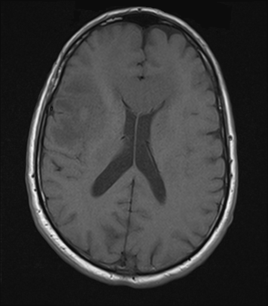

## 문제
73세 남자가 6주 전부터 점점 심해지는 두통과 2주 전부터 왼쪽 팔다리에 힘이 빠져 병원에 왔다. 두통은 아침에 심하고 구역을 동반하며, 최근 가족이 보기에 성격이 무뎌지고 말수가 줄었다. 고혈압으로 암로디핀을 복용하고 있으며 발열·경련·머리 외상은 없었다. 혈압 152/88 mmHg, 맥박 64회/분, 체온 36.7℃ 이고 의식은 명료하나 반응이 느리다. 왼쪽 팔다리 근력이 4/5 이고 왼쪽 바빈스키징후가 양성이며 목 경직은 없다. 혈액검사에서 백혈구 7,400/mm³, C반응단백 0.3 mg/dL 이다. 조영제를 주지 않고 찍은 뇌 MRI 축상면 T1 강조영상은 그림과 같다. 가장 적절한 다음 검사는?

- A. 경동맥 초음파
- B. 뇌 CT 혈관조영
- C. 가돌리늄 조영증강 뇌 MRI
- D. 요추천자와 뇌척수액 검사
- E. 뇌파검사

_뇌 MRI 축상면 T1 강조영상(조영 전), 원본 그대로 크기 조정만 (The Cancer Imaging Archive, CC BY 4.0 — 크롭·창 조정 없음)_

## 정답 및 해설
> 정답: C

- **정답 핵심**: 조영 전 T1 강조영상에서 환자 오른쪽 이마엽-섬엽에 경계가 불분명한 저신호 병변이 넓게 퍼져 회백질 경계와 고랑이 지워졌고, 같은 쪽 측뇌실 앞뿔이 눌려 좁아지며 중격이 반대쪽으로 밀려 있다 — 종괴효과를 가진 침윤성 병변이다. 6주에 걸친 진행성 두통(아침 악화·구역), 성격 변화, 반대쪽 편측 근력 약화와 바빈스키징후는 서서히 자라는 두개내 종괴에 합당하다. 종괴의 성격(종양·농양·전이)을 가르고 범위를 정하는 다음 검사는 가돌리늄 조영증강 MRI 이며, 종괴효과가 있는 상태에서 요추천자는 뇌탈출을 일으킬 수 있어 금기다. 경련이 없어 뇌파는 진단에 기여하지 않고, 경과가 급성 혈관 사건이 아니어서 경동맥 초음파·CT 혈관조영은 우선순위가 아니다.
- **원리**: <b>종괴효과(mass effect)는 두개골이라는 닫힌 공간에서 부피가 늘어난 결과</b>다. 병변 자체와 그 주위 혈관성 부종이 인접 구조를 밀어내면 영상에서 <b>고랑 소실, 같은 쪽 측뇌실 압박, 중앙선 구조(투명중격·제3뇌실)의 반대쪽 편위</b>로 나타난다. 조영 전 T1 강조영상에서 종양과 부종은 정상 백질보다 <b>저신호</b>이고, 경계가 불분명하게 회백질 경계를 지우는 모양은 침윤성 병변을 시사한다. 임상 경과가 <b>수주에 걸쳐 진행</b>하고 아침 두통·구역(두개내압 상승)·성격 변화(이마엽)· 반대쪽 추체로 징후가 겹치면 서서히 자라는 종괴다.  <b>왜 조영증강 MRI 가 다음인가</b> — 조영 전 영상은 「무엇이 어디를 밀고 있는가」만 보여 준다. 가돌리늄은 혈액뇌장벽이 깨진 곳에만 새어 들어가므로 조영증강 양상(고리형·균질·결절형·비증강)과 괴사 여부가 <b>고등급 교종·전이·림프종·농양·저등급 교종</b>을 가르는 첫 번째 단서가 되고, 병변의 실제 경계와 수술·생검 표적을 정한다. 그 뒤 필요하면 확산강조·관류·분광 영상과 조직검사로 이어진다.  <b>왜 요추천자는 안 되는가</b> — 한쪽 반구의 종괴가 측뇌실을 누르고 중앙선을 밀고 있는 상태에서 척수강 압력을 낮추면 천막 위아래의 압력 차가 커져 <b>구상회 탈출이나 소뇌편도 탈출</b>이 생길 수 있다. 수막염이 의심되더라도 종괴효과가 있으면 영상으로 먼저 확인하고, 이 증례는 발열·목 경직·염증 지표가 없어 수막염 자체가 의심되지 않는다.
- **비교**: <table><thead><tr><th style="width:24%">검사</th><th style="width:42%">언제 맞는가</th><th>이 증례에서</th></tr></thead><tbody> <tr><td><b>가돌리늄 조영증강 MRI(정답)</b></td><td><b>종괴효과가 있는 두개내 병변의 성격·범위 규명</b></td><td><b>침윤성 저신호 병변 + 뇌실 압박·중앙선 편위</b></td></tr> <tr><td>요추천자(가장 가까운 오답)</td><td>종괴효과가 없는 수막염·지주막하출혈·림프종성 수막염 의심</td><td>종괴효과가 있어 뇌탈출 위험 — 금기. 발열·목 경직·CRP 상승도 없다</td></tr> <tr><td>뇌파검사</td><td>경련이나 비경련성 뇌전증지속상태 의심</td><td>경련이 없고 국소 징후는 영상으로 이미 설명된다</td></tr> <tr><td>경동맥 초음파</td><td>급성 허혈뇌졸중·일과성허혈발작의 원인 평가</td><td>6주에 걸친 진행 경과 — 급성 혈관 사건이 아니다</td></tr> <tr><td>뇌 CT 혈관조영</td><td>동맥류·혈관기형·급성 대혈관 폐색 의심</td><td>영상이 혈관 병변이 아닌 실질 종괴를 보여 준다</td></tr> </tbody></table> <b>가장 가까운 오답은 「요추천자」</b>다 — 두통·성격 변화·반응 저하가 수막염이나 뇌염을 떠올리게 하기 때문이다. 갈림길은 <b>영상의 종괴효과</b>다. 측뇌실 압박과 중앙선 편위가 있으면 어떤 임상 상황에서도 요추천자보다 조영증강 영상이 먼저이고, 종괴효과 없는 수막 증상이라면 요추천자가 진단 검사가 된다.
- **오답 이유**:
  - ① 경동맥 초음파는 급성 허혈뇌졸중이나 일과성허혈발작에서 색전 원인을 찾는 검사다. 이 증례는 6주에 걸쳐 진행한 두통과 2주간 서서히 악화된 근력 약화로, 갑자기 생기는 혈관 사건의 경과가 아니며 영상도 동맥 영역에 국한된 경색이 아니라 침윤성 종괴다. 갑작스러운 편측 마비가 생겨 확산강조영상에서 경색이 확인되었다면 경동맥 평가가 맞다.
  - ② 뇌 CT 혈관조영은 동맥류·혈관기형·급성 대혈관 폐색이 의심될 때 쓴다. 이 영상은 혈관 병변이 아니라 실질 안의 침윤성 병변과 종괴효과를 보여 주고, 벼락두통이나 지주막하출혈의 단서도 없다. 갑작스러운 벼락두통과 지주막하출혈이 있었다면 혈관조영이 다음 검사가 된다.
  - ④ 요추천자는 두통·성격 변화·반응 저하가 수막염이나 뇌염을 떠올리게 해 고려할 수 있지만, 이 영상은 한쪽 반구의 종괴가 측뇌실을 누르고 중앙선을 밀고 있어 척수강 압력을 낮추면 뇌탈출이 생길 수 있다. 발열·목 경직·CRP 상승도 없다. 영상에 종괴효과가 없고 발열과 목 경직이 있었다면 요추천자가 정답이 된다.
  - ⑤ 뇌파검사는 경련이 있거나 비경련성 뇌전증지속상태로 의식 변화를 설명해야 할 때 필요하다. 이 환자는 경련이 없고 반응 저하와 편측 근력 약화는 영상의 종괴로 설명되므로 뇌파는 병변의 성격을 가르는 데 기여하지 못한다. 반복되는 국소 경련 뒤 의식이 돌아오지 않았다면 뇌파가 다음 검사가 된다.
- **함정**: 「두통 + 성격 변화 + 느린 반응」에서 뇌척수액 검사로 가기 전에 영상의 종괴효과를 읽는다. 측뇌실 압박·중앙선 편위가 있으면 요추천자는 금기이고 조영증강 MRI 가 다음이다.
- **학습목표**: 아급성 진행성 두통과 편측 근력 약화에서 조영 전 T1 강조 뇌 MRI 의 경계 불분명한 저신호 병변과 측뇌실 압박·중앙선 편위(종괴효과)를 읽고, 요추천자가 금기임을 알고 가돌리늄 조영증강 MRI 를 다음 검사로 고른다
- **근거·출처**: TCIA UPENN-GBM (CC BY 4.0) — 73 M, axial pre-contrast T1-weighted MRI, instance 16; 작성자 판독 2026-09-18 PASS — Grade B, teacher-only · 작성자 판독: 환자 우측 이마-섬엽의 경계 불분명한 저신호 병변, 회백질 경계·고랑 소실, 같은 쪽 측뇌실 앞뿔 압박과 중격의 반대쪽 편위(종괴효과); 조영 전이라 증강 양상은 알 수 없음 · Harrison's Principles of Internal Medicine, 21st ed., ch. 'Primary and metastatic tumors of the nervous system' — presentation of intracranial mass, contrast-enhanced MRI as the study of choice · Ropper AH et al. Adams and Victor's Principles of Neurology, 12th ed., ch. 'Intracranial neoplasms' and 'Lumbar puncture' — contraindication with mass effect and herniation risk · Osborn AG. Osborn's Brain, 2nd ed., ch. 'Herniation syndromes' — subfalcine and uncal herniation, midline shift

## 출처
- The Cancer Imaging Archive (CC BY 4.0) · series …98465845 · Creative Commons Attribution 4.0 International · https://www.cancerimagingarchive.net/data-usage-policies-and-restrictions/
