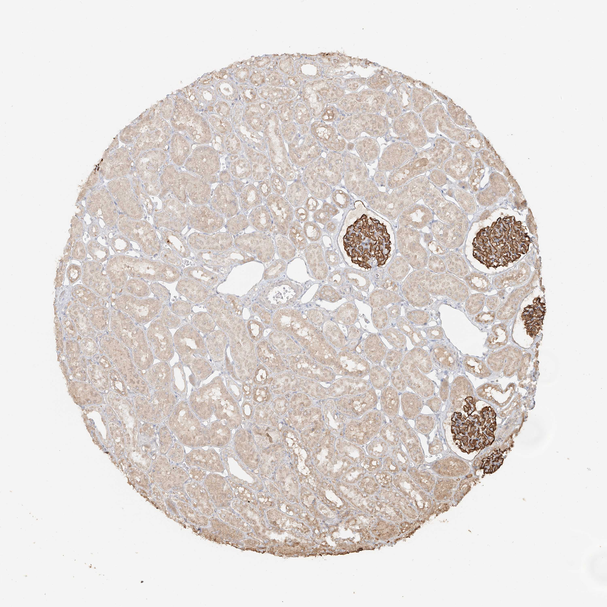

## 문제
A 16-year-old boy undergoes left nephrectomy after a motor-vehicle collision in which the kidney was shattered; he has no history of kidney disease, and his preoperative urinalysis showed no protein or blood. A section of uninjured renal cortex from the specimen is stained by immunohistochemistry for a transmembrane protein of the immunoglobulin superfamily that is expressed in the kidney only by podocytes; the photomicrograph is shown. A newborn with homozygous loss-of-function mutations in the gene encoding this protein would most likely present with which of the following?

- A. Hyperchloremic metabolic acidosis with a urine pH above 5.5
- B. Hypokalemic metabolic alkalosis with normal blood pressure
- C. Massive proteinuria, edema, and hypoalbuminemia within the first months of life
- D. Gross hematuria with sensorineural hearing loss and lens abnormalities
- E. Polyuria and hypernatremia unresponsive to desmopressin

_Immunohistochemical stain of a tissue microarray core (DAB brown chromogen, hematoxylin counterstain), original magnification (Human Protein Atlas, CC BY 4.0; no cropping or color adjustment)_

## 정답 및 해설
> 정답: C

- **정답 핵심**: The stain is confined to the glomeruli — each glomerular tuft is strongly brown along the capillary loops while the surrounding proximal and distal tubules and interstitium are unstained. A podocyte-restricted immunoglobulin-superfamily transmembrane protein with this distribution is nephrin, the principal component of the slit diaphragm between foot processes, encoded by NPHS1. Loss of nephrin abolishes the size-selective barrier of the slit, so complete deficiency produces congenital nephrotic syndrome of the Finnish type: massive proteinuria in utero and at birth, edema, hypoalbuminemia, and a large placenta. Alport syndrome (hematuria, hearing loss) is a glomerular basement membrane collagen defect, and the tubular options (nephrogenic diabetes insipidus, distal renal tubular acidosis, Bartter syndrome) involve proteins of the collecting duct, intercalated cell, and thick ascending limb, which are unstained here.
- **원리**: <b>The glomerular filtration barrier has three layers</b>: fenestrated endothelium, glomerular basement membrane, and the interdigitating foot processes of podocytes bridged by the <b>slit diaphragm</b>. The slit diaphragm is a modified adherens junction whose backbone is <b>nephrin</b> (NPHS1), a ~180-kDa transmembrane immunoglobulin-superfamily protein that forms a zipper-like meshwork with itself and with NEPH1 across the 30–40 nm slit; podocin (NPHS2), CD2AP, and TRPC6 anchor it to the actin cytoskeleton. Nephrin is expressed in the kidney only by podocytes, which is why an immunohistochemical stain for it lights up <b>every glomerular tuft along the capillary loops and nothing in the tubules or interstitium</b> — the pattern in this core. The slit diaphragm is the final and finest size barrier: albumin that crosses the basement membrane is held back here, so <b>loss of nephrin means unrestricted passage of plasma proteins</b>.  <b>Why the phenotype is nephrotic and congenital</b> — with homozygous NPHS1 loss-of-function (the Fin-major and Fin-minor founder mutations), the slit never forms; proteinuria begins in utero (elevated amniotic α-fetoprotein), the placenta is enlarged, and the infant has edema, hypoalbuminemia, and hyperlipidemia within days to weeks — <b>congenital nephrotic syndrome of the Finnish type</b>. Steroids are useless because the defect is structural, and treatment is albumin infusion, nutrition, and eventual bilateral nephrectomy with transplantation. The same logic explains the other podocyte genes: podocin mutations cause steroid-resistant nephrotic syndrome in early childhood, and WT1 mutations cause diffuse mesangial sclerosis with nephrotic syndrome (Denys-Drash).  <b>Why the image separates glomerular from tubular disease</b> — every distractor except Alport syndrome is a transport defect of a tubular segment (aquaporin-2 or the V2 receptor in the collecting duct, the H+-ATPase or anion exchanger of intercalated cells, the NKCC2 cotransporter of the thick ascending limb). Their proteins would stain the tubules and leave the glomeruli pale — the opposite of what is shown. Alport syndrome is glomerular, but it is a <b>basement membrane collagen IV</b> defect whose hallmark is hematuria, not the massive proteinuria of a slit-diaphragm defect.
- **비교**: <table><thead><tr><th style="width:30%">Presentation</th><th style="width:38%">Protein and location</th><th>Expected stain pattern</th></tr></thead><tbody> <tr><td><b>Congenital nephrotic syndrome (answer)</b></td><td><b>Nephrin — podocyte slit diaphragm</b></td><td><b>Glomeruli only, along capillary loops; tubules negative — as shown</b></td></tr> <tr><td>Hematuria + hearing loss (closest distractor)</td><td>Type IV collagen α3/α4/α5 — glomerular basement membrane (also cochlea, lens)</td><td>Glomerular, but a basement-membrane protein, not a podocyte transmembrane protein; defect leaks red cells rather than massive protein</td></tr> <tr><td>Nephrogenic diabetes insipidus</td><td>Aquaporin-2 or V2 receptor — collecting duct principal cells</td><td>Tubules stained, glomeruli negative</td></tr> <tr><td>Distal renal tubular acidosis</td><td>H+-ATPase or AE1 — intercalated cells of the collecting duct</td><td>Tubules stained, glomeruli negative</td></tr> <tr><td>Bartter syndrome</td><td>NKCC2, ROMK, ClC-Kb — thick ascending limb</td><td>Tubules stained, glomeruli negative</td></tr> </tbody></table> The <b>closest distractor is Alport syndrome</b>, because it is the other glomerular option and would also show glomerular-restricted staining at this magnification. The dividing line is <b>the identity given in the stem</b> — a transmembrane immunoglobulin-superfamily protein made only by podocytes is a slit-diaphragm component, whereas collagen IV is a secreted basement-membrane protein made by podocytes and endothelium alike — and the <b>consequence</b>: a slit defect leaks protein massively, a basement-membrane collagen defect leaks red cells and splits the lamina densa.
- **오답 이유**:
  - (A) Hyperchloremic metabolic acidosis with a urine pH above 5.5 is distal renal tubular acidosis from defects of the H+-ATPase or the anion exchanger AE1 in intercalated cells of the collecting duct. These are tubular transport proteins, and the glomerular-restricted stain shown here excludes them. If the stained cells had been scattered intercalated cells of the collecting duct, this option would be the answer.
  - (B) Hypokalemic metabolic alkalosis with normal blood pressure is Bartter syndrome, caused by loss of the NKCC2 cotransporter, ROMK, or ClC-Kb in the thick ascending limb. The image shows no tubular staining, so a thick-ascending-limb transporter is excluded. If the stain had outlined the thick ascending limbs in the medullary rays while the glomeruli remained unstained, Bartter syndrome would be correct.
  - (D) Gross hematuria with sensorineural hearing loss and lens abnormalities is Alport syndrome, a defect of type IV collagen α5 (or α3/α4) in the glomerular basement membrane, cochlea, and lens. It is glomerular and would also stain glomeruli, which makes it the closest competitor, but collagen IV is a secreted basement-membrane protein rather than a podocyte-specific immunoglobulin-superfamily transmembrane protein, and its loss produces hematuria and a split lamina densa rather than congenital massive proteinuria. If the stem had described a basement-membrane collagen, this option would be correct.
  - (E) Polyuria and hypernatremia unresponsive to desmopressin is nephrogenic diabetes insipidus from loss of aquaporin-2 or the vasopressin V2 receptor in collecting-duct principal cells. Those proteins would stain the tubules, leaving the glomeruli pale — the opposite of this image. If the photomicrograph had shown brown collecting ducts with unstained glomeruli and the protein were a water channel, this option would be correct.
- **함정**: Read the distribution before the name: staining confined to the glomerular tufts with negative tubules places the protein in the filtration barrier, and a podocyte-only transmembrane protein there is the slit diaphragm — its absence leaks protein, not red cells, and not salt or water.
- **학습목표**: 콩팥 피질 면역조직화학에서 사구체에만 강하게 염색되고 세관은 음성인 분포를 읽고, 그 단백질이 사구체 여과장벽(족세포 틈새막)의 구성 성분이며 그 결손이 선천 신증후군을 일으킨다는 것을 세관 질환과 구분해 추론한다
- **근거·출처**: Human Protein Atlas, NPHS1 / kidney (CC BY 4.0), image 67641_A_8_5 — 16 M, normal kidney TMA core; author reading 2026-09-22 — Grade A tissue identity; teacher-only · 작성자 판독(2026-09-22): 사구체 5~6개가 모세혈관 고리를 따라 강한 갈색으로 염색되고 근위·원위 세관과 사이질은 거의 음성; 식별 표지 없음 · Kestilä M et al. Positionally cloned gene for a novel glomerular protein — nephrin — is mutated in congenital nephrotic syndrome. Mol Cell 1998;1:575 · Robbins & Cotran Pathologic Basis of Disease, 10th ed., ch. 'The kidney' — glomerular filtration barrier, slit diaphragm, congenital nephrotic syndrome, Alport syndrome · Brenner and Rector's The Kidney, 11th ed., ch. 'Inherited disorders of the glomerulus' and 'Inherited disorders of renal tubular transport'

## 출처
- Human Protein Atlas, NPHS1 / Kidney (CC BY 4.0), https://images.proteinatlas.org/35555/67641_A_8_5.jpg · Creative Commons Attribution 4.0 International · https://www.proteinatlas.org/about/licence
