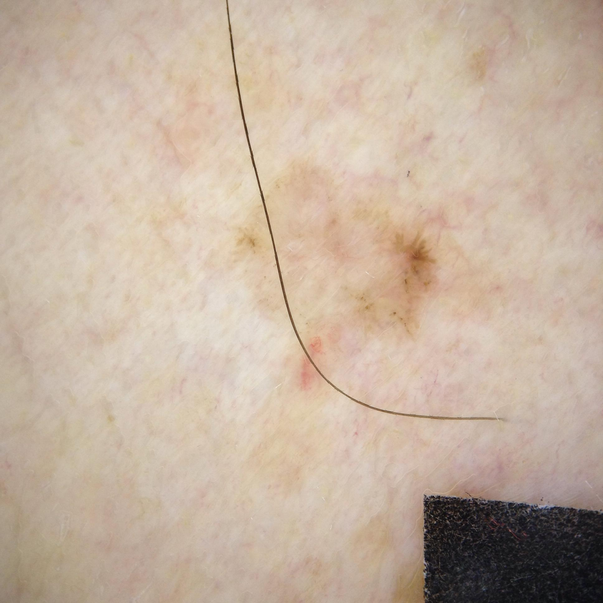

## 문제
60세 남자가 3년 전부터 등에 생겨 서서히 커지는 반점 때문에 병원에 왔다. 가렵거나 아프지는 않고 출혈은 없었다. 젊어서 야외에서 일했고 흡연은 하지 않으며 피부암의 가족력은 없다. 진찰에서 등 위쪽에 지름 약 8 mm 의 경계가 비교적 뚜렷한 분홍빛 반점이 있고 표면은 약간 광택이 있으며 가장자리를 따라 갈색 점들이 흩어져 있다. 병변은 단단하지 않고 눌러도 함몰되지 않으며 주위에 비슷한 병변은 없다. 더모스코피 소견은 그림과 같다. 가장 가능성이 높은 진단은?

- A. 지루각화증
- B. 피부섬유종
- C. 색소모반
- D. 기저세포암
- E. 악성 흑색종

_더모스코피 사진, 원본 그대로 크기 조정만 (ISIC Archive, CC0 1.0 — 크롭·색보정 없음)_

## 정답 및 해설
> 정답: D

- **정답 핵심**: 더모스코피에서 분홍-흰색의 광택 있는 배경 위에 회갈색 잎사귀 모양(leaf-like) 구조와 바퀴살(spoke-wheel) 모양 구조가 흩어져 있고, 멜라닌세포 병변의 기본 소견인 색소 그물(pigment network)이 없으며 배경에 가는 나뭇가지 모양 혈관이 비친다. 60세 남자의 햇빛 노출 부위에 수년에 걸쳐 서서히 커진 광택 있는 분홍 반점이라는 임상 맥락과 합쳐지면 색소성 기저세포암이다. 궤양·청백색 베일·비대칭 점과 줄무늬가 없어 흑색종과 거리가 있고, 면포모양 개구부·뇌이랑 모양이 없어 지루각화증도, 중심 흰 반흔에 주변 색소 그물이 없어 피부섬유종도 아니다.
- **원리**: <b>기저세포암은 모낭 상피의 기저세포에서 생기는 종양</b>으로 종양 둥지가 진피 안에서 소엽 모양으로 자라고 둥지 주변에 멜라닌세포와 멜라닌 함유 대식세포가 끼어들면 색소성 아형이 된다. 더모스코피에서 <b>잎사귀 모양 구조</b>는 진피 얕은 곳에서 소엽 모양으로 뻗은 색소성 종양 둥지가 단풍잎처럼 보이는 것이고, <b>바퀴살 모양 구조</b>는 중심의 짙은 색소 축에서 방사상으로 뻗는 종양 둥지다. <b>크고 청회색 난원형 둥지·다발성 청회색 소구</b>는 더 깊은 색소성 둥지, <b>나뭇가지 모양 혈관</b>은 종양 기질의 확장된 모세혈관, <b>궤양·광택 있는 흰 부위</b>는 표피 파괴와 섬유화를 반영한다. 이 구조들은 멜라닌세포가 표피 능선을 따라 배열될 때 생기는 <b>색소 그물</b>과 근본적으로 다르다 — 그래서 기저세포암 더모스코피 판독의 첫 단계는 <b>「색소 그물이 없다」</b>는 음성 기준이고, 둘째가 위의 양성 기준 중 하나 이상이다.  <b>왜 감별이 중요한가</b> — 기저세포암은 국소 파괴는 하지만 전이가 매우 드물어 절제 여유가 작은 완전 절제나 표재형이면 국소 치료로 충분하다. 반면 흑색종은 두께에 따라 절제 여유와 감시림프절 생검이 결정되고 예후가 완전히 다르다. 두 종양 모두 색소성일 수 있으므로 <b>구조의 종류</b>로 갈라야 하며, 확진은 절제 또는 펀치 생검의 조직검사다.
- **비교**: <table><thead><tr><th style="width:24%">진단</th><th style="width:44%">더모스코피의 결정적 소견</th><th>이 증례</th></tr></thead><tbody> <tr><td><b>기저세포암(정답)</b></td><td><b>색소 그물 없음 + 잎사귀 모양·바퀴살 모양·청회색 난원형 둥지·나뭇가지 모양 혈관·궤양 중 하나 이상</b></td><td><b>색소 그물 없음, 잎사귀·바퀴살 구조, 나뭇가지 모양 혈관</b></td></tr> <tr><td>악성 흑색종(가장 가까운 오답)</td><td>비정형 색소 그물, 비대칭 점·소구, 불규칙 줄무늬, 청백색 베일, 여러 색조, 퇴행 구조</td><td>색소 그물·줄무늬·청백색 베일 없음</td></tr> <tr><td>지루각화증</td><td>면포모양 개구부, 좁쌀 모양 낭, 뇌이랑 모양 고랑, 경계가 「도장 찍은 듯」 명확</td><td>개구부·낭·뇌이랑 모양 없음</td></tr> <tr><td>피부섬유종</td><td>중심 흰 반흔 모양 부위와 주변의 섬세한 색소 그물, 촉진 시 단단하고 집으면 함몰(dimple)</td><td>단단하지 않고 함몰 없음, 색소 그물 없음</td></tr> <tr><td>색소모반</td><td>규칙적 색소 그물 또는 균일한 소구, 대칭, 한두 가지 색조</td><td>색소 그물 없음, 분홍 배경에 회갈색 구조가 국소적</td></tr> </tbody></table> <b>가장 가까운 오답은 「악성 흑색종」</b>이다 — 갈색 점이 흩어진 색소성 병변이라는 겉모습이 겹치기 때문이다. 갈림길은 <b>색소 그물의 유무와 구조의 종류</b>다. 색소 그물·줄무늬·청백색 베일이 있으면 멜라닌세포 계열로 보고 비대칭·다색조를 따지며, 색소 그물이 없고 잎사귀·바퀴살·나뭇가지 혈관이 보이면 기저세포암으로 본다. 어느 쪽이든 임상적으로 의심되면 조직검사로 확정한다.
- **오답 이유**:
  - ① 지루각화증은 고령의 몸통에 흔한 갈색 병변이라 떠올릴 수 있지만, 더모스코피에서 면포모양 개구부·좁쌀 모양 낭·뇌이랑 모양 고랑과 도장 찍은 듯한 경계가 특징이다. 이 병변은 그런 각질 구조가 없고 광택 있는 분홍 배경에 나뭇가지 모양 혈관이 있다. 표면이 사마귀처럼 거칠고 개구부와 낭이 보였다면 이 선지가 맞다.
  - ② 피부섬유종은 몸통·사지의 작은 갈색 결절로 떠올릴 수 있지만, 중심의 흰 반흔 모양 부위를 섬세한 색소 그물이 둘러싸고 촉진하면 단단하며 양쪽에서 집으면 함몰된다. 이 병변은 단단하지 않고 함몰이 없으며 색소 그물이 없다. 단단한 결절에 함몰 징후와 중심 흰 반흔·주변 색소 그물이 있었다면 이 선지가 정답이 된다.
  - ③ 색소모반은 가장 흔한 색소성 병변이라 떠올릴 수 있지만, 규칙적인 색소 그물이나 균일한 소구가 대칭적으로 배열되고 색조가 한두 가지다. 이 병변은 색소 그물이 없고 분홍 배경에 회갈색 잎사귀·바퀴살 구조가 국소적으로 놓여 있으며 수년간 커졌다. 대칭적이고 규칙적인 색소 그물이 전체를 채우고 크기 변화가 없었다면 이 선지가 맞다.
  - ⑤ 악성 흑색종은 갈색 점이 흩어진 색소성 병변이라 떠올릴 수 있지만, 비정형 색소 그물·불규칙 줄무늬·청백색 베일·여러 색조 같은 멜라닌세포 병변의 구조가 있어야 한다. 이 병변은 색소 그물이 없고 잎사귀·바퀴살 모양 구조가 분홍 배경에 놓여 있다. 색소 그물이 비정형이고 여러 색조에 청백색 베일이 있었다면 이 선지가 정답이다.
- **함정**: 「갈색 색소 병변 = 멜라닌세포 병변」으로 시작하지 않는다. 판독의 첫 단계는 색소 그물의 유무이고, 없으면 기저세포암의 양성 기준(잎사귀·바퀴살·청회색 둥지·나뭇가지 혈관·궤양)을 찾는다.
- **학습목표**: 몸통의 서서히 커지는 색소성 병변에서 더모스코피의 잎사귀 모양·바퀴살 모양 구조와 색소 그물의 부재를 읽고 색소성 기저세포암을 흑색종·지루각화증·피부섬유종·색소모반과 감별한다
- **근거·출처**: ISIC Archive ISIC_0001120 (CC0 1.0) — 60 M, posterior trunk, dermoscopic image, histopathology-confirmed basal cell carcinoma — Grade A; teacher-only · 작성자 판독(2026-09-23): 분홍-흰 광택 배경 위 회갈색 잎사귀 모양·바퀴살 모양 색소 구조, 색소 그물 없음, 가는 나뭇가지 모양 혈관, 궤양·청백색 베일·줄무늬 없음, 문자·식별 표지 없음 · Menzies SW et al. Surface microscopy of pigmented basal cell carcinoma. Arch Dermatol 2000;136:1012 — 색소 그물 부재 + 양성 기준 · Lallas A et al. The dermoscopic universe of basal cell carcinoma. Dermatol Pract Concept 2014;4:11 · Bolognia JL et al. Dermatology, 5th ed., ch. 'Basal cell carcinoma' and 'Dermoscopy'

## 출처
- ISIC Archive ISIC_0001120 (CC-0) · CC0 1.0 Universal · https://creativecommons.org/publicdomain/zero/1.0/
