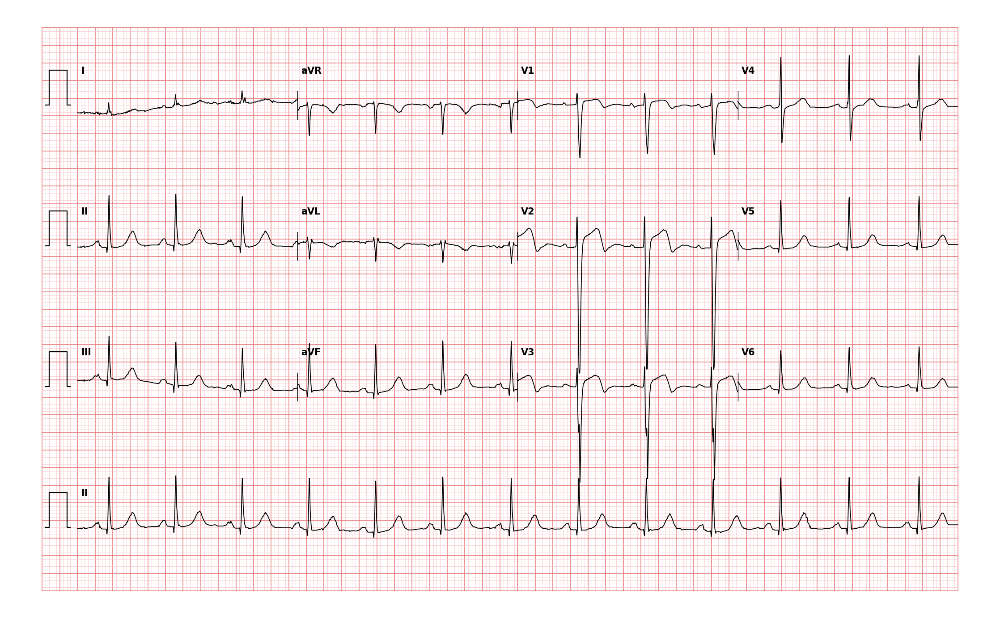

## 문제
71세 여자가 2시간 전부터 계속되는 가슴 가운데의 조이는 통증과 식은땀 때문에 구급차로 응급실에 왔다. 통증은 왼팔로 뻗치고 쉬어도 좋아지지 않았다. 10년 전부터 고혈압과 당뇨병으로 약을 먹고 있으며 출혈 병력이나 최근 수술은 없다. 혈압 138/82 mmHg, 맥박 76회/분, 호흡 20회/분, 체온 36.7℃, 산소포화도 96% 이다. 폐음은 깨끗하고 심잡음은 없으며 경정맥 확장은 없다. 아스피린을 씹어 먹게 한 뒤 시행한 12유도 심전도는 그림과 같다. 이 병원은 심혈관조영실이 있어 30분 안에 시술을 시작할 수 있다. 가장 적절한 처치는?

- A. 즉시 일차 경피적 관상동맥중재술
- B. 정맥 혈전용해제 투여 후 관찰
- C. 저분자량 헤파린 투여 후 트로포닌 재검
- D. 정맥 니트로글리세린 지속 주입 후 재평가
- E. 응급 관상동맥우회술

_12유도 심전도, 25 mm/s · 10 mm/mV, 3×4 + II 리듬 스트립 (PTB-XL ECG dataset, PhysioNet, CC BY 4.0 — 원신호 그대로 작도)_

## 정답 및 해설
> 정답: A

- **정답 핵심**: 심전도에서 V1~V3 에 r파가 거의 없는 rS/QS 형과 함께 V2·V3 에 J점에서 약 2 mm 위로 볼록한 ST 분절 상승이 있고 V1·V4 에도 경한 ST 상승이 이어지며, 하벽 유도와 V5·V6 에는 ST 상승이 없다 — 전중격 ST상승 심근경색이다. 2시간째 계속되는 허혈성 흉통과 함께 ST상승 심근경색 기준을 만족하므로 재관류가 최우선이고, 첫 의료 접촉에서 120분 안에 시술이 가능한 병원에서는 혈전용해제보다 일차 경피적 관상동맥중재술이 표준이다. 혈전용해제는 시술을 제때 할 수 없을 때의 대안이고, 항응고제와 트로포닌 재검으로 기다리는 것은 ST상승 심근경색에서 허용되지 않으며, 니트로글리세린은 증상 완화 보조일 뿐 재관류가 아니다. 응급 우회술은 해부학적으로 중재술이 불가능하거나 기계적 합병증이 있을 때 선택한다.
- **원리**: <b>ST 분절 상승은 심외막까지 이르는 관통성 허혈의 전기 신호</b>다. 관상동맥이 완전히 막히면 그 영역의 심근이 심내막에서 심외막으로 파도처럼 괴사해 가고(wavefront), 손상 전류가 그 영역을 마주 보는 유도에서 ST 상승으로 나타난다. <b>V1~V3 는 심실중격과 전벽을 마주 보는 유도</b>이므로 여기의 ST 상승은 좌전하행동맥(특히 중격 분지·대각 분지 이전 근위부)의 폐쇄를 뜻하고, r파가 사라지고 QS 형이 되는 것은 그 영역의 탈분극 전위가 소실됐다는 뜻이다. 하벽 유도에 ST 상승이 없고 상호 하강도 뚜렷하지 않아 우관상동맥 영역은 아니다.  <b>왜 일차 중재술인가</b> — 괴사는 시간에 비례해 커지므로(「time is muscle」) 치료의 본질은 <b>가장 빠르고 확실한 재개통</b>이다. 일차 경피적 관상동맥중재술은 혈전용해제보다 재개통률이 높고(TIMI 3 흐름 90 % 이상 vs 50~60 %), 재폐쇄와 두개내출혈이 적으며 사망률을 낮춘다. 그래서 첫 의료 접촉에서 <b>120분 안에 풍선 확장이 가능</b>하면 일차 중재술을, 그럴 수 없으면 증상 시작 12시간 안에 혈전용해제를 30분 안에 주고 이후 시술 병원으로 옮기는 약물-침습 전략을 쓴다. 이 환자는 시술 가능 병원에 있고 30분 안에 시작할 수 있으므로 갈등의 여지가 없다. 아스피린·P2Y12 억제제·항응고제는 시술과 함께 가는 보조 치료다.
- **비교**: <table><thead><tr><th style="width:26%">처치</th><th style="width:42%">그 처치가 맞는 조건</th><th>이 증례</th></tr></thead><tbody> <tr><td><b>즉시 일차 경피적 관상동맥중재술(정답)</b></td><td><b>ST상승 심근경색 + 첫 의료 접촉 120분 안에 시술 가능</b></td><td><b>V1~V3 ST 상승, 30분 안에 시술 가능</b></td></tr> <tr><td>정맥 혈전용해제(가장 가까운 오답)</td><td>ST상승 심근경색인데 120분 안에 시술이 불가능하고 증상 12시간 이내, 출혈 금기 없음</td><td>시술 가능 병원 — 혈전용해제의 자리가 없다</td></tr> <tr><td>저분자량 헤파린 + 트로포닌 재검</td><td>ST 상승이 없는 급성 관상동맥증후군에서 위험도 층화 중</td><td>ST 상승이 있어 기다리지 않는다</td></tr> <tr><td>정맥 니트로글리세린 지속 주입</td><td>지속 흉통·고혈압·폐울혈의 증상 조절 보조 — 재관류를 대신하지 못함</td><td>보조 치료일 뿐 최우선 처치가 아니다</td></tr> <tr><td>응급 관상동맥우회술</td><td>중재술 실패·불가능한 해부, 심실중격 파열·유두근 파열 같은 기계적 합병증</td><td>중재술 시도 전, 합병증 소견 없음</td></tr> </tbody></table> <b>가장 가까운 오답은 「정맥 혈전용해제」</b>다 — 같은 ST상승 심근경색의 재관류 치료이기 때문이다. 갈림길은 <b>시간과 시설</b>이다. 시술을 120분 안에 시작할 수 있으면 중재술, 없으면 혈전용해제 뒤 이송이다. 이 문제는 「30분 안에 시술 가능」이라는 한 줄이 답을 정한다.
- **오답 이유**:
  - ② 정맥 혈전용해제는 ST상승 심근경색의 재관류 치료이고 증상 2시간·출혈 금기 없음이라는 조건이 맞아 떠올릴 수 있지만, 첫 의료 접촉에서 120분 안에 시술이 가능하면 일차 중재술이 재개통률·출혈·사망률 모두에서 우월하다. 이 환자는 30분 안에 시술이 가능하다. 시술 병원까지 이송에 3시간이 걸리는 지역 병원이었다면 이 선지가 정답이다.
  - ③ 저분자량 헤파린을 주고 트로포닌을 재검하는 것은 ST 상승이 없는 급성 관상동맥증후군에서 위험도를 층화하며 초기 보존 치료를 할 때의 접근이다. 이 심전도는 V1~V3 에 ST 상승이 있어 트로포닌 결과와 무관하게 즉시 재관류 대상이다. 심전도에 ST 상승 없이 T파 역전만 있고 혈역학이 안정적이었다면 이 선지가 맞다.
  - ④ 정맥 니트로글리세린은 계속되는 흉통·고혈압·폐울혈을 조절하는 보조 치료라 떠올릴 수 있지만, 막힌 혈관을 열지 못하므로 재관류를 대신할 수 없고 우심실 경색이나 저혈압에서는 오히려 위험하다. 이 환자의 최우선은 재개통이다. 이미 재관류가 이루어진 뒤 흉통이 계속되고 혈압이 높았다면 이 선지가 적절한 보조 처치가 된다.
  - ⑤ 응급 관상동맥우회술은 중재술이 실패했거나 해부학적으로 불가능한 좌주간부·다혈관 질환, 또는 심실중격 파열·유두근 파열 같은 기계적 합병증이 있을 때의 재관류 방법이다. 이 환자는 아직 조영술도 하지 않았고 심잡음·폐울혈이 없어 합병증 징후가 없다. 조영술에서 중재술이 불가능한 좌주간부 병변이 확인되었다면 이 선지가 정답이 된다.
- **함정**: 「2시간 이내·출혈 금기 없음」이라는 혈전용해제의 조건이 모두 맞아도, 시술 가능 병원에서는 일차 중재술이 우선이다. 트로포닌 결과를 기다리지 않는다.
- **학습목표**: 급성 흉통 환자의 12유도 심전도에서 V1~V3 의 ST 분절 상승과 Q파를 읽어 전중격 ST상승 심근경색을 인지하고, 시술 가능 병원에서는 혈전용해제가 아니라 일차 경피적 관상동맥중재술을 선택한다
- **근거·출처**: PTB-XL (PhysioNet, CC BY 4.0) record 05895 — 71 F, anteroseptal myocardial infarction (ASMI likelihood 100), 2-cardiologist validated — Grade A; teacher-only · 작성자 판독(2026-09-23): 동리듬 75회/분, V1~V3 rS/QS 에 V2·V3 J점 약 2 mm 위로 볼록한 ST 상승, V1·V4 경한 ST 상승, 하벽 유도·V5·V6 ST 상승 없음, 유도 I 기저선 잡음 · Byrne RA et al. 2023 ESC Guidelines for the management of acute coronary syndromes. Eur Heart J 2023;44:3720 — primary PCI if ≤120 min from first medical contact · Rao SV et al. 2025 ACC/AHA/ACEP/NAEMSP/SCAI Guideline for the management of patients with acute coronary syndromes. Circulation 2025 · Harrison's Principles of Internal Medicine, 21st ed., ch. 'ST-segment elevation myocardial infarction' — reperfusion strategy selection

## 출처
- PTB-XL ECG dataset v1.0.3 (PhysioNet, CC BY 4.0) · record 5895 · Creative Commons Attribution 4.0 International · https://physionet.org/content/ptb-xl/1.0.3/LICENSE.txt
