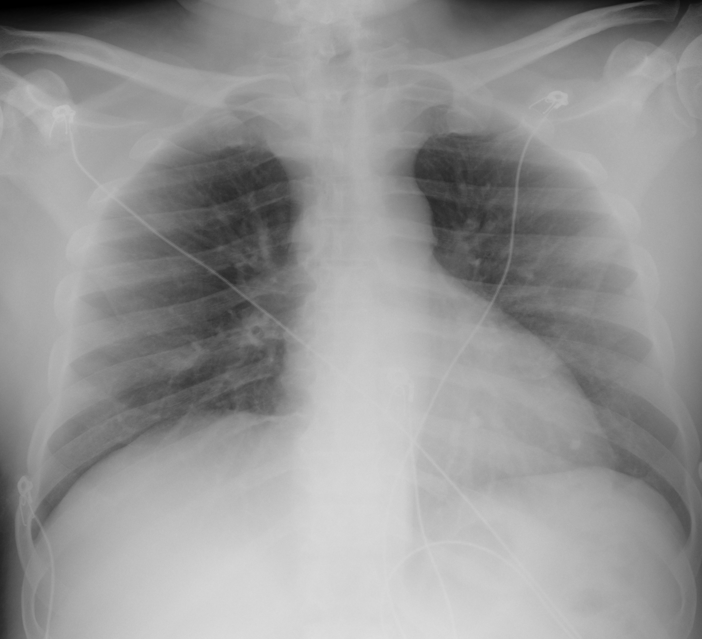

## 문제
A 55-year-old man comes to the emergency department because of 4 days of fever, dry cough, and worsening shortness of breath. One week ago he returned from a 3-night stay at a resort with a hot tub and spa. For 2 days he has had watery diarrhea 4 to 5 times daily, and this morning his family noticed that he was confused and slurring his words. He has a 20-pack-year smoking history, no diabetes mellitus, and no recent antibiotic use. His temperature is 39.4°C, pulse is 92/min, respirations are 26/min, and blood pressure is 108/66 mmHg; oxygen saturation is 90% on room air. Coarse crackles are heard over both lungs, and there is no neck stiffness. Laboratory studies show a leukocyte count of 14,800/mm3 (86% neutrophils), serum sodium of 126 mEq/L, AST of 96 U/L, ALT of 88 U/L, creatine kinase of 1,240 U/L, and C-reactive protein of 24 mg/dL. Gram stain of sputum shows many neutrophils but no organisms. A portable chest radiograph is shown. Which of the following is the most appropriate test to identify the causative organism?

- A. Nasopharyngeal influenza antigen test
- B. Two sets of blood cultures
- C. Urinary Legionella antigen assay
- D. Acid-fast stain of sputum for mycobacteria
- E. Serum Mycoplasma pneumoniae antibody titers

_Portable anteroposterior chest radiograph, unaltered apart from scaling (The Cancer Imaging Archive, CC BY 4.0; no cropping or window adjustment)_

## 정답 및 해설
> 정답: C

- **정답 핵심**: The chest radiograph shows patchy consolidation in both lungs, most marked in the right mid and lower zones and the left perihilar and lower zone, without cavitation or a large effusion. High fever and pneumonia beginning after a stay at a resort with a hot tub, together with watery diarrhea, confusion, hyponatremia, elevated aminotransferases and creatine kinase, and a sputum Gram stain with many neutrophils but no organisms, is the classic picture of Legionella pneumonia. Legionella stains poorly with Gram stain and does not grow on routine media, so the fastest and most widely used confirmatory test is the urinary antigen assay for serogroup 1, which remains positive after antibiotics are begun. Tuberculosis has a subacute course with upper-lobe cavitation; Mycoplasma causes milder disease in younger patients and antibody titers rise late; influenza does not explain diarrhea, hyponatremia, and a creatine kinase of 1,240 U/L; and blood cultures do not detect Legionella.
- **원리**: <b>Legionella is a gram-negative bacillus that lives inside amoebae in man-made water systems</b> — hot-water plumbing, cooling towers, hot tubs — and infects by inhalation of contaminated aerosol. In the lung it enters alveolar macrophages, blocks fusion of the phagosome with the lysosome, and multiplies inside the cell: it is a <b>facultative intracellular pathogen</b>. That biology explains three things at once: extracellular organisms are scarce, so <b>sputum Gram stain shows neutrophils without bacteria</b>; the lipopolysaccharide of its cell wall takes up Gram stain poorly; and it grows only on <b>buffered charcoal yeast extract</b> agar supplemented with cysteine and iron, so routine blood and sputum cultures are negative. Clinically the clues are the <b>extrapulmonary features</b> that accompany the pneumonia — diarrhea, altered mental status, hyponatremia (inappropriate antidiuretic hormone secretion), elevated aminotransferases, and rhabdomyolysis — and radiographs typically show rapidly progressive, multifocal, often bilateral consolidation.  <b>Why the urinary antigen assay</b> — soluble antigen is excreted in urine from the first days of illness; the assay returns a result within an hour, has a sensitivity of 70 to 90 percent and a specificity above 99 percent for <i>L. pneumophila</i> serogroup 1, which causes 80 to 90 percent of cases, and <b>stays positive for days to weeks after antibiotics are started</b>. Its limitation is that it misses other serogroups and species, so a negative result in a strongly suspected case is followed by culture on buffered charcoal yeast extract agar and polymerase chain reaction. Treatment requires a drug that reaches the intracellular organism — a <b>respiratory fluoroquinolone or azithromycin</b> — and beta-lactams are ineffective, which is why identifying the organism directly determines the antibiotic.
- **비교**: <table><thead><tr><th style="width:28%">Test</th><th style="width:40%">When it is the right test</th><th>This patient</th></tr></thead><tbody> <tr><td><b>Urinary Legionella antigen (answer)</b></td><td><b>Water exposure + pneumonia with diarrhea, confusion, hyponatremia, high CK, and a Gram stain without organisms</b></td><td><b>Hot-tub resort, watery diarrhea, confusion, Na 126, CK 1,240, no organisms on Gram stain</b></td></tr> <tr><td>Two sets of blood cultures (closest rival)</td><td>Baseline test in severe pneumonia — detects pneumococcal or staphylococcal bacteremia</td><td>Legionella does not grow on routine media, so cultures stay negative</td></tr> <tr><td>Acid-fast stain of sputum</td><td>Weeks to months of cough, weight loss, night sweats; upper-lobe cavities or nodules</td><td>Four-day acute course, no cavitation</td></tr> <tr><td>Mycoplasma antibody titers</td><td>Mild atypical pneumonia in a young patient; acute and convalescent titers compared</td><td>Older, severe, multifocal consolidation; result too slow</td></tr> <tr><td>Nasopharyngeal influenza antigen</td><td>Acute fever, myalgia, and cough in influenza season to decide on antivirals</td><td>Does not explain diarrhea, hyponatremia, aminotransferase and CK elevation</td></tr> </tbody></table> <b>The closest rival is blood cultures</b>, because they are ordered in every severe pneumonia. The dividing line is <b>what the test is meant to find</b>: this question asks for the causative organism in a patient whose picture points to Legionella, an organism that routine cultures cannot grow. Blood cultures are still sent, but the urinary antigen assay is the test that identifies the cause.
- **오답 이유**:
  - (A) A nasopharyngeal influenza antigen test is considered because of acute high fever and cough, but influenza does not explain watery diarrhea, confusion, a sodium of 126 mEq/L, a creatine kinase of 1,240 U/L, bilateral multifocal consolidation, or exposure to a hot tub, and the neutrophil-predominant leukocytosis argues against it. A patient in influenza season with abrupt fever, myalgia, and dry cough of one day and a clear radiograph would make this the appropriate test.
  - (B) Two sets of blood cultures are a standard part of the evaluation of severe pneumonia and should indeed be drawn, but Legionella is an intracellular organism that rarely causes bacteremia and does not grow on routine blood-culture media, so they cannot identify this cause. The question asks for the test that identifies the organism. If the Gram stain had shown gram-positive diplococci with lobar consolidation and pneumococcal bacteremia were the concern, blood cultures would be the appropriate answer.
  - (D) An acid-fast stain of sputum comes to mind in a smoker with fever, cough, and lung opacities, but tuberculosis runs a course of weeks to months with cough, weight loss, and night sweats and produces upper-lobe nodules and cavities; it does not explain diarrhea, confusion, hyponatremia, or a creatine kinase of 1,240 U/L. This patient has a 4-day febrile illness. Two months of cough with weight loss and an upper-lobe cavity on the radiograph would make this the right test.
  - (E) Mycoplasma antibody titers are considered because the Gram stain shows no organisms, which suggests an atypical pathogen. Mycoplasma pneumonia is typically a milder illness of younger patients, the titers must be compared between acute and convalescent sera so the result is late, and it does not account for hyponatremia, aminotransferase and creatine kinase elevation, or hot-tub exposure. A 20-year-old college student with 2 weeks of dry cough and low-grade fever and a unilateral interstitial infiltrate would fit this option.
- **함정**: Do not answer 'severe pneumonia' with 'blood cultures'. Extrapulmonary clues (diarrhea, confusion, hyponatremia, high CK), a Gram stain without organisms, and water exposure together call for the test that detects an organism routine cultures cannot grow.
- **학습목표**: 여행 뒤 발열·설사·의식 혼탁·저나트륨혈증과 흉부 X선의 양측 다발성 음영을 보이는 폐렴에서 레지오넬라 폐렴을 의심하고, 일반 배양으로 자라지 않는 이 균의 진단에 소변 항원검사를 선택한다
- **근거·출처**: TCIA COVID-19-AR (CC BY 4.0) — 55 M, portable AP chest radiograph, human-confirmed bilateral opacities — Grade B; the item asks only for the visible bilateral multifocal opacities and supplies the cause through clinical data; teacher-only · 작성자 판독(2026-09-23): 우측 중·하부와 좌측 폐문 주위·하부의 양측 반점상 경화·간유리 음영, 대엽 균질 경화·공동·큰 흉수 없음, 심전도 전극·케이블 외 장치 없음, 번인 문자 없음 · Harrison's Principles of Internal Medicine, 21st ed., ch. 'Legionella infections' — clinical clues, urinary antigen, BCYE culture, therapy · Metlay JP et al. Diagnosis and treatment of adults with community-acquired pneumonia. ATS/IDSA guideline. Am J Respir Crit Care Med 2019;200:e45 — Legionella urinary antigen in severe CAP · Cunha BA, Burillo A, Bouza E. Legionnaires' disease. Lancet 2016;387:376

## 출처
- COVID-19-AR, The Cancer Imaging Archive (CC BY 4.0) · series …11234748 · Creative Commons Attribution 4.0 International · https://www.cancerimagingarchive.net/data-usage-policies-and-restrictions/
