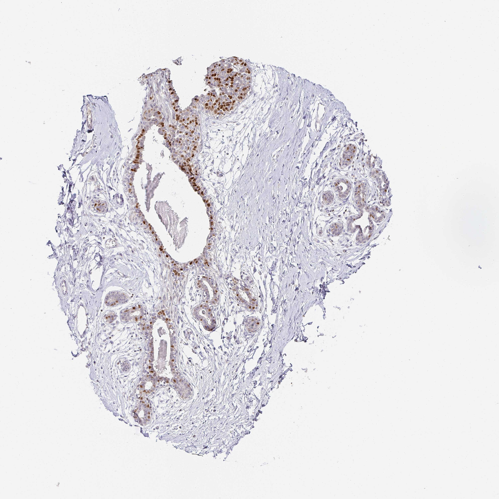

## 문제
A 45-year-old woman undergoes reduction mammoplasty. Her preoperative mammogram was normal, she has no personal or family history of breast cancer, and she takes no hormonal medications. Sections of the resected breast tissue are used as normal control tissue in the pathology laboratory. A section is stained by immunohistochemistry for a zinc-finger transcription factor that drives luminal differentiation of the mammary epithelium and that is also expressed in urothelium and in T lymphocytes but not in myoepithelial or stromal cells. A photomicrograph of the stained section of the breast is shown. In diagnostic pathology, detection of this protein is most useful for which of the following?

- A. Estimating the proliferation rate of a breast carcinoma
- B. Distinguishing ductal carcinoma in situ from invasive carcinoma
- C. Identifying breast or urothelial origin of a metastatic carcinoma of unknown primary
- D. Predicting response to endocrine therapy in invasive breast carcinoma
- E. Predicting response to trastuzumab in invasive breast carcinoma

_Immunohistochemical stain of a tissue microarray core (DAB brown chromogen, hematoxylin counterstain), original magnification (Human Protein Atlas, CC BY 4.0; no cropping or color adjustment)_

## 정답 및 해설
> 정답: C

- **정답 핵심**: The photomicrograph shows strong brown nuclear staining confined to the luminal epithelial cells lining the ducts and lobular acini, while the stroma, adipose tissue, vessels, and the outer myoepithelial layer are unstained — the pattern of a nuclear transcription factor restricted to luminal epithelium. The stem defines the protein as a zinc-finger transcription factor of luminal differentiation that is also expressed in urothelium and T cells, which is GATA3. Because GATA3 is retained in most breast carcinomas, including many that have lost estrogen receptor, and in urothelial carcinoma, its main diagnostic use is to assign a metastatic carcinoma of unknown primary to a breast or urothelial origin. Estrogen receptor predicts endocrine response, HER2 predicts trastuzumab benefit, Ki-67 estimates proliferation, and myoepithelial markers such as p63 and smooth muscle myosin heavy chain separate in situ from invasive disease.
- **원리**: <b>GATA3 is a zinc-finger transcription factor</b> that binds the GATA motif and is required for the specification and maintenance of the <b>luminal cell lineage</b> of the mammary gland; it is also essential for T-helper-2 lymphocyte differentiation and is expressed in urothelium, skin adnexa, and some other epithelia. As a transcription factor it lives in the nucleus, so a positive stain is <b>nuclear</b>, and in normal breast it marks the inner luminal layer of ducts and acini but not the outer myoepithelial cells or the stroma — exactly the distribution in the image. In breast carcinoma GATA3 lies in the same regulatory network as estrogen receptor and FOXA1, but it is retained in roughly 90 percent of all breast cancers and in about half of triple-negative tumors, so it identifies breast lineage even where estrogen receptor is lost.  <b>Why lineage assignment is its diagnostic role</b> — when a carcinoma presents as a metastasis (axillary or supraclavicular node, bone, liver, pleura) with no known primary, the pathologist uses a panel of lineage-restricted transcription factors: TTF-1 for lung and thyroid, PAX8 for kidney, ovary, and thyroid, CDX2 for intestine, NKX3.1 for prostate, and <b>GATA3 for breast and urothelium</b>. A GATA3-positive, TTF-1-negative adenocarcinoma in a woman's axillary node points to an occult breast primary; GATA3 with p63 and uroplakin points to urothelial carcinoma. The <b>predictive</b> markers are different proteins with different logic: estrogen and progesterone receptors predict benefit from tamoxifen or aromatase inhibitors, HER2 predicts benefit from trastuzumab, and Ki-67 quantifies the fraction of cycling cells. Myoepithelial markers (p63, calponin, smooth muscle myosin heavy chain) outline the intact layer around in situ carcinoma and are lost when tumor invades.
- **비교**: <table><thead><tr><th style="width:30%">Use</th><th style="width:40%">Marker and staining pattern</th><th>Why not the protein shown</th></tr></thead><tbody> <tr><td><b>Breast or urothelial origin of a metastasis (answer)</b></td><td><b>GATA3 — nuclear, luminal epithelium, retained in most breast and urothelial carcinomas</b></td><td><b>Fits the stem and the image</b></td></tr> <tr><td>Endocrine-therapy response (closest rival)</td><td>Estrogen receptor — nuclear steroid receptor in luminal cells of normal breast and in about 75 percent of carcinomas</td><td>Not a zinc-finger transcription factor, not expressed in urothelium or T cells</td></tr> <tr><td>Trastuzumab response</td><td>HER2 — membranous growth-factor receptor, amplified in 15–20 percent of carcinomas</td><td>Membranous, not nuclear; not a transcription factor</td></tr> <tr><td>Proliferation rate</td><td>Ki-67 — nuclear protein of cycling cells, scattered positive nuclei</td><td>Present in all dividing cells, not lineage-restricted; staining here is uniform in luminal cells</td></tr> <tr><td>In situ versus invasive</td><td>p63, calponin, smooth muscle myosin heavy chain — myoepithelial layer</td><td>The protein shown is absent from myoepithelial cells</td></tr> </tbody></table> <b>The closest rival is estrogen receptor</b>, because it too stains luminal nuclei of normal breast and is the marker students associate with breast pathology. The dividing line is <b>what the stem says the protein is</b>: a zinc-finger transcription factor expressed also in urothelium and T lymphocytes is GATA3, whose job in diagnosis is lineage, not therapy prediction. Read the biology in the stem before reaching for the most familiar marker.
- **오답 이유**:
  - (A) Estimating proliferation is the role of Ki-67, a nuclear protein present in all cycling cells regardless of lineage, giving scattered positive nuclei whose percentage is reported. The protein shown stains essentially every luminal cell uniformly and is lineage-restricted to breast, urothelium, and T cells, which is the opposite of a proliferation marker. Had the stem described a nuclear antigen expressed only in the G1, S, G2, and M phases of the cell cycle, this option would be correct.
  - (B) Distinguishing in situ from invasive carcinoma relies on demonstrating the myoepithelial layer with p63, calponin, or smooth muscle myosin heavy chain, which is intact around ductal carcinoma in situ and absent around invasive tumor. The stem states that this protein is not expressed in myoepithelial cells, so it cannot outline that layer. If the stain had decorated the outer basal layer of the ducts while sparing the luminal cells, a myoepithelial marker and this option would fit.
  - (D) Predicting endocrine-therapy response is the role of estrogen receptor, which also shows nuclear staining in luminal cells of normal breast, so it is the natural first thought. The stem, however, describes a zinc-finger transcription factor expressed in urothelium and T lymphocytes — GATA3, not a steroid hormone receptor — and GATA3 status does not by itself determine hormonal therapy. Had the stem described a nuclear steroid receptor whose ligand is estradiol, this option would be correct.
  - (E) Predicting trastuzumab response belongs to HER2, a membrane tyrosine-kinase receptor whose overexpression or amplification is scored by membranous staining and in situ hybridization. The protein in this image is nuclear and is defined as a transcription factor, so it cannot be HER2. If the photomicrograph had shown complete, strong membranous staining of tumor cells and the stem had described a growth-factor receptor, this option would be the answer.
- **함정**: Nuclear staining of luminal breast cells is not automatically estrogen receptor. The stem gives the identity — a lineage transcription factor shared with urothelium and T cells — and lineage markers answer 'where did this tumor come from', not 'which drug will work'.
- **학습목표**: 정상 유방 조직의 면역조직화학에서 관강 상피세포 핵에 국한된 염색을 읽고, 관강 분화를 조절하며 요로상피·T세포에도 발현되는 아연손가락 전사인자(GATA3)의 임상적 용도가 원발 불명 전이암의 유방·요로상피 기원 확인임을 에스트로겐 수용체·HER2·Ki-67·근상피 표지자와 구별한다
- **근거·출처**: Human Protein Atlas, GATA3 / breast (CC BY 4.0), image 140542_B_2_4 — 45 F, normal breast TMA core; author reading 2026-09-23 — Grade A tissue identity; teacher-only · 작성자 판독(2026-09-23): 유관·소엽 관강 상피세포 핵이 강한 갈색으로 염색되고 기질·지방·혈관·근상피 쪽은 음성; 문자·식별 표지 없음 · Miettinen M et al. GATA3: a multispecific but potentially useful marker in surgical pathology. Am J Surg Pathol 2014;38:13 · Robbins & Cotran Pathologic Basis of Disease, 10th ed., ch. 'The breast' — prognostic and predictive markers; ch. 'Neoplasia' — immunohistochemistry in carcinoma of unknown primary · Kouros-Mehr H et al. GATA-3 maintains the differentiation of the luminal cell fate in the mammary gland. Cell 2006;127:1041

## 출처
- Human Protein Atlas, GATA3 / Breast (CC BY 4.0), https://images.proteinatlas.org/16217/140542_B_2_4.jpg · Creative Commons Attribution 4.0 International · https://www.proteinatlas.org/about/licence
