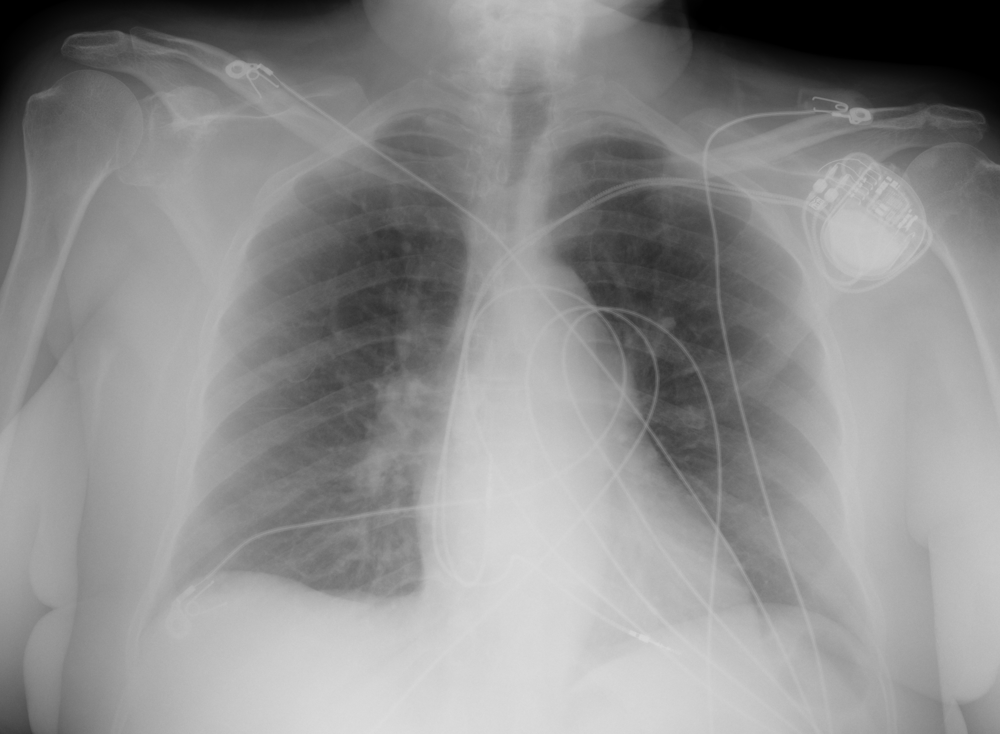

## 문제
77세 여자가 5일 전부터 열과 기침이 나고 이틀 전부터 숨이 차서 응급실에 왔다. 3일 전 같은 요양시설의 입소자가 코로나19로 진단되었다. 10년 전 완전방실차단으로 심박동기를 넣었고 고혈압약을 먹고 있다. 체온 38.4℃, 혈압 132/76 mmHg, 맥박 88회/분, 호흡 26회/분이고 실내공기에서 산소포화도는 89% 이다. 양쪽 아래 폐야에서 수포음이 들린다. 다리 부종은 없다. 코인두 도말 SARS-CoV-2 PCR 은 양성이고 혈청 크레아티닌은 0.9 mg/dL 이다. 흉부 X선은 그림과 같다. 비강 캐뉼라로 산소를 주기 시작하였다. 이 환자에게 투여할 약물로 가장 적절한 것은?

- A. 오셀타미비르
- B. 이버멕틴
- C. 덱사메타손
- D. 니르마트렐비르-리토나비르
- E. 하이드록시클로로퀸

_이동식 전후면 흉부 X선, 원본 그대로 크기 조정만 (The Cancer Imaging Archive, CC BY 4.0 — 크롭·윈도우 조정 없음)_

## 정답 및 해설
> 정답: C

- **정답 핵심**: 흉부 X선에서 우측 폐문 주위에서 중·하폐야로 이어지는 반점상 경화·간유리 음영과 좌하폐야 심장 뒤의 흐린 음영이 보여 양측 폐렴이고, 좌측 쇄골하 심박동기와 리드는 병력과 맞는 기구일 뿐이다. SARS-CoV-2 PCR 양성에 실내공기 산소포화도 89% 로 산소 보충이 필요하므로 중증(산소 요구) 코로나19 폐렴이다. 이 단계에서 사망률을 낮추는 것으로 증명된 약물은 덱사메타손(6 mg 하루 1회, 최대 10일)이다. 니르마트렐비르-리토나비르는 산소가 필요 없는 고위험 외래 환자의 경증 질환에서 발병 5일 안에 쓰는 약이고, 하이드록시클로로퀸·이버멕틴은 효과가 없으며, 오셀타미비르는 인플루엔자 치료제다.
- **원리**: <b>코로나19 폐렴은 시기에 따라 병의 주체가 바뀐다.</b> 발병 첫 며칠은 <b>바이러스 증식</b>이 주체라 항바이러스제가 효과를 내고, 약 1주 전후로 폐에서 <b>과도한 숙주 염증 반응</b>(사이토카인·폐포 손상·미세혈전)이 주체가 되면서 저산소증이 나타난다. 그래서 치료 선택의 축은 「발병 며칠째인가」보다 <b>「산소가 필요한가」</b>다 — 산소 요구는 염증 단계에 들어섰다는 가장 실용적인 표지이기 때문이다.  <b>덱사메타손</b>은 글루코코르티코이드 수용체를 통해 NF-κB 등 염증 전사를 억제해 폐포 손상을 줄인다. RECOVERY 시험에서 산소 보충이 필요한 환자와 기계환기 환자의 28일 사망률을 낮췄고, <b>산소가 필요 없는 환자에서는 이득이 없고 해가 될 수 있었다</b> — 같은 약이 시기에 따라 득실이 뒤집히는 것이다. 반대로 <b>니르마트렐비르-리토나비르</b>(3CL 단백분해효소 억제)는 바이러스 증식 단계의 약이라 산소가 필요 없는 고위험 외래 환자에서 입원·사망을 줄인다. 이미 입원해 산소가 필요한 환자에서는 이 근거가 없고, 리토나비르가 CYP3A 를 강하게 억제해 고령 다약제 복용자에서 상호작용 부담도 크다. 흉부 X선은 양측 음영으로 폐렴을 확인하고, 산소포화도가 중증도를 정한다 — 둘을 합쳐야 치료가 정해진다.
- **비교**: <table><thead><tr><th style="width:26%">약물</th><th style="width:42%">그 약이 맞는 조건</th><th>이 증례</th></tr></thead><tbody> <tr><td><b>덱사메타손(정답)</b></td><td><b>입원 + 산소 보충 또는 환기 보조가 필요한 코로나19</b></td><td><b>실내공기 SpO2 89%, 산소 시작, 양측 폐렴</b></td></tr> <tr><td>니르마트렐비르-리토나비르(가장 가까운 오답)</td><td>산소가 필요 없는 경증·중등증, 중증 진행 고위험(고령 등), 발병 5일 이내, 외래</td><td>이미 산소가 필요 — 이 약의 대상 단계를 지났다</td></tr> <tr><td>하이드록시클로로퀸</td><td>코로나19 적응 없음(대규모 무작위시험에서 효과 없음), 말라리아·루푸스 약</td><td>—</td></tr> <tr><td>오셀타미비르</td><td>인플루엔자(뉴라미니데이스 억제) — 동시 감염이 확인되면 추가</td><td>인플루엔자 검사 결과 없음, PCR 은 SARS-CoV-2 양성</td></tr> <tr><td>이버멕틴</td><td>기생충 감염 — 코로나19 무작위시험에서 효과 없음</td><td>—</td></tr> </tbody></table> <b>가장 가까운 오답은 니르마트렐비르-리토나비르</b>다 — 77세라는 고위험 인자가 떠오르게 한다. 갈림길은 <b>산소 요구</b>다. 산소가 필요 없으면 항바이러스제, 산소가 필요하면 덱사메타손(입원 환자에서는 렘데시비르를 함께 쓰기도 한다)이라고 정리하면 어느 방향으로 물어도 풀린다.
- **오답 이유**:
  - ① 오셀타미비르는 요양시설 고령자의 열·기침에서 인플루엔자를 함께 생각하게 만들지만, 이 환자는 SARS-CoV-2 PCR 이 양성이고 인플루엔자 검사 근거가 없다. 인플루엔자 신속항원이나 PCR 이 양성이었다면 발병 시기와 무관하게 입원 환자에게 투여할 약이다.
  - ② 이버멕틴은 기생충 치료제로 코로나19에서 여러 무작위시험이 효과를 보여 주지 못해 권고되지 않는다. 분선충(Strongyloides) 감염 위험 지역 출신 환자에게 스테로이드를 쓰기 전 선제 치료를 할 때라면 이 약이 정답이 된다.
  - ④ 니르마트렐비르-리토나비르는 77세 고위험 환자에서 입원과 사망을 줄이는 경구 항바이러스제라 떠올릴 수 있지만, 근거가 있는 대상은 산소가 필요 없는 경증·중등증 외래 환자다. 이 환자는 산소포화도 89% 로 이미 산소가 필요하다. 산소포화도가 96% 이고 발병 3일째인 외래 환자였다면 이 선지가 정답이다.
  - ⑤ 하이드록시클로로퀸은 유행 초기 시험관 연구로 기대를 모았지만 대규모 무작위시험에서 사망률·입원에 효과가 없고 QT 연장 위험만 있어 코로나19 치료로 권고되지 않는다. 말라리아 예방이나 전신홍반루푸스를 치료하는 상황이라면 정답이 될 약이다.
- **함정**: 고령·기저질환이라는 「고위험」 단어에 끌려 외래 경구 항바이러스제를 고르지 않는다. 치료 단계를 가르는 것은 나이가 아니라 산소 요구다.
- **학습목표**: 코로나19 환자의 흉부 X선에서 양측 폐 음영을 읽고 실내공기 산소포화도 저하로 산소가 필요한 중증 폐렴임을 판단해, 외래 경구 항바이러스제가 아니라 덱사메타손을 고른다
- **근거·출처**: TCIA COVID-19-AR (CC BY 4.0) — 77 F portable AP chest radiograph, bilateral opacities (collection-level label, Grade B); teacher-only · 작성자 판독(2026-09-24): 우측 폐문 주위~중·하폐야 반점상 경화·간유리 음영, 좌하폐야 심장 뒤 흐린 음영, 흉수·기흉 없음, 좌측 쇄골하 이중 리드 심박동기 · RECOVERY Collaborative Group. Dexamethasone in hospitalized patients with Covid-19. N Engl J Med 2021;384:693 · Hammond J et al. Oral nirmatrelvir for high-risk, nonhospitalized adults with Covid-19 (EPIC-HR). N Engl J Med 2022;386:1397 · IDSA Guidelines on the treatment and management of patients with COVID-19 (updated) — corticosteroids for patients requiring supplemental oxygen

## 출처
- COVID-19-AR, The Cancer Imaging Archive (CC BY 4.0) · series …27602620 · Creative Commons Attribution 4.0 International · https://www.cancerimagingarchive.net/data-usage-policies-and-restrictions/
