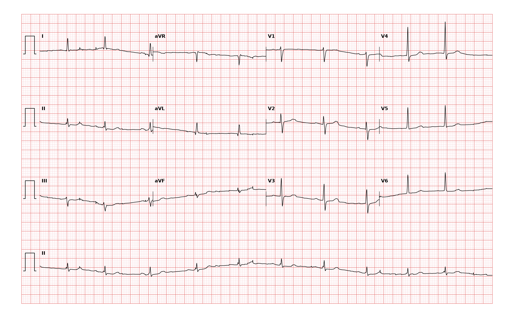

## 문제
An 83-year-old man comes to the emergency department 2 hours after an episode of pressure-like substernal chest discomfort that began while he was walking and resolved after 20 minutes of rest. He is now pain free. He has hypertension and hyperlipidemia treated with amlodipine and atorvastatin. His temperature is 36.6°C, pulse is 66/min, respirations are 16/min, and blood pressure is 142/80 mmHg. Oxygen saturation is 97% on room air. The lungs are clear to auscultation, and there is no murmur or peripheral edema. He is given aspirin on arrival. A 12-lead ECG is shown. An initial high-sensitivity troponin T level is at the upper reference limit. Which of the following is the most appropriate next step in management?

- A. Intravenous alteplase
- B. Discharge home with outpatient exercise stress testing
- C. CT pulmonary angiography
- D. Repeat high-sensitivity troponin measurement in 1 to 3 hours
- E. Emergency coronary angiography

_12-lead ECG, 25 mm/s and 10 mm/mV, 3×4 layout with lead II rhythm strip (PTB-XL ECG dataset, PhysioNet, CC BY 4.0; plotted from the raw signal)_

## 정답 및 해설
> 정답: D

- **정답 핵심**: The ECG shows sinus rhythm at about 65/min with narrow QRS complexes, flattened T waves in leads I, aVL, V5, and V6, and no ST-segment elevation or new bundle branch block. This is a nonspecific repolarization abnormality, not a STEMI equivalent. An 83-year-old man with exertional substernal pressure relieved by rest has a high pretest probability of acute coronary syndrome, and a single troponin at the reference limit 2 hours after pain cannot exclude myocardial infarction. The next step is a repeat high-sensitivity troponin at 1 to 3 hours (per the assay algorithm) to look for a rise, while continuing monitoring and antiplatelet therapy. Emergency angiography and thrombolysis are for STEMI or unstable NSTE-ACS, discharge requires a rule-out first, and pulmonary embolism is not suggested.
- **원리**: <b>Myocardial infarction is diagnosed by a rise and/or fall of troponin</b> with at least one value above the 99th percentile, in a clinical setting of ischemia. Troponin leaks from necrotic myocytes over hours, so one value drawn soon after symptoms can be normal even in infarction. A <b>delta</b> — the change between two samples 1 to 3 hours apart with a high-sensitivity assay — separates acute injury (rising or falling) from chronic elevation (stable) and from no injury.  <b>The ECG sorts the pathway first.</b> ST elevation in two contiguous leads (or a STEMI equivalent) means an occluded artery and immediate reperfusion, without waiting for troponin. Anything else — ST depression, T-wave inversion, <b>nonspecific T flattening</b>, or a normal tracing — goes down the NSTE pathway, where troponin kinetics and risk scores decide between invasive and noninvasive strategies. Flat T waves in lateral leads are common in older adults with hypertension and are neither diagnostic of ischemia nor reassuring; they simply do not change the pathway. The history here (typical angina at exertion, relief by rest, age 83) keeps the probability of ACS high, so the patient cannot be discharged on one borderline value. Serial troponin plus serial ECGs if pain recurs is the correct, time-bounded step; a rise would make this NSTEMI and lead to early angiography within 24 hours.
- **비교**: <table><thead><tr><th style="width:28%">Option</th><th style="width:42%">When it is right</th><th>This patient</th></tr></thead><tbody> <tr><td><b>Repeat hs-troponin in 1–3 h (answer)</b></td><td><b>Suspected ACS, no ST elevation, pain-free, first troponin not diagnostic</b></td><td><b>Nonspecific T flattening only, troponin at reference limit</b></td></tr> <tr><td>Emergency coronary angiography (closest rival)</td><td>STEMI, or NSTE-ACS with refractory pain, hemodynamic or electrical instability, acute heart failure</td><td>Pain free, stable, no heart failure, no arrhythmia</td></tr> <tr><td>Intravenous alteplase</td><td>STEMI when timely PCI is not available</td><td>No ST elevation — fibrinolysis is harmful in NSTE-ACS</td></tr> <tr><td>Discharge with outpatient stress test</td><td>Low-risk chest pain after serial troponins exclude infarction</td><td>Infarction not yet excluded</td></tr> <tr><td>CT pulmonary angiography</td><td>Pleuritic pain, tachycardia, hypoxemia, risk factors for venous thromboembolism</td><td>SpO2 97%, pulse 66, exertional pressure</td></tr> </tbody></table> <b>The closest rival is emergency angiography</b>: the story sounds like unstable angina in an old man. What divides them is <b>ST elevation or instability</b>. Without either, the NSTE pathway uses the troponin delta to decide how urgently to go to the catheterization laboratory.
- **오답 이유**:
  - (A) Intravenous alteplase is a reperfusion therapy and so comes to mind for suspected infarction, but fibrinolysis helps only when ST elevation shows an occluded artery and PCI cannot be done in time. In NSTE-ACS it increases bleeding without benefit. With ST elevation in two contiguous leads and no nearby PCI center, it would be correct.
  - (B) Discharge with outpatient stress testing is reasonable for low-risk chest pain once serial high-sensitivity troponins show no rise. A single borderline value 2 hours after typical angina in an 83-year-old does not exclude infarction. If the repeat troponin were unchanged and below the threshold with no recurrent pain, this would become the right plan.
  - (C) CT pulmonary angiography evaluates pulmonary embolism, which can cause chest pain and troponin elevation. Here the pain was exertional pressure relieved by rest, and he is not tachycardic or hypoxemic. With sudden pleuritic pain, tachycardia, hypoxemia, and a recent long flight or surgery, this would be the right test.
  - (E) Emergency coronary angiography is tempting because the history is typical for unstable coronary disease in an elderly man. It is indicated immediately only for STEMI or very-high-risk NSTE-ACS (ongoing pain, shock, arrhythmia, acute heart failure). This patient is pain free and stable with no ST elevation. If his chest pain had recurred and persisted despite nitrates, this would be the answer.
- **함정**: A 'nonspecific' ECG is not a normal one, and a single normal troponin soon after pain does not rule out infarction. Neither is it an indication for immediate reperfusion — follow the troponin delta.
- **학습목표**: 흉통이 멎은 고령 환자의 12유도 심전도에서 ST 상승 없이 측벽 유도의 비특이적 T파 편평만 있음을 읽고, 즉시 재관류가 아니라 고감도 트로포닌 연속 측정으로 비ST상승 급성 관상동맥증후군을 평가한다
- **근거·출처**: PTB-XL (PhysioNet, CC BY 4.0) record 10022 — 83 M, non-diagnostic T abnormalities (NDT likelihood 100), 2-cardiologist validated — Grade A; teacher-only · 작성자 판독(2026-09-24): 동리듬 약 65회/분, 좁은 QRS, I·aVL·V5·V6 T파 편평, ST 상승 없음, III·aVF 기저선 흔들림 · Byrne RA et al. 2023 ESC Guidelines for the management of acute coronary syndromes. Eur Heart J 2023;44:3720 — 0 h/1 h and 0 h/2 h hs-troponin algorithms · Thygesen K et al. Fourth universal definition of myocardial infarction (2018). Circulation 2018;138:e618 · Gulati M et al. 2021 AHA/ACC guideline for the evaluation and diagnosis of chest pain. Circulation 2021;144:e368

## 출처
- PTB-XL ECG dataset v1.0.3 (PhysioNet, CC BY 4.0) · record 10022 · Creative Commons Attribution 4.0 International · https://physionet.org/content/ptb-xl/1.0.3/LICENSE.txt
