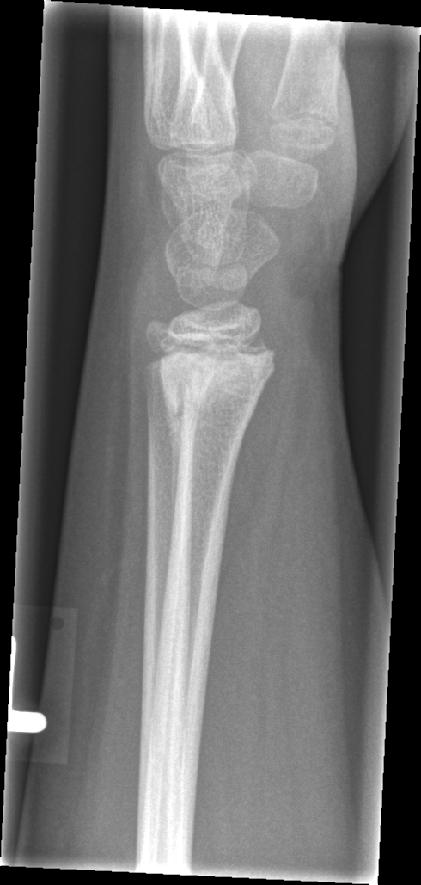

## 문제
9세 남아가 3주 전 놀이터에서 넘어지며 왼손을 짚은 뒤 손목이 계속 아파서 병원에 왔다. 넘어진 당일 손목이 부었으나 병원에 가지 않았고 부기는 1주일 뒤 대부분 가라앉았다. 지금은 손목을 짚거나 공을 던질 때만 아프다. 열·체중감소·야간 통증은 없고 다른 부위에 멍이나 골절 병력은 없다. 체온 36.6℃ 이다. 왼쪽 원위 요골 등쪽에 국한된 가벼운 압통이 있고 발적·열감·변형은 없으며 손가락 운동과 감각은 정상이다. 혈액검사에서 백혈구 7,600/mm³, 적혈구침강속도 8 mm/h, C반응단백 0.2 mg/dL 이다. 왼쪽 손목 측면 X선은 그림과 같다. 가장 적절한 처치는?

- A. 도수정복과 경피적 핀 고정
- B. 뼈 스캔
- C. 짧은 팔 석고 고정 후 외래 추적
- D. 뼈 생검
- E. 정맥 항생제 투여

_왼쪽 손목 측면 단순 X선, 원본 그대로 크기 조정만 (GRAZPEDWRI-DX, figshare, CC BY 4.0)_

## 정답 및 해설
> 정답: C

- **정답 핵심**: X선에서 원위 요골 골간단을 가로지르는 희미한 경화대가 있고 전위·각형성은 없으며 성장판은 열려 있어, 3주 전 외상에 따른 치유 중인 원위 요골 골절(경화대 = 골절선 주변의 새 뼈, 피질을 따라 얇은 골막 신생골)이다. 열·야간 통증·체중감소가 없고 백혈구·적혈구침강속도·C반응단백이 정상이며 압통이 국소적이어서 골수염이나 종양으로 인한 골막 반응을 의심할 이유가 없다. 따라서 짧은 팔 석고 또는 부목으로 고정해 통증을 줄이고 2~3주 뒤 추적한다. 생검·항생제·뼈 스캔은 필요 없고, 전위가 없어 정복과 핀 고정도 필요 없다.
- **원리**: <b>골막 반응은 「뼈가 반응하고 있다」는 뜻일 뿐, 원인은 맥락이 정한다.</b> 소아의 골막은 두껍고 느슨하게 붙어 있으며 골형성 능력이 매우 커서, 골절이 생기면 1~2주 안에 골막 밑에서 새 뼈(가골)를 만든다. 그래서 X선에서 <b>피질을 따라 얇고 매끈한 한 겹의 골막 신생골</b>과 <b>골절선 주변의 경화대</b> (골절 틈에 새로 생긴 뼈가 겹쳐 하얗게 보임)가 나타나는데, 이것은 치유의 정상 경과다. 외상 직후 X선에서 보이지 않던 미세 골절이 2~3주 뒤 이런 경화대로 비로소 드러나기도 한다.  <b>같은 골막 반응이 골수염·유잉육종·골육종에서도 나온다.</b> 이들을 가르는 것은 <b>골막 반응의 모양</b>과 <b>임상 맥락</b>이다. 치유 가골은 매끈하고 연속적인 한 겹이며 골절선과 붙어 있고, 뼈 파괴가 없다. 공격적인 병변은 여러 겹의 양파 껍질 모양, 햇살 모양, 코드만 삼각을 만들고 골수의 경계 불분명한 골용해를 동반한다. 임상에서는 외상과 시간 관계가 맞는가, 열·야간 통증·체중감소가 있는가, 염증 표지(적혈구침강속도·C반응단백)가 오르는가를 본다. 이 아이는 외상 3주 뒤, 매끈한 가골, 뼈 파괴 없음, 정상 염증 표지이므로 치유 중인 골절이고, 추가 검사가 아니라 고정과 추적이 답이다. 여러 시기의 골절이나 설명과 맞지 않는 손상이면 아동학대를 반드시 생각한다.
- **비교**: <table><thead><tr><th style="width:24%">진단(처치)</th><th style="width:44%">X선과 임상의 결정적 소견</th><th>이 증례</th></tr></thead><tbody> <tr><td><b>치유 중 골절(고정·추적 — 정답)</b></td><td><b>외상 2~3주 뒤, 골절선 경화대 + 매끈한 한 겹 골막 신생골, 뼈 파괴 없음, 염증 표지 정상</b></td><td><b>3주 전 넘어짐, 경화대, 전위 없음, ESR·CRP 정상</b></td></tr> <tr><td>유잉육종·골육종(뼈 생검 — 가장 가까운 오답)</td><td>여러 겹 양파 껍질·햇살 모양 골막 반응, 코드만 삼각, 투과성 골용해, 야간 통증·연부조직 종괴</td><td>야간 통증·종괴·골용해 없음</td></tr> <tr><td>급성 골수염(정맥 항생제)</td><td>열, 국소 발적·열감, ESR·CRP 상승, 골간단 골용해(1~2주 뒤)</td><td>열 없음, 염증 표지 정상</td></tr> <tr><td>전위 골절(도수정복·핀 고정)</td><td>각형성·전위가 허용 범위를 넘는 급성 골절</td><td>전위·각형성 없음, 이미 치유 중</td></tr> <tr><td>뼈 스캔</td><td>X선 음성인 피로 골절·다발성 병변·학대 선별</td><td>X선으로 이미 설명됨</td></tr> </tbody></table> <b>가장 가까운 오답은 뼈 생검</b>이다 — 「소아 뼈의 골막 반응 = 종양」이라는 연상 때문이다. 갈림길은 <b>외상과의 시간 관계 + 골막 반응의 모양 + 전신 증상</b>이다. 세 가지가 모두 치유 쪽이면 추적 X선으로 충분하고, 하나라도 공격적이면 MRI 와 생검으로 간다.
- **오답 이유**:
  - ① 도수정복과 경피적 핀 고정은 전위되거나 각형성이 허용 범위를 넘는 원위 요골 골절의 치료라 골절이라는 공통점으로 떠오를 수 있다. 이 X선은 전위·각형성이 없고 이미 가골이 생기고 있다. 넘어진 당일 X선에서 등쪽으로 30° 각형성된 골간단 골절이 보였다면 이 선지가 적절하다.
  - ② 뼈 스캔은 X선에서 안 보이는 피로 골절이나 다발성 병변, 아동학대의 숨은 골절을 찾을 때 쓰여 떠올릴 수 있지만, 이 아이의 통증은 X선의 치유 골절로 설명되고 다른 부위 손상 병력도 없다. 설명과 맞지 않는 여러 시기의 골절이 의심되는 영아였다면 골격 조사와 함께 이 검사가 필요하다.
  - ④ 뼈 생검은 소아 뼈의 골막 반응에서 유잉육종·골육종을 놓치지 않으려는 생각으로 떠오르지만, 이 아이는 외상과 시간 관계가 맞고 야간 통증·연부조직 종괴·골용해가 없으며 골막 반응이 매끈한 한 겹이다. 여러 겹의 양파 껍질 모양 골막 반응과 투과성 골용해, 야간 통증이 있었다면 MRI 뒤 생검이 정답이다.
  - ⑤ 정맥 항생제는 소아 골간단의 급성 골수염이 흔하고 골막 반응을 만들기 때문에 떠올릴 수 있지만, 이 아이는 열이 없고 발적·열감이 없으며 백혈구·적혈구침강속도·C반응단백이 정상이다. 열이 나고 국소 발적·열감과 함께 C반응단백이 크게 올라 있었다면 혈액배양 뒤 정맥 항생제가 정답이 된다.
- **함정**: 소아 X선의 골막 반응을 곧바로 종양·감염으로 읽지 않는다. 외상과의 시간 관계, 골막 반응의 모양, 전신 증상을 함께 본다.
- **학습목표**: 외상 3주 뒤 소아 손목 X선에서 원위 요골 골간단의 경화대와 골막 신생골을 치유 중인 골절의 가골로 읽고, 전신 증상·염증 표지가 없으면 골수염·종양 검사 대신 고정과 추적을 선택한다
- **근거·출처**: GRAZPEDWRI-DX (figshare, CC BY 4.0) — 9.8 M, left wrist lateral, healing distal radius fracture with periosteal reaction, pediatric radiologist annotation (AO/OTA 23r-E/2.1) — Grade A; teacher-only · 작성자 판독(2026-09-24): 원위 요골 골간단을 가로지르는 희미한 경화대, 전위·각형성 없음, 성장판 열림, 좌하단 표지 막대에 글자 없음 · Nagy E et al. A pediatric wrist trauma X-ray dataset (GRAZPEDWRI-DX) for machine learning. Sci Data 2022;9:222 · Rockwood and Wilkins' Fractures in Children, 9th ed., ch. 'Fractures of the distal radius and ulna' — healing and periosteal reaction · Nelson Textbook of Pediatrics, 21st ed., ch. 'Osteomyelitis' and 'Ewing sarcoma' — periosteal reaction patterns

## 출처
- GRAZPEDWRI-DX (figshare, CC BY 4.0) · Creative Commons Attribution 4.0 International · https://creativecommons.org/licenses/by/4.0/
