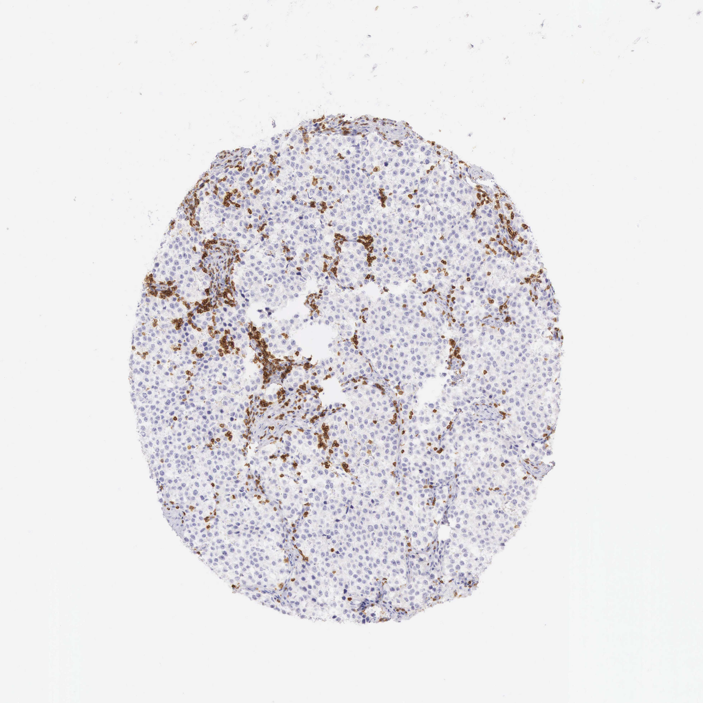

## 문제
A 39-year-old man comes to the physician because of a painless, gradually enlarging mass in his right testis for 3 months. He has no fever, night sweats, or weight loss. Examination shows a firm, nontender intratesticular mass that does not transilluminate; there is no lymphadenopathy. Scrotal ultrasonography shows a homogeneous hypoechoic intratesticular mass. Serum alpha-fetoprotein concentration is within the reference range, beta-hCG is slightly increased at 12 mIU/mL, and lactate dehydrogenase is increased. A radical inguinal orchiectomy is performed. A photomicrograph of a section of the tumor stained immunohistochemically for CD3 is shown. Which of the following is the most likely diagnosis?

- A. Seminoma
- B. Diffuse large B-cell lymphoma
- C. Embryonal carcinoma
- D. Yolk sac tumor
- E. Choriocarcinoma

_Immunohistochemical stain of a tissue microarray core (DAB brown chromogen, hematoxylin counterstain), original magnification (Human Protein Atlas, CC BY 4.0; no cropping or color adjustment)_

## 정답 및 해설
> 정답: A

- **정답 핵심**: The section shows sheets of uniform, large, round tumor cells with clear cytoplasm and central nuclei divided by thin fibrous septa, and the brown CD3-positive cells are small lymphocytes clustered along the septa and scattered between tumor cells; the tumor cells themselves are negative. Sheets of monotonous clear cells with septal T-lymphocyte infiltrates are the classic pattern of seminoma. A 39-year-old man with a homogeneous hypoechoic testicular mass, a normal AFP, and only a slight rise in beta-hCG (from scattered syncytiotrophoblasts, present in about 15% of seminomas) fits. Lymphoma is a disease of older men with sheets of atypical lymphoid cells that would themselves be the stained or counted population; a normal AFP argues against yolk sac tumor, and a markedly high hCG with hemorrhage would suggest choriocarcinoma.
- **원리**: <b>Seminoma is the testicular counterpart of the primordial germ cell</b> — the germ cell that has not differentiated toward embryonic or extraembryonic tissue. Its cells therefore look like primitive germ cells: large, round, uniform, with glycogen-rich <b>clear cytoplasm</b>, distinct cell borders, and a central nucleus with a prominent nucleolus. They grow in <b>sheets or lobules separated by thin fibrous septa</b>, and those septa carry a characteristic <b>lymphocytic infiltrate</b>, mostly CD3-positive T cells, sometimes with granulomas. This host immune reaction is so constant that it is a diagnostic clue, and a CD3 stain highlights it while leaving the tumor cells blank. Tumor cells stain for OCT3/4, SALL4, PLAP, D2-40, and CD117 and are negative for CD30 and keratin (mostly), which separates them from embryonal carcinoma.  <b>Serum markers mirror what each tumor differentiates into.</b> Because seminoma does not make yolk sac structures, <b>AFP is normal</b> — an elevated AFP means a nonseminomatous component and changes management even if the histology looks like pure seminoma. Scattered syncytiotrophoblastic giant cells can secrete small amounts of hCG, so a mild rise is compatible. LDH reflects tumor burden. Seminoma is exquisitely radiosensitive and chemosensitive, which is why the distinction from nonseminomatous germ cell tumors and from testicular lymphoma (the most common testicular tumor in men over 60) matters.
- **비교**: <table><thead><tr><th style="width:24%">Diagnosis</th><th style="width:46%">Morphology, immunostains, and markers</th><th>This case</th></tr></thead><tbody> <tr><td><b>Seminoma (answer)</b></td><td><b>Sheets of uniform clear cells, fibrous septa with CD3+ T lymphocytes; OCT3/4+, CD117+; AFP normal, hCG normal or mildly high</b></td><td><b>Clear-cell sheets, septal CD3+ lymphocytes, tumor cells CD3−, AFP normal, hCG 12</b></td></tr> <tr><td>Diffuse large B-cell lymphoma (closest rival)</td><td>Men &gt; 60, often bilateral; diffuse large atypical lymphoid cells infiltrating between tubules; CD20+, CD3− tumor; markers normal</td><td>Age 39, tumor cells epithelioid with clear cytoplasm, lymphocytes small and septal</td></tr> <tr><td>Embryonal carcinoma</td><td>Pleomorphic cells in glands and sheets, necrosis, hemorrhage; CD30+, keratin+; AFP and hCG often high</td><td>Uniform cells, no pleomorphism; AFP normal</td></tr> <tr><td>Yolk sac tumor</td><td>Reticular pattern, Schiller-Duval bodies, hyaline globules; AFP markedly high; most common in young children</td><td>AFP normal</td></tr> <tr><td>Choriocarcinoma</td><td>Syncytiotrophoblast and cytotrophoblast with hemorrhage; hCG very high (often &gt; 10,000)</td><td>hCG only 12 mIU/mL</td></tr> </tbody></table> <b>The closest rival is diffuse large B-cell lymphoma</b>, because lymphocytes are the stained cells. The key is <b>which cells are abnormal</b>: here the brown cells are small, reactive, and septal, while the tumor is the unstained clear-cell population — the reverse of lymphoma, where the large atypical lymphoid cells are the tumor.
- **오답 이유**:
  - (B) Diffuse large B-cell lymphoma is tempting because the stain highlights lymphocytes and lymphoma is the most common testicular tumor in older men. But the stained cells are small reactive T cells along septa, and the tumor cells are large clear epithelioid cells that do not stain; lymphoma would show sheets of atypical CD20-positive B cells. In a 68-year-old man with bilateral testicular masses, lymphoma would be the answer.
  - (C) Embryonal carcinoma is a common germ cell tumor of young men and can cause a firm testicular mass with raised LDH. Its cells are pleomorphic, form glands and papillae, and are accompanied by necrosis and hemorrhage, and AFP and hCG are often elevated. If the tumor showed pleomorphic CD30-positive cells with necrosis and a raised AFP, embryonal carcinoma would be correct.
  - (D) Yolk sac tumor is the classic source of AFP and should be considered in any testicular germ cell tumor. It shows a reticular or microcystic pattern with Schiller-Duval bodies, and serum AFP is markedly elevated. This patient's AFP is normal. In a 2-year-old boy with a testicular mass and an AFP of several thousand, yolk sac tumor would be the answer.
  - (E) Choriocarcinoma is suggested by any rise in beta-hCG, and it metastasizes early by blood. Its hCG levels are very high (often thousands to hundreds of thousands) and its histology shows hemorrhagic syncytiotrophoblast and cytotrophoblast. A slight elevation to 12 mIU/mL fits scattered syncytiotrophoblasts in seminoma. With hCG over 50,000 mIU/mL and lung metastases, choriocarcinoma would be correct.
- **함정**: In an immunostain, ask which cells are the tumor. Brown lymphocytes along septa of an unstained clear-cell tumor are the host response of seminoma, not a lymphoma.
- **학습목표**: 고환 종양의 CD3 면역조직화학에서 음성인 균일한 종양세포 판과 섬유 격막을 따라 모인 양성 T 림프구를 읽고, 정상 AFP 와 함께 정상피종을 진단하며 림프종·비정상피종 생식세포종양과 감별한다
- **근거·출처**: Human Protein Atlas (CC BY 4.0) CD3E, sample 1299 A-1-5 — 39 M, testis cancer, SNOMED seminoma NOS (sample annotation) — Grade A; teacher-only · 작성자 판독(2026-09-24): 맑은 세포질·둥근 핵의 균일한 종양세포 판, 섬유 격막을 따라 CD3 양성 작은 림프구 무리, 종양세포 음성 · Robbins & Cotran Pathologic Basis of Disease, 10th ed., ch. 'The lower urinary tract and male genital system' — seminoma, nonseminomatous germ cell tumors · WHO Classification of Tumours, Urinary and Male Genital Tumours, 5th ed. (2022) — germ cell neoplasia in situ-derived tumours · Gilligan T et al. Testicular cancer, version 2.2020, NCCN Clinical Practice Guidelines. J Natl Compr Canc Netw 2019;17:1529

## 출처
- Human Protein Atlas, CD3E / Testis cancer (CC BY 4.0), https://images.proteinatlas.org/10/1299_A_1_5.jpg · Creative Commons Attribution 4.0 International · https://www.proteinatlas.org/about/licence
