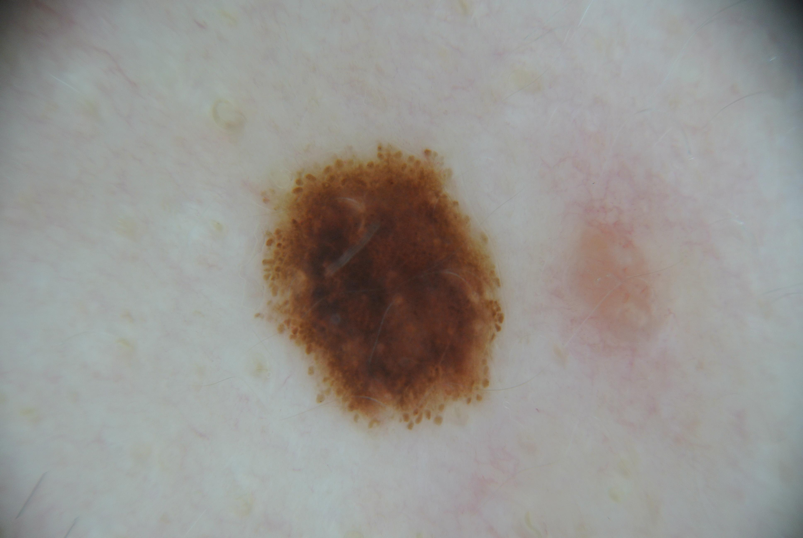

## 문제
40세 남자가 등에 있는 점을 확인하려고 피부과에 왔다. 이 점은 어릴 때부터 있었고, 아내가 최근 사진과 비교해 보았을 때 크기와 색이 달라지지 않았다고 한다. 가려움·출혈·궤양은 없었다. 피부암 가족력은 없고 햇볕에 심하게 탄 적도 드물다. 진찰에서 등 가운데에 지름 약 7 mm 의 타원형 갈색 반점이 있고 경계가 뚜렷하다. 다른 부위에 비슷한 점이 몇 개 있지만 이 점만 조금 크다. 병변의 더모스코피 사진은 그림과 같다. 가장 가능성이 높은 진단은?

- A. 선천멜라닌세포모반
- B. 표재확산흑색종
- C. 색소성 기저세포암
- D. 지루각화증
- E. 청색모반

_더모스코피 사진, 원본 그대로 크기 조정만 (ISIC Archive, CC0 1.0 — 크롭·색보정 없음)_

## 정답 및 해설
> 정답: A

- **정답 핵심**: 더모스코피에서 병변은 좌우·위아래가 거의 대칭인 타원형이고, 색은 갈색 한 계열로 균일하며(중심이 약간 진할 뿐) 가장자리를 따라 크기가 비슷한 갈색 소구가 규칙적으로 늘어서 있다. 비정형 색소망, 청백색 베일, 퇴행 구조, 비정형 혈관, 여러 색의 혼재 같은 흑색종 소견이 없다. 어릴 때부터 있었고 변화가 없다는 병력과 소구형 양상이 맞아 선천멜라닌세포모반이 가장 가능성이 높다(이 병변은 조직검사로 확정되었다).
- **원리**: <b>더모스코피는 표피-진피 경계에서 멜라닌이 어디에, 어떤 모양으로 모였는지를 보여 준다.</b> 멜라닌세포가 표피능선을 따라 늘어서면 <b>색소망</b>, 진피-표피 경계나 진피 윗부분에서 둥지(nest)를 이루면 <b>갈색 소구</b>로 보인다. 모반은 한 가지 규칙으로 자라는 양성 증식이라 구조가 <b>대칭이고 반복적</b>이다 — 소구가 크기·색이 고르고, 가장자리까지 같은 간격으로 늘어선다.  <b>흑색종</b>은 여러 클론이 서로 다른 속도로 자라고 표피 안에서 위로·옆으로 퍼지기 때문에 <b>비대칭</b>, <b>여러 색(검정·청회색·붉은색·흰색)</b>, <b>비정형 망</b>, 가장자리의 <b>불규칙한 줄무늬·점</b>, 진피 섬유화에 따른 <b>퇴행 구조</b>, 진피 멜라닌과 과각화가 겹친 <b>청백색 베일</b>이 나타난다. 그래서 판독은 「무엇이 보이는가」보다 <b>「구조가 하나의 규칙을 따르는가」</b>를 먼저 본다(대칭·단색·규칙 = 양성 쪽).  <b>가장자리 소구</b>는 방사상으로 커지는 모반의 표지다. 어린이·젊은 성인에서는 흔하고 정상적이지만, 50세 이후 새로 커지는 병변에 있으면 흑색종을 의심하는 근거가 된다 — 그래서 이 증례에서는 「어릴 때부터 있었고 변하지 않았다」는 병력이 판독을 뒷받침한다.
- **비교**: <table><thead><tr><th style="width:24%">소견</th><th style="width:38%">선천멜라닌세포모반(정답)</th><th>표재확산흑색종(가장 가까운 오답)</th></tr></thead><tbody> <tr><td>대칭</td><td><b>두 축 모두 대칭</b></td><td>한 축 이상 비대칭</td></tr> <tr><td>색</td><td><b>갈색 한 계열</b>(중심이 약간 진함)</td><td>3색 이상 — 검정·청회색·붉은색·흰색 혼재</td></tr> <tr><td>구조</td><td><b>크기가 고른 소구가 가장자리에 규칙적으로 배열</b></td><td>비정형 망, 불규칙 줄무늬·점, 청백색 베일, 퇴행 구조</td></tr> <tr><td>경과</td><td>어릴 때부터 있고 변화 없음</td><td>새로 생기거나 크기·색·모양이 변함(ABCDE 의 E)</td></tr> </tbody></table> <b>가장 가까운 오답은 표재확산흑색종</b>이다 — 성인 등에 있는 7 mm 갈색 병변이라는 점이 흑색종의 호발 부위·크기와 겹친다. 갈림길은 <b>구조의 규칙성과 경과</b>다. 대칭·단색·규칙적 소구에 변화 없는 경과면 모반, 비대칭·다색·비정형 구조에 변화가 있으면 흑색종으로 정리한다.
- **오답 이유**:
  - ② 표재확산흑색종은 성인 몸통에 흔하고 7 mm 로 6 mm 기준을 넘어 떠올리기 쉽다. 그러나 이 병변은 대칭이고 색이 균일하며 비정형 망·청백색 베일·퇴행 구조가 없다. 병변이 최근 커지고 검은색·청회색이 섞인 비대칭 구조였다면 이 선지가 정답이다.
  - ③ 색소성 기저세포암은 색소가 있는 결절로 보일 수 있지만 더모스코피에서 색소망 없이 나뭇가지 모양 혈관, 잎 모양 구조, 청회색 난형 둥지, 궤양이 특징이다. 햇빛 노출 부위의 진주빛 결절에 이런 구조가 보였다면 정답이 된다.
  - ④ 지루각화증은 중년 이후 몸통에 흔한 갈색 병변이라 떠올릴 수 있으나 더모스코피에서 면포 모양 개구부, 좁쌀 모양 낭종, 뇌회 모양 고랑과 이랑이 보이고 경계가 날카롭게 붙인 듯하다. 이런 구조가 보이는 사마귀 모양 병변이었다면 정답이다.
  - ⑤ 청색모반은 진피 깊은 곳의 멜라닌세포 때문에 더모스코피에서 구조 없는 균일한 청회색~청흑색으로 보인다. 소구나 망이 없는 균일한 푸른 병변이었다면 이 선지가 정답이 된다.
- **함정**: 성인·몸통·6 mm 초과라는 숫자만 보고 흑색종을 고르지 않는다. 더모스코피 판독은 대칭·색·구조의 규칙성을 먼저 본다.
- **학습목표**: 몸통 색소 병변의 더모스코피에서 대칭·균일한 색·가장자리의 규칙적인 갈색 소구를 읽고, 어릴 때부터 있던 병력과 합쳐 선천멜라닌세포모반으로 판단하며 흑색종의 비대칭·다색·비정형 구조와 구별한다
- **근거·출처**: ISIC Archive ISIC_0001109 (CC0) — 40 M, posterior trunk, histopathology-confirmed congenital nevus; teacher-only · 작성자 판독(2026-09-25): 대칭 타원형 갈색 병변, 색 균일, 가장자리 규칙적 갈색 소구, 비정형 망·청백색 베일·퇴행 구조 없음 · Argenziano G et al. Dermoscopy of pigmented skin lesions: results of a consensus meeting via the Internet. J Am Acad Dermatol 2003;48:679 · Marghoob AA, Braun RP, Malvehy J. Atlas of Dermoscopy, 2nd ed. — globular pattern and peripheral globules in nevi

## 출처
- ISIC Archive ISIC_0001109 (CC-0) · CC0 1.0 Universal · https://creativecommons.org/publicdomain/zero/1.0/
