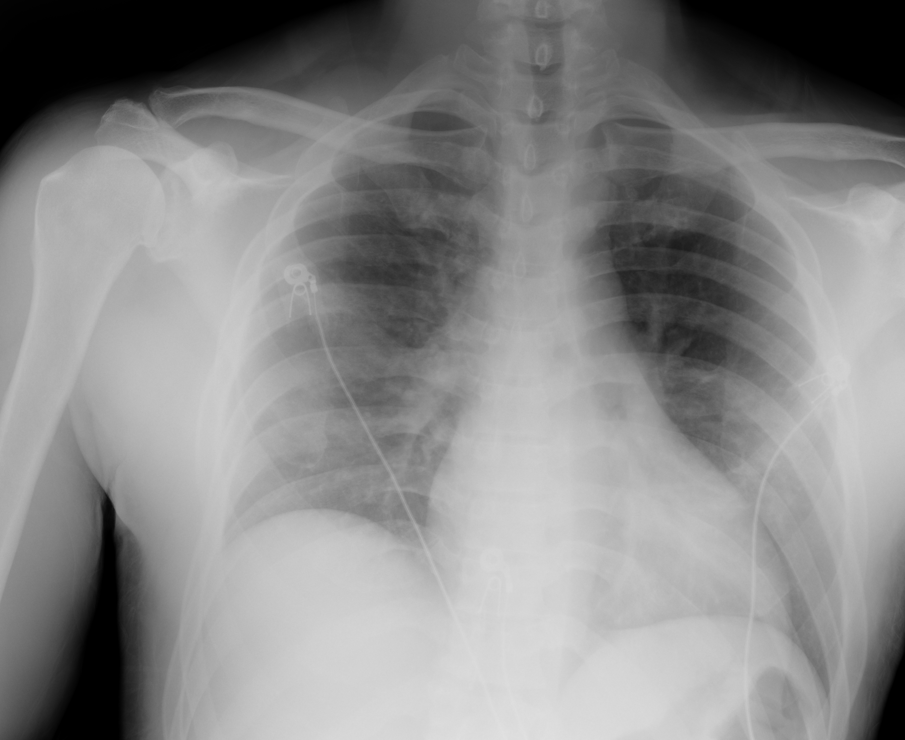

## 문제
A 49-year-old man is admitted to the hospital with a 7-day history of fever, dry cough, and progressive shortness of breath. A nasopharyngeal swab is positive for SARS-CoV-2 by PCR. He has been receiving dexamethasone since admission. Over the past 6 hours, his oxygen requirement has increased, and his oxygen saturation is now 88% on 6 L/min of oxygen by nasal cannula. His temperature is 38.2°C, pulse is 104/min, respirations are 28/min, and blood pressure is 128/78 mmHg. He is alert and speaking in full sentences. Crackles are heard at both lung bases. Arterial blood gas analysis shows pH 7.46, PaCO2 33 mmHg, and PaO2 56 mmHg. A portable chest x-ray is shown. Which of the following is the most appropriate next step in management?

- A. Intravenous furosemide
- B. Bedside bronchoscopy with lavage
- C. High-flow nasal cannula oxygen
- D. Immediate endotracheal intubation
- E. Needle decompression of the chest

_Portable anteroposterior chest radiograph, unaltered apart from scaling (The Cancer Imaging Archive, CC BY 4.0; no cropping or window adjustment)_

## 정답 및 해설
> 정답: C

- **정답 핵심**: The portable chest x-ray shows patchy bilateral ground-glass and consolidative opacities in the perihilar regions and lower zones, without pneumothorax, a large pleural effusion, or cavitation; ECG leads and cables overlie the chest. With a positive SARS-CoV-2 PCR, this is worsening COVID-19 pneumonia with acute hypoxemic respiratory failure. He is alert, protecting his airway, and not hypercapnic (PaCO2 33 mmHg) or in shock, so the next step is to escalate noninvasive support with high-flow nasal cannula oxygen, which improves oxygenation and reduces the need for intubation compared with conventional oxygen. Intubation is reserved for failure of noninvasive support, altered mental status, exhaustion, or hemodynamic instability.
- **원리**: <b>High-flow nasal cannula (HFNC)</b> delivers heated, humidified gas at 30–60 L/min with an FiO2 up to 1.0. Because the flow exceeds the patient's peak inspiratory flow, room air is not entrained and the delivered FiO2 is close to the set value — unlike a 6 L/min nasal cannula, whose true FiO2 falls as the respiratory rate and tidal flow rise. High flow also <b>washes out nasopharyngeal dead space</b> (lowering the work of breathing) and generates a small positive end-expiratory pressure that helps recruit alveoli.  In COVID-19 pneumonia the defect is <b>shunt and ventilation-perfusion mismatch</b> from alveolar filling, so the first need is more oxygen and some recruitment, not ventilation — the PaCO2 is low because the patient hyperventilates. Guidelines (NIH, SSC, WHO) recommend HFNC over conventional oxygen and over noninvasive positive-pressure ventilation when conventional oxygen fails, with <b>awake prone positioning</b> as an adjunct.  <b>Intubation</b> is indicated when the airway is unprotected, consciousness falls, hypercapnia or acidosis develops, the patient tires, shock appears, or HFNC fails (a falling ROX index). Delaying intubation in a patient who is failing is harmful, which is why an HFNC trial must be closely monitored. The chest x-ray matters here because pneumothorax (barotrauma) and large effusions are treatable causes of sudden worsening that change the answer.
- **비교**: <table><thead><tr><th style="width:28%">Option</th><th style="width:42%">When it is right</th><th>This patient</th></tr></thead><tbody> <tr><td><b>High-flow nasal cannula (answer)</b></td><td><b>Hypoxemia despite low-flow O2, alert, protecting the airway, no hypercapnia or shock</b></td><td><b>SpO2 88% on 6 L, alert, PaCO2 33, BP 128/78</b></td></tr> <tr><td>Immediate intubation (closest rival)</td><td>Altered mental status, exhaustion, rising PaCO2 or acidosis, shock, failure of HFNC/NIV</td><td>Alert, speaking in full sentences, respiratory alkalosis</td></tr> <tr><td>Needle decompression</td><td>Tension pneumothorax — absent breath sounds, hypotension, tracheal shift</td><td>No pneumothorax on the x-ray, normotensive</td></tr> <tr><td>IV furosemide</td><td>Cardiogenic pulmonary edema — cardiomegaly, vascular redistribution, effusions</td><td>Normal heart size, patchy peripheral-basal opacities of infection</td></tr> <tr><td>Bronchoscopy with lavage</td><td>Suspected alternative pathogen or lobar collapse from mucus plugging</td><td>Diagnosis confirmed by PCR, no lobar collapse</td></tr> </tbody></table> <b>The closest rival is immediate intubation</b>, suggested by SpO2 88% and a respiratory rate of 28. The dividing line is <b>mental status, CO2, and hemodynamics</b>: with all three preserved, escalate noninvasive oxygen first and intubate if it fails.
- **오답 이유**:
  - (A) Intravenous furosemide treats cardiogenic pulmonary edema, which can also cause bilateral opacities and hypoxemia. Here the heart size is normal, the opacities are patchy and basal-perihilar with PCR-proven infection, and there is no edema or jugular venous distension. In a patient with cardiomegaly, pleural effusions, and volume overload, it would be correct.
  - (B) Bronchoscopy with lavage is used to look for an alternative pathogen or to clear an obstructing mucus plug. The pathogen is already confirmed by PCR, and bronchoscopy transiently worsens hypoxemia and aerosolizes virus. With lobar collapse from mucus plugging on the x-ray, it would be reasonable.
  - (D) Immediate endotracheal intubation is tempting because he is hypoxemic and tachypneic, but he is alert, not hypercapnic (PaCO2 33 mmHg), and hemodynamically stable. Early intubation of such patients does not improve outcomes. If he became confused, his PaCO2 rose, or HFNC failed to improve his oxygenation, intubation would be correct.
  - (E) Needle decompression treats tension pneumothorax, a recognized cause of sudden deterioration in patients with COVID-19. The x-ray shows no pneumothorax and he is normotensive with bilateral crackles. With absent breath sounds on one side, hypotension, and a visible pleural line, this would be the answer.
- **함정**: Hypoxemia alone is not an indication for intubation. Check mental status, CO2, and blood pressure first.
- **학습목표**: 코로나19 폐렴에서 저유량 산소에도 저산소혈증이 진행하지만 의식이 명료하고 과탄산혈증·쇼크가 없으면 즉시 기관삽관보다 고유량 비강 캐뉼라 산소를 먼저 적용하고, 흉부 X선에서 기흉·큰 흉수를 배제한다
- **근거·출처**: TCIA COVID-19-AR (CC BY 4.0) — 49 M portable AP chest radiograph, bilateral opacities (collection-level label, Grade B); teacher-only · 작성자 판독(2026-09-25): 양측 폐문 주위·하폐야 반점상 간유리·경화 음영, 흉수·기흉·공동 없음, 심장 크기 정상 범위, 심전도 전극·케이블 · Frat JP et al. High-flow oxygen through nasal cannula in acute hypoxemic respiratory failure (FLORALI). N Engl J Med 2015;372:2185 · NIH COVID-19 Treatment Guidelines — oxygenation and ventilation for adults (HFNC preferred over NIV when conventional oxygen fails) · Surviving Sepsis Campaign: guidelines on the management of adults with COVID-19 in the ICU (2021)

## 출처
- COVID-19-AR, The Cancer Imaging Archive (CC BY 4.0) · series …05460207 · Creative Commons Attribution 4.0 International · https://www.cancerimagingarchive.net/data-usage-policies-and-restrictions/
