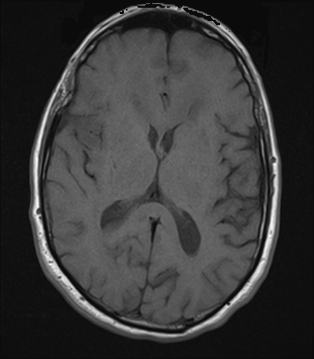

## 문제
A 73-year-old man is brought to the physician by his wife because of progressive weakness of his left arm and leg over the past 4 weeks. During this period, he has had morning headaches and has become more forgetful. Yesterday he had a generalized tonic-clonic seizure lasting 1 minute. He has hypertension treated with amlodipine. He has not had fever, recent infection, or head trauma, and he is not immunocompromised. His temperature is 36.8°C and blood pressure is 146/84 mmHg. Examination shows mild left hemiparesis and a left pronator drift. CT of the chest, abdomen, and pelvis shows no mass. An axial precontrast T1-weighted MRI of the brain is shown. Postcontrast images show a thick, irregular rim of enhancement surrounding a central non-enhancing area within the right frontal and insular white matter. Which of the following is the most likely diagnosis?

- A. Acute ischemic infarction
- B. Pyogenic brain abscess
- C. Primary CNS lymphoma
- D. Chronic subdural hematoma
- E. Glioblastoma

_Axial T1-weighted MRI of the brain before contrast, standard display orientation (patient's right on the viewer's left) (The Cancer Imaging Archive, CC BY 4.0; converted from DICOM without cropping)_

## 정답 및 해설
> 정답: E

- **정답 핵심**: On the precontrast T1-weighted image, the white matter of the right frontal and insular region is lower in signal than the opposite side, the overlying sulci are effaced, and the right frontal horn of the lateral ventricle is narrowed — an intra-axial mass with mass effect. There is no crescentic extra-axial collection. Postcontrast images show a thick, irregular rim of enhancement around a central necrotic area. In a 73-year-old man with 4 weeks of progressive hemiparesis, headache, cognitive change, and a new seizure, with no fever, no immunocompromise, and no primary tumor on body CT, the most likely diagnosis is glioblastoma (IDH-wildtype), the most common malignant primary brain tumor in older adults.
- **원리**: <b>Glioblastoma grows fast enough to outstrip its blood supply.</b> Tumor cells induce abnormal, leaky vessels (VEGF-driven microvascular proliferation), so gadolinium escapes where the blood-brain barrier is broken and the viable tumor at the periphery <b>enhances as a thick, irregular rim</b>. The center, starved of oxygen, becomes <b>necrotic</b> (pseudopalisading necrosis on histology) and does not enhance. Infiltrating cells and vasogenic edema extend into the surrounding white matter, which is why T1 shows a region of low signal and <b>mass effect</b> — sulcal effacement and a compressed ventricle.  <b>Time course separates it from stroke.</b> An infarct produces its maximal deficit within minutes to hours, conforms to an arterial territory, and does not compress the ventricle for weeks; subacute infarcts enhance in a gyriform pattern, not as a thick ring. An <b>abscess</b> also enhances as a ring, but the wall is thin and smooth, often thinner toward the ventricle, and the center shows restricted diffusion; fever or a source is usual. <b>Primary CNS lymphoma</b> is so densely cellular that it enhances homogeneously and restricts diffusion, typically periventricular or callosal; ring enhancement suggests lymphoma mainly in immunocompromised patients. Body CT without a primary makes a solitary metastasis less likely.
- **비교**: <table><thead><tr><th style="width:24%">Feature</th><th style="width:38%">Glioblastoma (answer)</th><th>Pyogenic brain abscess (closest rival)</th></tr></thead><tbody> <tr><td>Ring</td><td><b>Thick, irregular, nodular</b></td><td>Thin, smooth, often thinner on the ventricular side</td></tr> <tr><td>Center on DWI</td><td>Necrosis — usually no restricted diffusion</td><td><b>Pus — marked restricted diffusion</b></td></tr> <tr><td>Clinical setting</td><td><b>Older adult, weeks of progressive deficit, seizure, no fever</b></td><td>Fever, sinus or dental source, endocarditis, immunosuppression</td></tr> <tr><td>Why</td><td>Viable rim of neovascular tumor around hypoxic necrosis</td><td>Collagen capsule formed by the host around a liquefied center</td></tr> </tbody></table> <b>The closest rival is a pyogenic abscess</b> because both are ring-enhancing masses with mass effect. The ring's thickness and the clinical setting separate them here; diffusion-weighted imaging (restricted in an abscess) settles the rest.
- **오답 이유**:
  - (A) Acute ischemic infarction comes to mind because the right frontal-insular region is in the middle cerebral artery territory and he has left hemiparesis. But the deficit developed over 4 weeks with headache and a seizure, and the lesion compresses the ventricle and enhances as a thick ring. A sudden onset of deficit with gyriform enhancement confined to that territory would make this correct.
  - (B) Pyogenic brain abscess also forms a ring-enhancing lesion with edema and can cause seizures. It usually has a thin, smooth wall, and the patient typically has fever or a source such as sinusitis, dental infection, or endocarditis. With fever, a thin-walled ring, and restricted diffusion in the center, this would be the answer.
  - (C) Primary CNS lymphoma is a malignant intra-axial mass in older adults, so it is a reasonable consideration. In immunocompetent patients it enhances homogeneously and often lies against the ventricles or corpus callosum, without central necrosis. A homogeneously enhancing periventricular mass that shrinks with corticosteroids would make this correct.
  - (D) Chronic subdural hematoma causes progressive hemiparesis and cognitive decline in older adults and is often missed. It appears as a crescent-shaped extra-axial collection over the convexity, which is absent on this image. A crescentic collection following the inner table after a minor fall would make this the answer.
- **함정**: Left hemiparesis with a right MCA-territory lesion is not automatically a stroke — a 4-week progressive course and mass effect point to a tumor.
- **학습목표**: 수주에 걸친 진행성 편측 증상의 고령 환자 뇌 MRI 에서 한쪽 반구 축내 종괴 효과를 읽고, 두꺼운 불규칙 고리 조영증강·중심 괴사 설명과 합쳐 교모세포종으로 진단하며 축외 병변·뇌경색·농양·림프종과 구별한다
- **근거·출처**: TCIA UPENN-GBM (CC BY 4.0) — 73 M precontrast T1 axial, pathology-confirmed glioblastoma cohort; teacher-only · 작성자 판독(2026-09-25): 환자 우측 전두-섬엽 백질 저신호, 고랑 얕아짐, 같은 쪽 측뇌실 앞뿔 좁아짐, 축외 액체 저류 없음 · Louis DN et al. The 2021 WHO Classification of Tumors of the Central Nervous System: a summary. Neuro Oncol 2021;23:1231 · Osborn AG. Osborn's Brain: Imaging, Pathology, and Anatomy, 2nd ed. — glioblastoma vs abscess vs lymphoma

## 출처
- The Cancer Imaging Archive (CC BY 4.0) · series …98465845 · Creative Commons Attribution 4.0 International · https://www.cancerimagingarchive.net/data-usage-policies-and-restrictions/
