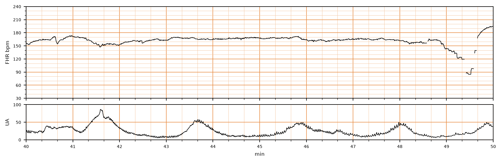

## 문제
40주 경산부(34세)가 규칙적인 진통으로 입원하였다. 입원 20시간 전에 양막이 파수되었다. 자궁경부는 6 cm 열려 있다. 입원 후 산모의 체온이 38.6℃ 로 올랐고 맥박은 112회/분, 혈압은 118/72 mmHg 이다. 자궁저부를 누르면 압통이 있고 질 분비물에서 악취가 난다. 백혈구는 17,800/mm³ 이다. 임신 중 B군 사슬알균 선별검사는 음성이었고 약물 알레르기는 없다. 전자태아감시의 태아심박동과 자궁수축 기록은 그림과 같다. 기록 끝부분의 끊긴 신호는 탐촉자 위치가 벗어난 것으로 확인되어 다시 붙였다. 가장 적절한 처치는?

- A. 옥시토신 투여 중단
- B. 산모 좌측위와 수액 볼루스만 시행
- C. 태아 두피 pH 측정
- D. 암피실린과 겐타마이신 정주
- E. 응급 제왕절개술

_분만 중 태아심박동(위)과 자궁수축(아래) 기록, 기록 시작 후 40~50분 구간; 3 cm/분, 세로선 = 1분 (CTU-UHB Intrapartum Cardiotocography Database, PhysioNet, ODC-BY 1.0 — 원자료 4 Hz 그대로, 평활화 없음)_

## 정답 및 해설
> 정답: D

- **정답 핵심**: 태아심박동 기록의 기저 심박수는 약 160~170회/분으로 태아빈맥이고, 변이도는 약 5회/분 정도로 최소~경도이며, 가속은 없다. 수축은 2~2.5분 간격으로 규칙적이고 반복 후기감속이나 심한 변이성 감속은 없다(끝부분은 인공물). 범주 II 기록이다. 파막 20시간, 산모 발열 38.6℃, 산모 빈맥, 자궁 압통, 악취 나는 분비물, 백혈구 증가, 태아빈맥이 모두 있어 양수내 감염(융모양막염)이다. 치료는 즉시 광범위 항생제(암피실린 + 겐타마이신)와 해열제이며, 감염 자체는 제왕절개의 적응증이 아니므로 태아 상태를 감시하며 분만을 진행한다.
- **원리**: <b>태아빈맥은 태아가 무언가에 반응한다는 신호다.</b> 기저 태아심박수는 교감·부교감 신경의 균형으로 정해지는데, <b>산모 발열</b>이 있으면 태아 체온이 산모보다 약 0.5~1℃ 더 높게 올라가 대사 요구가 늘고, <b>양수내 감염</b>의 염증 사이토카인이 태아 심박을 직접 끌어올린다. 그래서 분만 중 새로 생긴 태아빈맥(160회/분 이상)은 저산소증보다 <b>감염·발열</b>을 먼저 생각하게 한다. 변이도가 줄어든 것도 발열·감염에서 흔하다.  <b>양수내 감염</b>은 파막 뒤 질의 세균(대장균·B군 사슬알균·혐기균 등)이 양막강으로 올라가 생긴다. 진단은 산모 발열(≥39℃ 한 번 또는 38~38.9℃ 가 반복)에 <b>태아빈맥·산모 백혈구 증가·자궁경부의 화농성 분비물</b> 중 하나 이상이 더해지면 내린다. 그람음성균과 사슬알균을 함께 덮도록 <b>암피실린 + 겐타마이신</b>을 쓰고(제왕절개를 하게 되면 혐기균을 위해 클린다마이신이나 메트로니다졸 추가), 해열제로 태아의 대사 부담을 줄인다.  <b>분만 방식은 산과적 적응증으로 정한다</b> — 감염은 제왕절개 적응증이 아니다. 기록이 범주 III(변이도 소실 + 반복 후기·변이성 감속 또는 서맥, 사인파형)으로 가지 않는 한 항생제를 주며 질식분만을 진행하는 것이 표준이다(이 증례의 실제 분만도 Apgar 9점으로 끝났다).
- **비교**: <table><thead><tr><th style="width:24%">처치</th><th style="width:40%">그 처치가 맞는 조건</th><th>이 증례</th></tr></thead><tbody> <tr><td><b>암피실린 + 겐타마이신(정답)</b></td><td><b>산모 발열 + 태아빈맥·백혈구 증가·화농성 분비물 → 양수내 감염</b></td><td><b>38.6℃, 태아 기저 160~170/분, 백혈구 17,800, 악취 분비물</b></td></tr> <tr><td>응급 제왕절개술(가장 가까운 오답)</td><td>범주 III 기록(변이도 소실 + 반복 후기감속·서맥·사인파형) 또는 산과적 적응증</td><td>범주 II — 반복 감속·서맥 없음, 끝부분은 인공물</td></tr> <tr><td>옥시토신 중단</td><td>과다자궁수축(10분에 5회 초과)이나 그에 따른 감속</td><td>수축 10분에 4~5회, 감속 없음</td></tr> <tr><td>좌측위·수액만</td><td>저혈압·체위성 압박으로 인한 일시적 감속</td><td>원인(감염)을 치료하지 않는다</td></tr> <tr><td>태아 두피 pH</td><td>애매한 기록에서 산증 확인(현재 거의 쓰지 않음)</td><td>태아빈맥의 원인이 이미 설명된다</td></tr> </tbody></table> <b>가장 가까운 오답은 응급 제왕절개술</b>이다 — 태아빈맥과 줄어든 변이도는 「태아 곤란」처럼 보인다. 갈림길은 <b>기록의 범주와 원인</b>이다. 원인이 설명되는 범주 II 면 원인을 치료하며 분만을 진행하고, 범주 III 로 넘어가면 즉시 분만한다.
- **오답 이유**:
  - ① 옥시토신 중단은 수축이 너무 잦아 태아 산소 공급이 줄 때 하는 처치라 태아감시 이상에서 떠올릴 수 있다. 이 기록의 수축은 10분에 4~5회이고 감속이 없다. 수축이 10분에 6회 이상이면서 후기감속이 반복되었다면 이 선지가 정답이다.
  - ② 좌측위와 수액 볼루스는 대정맥 압박이나 경막외마취 후 저혈압으로 생긴 감속을 되돌리는 자궁 내 소생술이다. 이 산모는 혈압이 정상이고 문제의 원인은 감염이라 이것만으로는 부족하다. 경막외마취 직후 저혈압과 함께 감속이 생겼다면 정답이 된다.
  - ③ 태아 두피 pH 측정은 애매한 기록에서 태아 산증을 확인하려는 검사지만 지금은 거의 쓰지 않고, 이 증례는 발열과 감염으로 태아빈맥이 설명된다. 원인을 모르는 범주 II 기록이 이어져 산증 여부가 분만 결정에 필요한 드문 상황이라면 선택지가 될 수 있다.
  - ⑤ 응급 제왕절개술은 태아빈맥과 최소 변이도를 태아 곤란으로 읽으면 떠오르지만, 반복 후기감속·서맥·사인파형이 없는 범주 II 기록이고 원인(양수내 감염)이 설명된다. 감염만으로는 제왕절개 적응증이 아니다. 변이도가 사라지고 반복 후기감속이나 지속 서맥이 나타났다면 정답이 된다.
- **함정**: 태아빈맥 = 태아 곤란 = 제왕절개로 곧바로 잇지 않는다. 산모 발열이 있으면 먼저 감염을 치료하고, 수술 여부는 기록의 범주로 정한다.
- **학습목표**: 분만 중 산모 발열과 태아심박동 기록의 태아빈맥(기저 160회/분 이상)·최소 변이도를 읽어 양수내 감염(융모양막염)으로 판단하고, 범주 II 기록에서 즉시 제왕절개가 아니라 광범위 항생제와 해열제를 투여하며 분만을 진행한다
- **근거·출처**: CTU-UHB Intrapartum CTG Database record 1224 (PhysioNet, ODC-BY 1.0), 40–50 min window; teacher-only outcome: pH 7.33, Apgar 9/9 · 작성자 판독(2026-09-25): 기저 약 160~170/분, 변이도 약 5/분, 가속 없음, 수축 2~2.5분 간격, 49분 이후 신호 소실·인공물 · ACOG Committee Opinion No. 712: Intrapartum management of intraamniotic infection. Obstet Gynecol 2017;130:e95 · ACOG Practice Bulletin No. 106: Intrapartum fetal heart rate monitoring — three-tier interpretation system

## 출처
- CTU-UHB Intrapartum Cardiotocography Database (PhysioNet, ODC-BY 1.0) · record 1224 · Open Data Commons Attribution License v1.0 · https://opendatacommons.org/licenses/by/1-0/
