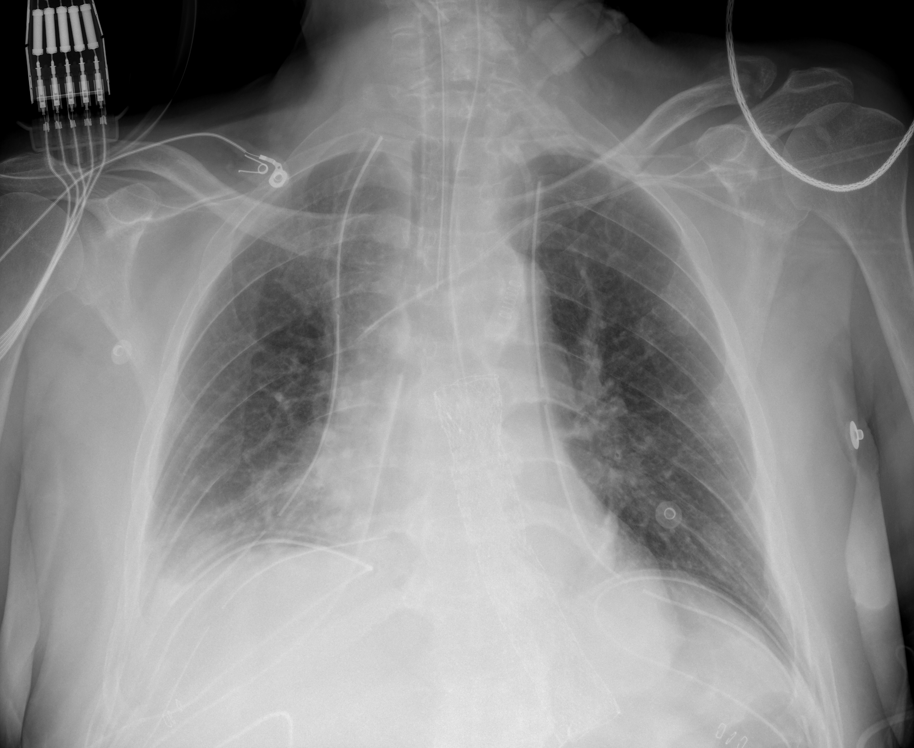

## 문제
A 64-year-old man with COVID-19 pneumonia was intubated 12 hours ago in the intensive care unit because of worsening hypoxemia despite high-flow nasal cannula oxygen. He is 175 cm (5 ft 9 in) tall and weighs 102 kg (225 lb). Current ventilator settings are volume-assist control with a tidal volume of 700 mL, respiratory rate of 18/min, PEEP of 8 cm H2O, and FiO2 of 0.8. The plateau pressure is 34 cm H2O. His temperature is 38.1°C, pulse is 108/min, and blood pressure is 118/70 mmHg on a low-dose norepinephrine infusion. Breath sounds are equal bilaterally with diffuse crackles. Arterial blood gas analysis shows pH 7.36, PaCO2 44 mmHg, and PaO2 88 mmHg. Bedside echocardiography shows normal left ventricular size and function. A portable chest x-ray is shown. Which of the following is the most appropriate change to the ventilator settings?

- A. Decrease the PEEP to 0 cm H2O to lower the plateau pressure
- B. Increase the tidal volume to 10 mL/kg of actual body weight
- C. Change to high-frequency oscillatory ventilation
- D. Reduce the tidal volume to 6 mL/kg of predicted body weight
- E. Reduce the tidal volume to 6 mL/kg of actual body weight

_Portable anteroposterior chest radiograph obtained in the supine position, unaltered apart from scaling (The Cancer Imaging Archive, CC BY 4.0; no cropping or window adjustment)_

## 정답 및 해설
> 정답: D

- **정답 핵심**: The supine portable chest x-ray shows an endotracheal tube, an enteric tube, and central venous catheters with bilateral airspace opacities, denser on the right in the perihilar region and lower zone, and no pneumothorax. With bilateral opacities within a week of the insult, a PaO2/FiO2 ratio of 88/0.8 = 110 on PEEP 8, and normal left ventricular function, he meets the Berlin criteria for moderate ARDS. The current tidal volume of 700 mL is about 10 mL/kg of his predicted body weight (about 70.6 kg for a 175-cm man) and the plateau pressure of 34 cm H2O exceeds 30. Lung-protective ventilation — tidal volume 6 mL/kg of predicted body weight (about 420 mL) with a plateau pressure of 30 cm H2O or less — reduces mortality.
- **원리**: In ARDS only a small part of the lung is aerated — the <b>"baby lung"</b>. A tidal volume that would be normal for healthy lungs is delivered into this small compliant region and overdistends it (<b>volutrauma</b>), while collapsed units open and close each breath (<b>atelectrauma</b>); both release inflammatory mediators (<b>biotrauma</b>) that worsen the lung injury and cause multiorgan failure.  Lung size is set by <b>height and sex, not weight</b>: an obese patient does not have larger lungs. That is why tidal volume is calculated from <b>predicted body weight</b> (men 50 + 0.91 × [height in cm − 152.4]; for 175 cm ≈ 70.6 kg), not actual weight. The ARDS Network trial showed that 6 mL/kg PBW with a plateau pressure ≤ 30 cm H2O lowered mortality from about 40% to 31% compared with 12 mL/kg.  The <b>plateau pressure</b> (measured during an inspiratory hold) reflects alveolar distending pressure; keeping it ≤ 30 cm H2O limits overdistension. Moderate hypercapnia that follows lower tidal volumes is accepted (<b>permissive hypercapnia</b>, pH ≥ 7.25), compensated partly by raising the respiratory rate. PEEP is kept or increased to hold alveoli open; prone positioning is added when PaO2/FiO2 stays below 150.
- **비교**: <table><thead><tr><th style="width:26%">Setting</th><th style="width:37%">6 mL/kg predicted body weight (answer)</th><th>6 mL/kg actual body weight (closest rival)</th></tr></thead><tbody> <tr><td>Basis</td><td><b>Height and sex → lung size</b></td><td>Total weight, including fat that adds no lung</td></tr> <tr><td>This patient</td><td><b>70.6 kg × 6 ≈ 420 mL</b></td><td>102 kg × 6 ≈ 610 mL (≈ 8.7 mL/kg PBW)</td></tr> <tr><td>Expected plateau pressure</td><td>Likely ≤ 30 cm H2O</td><td>Likely still near or above 30 cm H2O</td></tr> <tr><td>Evidence</td><td>Mortality benefit (ARDSNet)</td><td>Not lung-protective in obesity</td></tr> </tbody></table> <b>The closest rival is 6 mL/kg of actual body weight</b> — the number "6 mL/kg" is right, but the denominator is wrong. The dividing line is <b>which weight</b>: the lungs of a 175-cm man are the same size at 70 kg or 102 kg, so the calculation always uses predicted body weight.
- **오답 이유**:
  - (A) Decreasing PEEP to 0 would lower the plateau pressure, but it lets unstable alveoli collapse at end-expiration, worsening shunt and atelectrauma in a patient on FiO2 0.8. PEEP is lowered when there is barotrauma with hemodynamic compromise from high intrathoracic pressure and oxygenation is already adequate.
  - (B) Increasing the tidal volume to 10 mL/kg of actual body weight (about 1,020 mL) would raise the plateau pressure further and increase volutrauma; the PaCO2 of 44 mmHg does not call for more ventilation. Larger tidal volumes are used only in patients without lung injury, and even then about 6–8 mL/kg PBW is preferred.
  - (C) High-frequency oscillatory ventilation was proposed as the ultimate small-tidal-volume strategy, but trials (OSCILLATE, OSCAR) found no benefit and possible harm in moderate-to-severe ARDS. It is not a routine next step; conventional lung-protective ventilation is tried first and HFOV is reserved for refractory hypoxemia in selected centers.
  - (E) Six mL/kg of actual body weight uses the right number with the wrong weight; in this 102-kg man it gives about 610 mL, roughly 8.7 mL/kg of predicted body weight, which still overdistends the small aerated lung. It would be correct only if his actual weight equaled his predicted body weight of about 70 kg.
- **함정**: 6 mL/kg 라는 숫자만 외우면 실제 체중으로 계산하는 함정에 빠진다. 폐 크기는 키와 성별이 정한다.
- **학습목표**: 코로나19 급성호흡곤란증후군으로 기계환기 중인 환자에서 흉부 X선의 양측 음영과 PaO2/FiO2 비로 ARDS를 확인하고, 일회호흡량을 실제 체중이 아닌 예측 체중 6 mL/kg 으로 낮추고 고원압 30 cmH2O 이하를 목표로 한다
- **근거·출처**: ARDS Network. Ventilation with lower tidal volumes as compared with traditional tidal volumes for acute lung injury and ARDS. N Engl J Med 2000;342:1301 · ARDS Definition Task Force. Acute respiratory distress syndrome: the Berlin Definition. JAMA 2012;307:2526 · Fan E et al. An official ATS/ESICM/SCCM clinical practice guideline: mechanical ventilation in adult patients with ARDS. Am J Respir Crit Care Med 2017;195:1253 · 작성자 판독(2026-09-26): 앙와위 AP, 기관내관·비위관·중심정맥관, 양측(우측 우세) 폐문 주위·하폐야 음영, 기흉 없음

## 출처
- COVID-19-AR, The Cancer Imaging Archive (CC BY 4.0) · series …38227053 · Creative Commons Attribution 4.0 International · https://www.cancerimagingarchive.net/data-usage-policies-and-restrictions/
