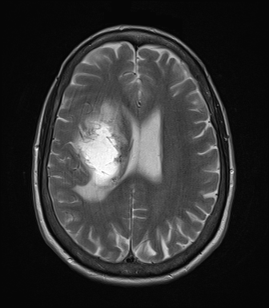

## 문제
A 68-year-old woman is brought to the physician by her daughter because of 3 weeks of progressive weakness of her left arm and leg and headaches that are worse in the morning. She has had two episodes of vomiting this week. She has hypertension treated with amlodipine. Her temperature is 36.8°C, pulse is 76/min, and blood pressure is 146/88 mmHg. She is alert and oriented. Neurologic examination shows 4/5 strength in the left upper and lower extremities with a left pronator drift and a left extensor plantar response. Sensation is intact. Funduscopic examination shows blurred optic disc margins bilaterally. Leukocyte count and serum glucose concentration are within the reference ranges. An axial MRI of the brain is shown. Which of the following is the most accurate interpretation of this image?

- A. T1-weighted image showing a right hemispheric mass with surrounding edema and leftward midline shift
- B. T2-weighted image showing a left hemispheric mass with surrounding edema and rightward midline shift
- C. FLAIR image showing an acute right hemispheric infarct with no mass effect or midline shift
- D. Diffusion-weighted image showing a right subdural hematoma compressing the lateral ventricle
- E. T2-weighted image showing a right hemispheric mass with surrounding edema and leftward midline shift

_Axial MRI of the brain at the level of the lateral ventricles, standard display orientation (patient's right on the viewer's left) (The Cancer Imaging Archive, CC BY 4.0; converted from DICOM without cropping)_

## 정답 및 해설
> 정답: E

- **정답 핵심**: The cerebrospinal fluid in the lateral ventricle and sulci is bright and the white matter is darker than the gray matter, which identifies a T2-weighted image (CSF is dark on T1 and suppressed on FLAIR). In the standard display orientation the patient's right is on the viewer's left: there is a heterogeneous hyperintense intra-axial mass in the right frontoparietal deep white matter with finger-like surrounding hyperintensity (vasogenic edema), effacement of the right lateral ventricle, and displacement of the septum pellucidum toward the left (subfalcine shift). This matches her left hemiparesis and signs of raised intracranial pressure (morning headache, vomiting, papilledema).
- **원리**: MRI contrast depends on how quickly protons recover (<b>T1</b>) and lose phase coherence (<b>T2</b>) after the radiofrequency pulse. <b>Free water</b> such as CSF has long T1 and long T2: it is <b>dark on T1-weighted</b> images (short TR/TE) and <b>bright on T2-weighted</b> images (long TR/TE). <b>FLAIR</b> is a T2-weighted sequence with an inversion pulse that nulls free water, so CSF is dark while edema and gliosis remain bright. Myelinated white matter, rich in lipid, is brighter than gray matter on T1 and darker on T2. So the fastest way to name a sequence is to look at the ventricles first, then compare gray and white matter.  <b>Vasogenic edema</b> arises when the blood–brain barrier breaks down around tumors or abscesses: plasma leaks into the extracellular space and tracks along white matter tracts, sparing the cortex — the "finger-like" pattern. It is bright on T2/FLAIR. <b>Mass effect</b> is judged by sulcal effacement, ventricular compression, and <b>subfalcine herniation</b> — the septum pellucidum and cingulate gyrus shift beneath the falx away from the mass.  Axial images are displayed in the <b>radiologic convention</b>: as if looking up from the patient's feet, so the patient's right is on the viewer's left. A lesion on the viewer's left is in the right hemisphere and causes left-sided weakness.
- **비교**: <table><thead><tr><th style="width:24%">Clue</th><th style="width:38%">T2-weighted (answer)</th><th>T1-weighted (closest rival)</th></tr></thead><tbody> <tr><td>CSF in ventricles/sulci</td><td><b>Bright</b></td><td>Dark</td></tr> <tr><td>White vs gray matter</td><td><b>White matter darker</b></td><td>White matter brighter</td></tr> <tr><td>Vasogenic edema</td><td><b>Bright, finger-like in white matter</b></td><td>Subtle, mildly dark</td></tr> <tr><td>FLAIR by comparison</td><td colspan="2">Edema bright but CSF dark — the ventricles are the tell</td></tr> </tbody></table> <b>The closest rival is the same description on a T1-weighted image</b> — laterality and mass effect are correct, only the sequence is wrong. The dividing line is <b>the brightness of CSF</b>. Then laterality: viewer's left = patient's right, which fits the left hemiparesis.
- **오답 이유**:
  - (A) The T1-weighted option describes the lesion, edema, and shift correctly but names the wrong sequence. On T1-weighted images CSF is dark and white matter is brighter than gray matter, the opposite of this image. If the ventricles were dark and the edema only faintly hypointense, this would be the answer.
  - (B) This option reverses the laterality by reading the image as if the viewer's left were the patient's left. In the radiologic convention the mass on the viewer's left lies in the right hemisphere, which is consistent with left-sided weakness. It would be correct for a patient with right hemiparesis and a lesion on the viewer's right.
  - (C) An acute infarct is bright on FLAIR and diffusion-weighted images, but here the CSF is bright (not FLAIR), the abnormality is a heterogeneous mass with white-matter edema and midline shift, and the history is 3 weeks of progression rather than sudden onset. A wedge-shaped cortical-subcortical lesion in a vascular territory with sudden deficits would fit this option.
  - (D) A subdural hematoma is extra-axial: a crescent-shaped collection between the skull and brain that compresses the hemisphere from outside. This lesion lies within the deep white matter, and the image is not a diffusion-weighted sequence. A crescentic collection along the convexity in an older patient on anticoagulants after a fall would fit this option.
- **함정**: Name the sequence from the CSF first, then read laterality in radiologic convention — not the other way round.
- **학습목표**: 뇌 MRI 축상면에서 뇌척수액이 밝은 것으로 T2 강조영상을 알아보고, 표준 표시 방향(환자 오른쪽 = 화면 왼쪽)에서 오른쪽 대뇌 반구 종괴와 주변 혈관성 부종·왼쪽으로의 대뇌낫밑 이동을 읽어 임상 소견(왼쪽 편마비)과 맞춘다
- **근거·출처**: Osborn AG, Hedlund GL, Salzman KL. Osborn's Brain: Imaging, Pathology, and Anatomy, 2nd ed. — MR sequences; brain herniations · UPENN-GBM collection, The Cancer Imaging Archive (CC BY 4.0) — teacher-only provenance · 작성자 판독(2026-09-26): T2 축상면, 환자 우측 전두-두정 심부 백질 불균질 고신호 종괴, 혈관성 부종, 우측 측뇌실 소실, 투명중격 좌측 이동

## 출처
- The Cancer Imaging Archive (CC BY 4.0) · series …13203111 · Creative Commons Attribution 4.0 International · https://www.cancerimagingarchive.net/data-usage-policies-and-restrictions/
