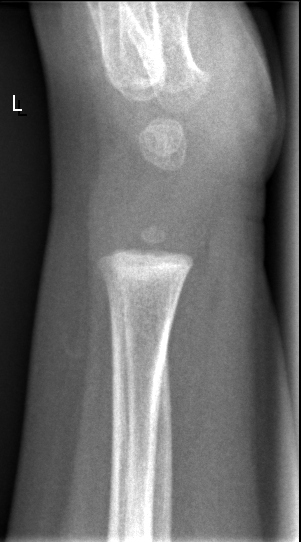

## 문제
20개월 남아가 두 다리가 바깥으로 휜 것 같다며 부모와 함께 소아청소년과에 왔다. 13개월에 걷기 시작했고 넘어지거나 절뚝이는 일은 없다. 모유 수유를 12개월에 끊었고 지금은 우유와 고기·달걀이 들어간 식사를 잘 먹는다. 키와 몸무게는 모두 50백분위수이며 발달은 정상이다. 진찰에서 양쪽 다리가 대칭적으로 바깥으로 휘어 있고, 발목을 붙이고 섰을 때 양쪽 무릎 사이가 4 cm 벌어진다. 손목이 굵어지거나 갈비연골 이음부가 튀어나온 곳은 없다. 혈청 칼슘은 9.6 mg/dL이다. 구루병을 확인하려고 찍은 왼쪽 손목 단순 X선 사진은 그림과 같다. 가장 적절한 처치는?

- A. 경구 인산염을 보충한다
- B. 근위 경골 절골술을 계획한다
- C. 안심시키고 6개월 뒤 다시 진찰한다
- D. 고용량 비타민 D를 경구로 투여한다
- E. 밤에 착용하는 교정 보조기를 처방한다

_왼쪽 손목 측면 단순 X선, 원본 그대로 크기 조정만 (GRAZPEDWRI-DX, figshare, CC BY 4.0)_

## 정답 및 해설
> 정답: C

- **정답 핵심**: 손목 X선에서 원위 요골 골간단의 끝이 편평하고 매끈하며, 구루병에서 보이는 컵 모양 함몰·솔 모양 불규칙·성장판 넓어짐이 없다. 손목뼈와 원위 요골 골단의 작은 골화중심은 이 나이에 맞는 정상 소견이다. 성장·식이가 정상이고 구루병 진찰 소견(손목 부종·구루병 염주)도 없으며 휘어짐이 대칭적이므로 생리적 내반슬이다. 생리적 내반슬은 18~24개월에 가장 심하다가 저절로 펴지고 3~4세에는 오히려 외반슬로 넘어가므로, 안심시키고 경과를 관찰한다.
- **원리**: <b>아이의 무릎 정렬은 나이에 따라 정해진 순서로 바뀐다.</b> 신생아는 자궁 안 자세 때문에 O다리(내반슬)로 태어나, <b>18~24개월</b>까지 내반이 가장 뚜렷하고, 2세 전후 곧게 된 뒤 <b>3~4세에 X다리(외반슬)가 최대</b>, 7세 무렵 어른의 가벼운 외반으로 자리 잡는다. 그래서 20개월 아이의 <b>대칭적인</b> O다리는 대부분 정상 발달이다.  의심해야 할 때는 <b>비대칭</b>, 2세 이후에도 <b>진행</b>, 키가 작음(3백분위 미만), 통증·절뚝임, 무릎 간격이 크게 벌어짐(보통 6 cm 초과), 가족력이 있을 때다. 이때 떠올리는 병이 <b>구루병</b>(영양성·저인산혈증성)과 <b>블라운트병</b>(근위 경골 내측 성장판 장애)이다.  <b>구루병의 X선</b>은 성장판에서 연골이 석회화되지 못해 생긴다 — 성장판이 넓어지고, 골간단 끝이 <b>컵 모양으로 패이고(cupping)</b>, 가장자리가 <b>솔처럼 갈라진다(fraying)</b>. 빨리 자라는 원위 요골·척골과 무릎 주위에서 가장 먼저 보여 손목 X선으로 선별한다. 이 아이의 골간단은 편평하고 매끈해 구루병 소견이 없다. 골화중심은 갓난아기에 유두골· 유구골, 1세 무렵 원위 요골 골단이 나타나므로 이 영상의 골화중심 수도 나이에 맞다.
- **비교**: <table><thead><tr><th style="width:24%">소견</th><th style="width:38%">생리적 내반슬(정답: 경과 관찰)</th><th>영양성 구루병(가장 가까운 오답: 비타민 D)</th></tr></thead><tbody> <tr><td>손목 X선 골간단</td><td><b>편평·매끈, 성장판 폭 정상</b></td><td>컵 모양 함몰, 솔 모양 불규칙, 성장판 넓어짐</td></tr> <tr><td>진찰</td><td><b>대칭적 휘어짐, 다른 뼈 소견 없음</b></td><td>손목 부종, 구루병 염주, 숫구멍 늦게 닫힘</td></tr> <tr><td>성장·식이</td><td>정상 키, 고른 식사</td><td>성장 지연, 비타민 D 보충 없는 장기 모유 수유·햇빛 부족</td></tr> <tr><td>검사실</td><td>칼슘 정상</td><td>알칼리인산분해효소 상승, 인 저하, 25(OH)D 저하</td></tr> </tbody></table> <b>가장 가까운 오답은 비타민 D 투여</b>다 — O다리를 보면 구루병부터 떠올리기 때문이다. 갈림길은 <b>손목 X선의 골간단 모양</b>이다. 편평·매끈하면 생리적, 컵 모양·솔 모양이면 구루병이다.
- **오답 이유**:
  - ① 경구 인산염 보충은 X-연관 저인산혈증성 구루병의 치료로, 식사가 좋아도 생기는 구루병이라 떠올릴 수 있다. 이 병도 손목 X선에서 컵 모양 함몰·성장판 넓어짐과 혈청 인 저하가 나타나는데 이 아이는 X선이 정상이다. 가족력이 있고 인이 낮으며 X선이 구루병 소견이었다면 정답이 된다.
  - ② 근위 경골 절골술은 4세 이후까지 진행한 블라운트병이나 보조기에 실패한 심한 변형에 한다. 20개월의 대칭적 O다리에 수술은 필요 없고, 대부분 2세 전후 저절로 펴진다. 4세가 넘은 아이에서 한쪽 경골 내반이 진행하고 X선에서 내측 골간단 함몰이 뚜렷했다면 정답이 된다.
  - ④ 고용량 비타민 D는 영양성 구루병의 치료다. 이 아이는 식사가 고르고 키가 정상이며 손목 X선의 골간단이 편평·매끈해 구루병 소견이 없다. 손목 X선에서 골간단이 컵 모양으로 패이고 가장자리가 솔처럼 갈라졌으며 알칼리인산분해효소가 높았다면 정답이 된다.
  - ⑤ 교정 보조기는 3세 전 블라운트병의 초기 단계에서 시도하는 치료다. 이 아이는 20개월에 휘어짐이 대칭적이고 진행 소견이 없어 생리적 범위다. 2세가 넘어 한쪽이 점점 더 휘고 무릎 X선에서 근위 경골 내측 골간단이 부리 모양으로 꺾였다면 이 선지를 고려한다.
- **함정**: O다리 = 구루병으로 곧장 가지 않는다. 20개월 전후의 대칭적 내반은 생리적이고, 손목 X선 골간단이 매끈하면 구루병 가능성은 낮다.
- **학습목표**: 걸음마 시기(생후 20개월 전후)의 대칭적 O다리에서 성장·식이·진찰과 손목 X선(원위 요골 골간단의 컵 모양 함몰·솔 모양 불규칙·성장판 넓어짐 없음)으로 구루병을 배제하고, 생리적 내반슬로 판단해 안심시키고 경과 관찰한다
- **근거·출처**: Kliegman RM et al. Nelson Textbook of Pediatrics, 21st ed. — torsional and angular deformities of the limb; rickets · Salenius P, Vankka E. The development of the tibiofemoral angle in children. J Bone Joint Surg Am 1975;57:259 · GRAZPEDWRI-DX (Nagy E et al., Sci Data 2022; CC BY 4.0) — 1.7 M, left wrist lateral, no fracture; teacher-only · 작성자 판독(2026-09-26): 원위 요골 골간단 끝이 편평·매끈, 컵 모양 함몰·솔 모양 불규칙·성장판 넓어짐 없음, 연령에 맞는 골화중심

## 출처
- GRAZPEDWRI-DX (figshare, CC BY 4.0) · Creative Commons Attribution 4.0 International · https://creativecommons.org/licenses/by/4.0/
