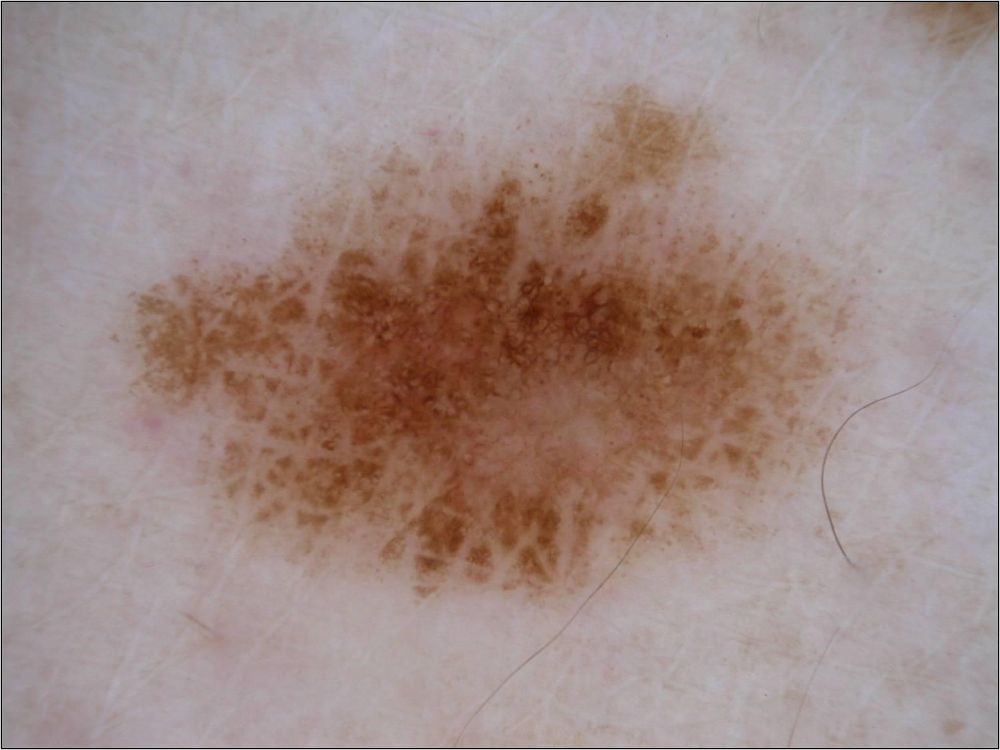

## 문제
55세 여자가 왼쪽 정강이에 있는 갈색 점이 지난 1년 동안 커졌다며 피부과에 왔다. 언니가 먼저 알아차렸고, 가렵거나 피가 난 적은 없다. 피부가 흰 편이고 10대에 물집이 잡힐 정도로 햇볕에 탄 적이 여러 번 있다. 본인과 가족 모두 피부암 병력은 없다. 진찰에서 왼쪽 정강이 앞면에 지름 9 mm 의 편평한 갈색 반점이 있고, 경계가 불규칙하며 색이 고르지 않다. 서혜부 림프절은 만져지지 않는다. 다른 부위의 점들은 작고 색이 고르다. 병변의 더모스코피 사진은 그림과 같다. 다음 단계로 가장 적절한 것은?

- A. 1~3 mm 절제연으로 병변 전체를 절제 생검한다
- B. 2 cm 절제연으로 광범위 절제를 한다
- C. 액체질소로 냉동치료를 한다
- D. 이미퀴모드 크림을 12주 동안 바르게 한다
- E. 안심시키고 12개월 뒤 더모스코피를 다시 한다

_더모스코피 사진, 원본 그대로 크기 조정만 (ISIC Archive, CC0 1.0 — 크롭·색보정 없음)_

## 정답 및 해설
> 정답: A

- **정답 핵심**: 더모스코피에서 병변은 구조와 색이 비대칭이고, 밝은 갈색과 짙은 갈색이 섞여 있으며, 색소망이 굵고 불규칙하고, 가장자리에 크기와 분포가 고르지 않은 점·소구가 있으며, 가운데에 흰색 무구조 영역(퇴행)이 있다. 이런 흑색종 구조에 1년간 커짐·불규칙한 경계·고르지 않은 색·지름 9 mm(ABCDE)가 더해져 흑색종 가능성이 높다. 다음 단계는 병변 전체를 1~3 mm 절제연으로 떼어 내는 진단적 전절제 생검이다. 병리의사가 Breslow 두께를 재야 최종 광범위 절제연과 감시림프절 생검 여부를 정할 수 있다.
- **원리**: <b>더모스코피는 표피-진피 경계에서 멜라닌이 어떻게 배열되었는지를 보여 준다.</b> 양성 모반은 한 가지 규칙으로 자라 규칙적인 망·고른 소구, 대칭, 한두 가지 색을 보인다. <b>흑색종</b>은 서로 다른 속도로 자라는 클론이 섞이고 표피를 따라 위·옆으로 퍼지기 때문에(파젯양 확산) <b>구조와 색의 비대칭</b>, <b>굵고 불규칙한 망</b>, 가장자리의 <b>불규칙한 점·소구</b>, 줄무늬, 그리고 면역계가 종양을 공격한 자리의 <b>퇴행 구조</b>(흰 흉터 모양 영역, 청회색 후추 점)를 만든다.  <b>왜 먼저 좁은 절제연으로 전체를 떼어 내는가?</b> 흑색종의 치료는 전체 표본에서 잰 <b>Breslow 두께</b>(침윤 깊이)로 정해진다. 일부만 떼거나 얕게 깎아 내면 가장 두꺼운 부분을 놓쳐 병기를 낮게 매길 수 있다. 1~3 mm 절제연은 병변을 다 떼면서도 림프 흐름을 흐트러뜨리지 않아, 뒤에 할 <b>감시림프절 생검</b>의 정확도를 지킨다.  조직 결과가 나오면 광범위 절제연을 두께로 고른다 — 제자리 0.5~1 cm, 1 mm 이하 1 cm, 1~2 mm 1~2 cm, 2 mm 초과 2 cm. 감시림프절 생검은 대략 0.8 mm 이상(또는 궤양이 있으면 더 얇아도)에서 고려한다. 냉동치료·이미퀴모드처럼 조직을 없애는 치료는 병기를 매길 표본을 남기지 않는다.
- **비교**: <table><thead><tr><th style="width:24%">항목</th><th style="width:38%">1~3 mm 전절제 생검(정답)</th><th>2 cm 광범위 절제(가장 가까운 오답)</th></tr></thead><tbody> <tr><td>목적</td><td><b>진단과 Breslow 두께 측정</b></td><td>병기 확인 뒤의 최종 치료</td></tr> <tr><td>시점</td><td><b>의심 병변, 조직 결과 없음</b></td><td>생검에서 두께 2 mm 초과 침윤성 흑색종</td></tr> <tr><td>림프 흐름</td><td>보존 — 감시림프절 지도화 가능</td><td>지도화 전에 하면 흐름이 흐트러질 수 있음</td></tr> <tr><td>먼저 했을 때</td><td>표준 순서</td><td>제자리·얇은 흑색종이면 과잉 치료, 절제연을 근거 없이 고름</td></tr> </tbody></table> <b>가장 가까운 오답은 2 cm 광범위 절제</b>다 — 병변이 악성으로 보이고 두꺼운 흑색종의 치료이기 때문이다. 갈림길은 <b>두께를 아는가</b>다. 절제연은 Breslow 두께로 정하므로 좁은 절제연의 진단적 전절제 생검이 언제나 먼저다.
- **오답 이유**:
  - ② 2 cm 광범위 절제는 두께 2 mm 를 넘는 흑색종의 최종 수술이라 악성으로 보이는 병변에서 고르기 쉽다. 그러나 조직이 없으면 두께도 절제연도 알 수 없고, 이 병변이 제자리 흑색종이면 0.5~1 cm 로 충분하다. 생검에서 두께 2.5 mm 의 침윤성 흑색종이 나왔다면 정답이 된다.
  - ③ 냉동치료는 광선각화증·사마귀 같은 얕은 병변을 없애는 치료로, 편평하고 얇아 보이는 반점에 떠올릴 수 있다. 표본이 남지 않아 흑색종을 진단하거나 병기를 매길 수 없고 불완전하게 치료되면 재발한다. 햇빛 노출 부위의 거칠고 비늘 있는 광선각화증이고 멜라닌세포 구조가 없다면 적절하다.
  - ④ 이미퀴모드는 국소 면역을 자극해 표재성 기저세포암·광선각화증에, 때로는 수술이 어려운 얼굴의 악성 흑색점에 쓴다. 진단되지 않은 채 변하는 다리 병변의 첫 처치는 아니다. 조직으로 확인된 얼굴의 악성 흑색점이고 고령이라 수술이 어렵다면 고려한다.
  - ⑤ 12개월 뒤 다시 보는 경과 관찰은 흑색종 구조가 없는 안정적이고 대칭인 모반에 맞다. 이 병변은 1년간 커졌고 비대칭·여러 색·불규칙 망·퇴행 구조가 있어 기다리면 더 깊이 침윤할 위험이 있다. 작고 대칭이며 색이 고르고 규칙적인 망에 변화가 없는 점이라면 이 선지가 맞다.
- **함정**: 악성으로 보인다고 넓은 절제부터 하지 않는다. 절제연은 조직의 Breslow 두께로 정하므로 좁은 절제연의 전절제 생검이 먼저다.
- **학습목표**: 변하는 하지 색소 병변의 더모스코피에서 비대칭·여러 갈색 음영·불규칙 색소망·가장자리 불규칙 점·중앙 퇴행 영역을 읽어 흑색종을 의심하고, 좁은 절제연(1~3 mm)의 전절제 생검을 고르며 조직 확인 전 광범위 절제와 구별한다
- **근거·출처**: Swetter SM et al. Guidelines of care for the management of primary cutaneous melanoma. J Am Acad Dermatol 2019;80:208 · NCCN Clinical Practice Guidelines in Oncology: Melanoma: Cutaneous — principles of biopsy and surgical margins · Argenziano G et al. Dermoscopy of pigmented skin lesions: results of a consensus meeting via the Internet. J Am Acad Dermatol 2003;48:679 · ISIC Archive ISIC_0000022 (CC0) — 55 F, lower extremity, histopathology-confirmed melanoma in situ; teacher-only · 작성자 판독(2026-09-26): 비대칭, 여러 갈색 음영, 굵고 불규칙한 색소망, 가장자리 불규칙 점·소구, 중앙 흰색 무구조 영역

## 출처
- ISIC Archive ISIC_0000022 (CC-0) · CC0 1.0 Universal · https://creativecommons.org/publicdomain/zero/1.0/
