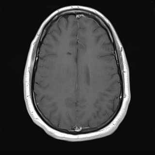

## 문제
28세 남자가 2주 전 처음으로 전신 강직간대발작이 있어 신경과 외래에 왔다. 발작은 1분 정도 지속되었고 발작 뒤 30분 동안 멍했다고 한다. 발열이나 두통은 없었고, 복용하는 약이나 음주력은 없다. 혈압 122/76 mmHg, 맥박 72회/분이다. 신경학적 진찰에서 이상은 없다. 가돌리늄 조영제를 정맥 주사한 뒤 얻은 뇌 MRI T1 강조 축상면 한 장은 그림과 같다. 이 영상에서 조영제가 혈관 안에 들어갔음을 보여 주는 소견은?

- A. 대뇌 백질이 회백질보다 조금 밝게 보인다
- B. 두개골 판사이층(골수)이 밝게 보인다
- C. 앞뒤 정중선에 있는 위시상정맥동 내강이 밝게 보인다
- D. 두피 아래 피하지방이 밝게 보인다
- E. 뇌고랑 안의 뇌척수액이 어둡게 보인다

_뇌 MRI 축상면 T1 강조영상(가돌리늄 정맥 주사 후), 표준 표시 방향(환자 오른쪽이 보는 사람 왼쪽), 원본 그대로 크기 조정만 (The Cancer Imaging Archive, CC BY 4.0 — 크롭·창 조정 없음)_

## 정답 및 해설
> 정답: C

- **정답 핵심**: T1 강조영상에서 지방(두피 피하지방, 두개골 판사이층의 황색골수)은 조영 여부와 상관없이 밝고, 뇌척수액은 어둡고, 백질은 회백질보다 조금 밝다 — 이것들은 모두 T1 강조영상임을 알려 줄 뿐이다. 조영제 투여를 알려 주는 것은 혈관이다. 이 영상에서 앞쪽과 뒤쪽 정중선의 위시상정맥동 내강과 피질 정맥이 밝게 조영되어 있어 가돌리늄이 혈관 안에 있음을 보여 준다. 뇌 실질에는 혈뇌장벽이 있어 정상에서는 조영되지 않는다.
- **원리**: <b>가돌리늄</b>은 주변 물 양성자의 <b>T1 이완 시간을 줄여</b> T1 강조영상에서 그 자리를 밝게 만든다. 따라서 가돌리늄이 <b>있는 곳만</b> 조영 전보다 밝아진다. 정상에서 가돌리늄이 가는 곳은 <b>혈관 안(정맥동·피질 정맥·맥락얼기)</b>과, 혈뇌장벽이 없는 구조(<b>경막·뇌하수체·맥락얼기·송과체</b>)다. 정상 뇌 실질은 혈뇌장벽 때문에 조영되지 않는다.  반면 <b>지방</b>은 원래 T1 이 짧아 조영 전에도 밝다 — 두피 피하지방, 판사이층의 황색골수, 안와 지방. 그래서 「밝은 지방」은 T1 강조영상이라는 증거일 뿐 조영의 증거가 아니다. <b>뇌척수액</b>은 T1 이 길어 T1 에서 어둡고 T2 에서 밝다 — 시퀀스를 가르는 표지다. 백질이 회백질보다 밝은 것도 수초의 지질 때문인 T1 의 특징이다.  주의할 점: 조영 전 T1 에서도 느린 혈류가 절편에 들어오며 정맥동이 약간 밝게 보일 수 있다(유입 효과). 그래서 실제 판독에서는 조영 전 영상과 나란히 놓고 비교한다. 시험에서는 「정맥동·피질 정맥·맥락얼기·경막이 밝다」를 조영 후 영상의 표지로 읽는다.
- **비교**: <table><thead><tr><th style="width:26%">구조</th><th style="width:37%">위시상정맥동(정답)</th><th>두피 피하지방(가장 가까운 오답)</th></tr></thead><tbody> <tr><td>밝은 이유</td><td><b>혈관 안 가돌리늄이 T1 을 줄임</b></td><td>지방 자체의 짧은 T1</td></tr> <tr><td>조영 전 T1</td><td>어둡거나 회색(유입 효과가 있으면 약간 밝음)</td><td><b>이미 밝다</b></td></tr> <tr><td>조영 후 T1</td><td><b>뚜렷하게 밝아짐</b></td><td>변화 없음</td></tr> <tr><td>알려 주는 것</td><td>조영제 투여</td><td>T1 강조영상(지방억제 없음)</td></tr> </tbody></table> <b>가장 가까운 오답은 피하지방의 고신호</b>다. 둘 다 「밝다」는 겉모습이 같다. 갈림길은 <b>조영 전에도 밝은가</b>다 — 조영 전에도 밝으면 조직 고유 신호, 조영 후에만 밝으면 가돌리늄이다.
- **오답 이유**:
  - ① 백질이 회백질보다 밝은 것은 수초 지질 때문인 성인 T1 의 정상 대비다. 조영 전 영상에서도 같다. 이 영상이 성인 T1 강조영상인지(영아는 역전) 묻는다면 근거가 된다.
  - ② 판사이층의 황색골수는 지방이라 조영 없이도 T1 에서 밝다. 골수 전이·골수 침윤으로 이 고신호가 사라졌는지 묻는 문항이라면 이 구조를 본다.
  - ④ 피하지방은 T1 이 짧아 조영 전후 모두 밝으므로 조영의 증거가 아니라 T1 강조영상의 증거다. 지방억제 T1 조영 후 영상에서 지방이 어둡게 바뀌었는지를 묻는다면 이 구조를 보게 된다.
  - ⑤ 뇌고랑 뇌척수액이 어두운 것은 T1 강조영상의 특징으로, 조영 여부와 관계없다. 이 영상이 T1 인지 T2 인지를 묻는 문항이었다면 정답이 된다.
- **함정**: T1 에서 밝은 것을 모두 조영으로 읽지 않는다. 지방은 원래 밝다 — 조영의 증거는 혈관(정맥동·피질 정맥)이다.
- **학습목표**: 조영 후 T1 강조 뇌 MRI 에서 지방·판사이층의 고신호는 조영과 무관한 T1 고유 신호이고, 경막 정맥동과 피질 정맥의 고신호가 혈관 안 가돌리늄을 보여 준다는 것을 구별한다
- **근거·출처**: Osborn AG. Osborn's Brain: Imaging, Pathology, and Anatomy, 2nd ed. — normal enhancing structures · Bushberg JT et al. The Essential Physics of Medical Imaging, 4th ed. — T1 relaxation and gadolinium contrast · TCIA UPENN-GBM collection (CC BY 4.0) — 28 M, axial T1 post-contrast; teacher-only · 작성자 판독(2026-09-27): 두피 지방·판사이층 고신호, CSF 저신호, 백질 > 회백질, 위시상정맥동 앞뒤와 피질 정맥 조영, 이 단면에 종괴 없음

## 출처
- The Cancer Imaging Archive (CC BY 4.0) · series …35053496 · Creative Commons Attribution 4.0 International · https://www.cancerimagingarchive.net/data-usage-policies-and-restrictions/
