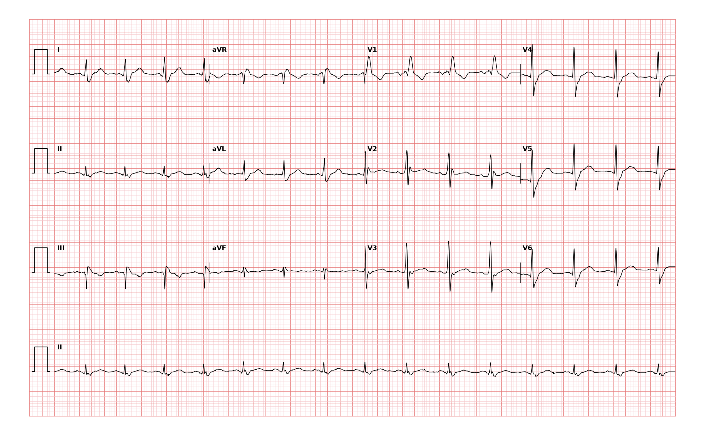

## 문제
A 60-year-old man comes to the clinic for preoperative evaluation before elective right total knee arthroplasty for osteoarthritis. He walks 2 km daily and climbs two flights of stairs without chest pain or dyspnea. He has no history of syncope or palpitations. He has hypertension treated with amlodipine and does not smoke. He is 183 cm (6 ft) tall and weighs 97 kg (214 lb). His pulse is 88/min and blood pressure is 134/82 mm Hg. The lungs are clear. The second heart sound splits during inspiration and becomes single during expiration, and there are no murmurs. A 12-lead electrocardiogram is shown. Which of the following is the most appropriate next step in management?

- A. Coronary CT angiography
- B. Proceed with surgery without further cardiac testing
- C. Transthoracic echocardiography
- D. Exercise electrocardiographic stress testing
- E. 24-hour ambulatory electrocardiographic monitoring

_12-lead ECG, 25 mm/s and 10 mm/mV, 3×4 layout with lead II rhythm strip (PTB-XL ECG dataset, PhysioNet, CC BY 4.0; plotted from the raw signal)_

## 정답 및 해설
> 정답: B

- **정답 핵심**: The ECG shows sinus rhythm at about 90/min with an rSR′ pattern in V1, a QRS duration under 120 ms, and a slurred but narrow S wave in leads I and V6 — incomplete right bundle branch block. It is common in healthy adults and carries no added perioperative risk by itself. He has no cardiac symptoms, his functional capacity exceeds 4 METs (two flights of stairs), and the physiologic (not fixed) splitting of S2 without a murmur makes an atrial septal defect unlikely. Knee arthroplasty is an elevated-risk procedure, but a patient with good functional capacity proceeds to surgery without stress testing or imaging.
- **원리**: The right bundle branch is a thin, long fascicle that is easily delayed. When it conducts slowly, the left ventricle depolarizes normally first (the initial r in V1 and the R in V6), and the right ventricle is activated late from the left, adding a <b>terminal rightward and anterior force</b>: a secondary <b>R′ in V1</b> and a <b>slurred S wave in I and V6</b>. If the QRS is ≥ 120 ms it is complete RBBB; if the same pattern has a QRS &lt; 120 ms it is <b>incomplete RBBB</b>.  Incomplete RBBB is found in a few percent of healthy adults, more often in tall men and athletes, and it predicts no cardiac event on its own. It matters when it is a <b>clue to right ventricular volume overload</b> — classically an <b>ostium secundum atrial septal defect</b>, which adds a <b>fixed split S2</b>, a systolic flow murmur at the left upper sternal border, and right axis deviation. It also matters when it appears with syncope (Brugada pattern, bifascicular block).  Preoperative cardiac testing follows the ACC/AHA stepwise approach: urgent surgery? active cardiac condition? risk of the procedure? and then <b>functional capacity</b>. A patient who can do ≥ 4 METs (climbing two flights of stairs) without symptoms proceeds to surgery; testing is reserved for results that would change management.
- **비교**: <table><thead><tr><th style="width:26%">Feature</th><th style="width:37%">Proceed to surgery (answer)</th><th>Transthoracic echocardiography (closest rival)</th></tr></thead><tbody> <tr><td>When indicated</td><td><b>Asymptomatic, ≥ 4 METs, isolated conduction finding</b></td><td>Murmur, dyspnea, heart failure signs, suspected ASD or valve disease</td></tr> <tr><td>S2</td><td><b>Physiologic split (widens on inspiration, single on expiration)</b></td><td>Fixed wide split suggests ASD</td></tr> <tr><td>Murmur</td><td>None</td><td>Pulmonary flow murmur at left upper sternal border</td></tr> <tr><td>Effect on management</td><td>None — surgery proceeds</td><td>Would change management only if structural disease is suspected</td></tr> </tbody></table> <b>The closest rival is echocardiography</b>, because incomplete RBBB is the ECG clue to an atrial septal defect. The dividing line is <b>the S2 and the murmur</b>: physiologic splitting and no murmur make an ASD unlikely, so echocardiography would not change the plan.
- **오답 이유**:
  - (A) Coronary CT angiography evaluates suspected coronary artery disease in a patient with symptoms and an intermediate pretest probability. He has no angina or dyspnea and good functional capacity. It would be considered for new exertional chest pain in a patient unable to exercise.
  - (C) Echocardiography is appropriate if incomplete RBBB comes with a fixed split S2, a flow murmur, dyspnea, or signs of right heart overload that suggest an atrial septal defect. Here S2 splits physiologically and there is no murmur, so it would not change management.
  - (D) Exercise stress testing assesses ischemia when functional capacity is poor or unknown before elevated-risk surgery. This man climbs two flights of stairs without symptoms (> 4 METs). It would be reasonable if he could not do that or had exertional chest pain.
  - (E) Ambulatory ECG monitoring detects intermittent arrhythmias or conduction block in a patient with palpitations or syncope. He has neither. It would be the next step if incomplete RBBB were accompanied by unexplained syncope.
- **함정**: Incomplete RBBB alone is not a reason to delay surgery or order tests — look for a fixed split S2, a murmur, or syncope before investigating further.
- **학습목표**: 수술 전 심전도에서 불완전 우각차단(V1 rSR′, QRS 120 ms 미만)을 보면, 증상이 없고 운동능력이 4 METs 이상이며 S2 의 고정 분열·심잡음이 없을 때 추가 심장 검사 없이 수술을 진행한다
- **근거·출처**: Thompson A et al. 2024 AHA/ACC guideline for perioperative cardiovascular management for noncardiac surgery. Circulation 2024;150:e351 · Surawicz B et al. AHA/ACCF/HRS recommendations for the standardization and interpretation of the ECG, part III: intraventricular conduction disturbances. Circulation 2009;119:e235 · PTB-XL ECG dataset (PhysioNet, CC BY 4.0) record 18334 — 60 M, incomplete right bundle branch block (2 cardiologists); teacher-only · 작성자 판독(2026-09-27): 동리듬 약 90/분, V1 rSR′, QRS 120 ms 미만, I·V6 끌리는 S, ST 변화 없음

## 출처
- PTB-XL ECG dataset v1.0.3 (PhysioNet, CC BY 4.0) · record 18334 · Creative Commons Attribution 4.0 International · https://physionet.org/content/ptb-xl/1.0.3/LICENSE.txt
