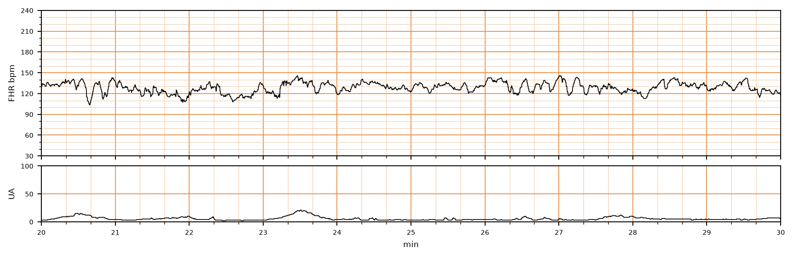

## 문제
38주 경산부(35세)가 4시간 전부터 규칙적인 진통이 있어 분만실에 입원하였다. 임신 경과 중 특이 소견은 없었고, 이전 분만은 질식분만이었다. 체온 36.8°C, 혈압 118/72 mmHg, 맥박 84회/분이다. 내진에서 자궁경부는 4 cm 열리고 70 % 소실되었으며 양막은 파열되지 않았다. 옥시토신은 쓰지 않았다. 입원 후 시작한 전자태아감시의 태아심박동과 자궁수축 기록은 그림과 같다. 이 기록에서 기저 태아심박수와 기저선 변이도로 가장 적절한 것은?

- A. 약 125~130회/분, 중등도 변이도
- B. 약 125~130회/분, 최소 변이도
- C. 약 165~170회/분, 중등도 변이도
- D. 약 100~105회/분, 중등도 변이도
- E. 약 125~130회/분, 사인파형

_분만 중 태아심박동(위)과 자궁수축(아래) 기록, 기록 시작 후 20~30분 구간; 세로 굵은 선 = 1분 (CTU-UHB Intrapartum Cardiotocography Database, PhysioNet, ODC-BY 1.0 — 원자료 4 Hz 그대로, 평활화 없음)_

## 정답 및 해설
> 정답: A

- **정답 핵심**: 10분 구간에서 가속·짧은 하강을 뺀 평균 심박수는 약 125~130회/분으로 정상 범위(110~160)다. 기저선이 한 분 안에서 불규칙하게 오르내리는 진폭(최고점과 최저점 차)은 대부분 6~15회/분으로, 6~25회/분인 중등도 변이도다. 곳곳에 145회/분 전후까지 올라가는 가속이 있고, 규칙적인 사인 모양 진동은 없다. 중등도 변이도는 그 순간 태아 대사성 산증이 없음을 강하게 시사한다.
- **원리**: 전자태아감시 판독은 <b>기저선 → 변이도 → 가속 → 감속 → 추세</b> 순서로 읽는다(NICHD 2008).  <b>기저 심박수</b>는 10분 동안 가속·감속·변이도가 큰 구간을 빼고 5회/분 단위로 반올림한 평균이다. 110~160이 정상, 160 초과(10분 이상)는 빈맥 — 산모 발열·융모양막염·태아 저산소의 초기, 110 미만은 서맥이다.  <b>기저선 변이도</b>는 기저선이 불규칙하게 오르내리는 폭(최고-최저)이다. 태아 뇌간의 교감·부교감 신경이 1초 단위로 심박수를 조절한 결과라서 <b>변이도가 있다는 것은 중추신경계가 산소를 잘 받고 있다는 뜻</b>이다. 없음(검출 불가) · 최소(≤ 5) · <b>중등도(6~25)</b> · 현저(&gt; 25)로 나눈다. 최소 변이도는 태아 수면(보통 40분 이내), 마약성 진통제·황산마그네슘, 또는 산증에서 나타난다.  <b>사인파형</b>은 3~5회/분 주기의 매끈하고 규칙적인 파동(진폭 5~15)으로 변이도가 없는 것과 같으며, 태아 빈혈·심한 저산소를 뜻하는 범주 III 소견이다. 이 기록처럼 파형이 들쭉날쭉하면 사인파형이 아니다.
- **비교**: <table><thead><tr><th style="width:26%">항목</th><th style="width:37%">중등도 변이도(정답)</th><th>최소 변이도(가장 가까운 오답)</th></tr></thead><tbody> <tr><td>진폭</td><td><b>6~25회/분</b></td><td>검출되지만 ≤ 5회/분 — 거의 평탄</td></tr> <tr><td>이 기록</td><td><b>대부분 6~15회/분의 불규칙한 오르내림</b></td><td>—</td></tr> <tr><td>의미</td><td>현재 대사성 산증이 없을 가능성이 높다</td><td>수면·약물(마약성 진통제·황산마그네슘) 또는 산증</td></tr> <tr><td>대응</td><td>일상 감시를 이어간다</td><td>원인 확인·자극 검사, 지속되면 범주 II 평가</td></tr> </tbody></table> <b>가장 가까운 오답은 같은 기저선의 최소 변이도</b>다. 기저선 숫자는 맞으므로 갈림길은 <b>오르내림의 폭</b>이다 — 가는 선이 격자 한 칸(10회/분) 안팎으로 계속 흔들리면 중등도, 거의 한 줄로 평탄하면 최소다.
- **오답 이유**:
  - ② 최소 변이도는 기저선 진폭이 5회/분 이하로 거의 평탄한 기록이다. 이 기록은 6~15회/분으로 계속 흔들리고 가속도 있다. 마약성 진통제를 준 직후 선이 평탄해졌다면 정답이 된다.
  - ③ 165~170회/분은 태아 빈맥으로, 산모 발열·융모양막염·탈수에서 보인다. 이 기록의 평균은 130 전후이고 145 전후 봉우리는 가속이다. 산모가 38.5°C 이고 기록이 10분 넘게 160 위에 머물렀다면 정답이 된다.
  - ④ 100~105회/분은 태아 서맥으로, 제대 압박·태반 조기박리·태아 심차단에서 보인다. 이 기록의 20.6분 하강은 짧게 한 번뿐이라 기저선이 아니다. 기록 전체가 105 근처에 머물렀다면 정답이 된다.
  - ⑤ 사인파형은 3~5회/분 주기의 매끈하고 규칙적인 파동으로 태아 빈혈·중증 저산소를 뜻한다. 이 기록의 흔들림은 불규칙하고 가속이 섞여 있다. 태아모체 출혈이 의심되는 산모에서 규칙적인 물결이 20분 이상 이어졌다면 정답이 된다.
- **함정**: 짧은 하강 하나나 가속 봉우리를 기저선으로 읽지 않는다. 기저선은 10분의 평균이고, 변이도는 오르내림의 폭이다.
- **학습목표**: 분만 중 태아심박동 기록에서 10분 구간의 기저 심박수(110~160회/분)와 기저선 변이도(진폭 6~25회/분 = 중등도)를 직접 읽는다
- **근거·출처**: Macones GA et al. The 2008 NICHD workshop report on electronic fetal monitoring. Obstet Gynecol 2008;112:661 · ACOG Practice Bulletin No. 106: Intrapartum fetal heart rate monitoring. Obstet Gynecol 2009;114:192 · CTU-UHB Intrapartum CTG Database (PhysioNet, ODC-BY 1.0) record 1312, minutes 20–30 — 35 y, 38 wk, para 1; teacher-only · 작성자 판독(2026-09-27): 기저 약 125~130/분, 변이도 중등도(6~15), 145 전후 가속 여러 번, 20.6분 짧은 하강 1회, 저진폭 수축

## 출처
- CTU-UHB Intrapartum Cardiotocography Database (PhysioNet, ODC-BY 1.0) · record 1312 · Open Data Commons Attribution License v1.0 · https://opendatacommons.org/licenses/by/1-0/
