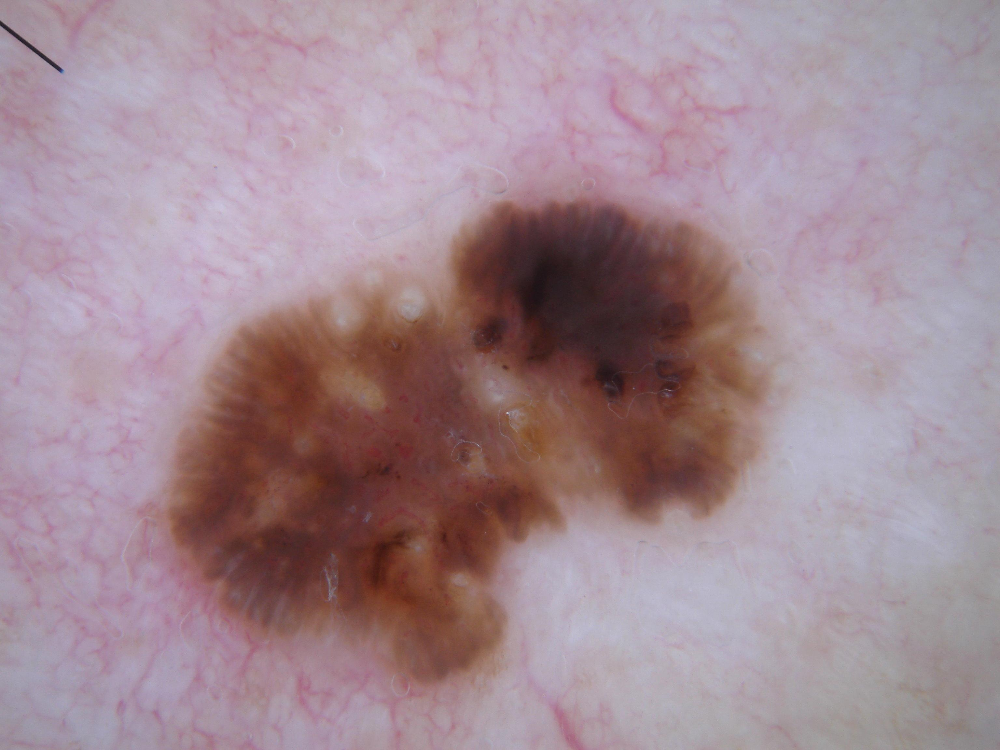

## 문제
A 75-year-old man comes to the physician because of a brown lesion on his upper back that his wife noticed several months ago. He is not sure how long it has been present. It occasionally itches when it rubs against his clothing but has never bled. He has hypertension treated with lisinopril and worked outdoors as a farmer for 40 years. Examination shows a 1.4-cm, slightly raised, sharply demarcated brown plaque on the upper back and several smaller tan papules elsewhere on the trunk. There is no cervical or axillary lymphadenopathy. A dermoscopic photograph of the lesion on the back is shown. The lesion is most likely a proliferation of which of the following cell types?

- A. Melanocytes at the dermoepidermal junction
- B. Nevus cells nested in the dermis
- C. Sebaceous gland cells
- D. Dermal fibroblasts
- E. Epidermal keratinocytes

_Dermoscopic photograph, unaltered apart from scaling (ISIC Archive, CC0 1.0; no cropping or color adjustment)_

## 정답 및 해설
> 정답: E

- **정답 핵심**: Dermoscopy shows a sharply demarcated brown lesion with several round white-yellow milia-like cysts, dark irregular comedo-like openings, and thick finger-like (cerebriform) projections at the periphery, with no pigment network. Milia-like cysts and comedo-like openings are keratin trapped in the thickened epidermis and are the hallmark of seborrheic keratosis, a benign epidermal (non-melanocytic) proliferation that is very common on the trunk of older adults. The brown color comes from melanin passed into these keratinocytes, not from a proliferation of melanocytes; the absence of a pigment network argues against a melanocytic lesion such as melanoma, a junctional or dysplastic nevus, or a dermal nevus.
- **원리**: Dermoscopy first asks one question: <b>is the lesion melanocytic?</b> Melanocytic lesions (nevi, melanoma) usually show a <b>pigment network</b> (melanin along the rete ridges), aggregated globules, or streaks. If none is present, the reader looks for the signatures of non-melanocytic lesions.  <b>Seborrheic keratosis</b> is a benign proliferation of basaloid keratinocytes with <b>horn cysts</b> and <b>pseudo-horn cysts</b>. Seen from above, horn cysts inside the epidermis appear as round <b>white-yellow "milia-like cysts"</b>, and keratin plugs opening onto the surface appear as <b>dark "comedo-like openings"</b>. The folded, papillomatous surface creates <b>fissures and ridges ("brain-like" or cerebriform pattern)</b> and thick "fat fingers," and the lesion has a <b>sharp, "stuck-on" border</b>.  Pigmented basal cell carcinoma lacks a network too but shows <b>arborizing vessels</b>, blue-gray ovoid nests, leaf-like areas, and ulceration. A heavily pigmented seborrheic keratosis can look dark and irregular, which is why the dermoscopic structures — not color alone — decide the diagnosis; if structures are equivocal, the lesion is biopsied.
- **비교**: <table><thead><tr><th style="width:26%">Feature</th><th style="width:37%">Keratinocyte proliferation — seborrheic keratosis (answer)</th><th>Junctional melanocyte proliferation — melanoma or nevus (closest rival)</th></tr></thead><tbody> <tr><td>Cell of origin</td><td><b>Keratinocyte (non-melanocytic)</b></td><td>Melanocyte</td></tr> <tr><td>Pigment network</td><td><b>Absent</b></td><td>Atypical — thick, irregular, abruptly ending</td></tr> <tr><td>Key structures</td><td><b>Milia-like cysts, comedo-like openings, cerebriform ridges</b></td><td>Irregular dots/globules, streaks, blue-white veil, regression</td></tr> <tr><td>Border</td><td>Sharp, "stuck-on"</td><td>Irregular, may fade into skin</td></tr> </tbody></table> <b>The closest rival is a melanocytic proliferation</b>, because the lesion is large, dark, and irregular in an older sun-exposed man and pigment makes one think of melanocytes. The dividing line is <b>the pigment network and keratin structures</b>: milia-like cysts and comedo-like openings without a network point to a keratinocytic lesion whose pigment is only borrowed melanin.
- **오답 이유**:
  - (A) Junctional melanocytes proliferate in melanoma and junctional or dysplastic nevi, which show a pigment network, irregular globules or streaks, or a blue-white veil on dermoscopy. It would be correct if an atypical network replaced the milia-like cysts and comedo-like openings.
  - (B) Nevus cells nested in the dermis form an intradermal nevus, a soft, often skin-colored or light-brown dome with comma vessels and globules. It would be correct for a soft, rubbery facial papule with curved vessels and no keratin structures.
  - (C) Sebaceous gland cells proliferate in sebaceous hyperplasia or adenoma, a yellowish umbilicated papule with crown vessels, usually on the face. It would be correct for a 3-mm yellow papule on the forehead with a central dell and peripheral vessels.
  - (D) Dermal fibroblasts proliferate in a dermatofibroma, a firm papule that dimples when pinched and shows a central white patch with a delicate peripheral network. It would be correct for a firm leg papule with a positive dimple sign.
- **함정**: Brown does not mean melanocytic — first look for a pigment network; milia-like cysts and comedo-like openings without a network mark a keratinocytic lesion.
- **학습목표**: 노인 몸통의 갈색 병변에서 더모스코피의 좁쌀 모양 낭·면포 모양 구멍·뇌이랑 모양 구조와 색소망의 부재로 멜라닌세포가 아닌 표피 각질세포의 양성 증식(지루각화증)임을 읽고 멜라닌세포 병변과 구별한다
- **근거·출처**: Argenziano G et al. Dermoscopy of pigmented skin lesions: results of a consensus meeting via the Internet. J Am Acad Dermatol 2003;48:679 · Bolognia JL, Schaffer JV, Cerroni L. Dermatology, 4th ed. — seborrheic keratosis; dermoscopy · ISIC Archive ISIC_0001104 — 75 M, posterior trunk, histopathology-confirmed seborrheic keratosis; teacher-only · 작성자 판독(2026-09-27): 경계 뚜렷한 갈색 병변, 좁쌀 모양 낭 여럿, 면포 모양 구멍, 가장자리 굵은 손가락·뇌이랑 모양 구조, 색소망 없음

## 출처
- ISIC Archive ISIC_0001104 (CC-0) · CC0 1.0 Universal · https://creativecommons.org/publicdomain/zero/1.0/
