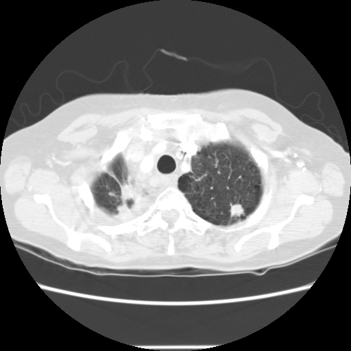

## 문제
A 61-year-old woman undergoes her first low-dose CT scan of the chest for lung cancer screening. She has a 36-pack-year history of cigarette smoking and quit 4 years ago. She has no cough, hemoptysis, or weight loss. She takes no medications. Her pulse is 78/min, respirations are 14/min, and blood pressure is 128/78 mm Hg. The lungs are clear to auscultation. No previous chest imaging is available for comparison. An axial CT image at the level of the lung apices is shown; the lesion in the left upper lobe measures 21 mm in mean diameter. Which of the following is the most appropriate next step in management?

- A. Repeat low-dose CT scan in 6 months
- B. Repeat low-dose CT scan in 12 months
- C. Sputum cytology
- D. Fluorodeoxyglucose PET-CT scan
- E. Repeat low-dose CT scan in 3 months

_Axial chest CT, lung window, standard display orientation (patient's right on the viewer's left) (The Cancer Imaging Archive, CC BY 3.0; converted from DICOM without cropping)_

## 정답 및 해설
> 정답: D

- **정답 핵심**: The lesion is a solid nodule — it has soft-tissue attenuation that completely obscures the lung vessels, with a slightly lobulated, irregular margin and no calcification. In a screening CT, a solid nodule of 15 mm or larger is Lung-RADS category 4B, for which the malignancy risk exceeds 15 %; it is evaluated with diagnostic chest CT, PET-CT, and/or tissue sampling rather than by short-interval surveillance. In a 61-year-old former heavy smoker, FDG PET-CT characterizes the nodule and stages the mediastinum before biopsy or resection.
- **원리**: Management of a screen-detected nodule depends on <b>three things read from the image: attenuation, size, and growth</b>.  <b>Attenuation</b>: a <b>solid</b> nodule has soft-tissue density that hides the vessels passing through it; a <b>ground-glass</b> nodule raises lung density but vessels remain visible; a <b>part-solid</b> nodule has both. Pure ground-glass nodules are usually slow-growing adenocarcinoma in situ or minimally invasive lesions, so even a 2-cm pure ground-glass nodule is followed with CT (Lung-RADS 2 if &lt; 30 mm). Solid nodules grow faster and carry a size-dependent risk.  <b>Size</b> (mean diameter) of a solid nodule at baseline: &lt; 6 mm → annual screening; 6–8 mm → CT in 6 months (Lung-RADS 3); 8–15 mm → CT in 3 months or PET-CT if ≥ 8 mm (4A); <b>≥ 15 mm → 4B, PET-CT and/or tissue sampling</b>. Spiculation, lobulation, and upper-lobe location further raise the probability of cancer.  PET-CT exploits the increased glucose uptake of most non-small cell cancers; a false-negative result is possible with small (&lt; 8 mm) or ground-glass lesions, which is why PET is used for solid nodules of this size.
- **비교**: <table><thead><tr><th style="width:26%">Feature</th><th style="width:37%">PET-CT (answer)</th><th>Low-dose CT in 3 months (closest rival)</th></tr></thead><tbody> <tr><td>Solid nodule size</td><td><b>≥ 15 mm (Lung-RADS 4B)</b></td><td>8 to &lt; 15 mm (4A)</td></tr> <tr><td>Malignancy risk</td><td><b>&gt; 15 %</b></td><td>5–15 %</td></tr> <tr><td>Purpose</td><td>Characterize and stage before tissue diagnosis</td><td>Detect growth or resolution (infection)</td></tr> <tr><td>This patient</td><td><b>21 mm, solid, lobulated margin</b></td><td>—</td></tr> </tbody></table> <b>The closest rival is a 3-month CT</b>, which is appropriate for an 8–15 mm solid nodule. The dividing line is <b>15 mm</b>; at 21 mm, waiting delays the diagnosis of a probable cancer. Had the nodule been pure ground glass, a longer interval would be appropriate instead.
- **오답 이유**:
  - (A) A 6-month low-dose CT is used for a solid nodule of 6 to less than 8 mm (Lung-RADS 3), which has a low probability of cancer. This nodule is much larger. It would be correct for a newly found 7-mm solid nodule.
  - (B) Returning to annual screening fits a solid nodule smaller than 6 mm or a pure ground-glass nodule smaller than 30 mm. This lesion is solid and obscures the vessels. It would be correct if the 21-mm lesion were a pure ground-glass nodule.
  - (C) Sputum cytology has low sensitivity, especially for peripheral tumors like this one, and a negative result would not change management. It would be considered only for a central endobronchial lesion in a patient unable to undergo bronchoscopy or biopsy.
  - (E) A 3-month low-dose CT is the recommendation for a solid nodule of 8 to less than 15 mm (Lung-RADS 4A), looking for growth or resolution of an inflammatory lesion. This nodule is 21 mm. It would be correct if the solid nodule measured 10 mm.
- **함정**: Read attenuation before size: the same 21-mm diameter means annual follow-up for pure ground glass but PET-CT or biopsy for a solid nodule.
- **학습목표**: 폐암 선별 저선량 CT 에서 결절이 고형인지 간유리인지 영상으로 읽고, 15 mm 이상 고형 결절(Lung-RADS 4B)은 단기 추적이 아니라 PET-CT 또는 조직 검사로 평가한다
- **근거·출처**: American College of Radiology. Lung-RADS v2022 assessment categories · MacMahon H et al. Guidelines for management of incidental pulmonary nodules detected on CT images: from the Fleischner Society 2017. Radiology 2017;284:228 · Armato SG 3rd et al. The Lung Image Database Consortium (LIDC) and Image Database Resource Initiative (IDRI). Med Phys 2011;38:915 — teacher-only · 작성자 판독(2026-09-28): 왼쪽 위엽 뒤쪽 약 2 cm 고형 결절, 가장자리 약간 분엽·불규칙, 석회화 없음(4인 판독 윤곽 슬라이스)

## 출처
- LIDC-IDRI, The Cancer Imaging Archive (CC BY 3.0) · series …02774757 · LIDC XML 판독 윤곽 · Creative Commons Attribution 3.0 Unported · https://www.cancerimagingarchive.net/data-usage-policies-and-restrictions/
