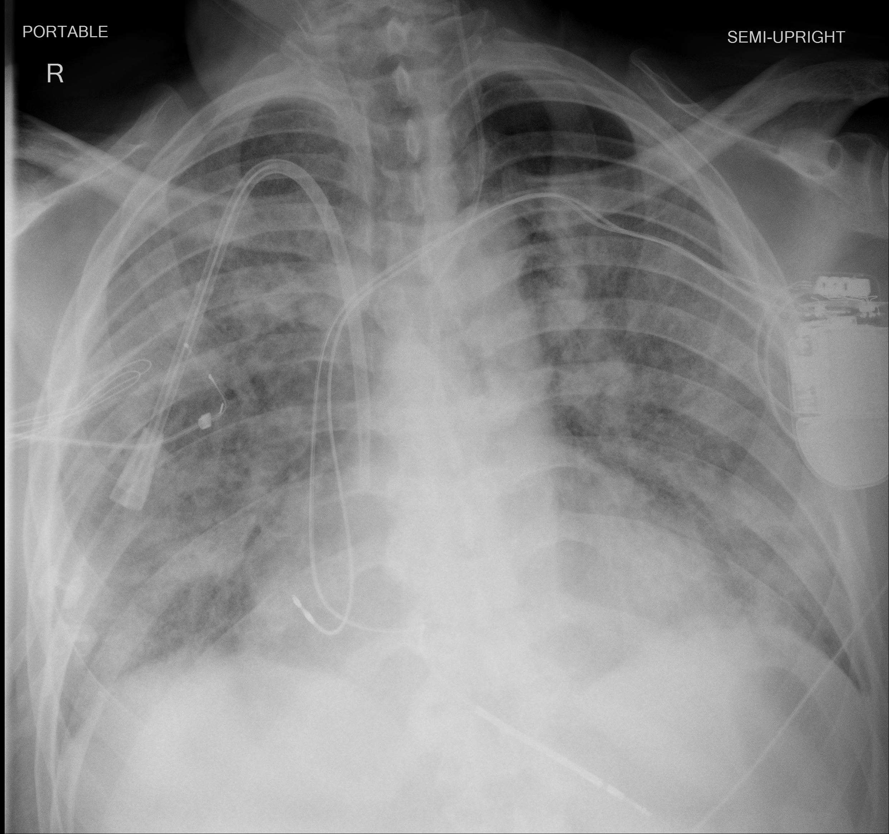

## 문제
60세 남자가 7일 전부터 발열과 기침이 있었고 4일 전 코로나19 확진을 받았다. 어제부터 숨이 차 응급실에 왔고 산소 공급에도 산소포화도가 85 %로 떨어져 기관삽관 후 중환자실에 입원하였다. 고혈압 외 병력은 없다. 체온 38.3°C, 혈압 112/68 mmHg, 맥박 108회/분이다. 호기말양압 10 cmH2O, 흡입산소분율 0.6 에서 동맥혈 산소분압은 84 mmHg 이다. 심장초음파에서 좌심실 구혈률은 60 %이고 판막 이상은 없다. 이동식 흉부 X선 사진은 그림과 같다. 이 환자의 상태로 가장 적절한 것은?

- A. 심인성 폐부종
- B. 급성호흡곤란증후군 기준에 맞지 않는 한쪽 폐렴
- C. 중등도 급성호흡곤란증후군
- D. 중증 급성호흡곤란증후군
- E. 경증 급성호흡곤란증후군

_이동식 앞뒤(AP) 흉부 X선, 반좌위, 원본 그대로 크기 조정만 (The Cancer Imaging Archive, CC BY 4.0 — 크롭·창 조정 없음)_

## 정답 및 해설
> 정답: C

- **정답 핵심**: 흉부 X선에서 양쪽 폐에 미만성 반점상 폐포 음영이 있고(흉수·허탈로 설명되지 않음), 코로나19 폐렴이라는 원인 뒤 1주 안에 호흡부전이 생겼으며, 좌심실 구혈률이 정상이라 심장 원인으로 설명되지 않는다. 호기말양압 10 cmH2O 에서 PaO2/FiO2 = 84/0.6 = 140 으로 100 초과 200 이하이므로 베를린 정의의 중등도 급성호흡곤란증후군이다.
- **원리**: <b>베를린 정의(2012)</b>는 네 가지를 모두 요구한다. ① <b>시간</b> — 알려진 원인(폐렴·흡인·패혈증·외상 등)이나 새로 생긴·악화된 호흡기 증상 뒤 <b>1주 이내</b> ② <b>영상</b> — 흉부 X선이나 CT 에서 흉수·허탈·결절로 설명되지 않는 <b>양측 음영</b> ③ <b>원인</b> — 심부전이나 수액 과다로 완전히 설명되지 않음(위험인자가 없으면 심장초음파 등으로 객관적 확인) ④ <b>산소화</b> — PEEP(또는 CPAP) 5 cmH2O 이상에서 PaO2/FiO2 로 중증도를 매긴다.  <b>경증 200 초과~300 이하, 중등도 100 초과~200 이하, 중증 100 이하.</b> PEEP 조건을 두는 이유는 같은 환자라도 PEEP 가 낮으면 허탈된 폐포가 많아 P/F 가 실제보다 나쁘게 나오기 때문이다.  기전은 폐포-모세혈관 장벽의 손상이다. 단백질이 많은 부종액이 폐포를 채우고 표면활성물질이 줄어 폐포가 허탈되며, 환기되지 않는 폐포로 혈류가 계속 가는 <b>단락</b> 때문에 산소를 올려도 PaO2 가 잘 오르지 않는다. 그래서 흉부 X선이 양측 폐포 음영으로 보이고, 심장 압력은 정상이다(정수압성 부종과 다른 점).  중증도는 치료 선택으로 이어진다 — P/F 150 미만이면 엎드린 자세 환기를, 100 이하에서는 ECMO 를 고려한다. 150 기준과 100 기준을 헷갈리지 않는다.
- **비교**: <table><thead><tr><th style="width:26%">항목</th><th style="width:37%">중등도 ARDS(정답)</th><th>중증 ARDS(가장 가까운 오답)</th></tr></thead><tbody> <tr><td>PaO2/FiO2(PEEP ≥ 5)</td><td><b>100 초과 ~ 200 이하</b></td><td>100 이하</td></tr> <tr><td>이 환자</td><td><b>84 / 0.6 = 140</b></td><td>—</td></tr> <tr><td>흔한 혼동</td><td>150 미만이면 엎드린 자세 환기 적응증</td><td>150 은 중증 경계가 아니다</td></tr> <tr><td>사망률(원 코호트)</td><td>약 32 %</td><td>약 45 %</td></tr> </tbody></table> <b>가장 가까운 오답은 중증</b>이다. 엎드린 자세 환기 기준(P/F &lt; 150)을 중증 기준으로 착각하기 쉽다. 갈림길은 <b>100</b> 이다 — PaO2 가 60 이하였다면 P/F 100 으로 중증이 된다.
- **오답 이유**:
  - ① 심인성 폐부종도 양측 음영과 저산소혈증을 만들지만 좌심실 기능 저하·판막 질환·수액 과다가 있어야 한다. 이 환자는 좌심실 구혈률 60 %에 판막 이상이 없다. 구혈률 25 %에 양측 흉수와 심비대가 있었다면 정답이 된다.
  - ② 한쪽 폐엽에 국한된 경화라면 양측 음영 기준을 채우지 못한다. 이 사진은 양쪽 폐에 걸친 미만성 음영이다. 음영이 오른쪽 아래엽에만 있었다면 정답이 된다.
  - ④ 중증은 PEEP 5 이상에서 PaO2/FiO2 가 100 이하일 때다. 이 환자는 140 이다. 같은 흡입산소분율 0.6 에서 PaO2 가 55 mmHg(P/F 92)였다면 정답이 된다.
  - ⑤ 경증은 PaO2/FiO2 가 200 초과 300 이하일 때다. 이 환자는 140 으로 그보다 나쁘다. 흡입산소분율 0.4 에서 PaO2 가 100 mmHg(P/F 250)였다면 정답이 된다.
- **함정**: 엎드린 자세 환기 기준(P/F < 150)과 중증 ARDS 기준(P/F ≤ 100)을 섞지 않는다. P/F 는 PEEP 5 이상에서 잰다.
- **학습목표**: 급성 호흡부전 환자에서 흉부 X선의 양측 음영, 1주 이내 발생, 심장 원인 배제, PEEP 5 이상에서 PaO2/FiO2 로 베를린 정의의 ARDS 와 그 중증도를 판정한다
- **근거·출처**: ARDS Definition Task Force. Acute respiratory distress syndrome: the Berlin Definition. JAMA 2012;307:2526 · Guérin C et al. Prone positioning in severe acute respiratory distress syndrome (PROSEVA). N Engl J Med 2013;368:2159 · Harrison's Principles of Internal Medicine, 21st ed. — acute respiratory distress syndrome · 작성자 판독(2026-09-28): 양측 미만성 반점상 폐포 음영(폐문 주위·하폐야 우세), 비위관·중심정맥관, 기흉·대량 흉수 없음

## 출처
- COVID-19-AR, The Cancer Imaging Archive (CC BY 4.0) · series …17145927 · Creative Commons Attribution 4.0 International · https://www.cancerimagingarchive.net/data-usage-policies-and-restrictions/
