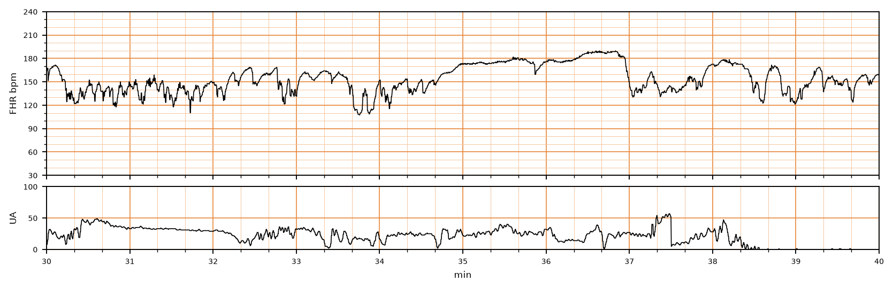

## 문제
26세 초산부가 임신 40주에 8시간 전부터 규칙적인 진통이 있어 분만실에 입원하였다. 임신 경과 중 특이 소견은 없었다. 2시간 전 양막이 저절로 파열되었고 양수는 맑다. 체온 36.9°C, 혈압 116/74 mmHg, 맥박 88회/분이다. 내진에서 자궁경부는 6 cm 열리고 80 % 소실되었다. 옥시토신은 쓰지 않았다. 전자태아감시의 태아심박동과 자궁수축 기록은 그림과 같다. 다음 처치로 가장 적절한 것은?

- A. 산모를 옆으로 눕히고 수액을 주입하며 원인을 찾는다
- B. 태아 두피 혈액의 pH 를 측정한다
- C. 응급 제왕절개를 준비한다
- D. 산모에게 해열제와 광범위 항생제를 투여한다
- E. 현재의 전자태아감시를 유지하며 분만 진행을 지켜본다

_분만 중 태아심박동(위)과 자궁수축(아래) 기록, 기록 시작 후 30~40분 구간; 세로 굵은 선 = 1분 (CTU-UHB Intrapartum Cardiotocography Database, PhysioNet, ODC-BY 1.0 — 원자료 4 Hz 그대로, 평활화 없음)_

## 정답 및 해설
> 정답: E

- **정답 핵심**: 가속·짧은 하강을 뺀 기저 심박수는 약 140~150회/분으로 정상이고, 기저선이 10~20회/분 폭으로 불규칙하게 흔들려 중등도 변이도다. 가속이 여러 번 있고, 35~37분의 180~190회/분 상승은 약 2분 뒤 원래 기저선으로 돌아온 연장 가속(2~10분)이지 기저선 변화(10분 이상)가 아니다. 33.7분의 짧은 하강은 30초 미만으로 한 번뿐이고 후기·가변 감속은 없다. 정상 기저선 + 중등도 변이도 + 반복 감속 없음 = 범주 I 이므로 일상 감시를 이어간다.
- **원리**: NICHD 3단계 분류는 <b>태아 산-염기 상태를 그 시점에서 예측</b>하려는 것이다.  <b>범주 I</b>: 기저선 110~160, <b>중등도 변이도</b>, 후기·가변 감속 없음(조기 감속과 가속은 있어도 되고 없어도 됨). 이때 태아가 대사성 산증일 가능성은 매우 낮아 <b>일상 감시</b>만 한다.  <b>가속</b>은 태아 움직임에 따라 교감신경이 심박수를 올린 것으로, 32주 이후 15회/분 이상·15초 이상이면 가속이다. 가속이 있으면 그 순간 산증이 없다고 본다. 가속이 <b>2분 이상 10분 미만</b> 이어지면 <b>연장 가속</b>이고, 10분 이상이면 기저선이 바뀐 것으로 본다. 연장 가속은 태아가 계속 움직이거나 자극받을 때 생기며 저산소의 표지가 아니다.  <b>범주 II</b>(최소 변이도, 반복 가변 감속, 연장 감속, 가속 없는 빈맥 등)는 원인을 찾고 <b>자궁 내 소생술</b>(산모 체위 변경·수액·자궁수축제 중단·저혈압 교정)을 한다. <b>범주 III</b>(변이도 없음 + 반복 후기·가변 감속·서맥, 또는 사인파형)은 소생술과 함께 신속한 분만을 준비한다.  그래서 이 기록의 180~190 봉우리를 「빈맥」으로 읽으면 범주 II 로 잘못 올라가 불필요한 처치를 하게 된다.
- **비교**: <table><thead><tr><th style="width:26%">항목</th><th style="width:37%">범주 I — 일상 감시(정답)</th><th>범주 II — 자궁 내 소생술(가장 가까운 오답)</th></tr></thead><tbody> <tr><td>기저선</td><td><b>140~150, 정상</b></td><td>빈맥(10분 이상 160 초과)이거나 서맥</td></tr> <tr><td>변이도</td><td><b>중등도(10~20)</b></td><td>최소이거나 현저</td></tr> <tr><td>180~190 상승</td><td><b>약 2분 뒤 기저선 복귀 — 연장 가속</b></td><td>10분 넘게 지속되면 기저선 변화(빈맥)</td></tr> <tr><td>감속</td><td>짧은 하강 1회, 후기·가변 감속 없음</td><td>반복 가변 감속·연장 감속</td></tr> </tbody></table> <b>가장 가까운 오답은 자궁 내 소생술</b>이다. 180 이 넘는 봉우리를 빈맥으로 읽으면 이것을 고르게 된다. 갈림길은 <b>지속 시간</b> — 2~10분 뒤 원래 기저선으로 돌아오면 연장 가속이고, 10분 넘게 머물러야 기저선 변화다.
- **오답 이유**:
  - ① 자궁 내 소생술은 범주 II 기록(반복 가변 감속, 연장 감속, 최소 변이도 등)에서 원인을 교정하는 처치다. 이 기록은 범주 I 이다. 수축마다 가변 감속이 반복되었다면 정답이 된다.
  - ② 태아 두피 혈액 pH 는 범주 II 가 지속되어 산증 여부를 확인해야 할 때 쓰는 검사다(지금은 거의 쓰지 않는다). 가속과 중등도 변이도가 있으면 산증이 아니다. 최소 변이도가 1시간 넘게 이어졌다면 고려한다.
  - ③ 응급 제왕절개는 범주 III(변이도 없음 + 반복 후기 감속·서맥, 사인파형)이 소생술에도 풀리지 않을 때다. 이 기록은 정상이다. 변이도 없이 반복 후기 감속이 이어졌다면 정답이 된다.
  - ④ 해열제와 항생제는 산모 발열과 태아 빈맥이 있는 융모양막염에서 쓴다. 산모 체온은 36.9°C 이고 180 봉우리는 약 2분짜리 가속이다. 산모가 38.5°C 이고 기저선이 10분 넘게 170 에 머물렀다면 정답이 된다.
- **함정**: 180 을 넘는 봉우리를 곧바로 빈맥으로 읽지 않는다 — 몇 분 뒤 기저선으로 돌아오면 연장 가속이다.
- **학습목표**: 분만 중 태아심박동에서 정상 기저선·중등도 변이도·가속이 있고 후기·가변 감속이 없으면 2분 남짓의 연장 가속이 있어도 범주 I 로 판정하고 일상 감시를 이어간다
- **근거·출처**: Macones GA et al. The 2008 NICHD workshop report on electronic fetal monitoring. Obstet Gynecol 2008;112:661 · ACOG Practice Bulletin No. 116: Management of intrapartum fetal heart rate tracings. Obstet Gynecol 2010;116:1232 · CTU-UHB Intrapartum CTG Database (PhysioNet, ODC-BY 1.0) record 2033, minutes 30–40 — 26 y, 40 wk, para 0; teacher-only · 작성자 판독(2026-09-28): 기저 140~150/분, 중등도 변이도, 가속 여러 번, 34.8~37분 약 2분 연장 가속, 33.7분 짧은 하강 1회, 후기·가변 감속 없음

## 출처
- CTU-UHB Intrapartum Cardiotocography Database (PhysioNet, ODC-BY 1.0) · record 2033 · Open Data Commons Attribution License v1.0 · https://opendatacommons.org/licenses/by/1-0/
