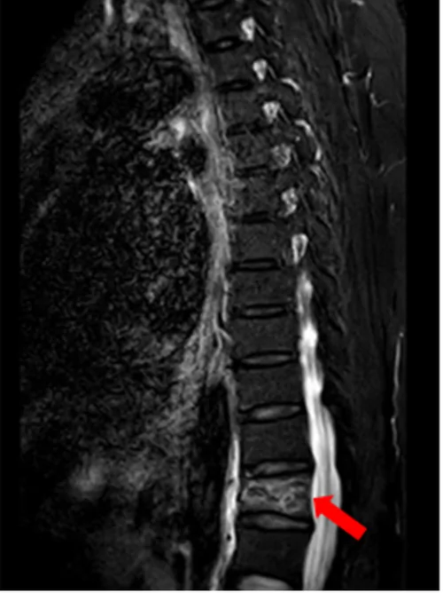

## 문제
A 56-year-old woman comes to the physician because of mid-back pain for 3 days after she slipped at home and fell from standing height onto her buttocks. Menopause occurred at the age of 49 years, and she has never taken hormone therapy. She does not smoke or drink alcohol and takes no medications. Her BMI is 21 kg/m2. Vital signs are within normal limits. There is tenderness over the thoracolumbar junction. Neurologic examination shows no abnormalities. Serum calcium is 9.4 mg/dL, creatinine is 0.8 mg/dL, alkaline phosphatase is normal, 25-hydroxyvitamin D is 34 ng/mL, and serum protein electrophoresis shows no monoclonal protein. A sagittal MRI of the spine is shown. Dual-energy x-ray absorptiometry shows a T-score of −2.1 at the lumbar spine and −1.9 at the femoral neck. In addition to analgesia, which of the following is the most appropriate pharmacotherapy to reduce her risk of future fractures?

- A. No pharmacotherapy until repeat densitometry in 2 years
- B. Oral alendronate
- C. Calcium and vitamin D supplementation alone
- D. Intranasal calcitonin
- E. Estrogen–progestin therapy

_Sagittal STIR MRI of the thoracolumbar spine; a single panel cropped from a published multi-panel figure, panel letters removed, arrow as in the original (PMC Open Access Subset, CC BY; no resizing of proportions or color change)_

## 정답 및 해설
> 정답: B

- **정답 핵심**: The MRI shows loss of height of a vertebral body at the thoracolumbar junction with a band of high STIR signal (bone marrow edema), indicating an acute compression fracture. It occurred after a fall from standing height, so it is a fragility fracture. In a postmenopausal woman, a low-trauma vertebral or hip fracture establishes the clinical diagnosis of osteoporosis regardless of a T-score in the osteopenic range. Secondary causes (hypercalcemia, renal disease, vitamin D deficiency, myeloma) are not suggested by the laboratory results. First-line therapy is an oral bisphosphonate such as alendronate, which reduces the risk of new vertebral fractures by about half.
- **원리**: <b>Osteoporosis is diagnosed in two ways</b>: a DXA T-score of −2.5 or lower, <b>or a fragility fracture</b> of the spine or hip regardless of bone density (and, in many guidelines, a fracture of the wrist, humerus, or pelvis with osteopenia). Densitometry measures only mineral quantity; bone strength also depends on microarchitecture, turnover, and fall mechanics. A vertebra that collapses after a fall from standing height has already demonstrated that the skeleton is weak, and <b>one vertebral fracture raises the risk of the next vertebral fracture about five-fold</b>, highest in the first year.  <b>STIR MRI</b> suppresses fat, so normal marrow is dark and water is bright; a band of high signal within a collapsed vertebra means marrow edema from a <b>recent</b> fracture, whereas an old healed fracture has normal signal. This distinguishes a new fracture from a chronic deformity and helps exclude a tumor (which usually replaces the whole body and the pedicle).  <b>Bisphosphonates</b> bind hydroxyapatite and are taken up by osteoclasts during resorption; nitrogen-containing agents inhibit farnesyl pyrophosphate synthase, disrupting osteoclast function and survival. Turnover falls, bone density rises, and vertebral fracture risk falls by roughly 40–70 %. Before starting, secondary causes and vitamin D deficiency are excluded, and calcium and vitamin D are given as adjuncts, not as the treatment.
- **비교**: <table><thead><tr><th style="width:26%">Feature</th><th style="width:37%">Alendronate (answer)</th><th>Calcium + vitamin D alone (closest rival)</th></tr></thead><tbody> <tr><td>Indication</td><td><b>Osteoporosis — including any fragility vertebral fracture</b></td><td>Adjunct to every regimen; sole therapy only for osteopenia at low risk</td></tr> <tr><td>Vertebral fracture reduction</td><td><b>About 40–70 %</b></td><td>No reliable reduction when given alone</td></tr> <tr><td>Effect of T-score −2.1</td><td>Overridden by the fracture</td><td>Would apply only if there were no fracture and low 10-year risk</td></tr> </tbody></table> <b>The closest rival is calcium and vitamin D alone</b>, chosen by those who read the T-score as “only osteopenia.” The dividing line is <b>the fragility fracture</b>: once the spine has fractured from minimal trauma, she has osteoporosis and needs antiresorptive therapy.
- **오답 이유**:
  - (A) Waiting for repeat densitometry ignores the fracture, which already establishes osteoporosis and signals a high short-term risk of another vertebral fracture. It would be correct only for an asymptomatic woman with mild osteopenia and a low calculated fracture risk.
  - (C) Calcium and vitamin D alone are appropriate for osteopenia without fracture when the 10-year fracture risk is low. Her fragility vertebral fracture defines osteoporosis despite the T-score. It would be correct if she had a T-score of −1.8 and no fracture.
  - (D) Intranasal calcitonin has only weak antifracture efficacy and a possible association with malignancy, so it is not used for long-term osteoporosis treatment. It is sometimes given briefly for pain of an acute vertebral fracture, not for fracture prevention.
  - (E) Estrogen–progestin therapy prevents bone loss but is not first-line for osteoporosis because of the risks of breast cancer and thromboembolism; it is used for younger women with vasomotor symptoms. It would be reasonable for a 50-year-old with hot flashes and osteopenia.
- **함정**: A fragility vertebral fracture diagnoses osteoporosis even when the T-score is above −2.5 — do not let an osteopenic DXA delay treatment.
- **학습목표**: 낮은 외상 뒤 척추 MRI 에서 골수 부종을 동반한 급성 압박골절을 읽고, 폐경 후 여성의 취약 척추골절은 골밀도 T 점수와 관계없이 골다공증으로 진단해 비스포스포네이트로 치료한다
- **근거·출처**: Eastell R et al. Pharmacological management of osteoporosis in postmenopausal women: an Endocrine Society clinical practice guideline. J Clin Endocrinol Metab 2019;104:1595 · Camacho PM et al. AACE/ACE clinical practice guidelines for the diagnosis and treatment of postmenopausal osteoporosis — 2020 update. Endocr Pract 2020;26(Suppl 1):1 · PMC Open Access case report (Front Surg 2026;13:1851167, CC BY), Figure 3 panel E — teacher-only · 작성자 판독(2026-09-28): 흉요추 이행부 척추체 높이 감소와 띠 모양 STIR 고신호(골수 부종) — 급성 압박골절, 척수 압박 없음

## 출처
- Compression fracture of the T12 vertebra combined with diaphragmatic hernia after low-energy trauma: a case report and literature review. Front Surg. 2026 Aug 12;13:1851167. doi: 10.3389/fsurg.2026.1851167 (CC BY) — Figure 3 · CC BY · https://creativecommons.org/licenses/
