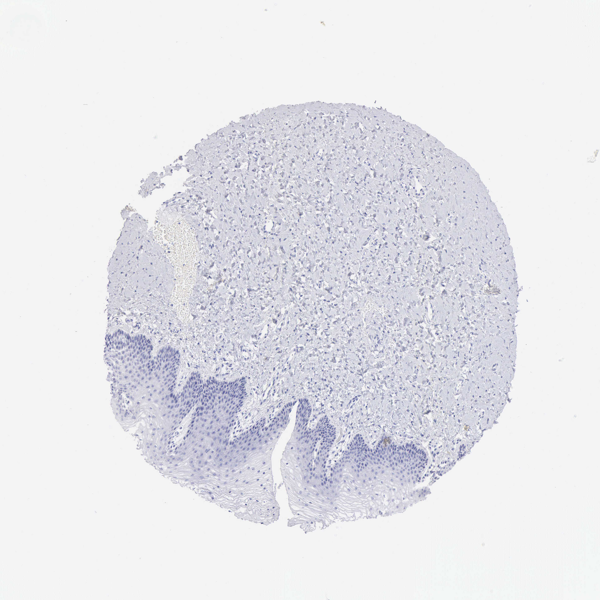

## 문제
68세 여자가 2주 전부터 성교 후 소량의 질 출혈이 있어 왔다. 12년 전 폐경되었고 호르몬 치료는 받지 않았다. 5년 전 자궁경부 세포검사는 정상이었다. 질경 검사에서 질 위쪽 1/3 뒤벽에 1 cm 크기의 경계가 불분명한 붉은 부위가 있고 자궁경부는 육안으로 정상이다. 질 확대경 유도 조직검사의 헤마톡실린-에오신 염색에서 편평상피 핵의 변화가 위축에 의한 반응성 변화인지 고등급 병변인지 판정이 애매하여 p16 면역조직화학염색을 추가하였다. 질 조직 절편의 염색 결과는 그림과 같다. 이 결과의 해석으로 가장 적절한 것은?

- A. 고위험 HPV 연관 고등급 편평상피내병변(VaIN 2–3)이다
- B. 저등급 편평상피내병변(VaIN 1)으로 확진된다
- C. p16 과발현으로 보아 침윤성 편평세포암이다
- D. 에스트로겐 결핍에 의한 비특이 반점상 양성이다
- E. 고위험 HPV 연관 고등급 병변을 지지하지 않는다

_조직 마이크로어레이 코어의 면역조직화학염색(DAB 갈색, 헤마톡실린 대조염색), 원 배율 (Human Protein Atlas, CC BY 4.0 — 크롭·보정 없음)_

## 정답 및 해설
> 정답: E

- **정답 핵심**: 그림에서 편평상피는 기저층부터 표층까지 헤마톡실린의 청색 핵만 보이고 갈색(DAB) 염색이 없다. 간질도 음성이다. 고위험 HPV 연관 고등급 병변은 p16 이 기저층에서 위로 이어지는 연속된 강한 핵·세포질 염색(block 양성)을 보이므로, 음성 결과는 고등급 병변을 지지하지 않고 위축에 의한 반응성 변화 쪽으로 해석한다.
- **원리**: <b>p16INK4a 가 HPV 표지자가 되는 이유</b>는 세포주기 조절의 되먹임 때문이다. 정상 세포에서 p16 은 CDK4/6 을 억제해 Rb 가 인산화되지 않게 하고, Rb 는 E2F 를 붙잡아 S기 진입을 막는다.  <b>고위험 HPV(16·18 등)의 E7</b> 단백은 Rb 에 결합해 분해시킨다. 그러면 E2F 가 풀려 세포가 계속 분열하고, Rb 기능이 사라진 것을 감지한 세포는 p16 을 대량으로 만든다 — 그러나 Rb 가 없으니 p16 은 아무 효과가 없고 쌓이기만 한다. 그래서 <b>형질전환 감염(고등급 병변·암)에서는 p16 이 미만성으로 강하게</b> 염색된다.  <b>판정 기준(LAST 2012)</b>: 기저층에서 시작해 상피 아래 1/3 이상까지 <b>연속된 강한 핵+세포질 염색</b>(block 양성)만 양성이다. 음성이거나 조각조각 약한 염색은 고등급 병변을 지지하지 않는다. 저위험 HPV(6·11)의 E7 은 Rb 결합력이 약해 콘딜로마·저등급 병변은 p16 이 음성이거나 반점상이다.  위축된 상피는 핵/세포질 비가 커 H&E 에서 고등급 병변처럼 보이기 쉽다. 바로 이 감별이 p16 염색의 적응증이다.
- **비교**: <table><thead><tr><th style="width:26%">항목</th><th style="width:37%">고등급 병변을 지지하지 않음(정답)</th><th>고등급 편평상피내병변(가장 가까운 오답)</th></tr></thead><tbody> <tr><td>p16 양상</td><td><b>음성</b> — 청색 핵만</td><td>기저층부터 연속된 강한 핵·세포질 갈색(block)</td></tr> <tr><td>기전</td><td>Rb 정상 → p16 되먹임 과발현 없음</td><td>고위험 HPV E7 이 Rb 분해 → p16 축적</td></tr> <tr><td>H&E 모방</td><td>위축·미성숙 화생·반응성 변화</td><td>핵 이형성이 상피 위쪽까지</td></tr> <tr><td>이 절편</td><td><b>전층·간질 모두 갈색 없음</b></td><td>—</td></tr> </tbody></table> <b>가장 가까운 오답은 고등급 병변</b>이다. 갈림길은 <b>연속된 block 염색이 있느냐</b>다. 반점상 약양성도 음성과 같이 해석한다는 점까지 기억하면 어느 쪽으로 물어도 대응된다.
- **오답 이유**:
  - ① 고등급 편평상피내병변은 p16 이 기저층부터 위로 연속된 강한 block 염색을 보여야 한다. 이 절편은 갈색 염색이 전혀 없다. 기저층부터 상피 절반 이상이 짙은 갈색이었다면 정답이 된다.
  - ② 저등급 병변은 p16 이 음성일 수 있지만 p16 음성만으로 확진하지 않는다 — H&E 의 코일로사이트·상피 아래 1/3 에 국한된 이형성이 필요하다. 코일로사이트가 뚜렷한 H&E 소견이 함께 주어졌다면 가까워진다.
  - ③ 침윤암은 H&E 에서 기저막을 넘는 종양 세포 둥지로 진단하고, 고위험 HPV 연관이면 p16 이 미만성 강양성이다. 이 절편은 p16 음성이고 기저막이 유지된다. 간질 속 종양 둥지가 갈색으로 염색되었다면 정답이 된다.
  - ④ 위축 상피는 대개 p16 음성이고, 드물게 약한 반점상 양성이 나와도 비특이적이다. 그러나 이 절편에는 반점상 갈색 염색조차 없다. 표층 몇몇 세포만 흩어져 갈색이었다면 정답이 된다.
- **함정**: p16 은 '어느 정도 갈색이냐'가 아니라 '기저층부터 연속된 block 이냐'로 판정한다. 음성과 반점상 약양성은 같은 방향으로 해석한다.
- **학습목표**: p16 면역조직화학염색의 미만성 강양성(block) 기준을 알고, 음성 결과를 고위험 HPV 연관 고등급 편평상피내병변을 지지하지 않는 소견으로 해석한다
- **근거·출처**: Darragh TM et al. The Lower Anogenital Squamous Terminology Standardization Project for HPV-associated lesions (LAST). Arch Pathol Lab Med 2012;136:1266 · Kumar V, Abbas AK, Aster JC. Robbins and Cotran Pathologic Basis of Disease, 10th ed. — female genital tract (HPV and p16) · Human Protein Atlas — CDKN2A, vagina (image 1644_B_3_2) — teacher-only · 작성자 판독(2026-09-21·29): 질 중층편평상피 기저층~표층·간질 모두 갈색 없음 = p16 음성

## 출처
- Human Protein Atlas, CDKN2A / Vagina (CC BY 4.0), https://images.proteinatlas.org/93/1644_B_3_2.jpg · Creative Commons Attribution 4.0 International · https://www.proteinatlas.org/about/licence
