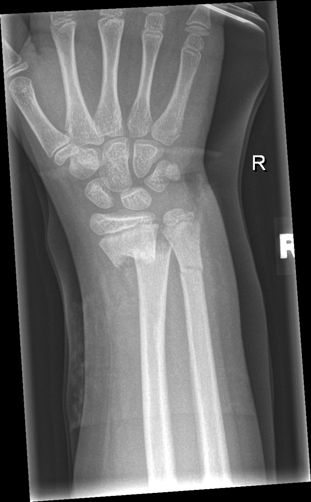

## 문제
A 9-year-old girl is brought to the emergency department 1 hour after she fell onto her outstretched right hand while roller-skating. She has pain and swelling of the right wrist and will not move it. She has no other injuries and has been healthy. Her pulse is 104/min and blood pressure is 108/66 mm Hg. Examination shows swelling, mild deformity, and tenderness over the distal forearm about 3 cm proximal to the wrist crease. The radial pulse and capillary refill are normal, and sensation in the median, ulnar, and radial nerve distributions is intact. An anteroposterior x-ray of the right wrist is shown. Which of the following best describes the injury of the radius?

- A. Complete fracture of the metaphysis
- B. Greenstick fracture of the metaphysis
- C. Buckle (torus) fracture of the metaphysis
- D. Salter-Harris type II physeal fracture
- E. Plastic (bowing) deformation of the shaft

_Anteroposterior radiograph of the right wrist, unaltered apart from scaling (GRAZPEDWRI-DX, figshare, CC BY 4.0)_

## 정답 및 해설
> 정답: A

- **정답 핵심**: The x-ray shows a transverse fracture line across the distal radial metaphysis that passes through both cortices, with a step-off and slight displacement at the ulnar cortex. The radial physis is not involved; the distal ulnar metaphysis also shows a fracture line. A fracture that disrupts both cortices is a complete fracture (AO pediatric classification 23-M/3), not an incomplete buckle or greenstick fracture.
- **원리**: Children's bones are <b>more porous and elastic</b>, with a thick, strong periosteum, and the metaphysis is the weakest region. That is why pediatric forearm fractures form a spectrum from incomplete to complete, and the pattern is read cortex by cortex.  <b>Buckle (torus) fracture</b>: axial compression makes the metaphyseal cortex bulge or kink on the compression side; there is no fracture line through either cortex. It is stable.  <b>Greenstick fracture</b>: a bending force breaks the <b>tension-side cortex</b>, while the compression-side cortex bends but stays intact.  <b>Complete fracture</b>: <b>both cortices are broken</b>; the fragments can translate, angulate, or overlap.  <b>Physeal (Salter-Harris) fracture</b>: the line runs through the growth plate — type II exits through the metaphysis leaving a triangular fragment (Thurston-Holland).  The distinction drives treatment: buckle fractures need only a removable splint for about 3 weeks, whereas complete fractures need a well-molded cast and follow-up x-rays, and reduction if angulation or displacement exceeds age-dependent limits.
- **비교**: <table><thead><tr><th style="width:26%">Feature</th><th style="width:37%">Complete fracture (answer)</th><th>Greenstick fracture (closest rival)</th></tr></thead><tbody> <tr><td>Cortices</td><td><b>Both broken</b></td><td>Tension side broken, compression side bent</td></tr> <tr><td>Displacement</td><td><b>Step-off or translation possible</b></td><td>Angulation without translation</td></tr> <tr><td>AO pediatric code</td><td>M/3</td><td>M/2 (incomplete)</td></tr> <tr><td>This x-ray</td><td><b>Line across the whole metaphysis with ulnar-cortex step-off</b></td><td>—</td></tr> </tbody></table> <b>The closest rival is a greenstick fracture</b>, which also shows a visible fracture line. The dividing line is <b>whether the second cortex is intact</b>. A bulging cortex without any line would point to a buckle fracture instead.
- **오답 이유**:
  - (B) A greenstick fracture breaks only the tension-side cortex while the opposite cortex bends. Here the line crosses both cortices with a step-off. It would be correct if the fracture line stopped midway and the opposite cortex were bowed but continuous.
  - (C) A buckle (torus) fracture is a bulge or kink of the metaphyseal cortex from compression, with no line through either cortex. It would be correct if only a small cortical bump were visible on the side of impact.
  - (D) A Salter-Harris type II fracture passes through the physis and exits through the metaphysis. The radial physis here is intact and the line is proximal to it. It would be correct if the physis were widened with a triangular metaphyseal corner fragment.
  - (E) Plastic deformation is bowing of the shaft without a visible fracture line, typically in the ulna. Here there is a discrete metaphyseal fracture line. It would be correct if the forearm bones were curved with no line.
- **함정**: Read each cortex: a line through both is complete; one broken cortex with the other bent is greenstick; a bulge without a line is buckle.
- **학습목표**: 소아 원위 요골 골간단 골절을 X선에서 팽륜(torus)·생나무·완전 골절·성장판 골절로 구분한다 — 양쪽 피질이 모두 끊기면 완전 골절이다
- **근거·출처**: Slongo T et al. Development and validation of the AO pediatric comprehensive classification of long bone fractures. J Pediatr Orthop 2006;26:43 · Nagy E et al. A pediatric wrist trauma X-ray dataset (GRAZPEDWRI-DX) for machine learning. Sci Data 2022;9:222 — teacher-only · Rockwood and Wilkins' Fractures in Children, 9th ed. — distal radius and ulna fractures · 작성자 판독(2026-09-29): 원위 요골 골간단 완전 골절(양쪽 피질·척측 계단), 원위 척골 골절선, 요골 성장판 침범 없음

## 출처
- GRAZPEDWRI-DX (figshare, CC BY 4.0) · Creative Commons Attribution 4.0 International · https://creativecommons.org/licenses/by/4.0/
