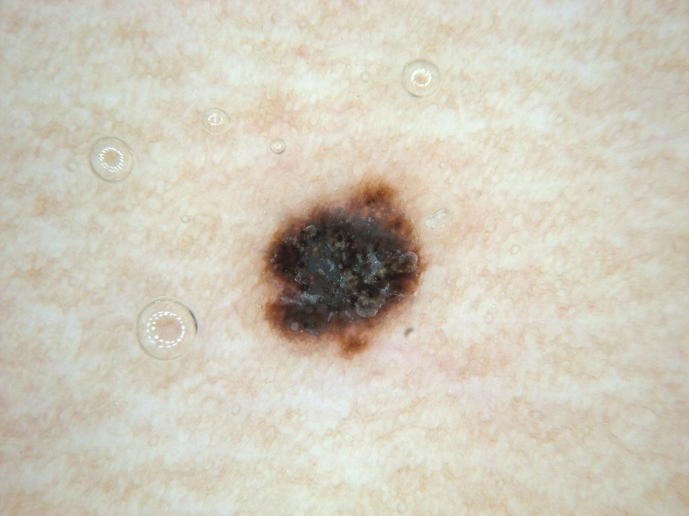

## 문제
25세 여자가 다리의 색소 반점이 최근 6개월 사이 짙어지고 모양이 변한 것 같다고 왔다. 가려움이나 출혈은 없다. 몸의 다른 점은 10개 미만이고 서로 비슷하게 생겼다. 피부암 가족력은 없고 20대 초반에 햇볕 화상을 여러 번 입었다. 병변은 편평하고 만져지는 결절은 없으며 주위 림프절은 만져지지 않는다. 병변의 더모스코피 사진은 그림과 같다. 이 병변을 절제생검해야 하는 근거가 되는 더모스코피 소견으로 가장 적절한 것은?

- A. 규칙적인 그물 모양 색소망
- B. 다발성 우윳빛 낭종과 면포 모양 개구부
- C. 중심부 흰 반흔 모양 구역과 섬세한 가장자리 색소망
- D. 비대칭 색소 분포와 중심부 청회색 구조
- E. 대칭으로 배열된 경계 뚜렷한 갈색 소구체

_더모스코피 사진, 원본 그대로 크기 조정만 (ISIC Archive, CC0 1.0 — 크롭·색보정 없음)_

## 정답 및 해설
> 정답: D

- **정답 핵심**: 사진에서 흑갈색 색소가 한쪽으로 치우쳐 비대칭이고, 가장자리에 불규칙한 돌출과 점이 있으며, 중심부에 청회색·흰색 구조가 있다. 두 축 이상의 비대칭과 청회색 구조(청백색 베일·퇴행 구조)는 흑색종의 경고 소견이고, 최근 변화까지 있으므로 전층 절제생검이 필요하다. 이 증례의 조직 결과는 양성 흑자였다 — 더모스코피로 흑색종을 배제할 수 없어 절제한 전형적인 경우다.
- **원리**: <b>더모스코피는 표피~진피 상부의 색소 위치를 색으로 보여 준다</b>. 멜라닌이 각질층·표피 상부에 있으면 검정, 표피 하부·진피-표피 경계면 갈색, <b>진피에 있으면 틴들 효과로 청회색</b>으로 보인다.  <b>청회색 구조가 경고인 이유</b>: 진피에 멜라닌이 있다는 뜻이다. 흑색종 세포가 진피로 침윤하거나(청백색 베일), 면역 반응으로 종양이 퇴행하며 대식세포가 멜라닌을 삼키면(청회색 후추 모양 점·흰 반흔 구역) 생긴다. 양성 모반에서도 청색 모반처럼 균일한 청색은 있지만, <b>비대칭 병변 안의 국소 청회색·흰색</b>은 흑색종을 시사한다.  <b>비대칭</b>은 세포 증식이 무질서하다는 표지다. 양성 모반은 색과 구조가 대칭으로 한 가지 패턴을 따른다. 흑색종 판정 알고리즘(ABCD 규칙·7점 체크리스트)은 비대칭·불규칙 줄무늬·불규칙 점/소구체·청백색 베일·퇴행 구조에 점수를 준다.  더모스코피 특이도는 완벽하지 않아 이 증례처럼 흑자·이형성 모반도 이 소견을 보인다. 그래서 결론은 '흑색종 진단'이 아니라 <b>'배제할 수 없으니 전체를 떼어 조직으로 확인'</b>이다.
- **비교**: <table><thead><tr><th style="width:26%">항목</th><th style="width:37%">비대칭 + 청회색 구조(정답)</th><th>대칭 갈색 소구체(가장 가까운 오답)</th></tr></thead><tbody> <tr><td>의미</td><td><b>진피 멜라닌·무질서 증식 — 흑색종 경고</b></td><td>양성 소구체 모반(소아·청년)</td></tr> <tr><td>배열</td><td>한쪽으로 치우친 색·구조</td><td>같은 크기·색의 소구체가 고르게</td></tr> <tr><td>처치</td><td><b>절제생검</b></td><td>경과 관찰</td></tr> <tr><td>이 사진</td><td><b>치우친 흑갈색, 불규칙 가장자리 점, 중심 청회색·흰색</b></td><td>—</td></tr> </tbody></table> <b>가장 가까운 오답은 대칭 갈색 소구체</b>다. 이 사진에도 가장자리에 점이 있지만 크기·분포가 불규칙하다. 갈림길은 <b>대칭이냐</b>다.
- **오답 이유**:
  - ① 규칙적인 그물 모양 색소망은 균일한 선과 구멍으로 된 양성 경계 모반의 전형이다. 이 사진에는 규칙적인 그물이 보이지 않는다. 병변 전체가 가늘고 고른 그물로 덮여 있었다면 양성 소견이 된다.
  - ② 우윳빛 낭종과 면포 모양 개구부는 지루각화증의 소견이다. 이 병변은 편평하고 그런 구조가 없다. 중년 이후 몸통의 볼록한 '붙인 듯한' 병변이었다면 정답이 된다.
  - ③ 중심부 흰 반흔 구역과 섬세한 가장자리 색소망은 피부섬유종의 전형이다(옆에서 누르면 들어가는 보조개 징후). 이 사진의 중심은 청회색이 섞여 있다. 단단한 구진이 보조개 징후를 보였다면 정답이 된다.
  - ⑤ 경계가 뚜렷한 갈색 소구체가 대칭으로 고르게 배열되면 소아·청년의 양성 소구체 모반 패턴이다. 이 사진의 점은 크기가 제각각이고 한쪽에 몰려 있다. 같은 크기의 갈색 소구체가 병변 전체에 고르게 있었다면 경과 관찰 소견이 된다.
- **함정**: 더모스코피 경고 소견은 흑색종 '진단'이 아니라 '배제 불가 → 절제생검'의 근거다. 조직이 양성(흑자)으로 나와도 절제 판단은 옳았다.
- **학습목표**: 색소 병변의 더모스코피에서 비대칭 색소 분포와 청회색 구조를 흑색종 경고 소견으로 읽고 절제생검의 근거로 삼는다
- **근거·출처**: Argenziano G et al. Dermoscopy of pigmented skin lesions: results of a consensus meeting via the Internet. J Am Acad Dermatol 2003;48:679 · Bolognia JL, Schaffer JV, Cerroni L. Dermatology, 4th ed. — dermoscopy; melanoma · ISIC Archive ISIC_0009986 — histopathology: lentigo NOS (teacher-only) · 작성자 판독(2026-09-29): 비대칭 흑갈색 반, 불규칙 가장자리 돌출·점, 중심 청회색·흰색 구조

## 출처
- ISIC Archive ISIC_0009986 (CC-0) · CC0 1.0 Universal · https://creativecommons.org/publicdomain/zero/1.0/
