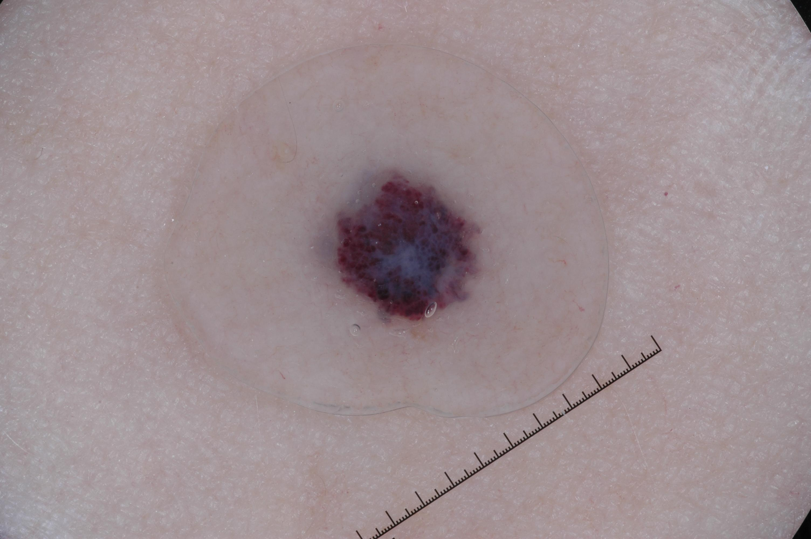

## 문제
A 50-year-old woman comes to the physician because of a spot on her thigh that she first noticed 1 year ago. It has not changed in size, but it bled once after she scratched it. She has no personal or family history of skin cancer. She takes no medications. Her pulse is 72/min and blood pressure is 124/78 mm Hg. Examination shows a small, soft, dark red-purple papule that partially blanches with pressure. There is no regional lymphadenopathy. A dermoscopic image of the lesion is shown. Which of the following is the most likely diagnosis?

- A. Dermatofibroma
- B. Seborrheic keratosis
- C. Cherry angioma
- D. Nodular melanoma
- E. Pyogenic granuloma

_Dermoscopic photograph, unaltered apart from scaling (ISIC Archive, CC0 1.0; no cropping or color adjustment)_

## 정답 및 해설
> 정답: C

- **정답 핵심**: Dermoscopy shows multiple sharply demarcated, round to oval red to red-purple compartments (lacunae or lagoons) clustered together, with a central bluish-white area and no pigment network. Red lacunae represent dilated vascular spaces in the upper dermis and are the diagnostic feature of a cherry angioma (capillary hemangioma of adults). The history of a stable, soft, partly blanching red-purple papule fits; the ISIC record is histopathologically confirmed hemangioma.
- **원리**: <b>Dermoscopy colors map to structures</b>: melanin gives black, brown, or blue-gray; <b>blood gives red, purple, or blue-black</b>.  A <b>hemangioma</b> (cherry angioma in adults) is a benign proliferation of dilated capillaries in the papillary dermis. Each dilated vascular space, walled off by fibrous septa, appears as a <b>sharply demarcated round or oval red to purple "lacuna"</b>. The septa make the lacunae look separated, and thrombosed spaces turn dark purple to black. A <b>whitish or bluish-white veil</b> can appear from fibrosis or overlying hyperkeratosis.  <b>Why this is not melanoma</b>: a blue-white veil in melanoma sits over a melanocytic lesion with pigment network, streaks, or irregular dots and globules of brown/black pigment. Here the colored compartments are red-purple lacunae and there is no pigment network — the lesion is vascular, not melanocytic. Partial blanching confirms blood-filled spaces.  <b>Pyogenic granuloma</b>, also vascular, grows rapidly over weeks, is friable, and on dermoscopy shows a homogeneous red area with a white collarette and white "rail" lines rather than lacunae.
- **비교**: <table><thead><tr><th style="width:26%">Feature</th><th style="width:37%">Cherry angioma (answer)</th><th>Nodular melanoma (closest rival)</th></tr></thead><tbody> <tr><td>Key structure</td><td><b>Red to purple lacunae</b></td><td>Blue-black, irregular vessels, blue-white veil</td></tr> <tr><td>Nature</td><td>Vascular — partly blanches</td><td>Melanocytic — does not blanch</td></tr> <tr><td>Course</td><td><b>Stable for 1 year</b></td><td>Rapid growth over months</td></tr> <tr><td>This lesion</td><td><b>Clustered red-purple lacunae, central bluish-white area</b></td><td>—</td></tr> </tbody></table> <b>The closest rival is nodular melanoma</b> because of the dark color and bluish-white area. The dividing line is <b>lacunae (blood) versus pigment structures (melanin)</b>, together with stability over a year.
- **오답 이유**:
  - (A) Dermatofibroma is a firm papule with a central white scar-like patch and a fine peripheral pigment network, and it dimples when pinched. It would be correct for a firm brown papule on the leg with a positive dimple sign.
  - (B) Seborrheic keratosis is a stuck-on, warty, brown lesion with milia-like cysts and comedo-like openings. It would be correct for a waxy brown plaque on the trunk of an older adult.
  - (D) Nodular melanoma can be red, blue, or black and may show a blue-white veil, but it grows rapidly and shows irregular polymorphous vessels and melanin structures, not sharply defined lacunae. It would be correct for a firm, enlarging, non-blanching blue-black nodule appearing over months.
  - (E) Pyogenic granuloma is a vascular lesion that grows rapidly over weeks, bleeds easily, and shows a homogeneous red area with a white collarette on dermoscopy. It would be correct for a friable red papule on a finger that appeared 3 weeks ago.
- **함정**: A bluish-white area does not make a lesion melanocytic — red to purple lacunae without a pigment network mean a vascular lesion.
- **학습목표**: 더모스코피에서 경계가 뚜렷한 적색~적자색 소엽(열공)을 혈관 증식 병변(혈관종)의 소견으로 읽고, 청백색 구역이 있어도 흑색종과 구분한다
- **근거·출처**: Zaballos P et al. Dermoscopy of solitary angiokeratomas and hemangiomas. Arch Dermatol 2007 (vascular lacunae) · Bolognia JL, Schaffer JV, Cerroni L. Dermatology, 4th ed. — vascular neoplasms; dermoscopy · ISIC Archive ISIC_0001129 — histopathology: hemangioma (teacher-only) · 작성자 판독(2026-09-29): 적색~적자색 소엽(열공) 집합, 중심 청백색 구역, 색소망 없음

## 출처
- ISIC Archive ISIC_0001129 (CC-0) · CC0 1.0 Universal · https://creativecommons.org/publicdomain/zero/1.0/
