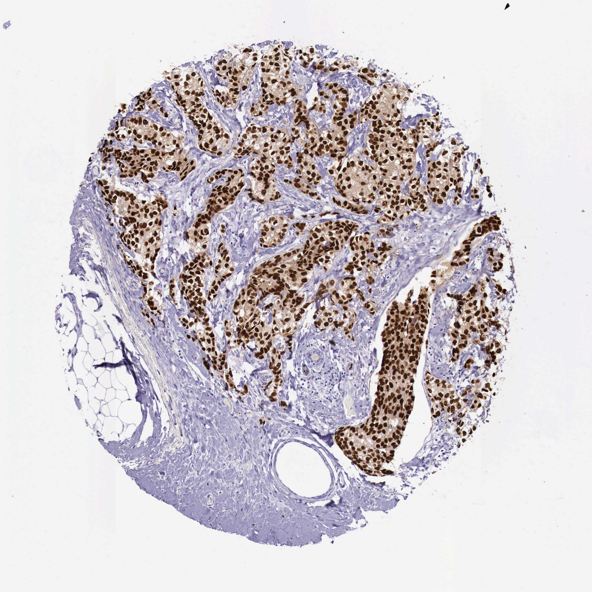

## 문제
68세 여자가 건강검진 유방촬영술에서 왼쪽 유방의 2 cm 종괴가 발견되어 왔다. 16년 전 폐경되었고 골다공증이나 정맥혈전증 병력은 없다. 유방보존수술과 감시림프절 생검을 하였고 병리 결과는 침윤성 관암종, 림프절 전이 없음이었다. 종양 조직의 HER2 면역조직화학염색은 1+였다. 종양 조직 절편의 에스트로겐 수용체 면역조직화학염색 결과는 그림과 같다. 방사선치료 뒤 보조 전신치료로 가장 적절한 것은?

- A. 타목시펜과 고세렐린 병용
- B. 독소루비신과 시클로포스파미드
- C. 추가 전신치료 없이 경과 관찰
- D. 아나스트로졸
- E. 트라스투주맙

_조직 마이크로어레이 코어의 면역조직화학염색(DAB 갈색, 헤마톡실린 대조염색), 원 배율 (Human Protein Atlas, CC BY 4.0 — 크롭·보정 없음)_

## 정답 및 해설
> 정답: D

- **정답 핵심**: 그림에서 종양 세포 둥지 거의 모든 세포의 핵이 진한 갈색으로 염색되고 간질·지방은 음성이다 — 에스트로겐 수용체 강양성이다. HER2 1+ 는 음성이다. 폐경 후 호르몬 수용체 양성·HER2 음성 조기 유방암의 보조 내분비치료는 아로마타제 억제제(아나스트로졸 등) 5년이 표준이다.
- **원리**: <b>ER 양성이 치료를 정하는 이유</b>: 에스트로겐 수용체는 핵 안의 전사인자다. 에스트로겐이 붙으면 증식 유전자를 켜므로, ER 이 있는 종양은 에스트로겐을 끊거나 수용체를 막으면 자라지 못한다. 그래서 판독은 <b>핵 염색</b>을 보고, 1 % 이상 핵이 염색되면 양성이다(ASCO/CAP).  <b>폐경 후에는 에스트로겐 공급원이 다르다</b>: 난소 기능이 멈춘 뒤 에스트로겐은 지방·근육의 <b>아로마타제</b>가 부신 안드로겐을 바꿔 만든다. 아로마타제 억제제는 이 경로를 막아 혈중 에스트로겐을 거의 없앤다. 폐경 전에는 난소가 대량으로 만들기 때문에 아로마타제 억제제만으로는 부족하고, 난소 억제를 함께 하거나 타목시펜을 쓴다.  <b>타목시펜</b>은 수용체를 막는 선택적 조절제로 폐경 전후 모두 쓸 수 있지만, 폐경 후에는 아로마타제 억제제가 재발을 더 줄여 먼저 고른다. 아로마타제 억제제의 대가는 골소실과 관절통이라 골밀도를 추적한다.
- **비교**: <table><thead><tr><th style="width:26%">항목</th><th style="width:37%">아로마타제 억제제(정답)</th><th>타목시펜 ± 난소 억제(가장 가까운 오답)</th></tr></thead><tbody> <tr><td>표적</td><td>말초 아로마타제 — 에스트로겐 생성 차단</td><td>에스트로겐 수용체 차단(난소 억제는 생성 차단)</td></tr> <tr><td>적합한 환자</td><td><b>폐경 후</b> ER 양성</td><td>폐경 전 ER 양성(난소 억제 병용은 고위험 폐경 전)</td></tr> <tr><td>주요 부작용</td><td>골소실·관절통</td><td>정맥혈전증·자궁내막암</td></tr> <tr><td>이 환자</td><td><b>폐경 16년 — 난소 억제가 필요 없다</b></td><td>—</td></tr> </tbody></table> <b>가장 가까운 오답은 타목시펜 계열</b>이다. 갈림길은 <b>폐경 여부</b>다 — 폐경 전이면 타목시펜(± 난소 억제), 폐경 후면 아로마타제 억제제가 기본이다.
- **오답 이유**:
  - ① 고세렐린으로 난소를 억제하는 것은 폐경 전 고위험 환자에게 쓰는 전략이다. 16년 전 폐경된 환자는 난소가 이미 멈춰 의미가 없고, 40세 폐경 전 환자라면 고려한다.
  - ② 안트라사이클린 항암화학요법은 림프절 전이가 많거나 호르몬 수용체 음성·고위험 종양에 쓴다. 림프절 음성·ER 강양성 2 cm 종양에서 먼저 고르지 않으며, 삼중음성이었다면 적절해진다.
  - ③ ER 양성 침윤암은 림프절 음성이라도 내분비치료가 재발을 의미 있게 줄인다. 치료 없이 관찰하는 것은 기대여명이 매우 짧은 경우에나 고려한다.
  - ⑤ 트라스투주맙은 HER2 3+ 또는 ISH 증폭 종양에만 효과가 있다. 이 종양은 HER2 1+(음성)이라 대상이 아니며, HER2 3+ 였다면 정답이 된다.
- **함정**: ER 강양성·HER2 음성까지 읽었다면 남은 갈림길은 폐경 여부다 — 폐경 후는 아로마타제 억제제.
- **학습목표**: 에스트로겐 수용체 면역조직화학의 핵 양성을 읽고, 폐경 후 호르몬 수용체 양성 유방암의 보조 내분비치료로 아로마타제 억제제를 고른다
- **근거·출처**: Burstein HJ et al. Adjuvant Endocrine Therapy for Women With Hormone Receptor-Positive Breast Cancer: ASCO Guideline Update. J Clin Oncol 2019;37:423 · Allison KH et al. Estrogen and Progesterone Receptor Testing in Breast Cancer: ASCO/CAP Guideline Update. J Clin Oncol 2020;38:1346 · Human Protein Atlas — ESR1, breast cancer (duct carcinoma), 68세 여 (teacher-only) · 작성자 판독(2026-09-30): 종양 세포 둥지 거의 전부 핵 강양성, 간질·지방 음성

## 출처
- Human Protein Atlas, ESR1 / Breast cancer (CC BY 4.0), https://images.proteinatlas.org/37/414_A_4_3.jpg · Creative Commons Attribution 4.0 International · https://www.proteinatlas.org/about/licence
