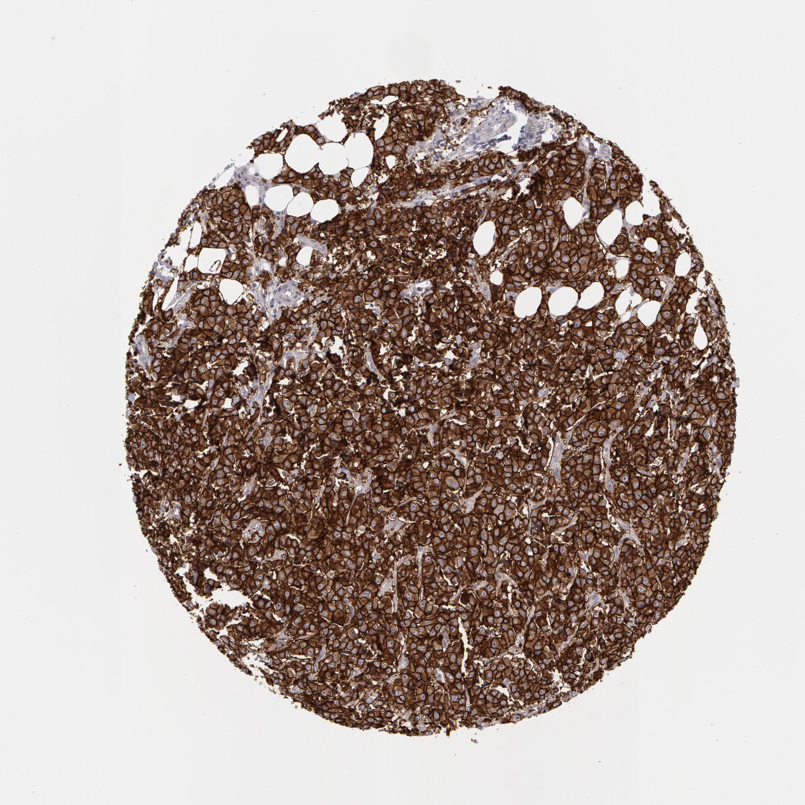

## 문제
A 58-year-old woman comes to the physician for follow-up after a core-needle biopsy of a 3-cm mass in her right breast. She has hypertension treated with amlodipine. She has no history of heart failure. Her pulse is 76/min and blood pressure is 132/80 mm Hg. Examination shows a firm right breast mass and a palpable, mobile right axillary lymph node. Biopsy shows invasive ductal carcinoma. Estrogen and progesterone receptor stains are negative. A photomicrograph of the tumor stained by immunohistochemistry for a cell-surface receptor is shown. Neoadjuvant chemotherapy combined with a monoclonal antibody against this receptor is planned. Which of the following is the most appropriate test before starting the antibody?

- A. Pure-tone audiometry
- B. Slit-lamp eye examination
- C. Serum TSH measurement
- D. Transthoracic echocardiography
- E. Pulmonary function testing

_Tissue microarray core, immunohistochemical stain (DAB brown, hematoxylin counterstain), original magnification (Human Protein Atlas, CC BY 4.0; no cropping or color adjustment)_

## 정답 및 해설
> 정답: D

- **정답 핵심**: The tumor cells show complete, circumferential, intense membrane staining in almost all cells — HER2 immunohistochemistry 3+, which is HER2-positive. The planned antibody is trastuzumab (usually with pertuzumab), whose main toxicity is a decrease in left ventricular ejection fraction. Baseline echocardiography (or MUGA) is required before treatment and is repeated about every 3 months.
- **원리**: <b>Why the stain pattern matters</b>: HER2 (ERBB2) is a transmembrane tyrosine kinase receptor. Gene amplification puts millions of receptors on the cell surface, so the stain outlines each cell like chicken wire. Scoring (ASCO/CAP) uses <b>membrane</b> staining: 3+ = complete, intense membrane staining in more than 10% of tumor cells (positive); 2+ = equivocal and needs ISH; 0/1+ = negative.  <b>Why trastuzumab harms the heart</b>: cardiomyocytes use HER2 (ERBB2/ERBB4 signaling with neuregulin) as a survival pathway under stress. Blocking it impairs repair, so contractility falls. Unlike anthracycline damage, which is dose-dependent and causes myocyte death, trastuzumab cardiotoxicity is usually <b>not dose-related and largely reversible</b> after stopping the drug.  Therefore <b>baseline LVEF</b> is measured before the first dose and monitored during treatment; a significant drop leads to holding the drug. Risk is higher with prior or concurrent anthracyclines, older age, and hypertension.
- **비교**: <table><thead><tr><th style="width:26%">Feature</th><th style="width:37%">Trastuzumab (this case)</th><th>Anthracycline (doxorubicin)</th></tr></thead><tbody> <tr><td>Mechanism of cardiac injury</td><td>Blocks HER2 survival signaling in myocytes</td><td>Free radicals, topoisomerase IIβ — myocyte death</td></tr> <tr><td>Dose relation</td><td><b>Not dose-dependent</b></td><td>Cumulative dose-dependent</td></tr> <tr><td>Reversibility</td><td><b>Usually reversible</b></td><td>Largely irreversible</td></tr> <tr><td>Monitoring</td><td><b>Echo/MUGA at baseline and about every 3 months</b></td><td>Echo at baseline and after cumulative doses</td></tr> </tbody></table> Both call for echocardiography; the drug that matches this stain is trastuzumab. Other options monitor toxicities of different drugs (bleomycin, cisplatin, tamoxifen, checkpoint inhibitors).
- **오답 이유**:
  - (A) Audiometry is monitored with cisplatin, which causes dose-related sensorineural hearing loss. It would be correct for a platinum-based regimen, not an anti-HER2 antibody.
  - (B) Ophthalmologic examination is appropriate for tamoxifen (cataract, retinopathy) or hydroxychloroquine. Tamoxifen would be relevant only if the tumor were hormone receptor-positive, and it is not.
  - (C) TSH monitoring is needed with immune checkpoint inhibitors or tyrosine kinase inhibitors such as sunitinib, which cause thyroiditis. It would be correct if pembrolizumab were planned.
  - (E) Pulmonary function testing (DLCO) is required before bleomycin, which causes pulmonary fibrosis. It would be correct if the regimen contained bleomycin, as in Hodgkin lymphoma or testicular cancer.
- **함정**: Read the stain as HER2 3+ (membrane, chicken-wire), identify trastuzumab, and remember its toxicity is cardiac and usually reversible.
- **학습목표**: HER2 면역조직화학 3+(완전하고 강한 세포막 염색)를 읽고, 트라스투주맙 치료 전 심기능 평가가 필요함을 안다
- **근거·출처**: Wolff AC et al. Human Epidermal Growth Factor Receptor 2 Testing in Breast Cancer: ASCO/CAP Guideline Update. J Clin Oncol 2023;41:3867 · Harrison's Principles of Internal Medicine, 21st ed. — breast cancer; cardiotoxicity of cancer therapy · Human Protein Atlas — ERBB2, breast cancer (duct carcinoma), 58세 여 (teacher-only) · 작성자 판독(2026-09-30): 종양 세포 거의 전부 완전한 고리 모양의 강한 세포막 염색 — IHC 3+

## 출처
- Human Protein Atlas, ERBB2 / Breast cancer (CC BY 4.0), https://images.proteinatlas.org/1383/4496_A_5_5.jpg · Creative Commons Attribution 4.0 International · https://www.proteinatlas.org/about/licence
