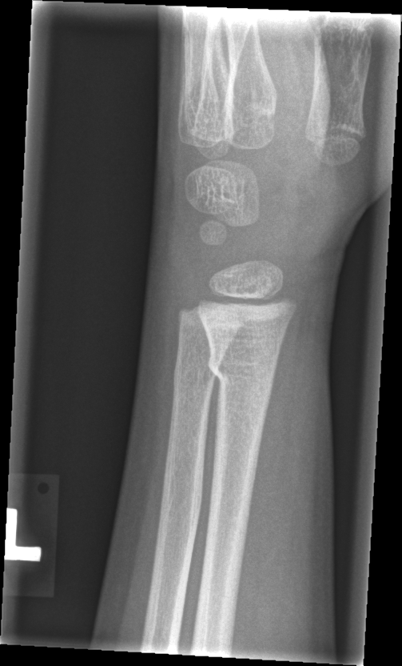

## 문제
5세 남아가 2시간 전 놀이터에서 뛰다가 넘어지며 왼손을 짚은 뒤 손목 통증이 있어 왔다. 다른 부위 손상은 없고 과거력은 특이하지 않다. 왼쪽 손목 약간 몸쪽 요골 쪽에 경미한 부종과 압통이 있고 눈에 보이는 변형은 없다. 요골동맥 맥박과 모세혈관 재충전은 정상이고 손가락 감각과 운동도 정상이다. 왼쪽 손목 측면 단순 X선은 그림과 같다. 치료로 가장 적절한 것은?

- A. 제거 가능한 손목 부목 3주
- B. 진정 하 도수 정복 후 장상지 석고 6주
- C. 경피적 K-강선 고정
- D. 관혈적 정복 및 금속판 내고정
- E. 고정 없이 1주 뒤 X선 재촬영

_왼쪽 손목 측면 단순 X선, 원본 그대로 크기 조정만 (GRAZPEDWRI-DX, figshare, CC BY 4.0)_

## 정답 및 해설
> 정답: A

- **정답 핵심**: X선에서 원위 요골 골간단의 한쪽 피질이 각지게 꺾여 있으나 골절선이 반대쪽 피질까지 이어지지 않고 전위·각형성이 없으며 성장판도 침범하지 않았다 — 융기(torus) 골절이다. 안정 골절이라 정복이 필요 없고, 제거 가능한 손목 부목으로 약 3주 보호하면 석고와 같은 결과를 내며 추적 X선도 대개 필요 없다.
- **원리**: <b>융기 골절이 안정한 이유</b>: 소아의 골간단은 피질이 얇고 다공성이며 골막이 두껍다. 손을 짚어 축 방향으로 힘이 실리면 피질이 부러지기보다 <b>눌려 불룩해지거나 꺾인다</b>. 골절선이 뼈를 가로지르지 않고 반대쪽 피질과 골막이 온전하므로 뼈 조각이 움직일 수 없다.  <b>그래서 치료는 통증 조절이 목적이다</b>: 전위할 위험이 거의 없어 정복이 필요 없고, 무거운 석고 대신 제거 가능한 부목이 통증 조절·기능 회복에서 같거나 낫다는 무작위 연구(FORCE 연구, 2022)가 있다. 약 3주 뒤 부목을 떼고, 합병증이 없으면 추적 X선이나 정형외과 재방문도 생략할 수 있다.  <b>생나무·완전 골절은 다르다</b> — 긴장 쪽 피질이 끊어진 생나무 골절은 각형성이 진행할 수 있어 잘 틀을 잡은 석고와 추적 X선이 필요하고, 나이별 허용 한계를 넘는 각형성은 정복한다. 성장판을 지나는 Salter-Harris 골절도 성장 장애 위험 때문에 추적한다.
- **비교**: <table><thead><tr><th style="width:26%">항목</th><th style="width:37%">융기 골절 — 부목(정답)</th><th>전위 골절 — 정복 후 석고(가장 가까운 오답)</th></tr></thead><tbody> <tr><td>피질</td><td><b>한쪽이 꺾이거나 불룩, 반대쪽 연속</b></td><td>양쪽 또는 긴장 쪽 피질 단절</td></tr> <tr><td>전위·각형성</td><td><b>없음</b></td><td>있음(나이별 허용 한계 초과)</td></tr> <tr><td>고정</td><td>제거 가능한 부목 약 3주</td><td>진정 하 정복 → 장상지 석고 4~6주</td></tr> <tr><td>추적 X선</td><td>대개 불필요</td><td>1~2주 안에 재전위 확인</td></tr> </tbody></table> <b>가장 가까운 오답은 정복 후 석고</b>다. 갈림길은 <b>반대쪽 피질이 온전하고 전위가 없느냐</b>다 — 그렇다면 정복할 것이 없다.
- **오답 이유**:
  - ② 도수 정복과 장상지 석고는 전위되거나 나이별 허용 한계를 넘어 각형성된 골간단 골절에 쓴다. 이 X선은 전위가 없는 융기 골절이라 정복할 것이 없으며, 30° 각형성된 완전 골절이라면 정답이 된다.
  - ③ 경피적 K-강선 고정은 정복 뒤에도 불안정한 전위 골절이나 재전위된 골절에 쓴다. 안정한 융기 골절에는 수술적 고정이 필요 없고, 정복 후 재전위가 반복될 때나 고려한다.
  - ④ 관혈적 정복과 금속판 고정은 개방 골절, 정복이 안 되는 골절, 관절면 침범 골절에 쓴다. 5세의 비전위 융기 골절에는 과잉 치료이며 성장판 손상 위험만 더한다.
  - ⑤ 융기 골절도 골절이라 통증 조절을 위해 짧은 고정이 필요하다. 고정 없이 두면 아이가 아파 손을 쓰지 못하고, 골절이 없는 단순 염좌라면 이 선택이 더 가깝다.
- **함정**: X선에서 골절을 찾는 것에서 멈추지 말고, 반대쪽 피질과 전위를 확인해 안정한 융기 골절이면 부목으로 끝낸다.
- **학습목표**: 소아 원위 요골의 융기(torus) 골절을 X선에서 알아보고, 안정 골절이므로 제거 가능한 손목 부목과 짧은 고정으로 치료한다
- **근거·출처**: Perry DC et al. Immobilisation of torus fractures of the wrist in children (FORCE): a randomised controlled equivalence trial in the UK. Lancet 2022;400:39 · Rockwood and Wilkins' Fractures in Children, 9th ed. — fractures of the distal radius and ulna · GRAZPEDWRI-DX — 소아영상의학 전문의 주석 AO 23-M/2.1 (teacher-only) · 작성자 판독(2026-09-30): 원위 요골 골간단 한쪽 피질이 각지게 꺾임, 반대쪽 피질 연속·전위 없음, 성장판 침범 없음

## 출처
- GRAZPEDWRI-DX (figshare, CC BY 4.0) · Creative Commons Attribution 4.0 International · https://creativecommons.org/licenses/by/4.0/
