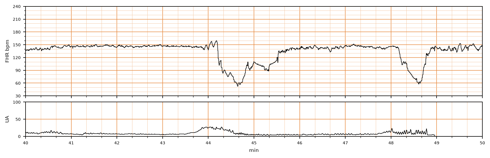

## 문제
A 29-year-old woman, gravida 2, para 1, at 39 weeks' gestation is admitted to the labor and delivery unit in active labor. Her pregnancy has been uncomplicated. Membranes ruptured spontaneously 3 hours ago, and the amniotic fluid is clear. Her temperature is 37.0°C (98.6°F), pulse is 88/min, and blood pressure is 118/72 mm Hg. The cervix is 6 cm dilated and 90% effaced, and the fetal head is at 0 station. She has not received epidural analgesia or oxytocin. A 10-minute segment of the continuous external fetal heart rate and uterine activity tracing is shown. Which of the following is the most likely cause of the fetal heart rate decreases?

- A. Umbilical cord compression
- B. Uteroplacental insufficiency
- C. Fetal head compression
- D. Maternal hypotension
- E. Fetal anemia

_Intrapartum fetal heart rate (top) and uterine activity (bottom), minutes 40 to 50 of the recording; bold vertical lines = 1 min (CTU-UHB Intrapartum Cardiotocography Database, PhysioNet, ODC-BY 1.0; 4 Hz raw data, no smoothing)_

## 정답 및 해설
> 정답: A

- **정답 핵심**: The baseline is about 145/min with moderate variability. Twice in 10 minutes the heart rate falls abruptly — from about 150 to a nadir of 55 to 60/min within 30 seconds — and recovers quickly, with brief accelerations (shoulders) before the falls. An abrupt decrease of at least 15/min lasting 15 seconds to 2 minutes is a variable deceleration, caused by umbilical cord compression, which is more likely after rupture of membranes.
- **원리**: <b>Why cord compression produces abrupt drops</b>: the umbilical vein has a thin wall and is compressed first, reducing venous return; the fetus responds with a brief acceleration (the <b>shoulder</b>). With more compression, the thick-walled arteries occlude, fetal systemic resistance rises suddenly, and <b>baroreceptors trigger a vagal reflex</b> that slows the heart within seconds. When compression is released the rate returns just as fast. The reflex is neural, so the shape is <b>abrupt (onset to nadir &lt; 30 s)</b> and its timing varies with contractions.  <b>Late decelerations are different</b>: during a contraction, blood flow to the intervillous space stops. If placental reserve is poor, fetal oxygen tension falls, <b>chemoreceptors</b> sense hypoxemia, and the rate decreases gradually, reaching its nadir after the contraction peak. <b>Early decelerations</b> mirror contractions and come from head compression (vagal response to raised intracranial pressure), gradual and benign.  Variable decelerations with moderate variability are usually tolerated; recurrent ones are managed by maternal repositioning and, if persistent, amnioinfusion.
- **비교**: <table><thead><tr><th style="width:26%">Feature</th><th style="width:37%">Variable deceleration (answer)</th><th>Late deceleration (closest rival)</th></tr></thead><tbody> <tr><td>Onset to nadir</td><td><b>Abrupt, &lt; 30 s</b></td><td>Gradual, ≥ 30 s</td></tr> <tr><td>Timing</td><td>Varies; may coincide with contractions</td><td>Nadir after the contraction peak</td></tr> <tr><td>Mechanism</td><td>Cord compression → baroreceptor vagal reflex</td><td>Uteroplacental insufficiency → chemoreceptor response to hypoxemia</td></tr> <tr><td>This tracing</td><td><b>150 → 55–60/min within seconds, shoulders</b></td><td>—</td></tr> </tbody></table> <b>The closest rival is uteroplacental insufficiency.</b> The dividing line is the <b>speed of the fall</b>: abrupt and V-shaped means cord; smooth and delayed means placenta.
- **오답 이유**:
  - (B) Uteroplacental insufficiency causes late decelerations — a gradual, symmetric fall whose nadir follows the contraction peak. It would be correct if the rate declined slowly over more than 30 seconds after each contraction.
  - (C) Head compression causes early decelerations, which are gradual, shallow, and mirror the contraction. It would be correct for shallow decreases of 10 to 20/min whose nadir coincides with each contraction peak.
  - (D) Maternal hypotension (for example after epidural analgesia) reduces placental perfusion and causes late or prolonged decelerations. She has a normal blood pressure and no epidural; it would fit a fall to 80/min lasting several minutes after an epidural bolus.
  - (E) Fetal anemia (for example alloimmunization or fetomaternal hemorrhage) produces a sinusoidal pattern, not episodic decelerations. It would be correct for a smooth, regular 3–5 cycles/min undulation without variability.
- **함정**: Judge the shape before the timing — an abrupt V-shaped drop with shoulders is a variable deceleration even when it falls during a contraction.
- **학습목표**: 태아심박동 기록에서 급격히 떨어지는 변동성 감속을 알아보고 그 기전을 탯줄 압박으로 설명한다
- **근거·출처**: Macones GA et al. The 2008 NICHD Workshop Report on Electronic Fetal Monitoring. Obstet Gynecol 2008;112:661 · ACOG Practice Bulletin No. 106: Intrapartum fetal heart rate monitoring. Obstet Gynecol 2009;114:192 · CTU-UHB record 1437 — 제대동맥 pH 7.17, Apgar 9/10 (teacher-only) · 작성자 판독(2026-09-30): 기저 약 145회/분, 변이도 중등도, 44.1분·48.1분 급격한 감속(최저 55~60회/분), 어깨 가속 동반

## 출처
- CTU-UHB Intrapartum Cardiotocography Database (PhysioNet, ODC-BY 1.0) · record 1437 · Open Data Commons Attribution License v1.0 · https://opendatacommons.org/licenses/by/1-0/
