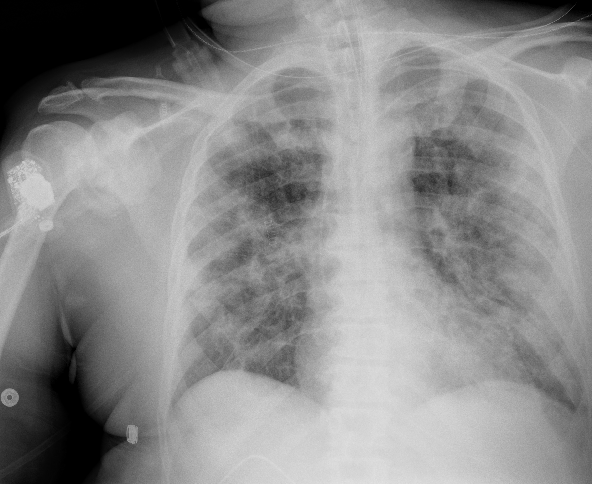

## 문제
A 64-year-old man with COVID-19 pneumonia has been intubated and mechanically ventilated in the intensive care unit for 4 days. He required norepinephrine for the first 2 days, but vasopressors were discontinued 48 hours ago. His cumulative fluid balance is positive by 7 L. He is ventilated with a tidal volume of 6 mL/kg predicted body weight and a PEEP of 12 cm H2O; the plateau pressure is 26 cm H2O. His pulse is 88/min, and mean arterial pressure is 78 mm Hg. Arterial blood gas analysis on an FiO2 of 0.5 shows a PaO2 of 90 mm Hg. Serum lactate concentration is 1.2 mmol/L, and serum creatinine concentration is 0.9 mg/dL. A chest radiograph is shown. Which of the following is the most appropriate next step in management?

- A. Intravenous albumin infusion to raise oncotic pressure
- B. Maintenance crystalloid infusion at 150 mL/h
- C. Venovenous extracorporeal membrane oxygenation
- D. Increase tidal volume to 10 mL/kg predicted body weight
- E. Intravenous furosemide targeting a negative fluid balance

_Portable anteroposterior chest radiograph, unaltered apart from scaling (The Cancer Imaging Archive, CC BY 4.0; no cropping or window adjustment)_

## 정답 및 해설
> 정답: E

- **정답 핵심**: The radiograph shows an endotracheal tube and diffuse bilateral opacities; with a PaO2/FiO2 ratio of 180 on PEEP 12, this is moderate ARDS. Shock has resolved (off vasopressors 48 hours, normal lactate) and kidney function is normal, while he is 7 L positive. A conservative fluid strategy with diuretics to achieve a negative balance increases ventilator-free days without worsening kidney failure (FACTT).
- **원리**: <b>Why fluid matters in ARDS</b>: ARDS is noncardiogenic pulmonary edema — inflamed alveolar-capillary membranes leak protein-rich fluid even at normal hydrostatic pressure. Because the barrier is damaged, <b>every rise in capillary hydrostatic pressure pushes more fluid into the alveoli</b> than it would in a normal lung. Lowering intravascular volume after resuscitation therefore reduces lung water and improves compliance and oxygenation.  <b>Timing is the key</b>: in the shock phase, fluid is needed to restore perfusion. Once shock has resolved (no vasopressors, normal lactate, adequate urine output), the balance should be reversed. The FACTT trial showed that a conservative strategy (diuretics guided by CVP or PAOP) gave about 2.5 more ventilator-free days than a liberal strategy, with no increase in dialysis.  <b>What does not work</b>: albumin with furosemide improves oxygenation in hypoproteinemic patients but has no proven mortality benefit and is not routine; ECMO is reserved for severe ARDS (PaO2/FiO2 below about 80 despite optimal ventilation and prone positioning). Larger tidal volumes increase volutrauma and mortality.
- **비교**: <table><thead><tr><th style="width:26%">Feature</th><th style="width:37%">Conservative fluid (answer)</th><th>VV-ECMO (closest rival)</th></tr></thead><tbody> <tr><td>Who</td><td><b>Shock resolved, positive balance</b></td><td>Refractory severe hypoxemia</td></tr> <tr><td>Oxygenation threshold</td><td>Any ARDS severity</td><td>PaO2/FiO2 &lt; 80 for hours despite optimal care</td></tr> <tr><td>This patient</td><td><b>PaO2/FiO2 180, off pressors, lactate normal</b></td><td>Not severe enough; prone position not yet needed</td></tr> <tr><td>Risk</td><td>Hypovolemia, electrolyte loss</td><td>Bleeding, thrombosis, cannula complications</td></tr> </tbody></table> ECMO attracts students because the radiograph looks alarming, but the <b>numbers</b> decide: PaO2/FiO2 of 180 is moderate ARDS. The immediate lever is removing excess fluid.
- **오답 이유**:
  - (A) Albumin with diuretics can improve oxygenation in patients with low serum protein, but it has no proven survival benefit and is not standard; it becomes reasonable only as an adjunct when hypoalbuminemia limits diuresis.
  - (B) Liberal maintenance fluid was the comparator arm in FACTT and prolonged ventilation. It would be appropriate only if he were still hypotensive or had signs of hypoperfusion such as a rising lactate.
  - (C) VV-ECMO is for severe ARDS with PaO2/FiO2 below about 80 despite low tidal volume, high PEEP, and prone positioning. With a ratio of 180, it is premature; it would become the answer if hypoxemia were refractory.
  - (D) Tidal volumes of 10–12 mL/kg increase alveolar overdistension and raised mortality in the ARMA trial. Tidal volume should stay at 4–8 mL/kg with plateau pressure at or below 30 cm H2O, and there is no situation in ARDS where 10 mL/kg is preferred.
- **함정**: The radiograph looks severe, but the question is about phase: shock is over and the lungs are wet — remove fluid.
- **학습목표**: 쇼크가 해소된 급성호흡곤란증후군 환자에서 보존적(음성 균형) 수액 전략이 기계환기 기간을 줄임을 알고 이뇨제로 수액 균형을 음으로 만든다
- **근거·출처**: National Heart, Lung, and Blood Institute ARDS Clinical Trials Network. Comparison of two fluid-management strategies in acute lung injury (FACTT). N Engl J Med 2006;354:2564 · Fan E et al. An Official ATS/ESICM/SCCM Clinical Practice Guideline: Mechanical Ventilation in Adult Patients with ARDS. Am J Respir Crit Care Med 2017;195:1253 · TCIA COVID-19-AR, 64세 남 이동식 AP (teacher-only) · 작성자 판독(2026-10-01): 기관 내 관·비위관, 양폐 미만성 음영(아래쪽 우세), 뚜렷한 흉수 없음

## 출처
- COVID-19-AR, The Cancer Imaging Archive (CC BY 4.0) · series …78183425 · Creative Commons Attribution 4.0 International · https://www.cancerimagingarchive.net/data-usage-policies-and-restrictions/
