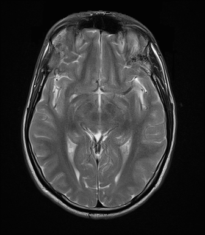

## 문제
A 29-year-old man comes to the physician because of daily headaches for 2 months. The headaches are worse in the morning. He has no history of trauma, fever, or visual disturbance. His temperature is 36.8°C, pulse is 70/min, and blood pressure is 124/78 mm Hg. Neurologic examination shows no focal deficits, and funduscopic examination is normal. MRI of the brain is obtained, and an axial image at the level of the midbrain is shown. Which of the following physical properties best explains the signal intensity of the cerebrospinal fluid in the sulci and cisterns on this image?

- A. Long T2 relaxation time of free water
- B. Short T1 relaxation time of free water
- C. Paramagnetic effect of gadolinium
- D. Restricted diffusion of water molecules
- E. Low proton density of cerebrospinal fluid

_Axial MRI of the brain, standard display orientation (patient's right on the viewer's left) (The Cancer Imaging Archive, CC BY 4.0; converted from DICOM without cropping)_

## 정답 및 해설
> 정답: A

- **정답 핵심**: The cerebrospinal fluid in the sylvian fissures, basal cisterns, and third ventricle is bright, and gray matter is brighter than white matter — a T2-weighted image. Free water has a long T2 relaxation time, so its transverse magnetization persists and it still gives strong signal at the long echo time used for T2 weighting.
- **원리**: <b>Relaxation times in one sentence each</b>: after the radiofrequency pulse, protons recover longitudinal magnetization with time constant T1 and lose transverse (phase) coherence with time constant T2. Free water has <b>long T1 and long T2</b>; fat has short T1; tissue with many macromolecules (myelin) shortens both.  <b>How weighting turns this into brightness</b>: a T2-weighted image uses a long TE (echo time). By then, tissues with short T2 have lost signal, while free water, whose T2 is long, is still coherent — so <b>fluid is bright</b>. A T1-weighted image uses a short TR; tissues with short T1 (fat, gadolinium-enhanced tissue, white matter) have recovered and appear bright, whereas water with long T1 stays dark.  <b>Reading the image</b>: CSF bright and gray matter brighter than white matter (myelin shortens T2) → T2. On T1 the pattern reverses (CSF dark, white matter brighter than gray). FLAIR is T2-weighted with an inversion pulse that nulls free water, so CSF becomes dark while edema stays bright.
- **비교**: <table><thead><tr><th style="width:26%">Feature</th><th style="width:37%">T2-weighted (this image)</th><th>T1-weighted (closest rival)</th></tr></thead><tbody> <tr><td>CSF</td><td><b>Bright — long T2 of free water</b></td><td>Dark — long T1 of free water</td></tr> <tr><td>Gray vs white matter</td><td><b>Gray brighter</b></td><td>White brighter</td></tr> <tr><td>Key parameter</td><td>Long TE</td><td>Short TR</td></tr> <tr><td>What else is bright</td><td>Edema, cysts, most lesions</td><td>Fat, gadolinium, methemoglobin</td></tr> </tbody></table> The same free water has both a long T1 and a long T2; which one you "see" depends on the weighting. Bright CSF means the long T2 is being displayed.
- **오답 이유**:
  - (B) Free water has a long T1, not a short one, and appears dark on T1-weighted images. Short T1 produces brightness on T1 images, as with fat or methemoglobin; this option would describe a bright fat signal.
  - (C) Gadolinium shortens T1 and brightens tissue where the blood-brain barrier is disrupted on T1-weighted images. CSF does not normally enhance, and it would apply only to enhancing lesions or leptomeningeal disease.
  - (D) Restricted diffusion makes tissue bright on diffusion-weighted imaging, as in acute infarction or abscess. CSF diffuses freely and is dark on DWI, so this would be the answer only for a bright lesion on a DWI sequence.
  - (E) CSF has a high, not low, proton density because it is almost pure water. Low proton density explains dark signal in cortical bone or air, and it would be correct for those structures.
- **함정**: Bright fluid plus gray matter brighter than white matter means T2 weighting; the physical reason is the long T2 of free water.
- **학습목표**: T2 강조 MRI 에서 뇌척수액이 밝은 이유가 자유수의 긴 T2 이완시간임을 알고, 영상에서 뇌척수액·회색질·백질 신호로 강조 방식을 읽는다
- **근거·출처**: Bitar R et al. MR pulse sequences: what every radiologist wants to know but is afraid to ask. RadioGraphics 2006;26:513 · Harrison's Principles of Internal Medicine, 21st ed. — neuroimaging (MRI principles) · TCIA UPENN-GBM, 29세 남 축상 T2 (teacher-only — 이 단면에 병변 없음) · 작성자 판독(2026-10-01): 가쪽고랑·뇌바닥 수조·셋째뇌실 뇌척수액이 밝고 회색질이 백질보다 밝다

## 출처
- The Cancer Imaging Archive (CC BY 4.0) · series …48436872 · Creative Commons Attribution 4.0 International · https://www.cancerimagingarchive.net/data-usage-policies-and-restrictions/
