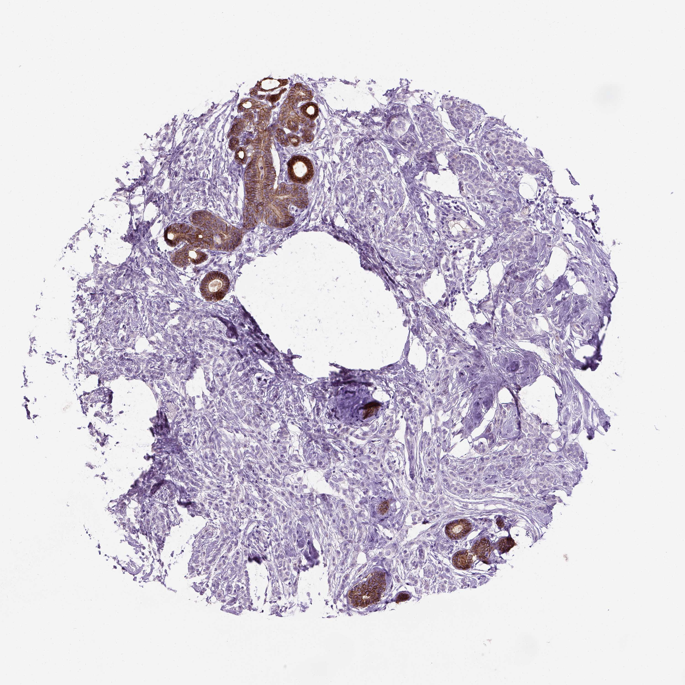

## 문제
49세 여자가 3개월 전부터 왼쪽 유방이 단단해진 느낌이 있어 왔다. 유방촬영술에서는 뚜렷한 종괴 없이 구조 왜곡만 보였고 초음파에서 경계가 불분명한 저에코 병변이 있었다. 중심부바늘생검에서 작고 균일한 종양 세포가 간질 사이로 한 줄씩 늘어서 침윤하였고 관 형성은 없었다. 에스트로겐 수용체는 양성, HER2 는 음성이었다. 유방 종양 조직 절편의 E-cadherin 면역조직화학염색 결과는 그림과 같다. 가장 가능성이 높은 진단은?

- A. 수질암종
- B. 점액암종
- C. 관상피내암종
- D. 침윤성 소엽암종
- E. 침윤성 관암종

_조직 마이크로어레이 코어의 면역조직화학염색(DAB 갈색, 헤마톡실린 대조염색), 원 배율 (Human Protein Atlas, CC BY 4.0 — 크롭·보정 없음)_

## 정답 및 해설
> 정답: D

- **정답 핵심**: 그림에서 간질에 흩어져 침윤한 작은 종양 세포들은 세포막 염색이 전혀 없고, 같은 코어의 남아 있는 정상 관·소엽 상피만 세포막이 진한 갈색이다(내부 양성 대조). E-cadherin 소실은 침윤성 소엽암종의 특징이다.
- **원리**: <b>E-cadherin 이 하는 일</b>: E-cadherin(CDH1 유전자)은 상피세포끼리 붙게 하는 칼슘 의존성 부착 단백이다. 세포막에서 이웃 세포의 E-cadherin 과 맞물리고, 안쪽은 카테닌을 통해 액틴 골격에 연결된다. 그래서 정상 상피와 관암종은 세포막이 벌집처럼 갈색으로 그려진다.  <b>소엽암종에서 왜 사라지나</b>: 침윤성 소엽암종은 CDH1 의 돌연변이·결실·메틸화로 E-cadherin 이 없어진다. 세포끼리 붙지 못하니 덩어리·관을 만들지 못하고 <b>한 줄로(single file) 흩어져</b> 간질을 파고든다. 이 때문에 만져지는 뚜렷한 종괴보다 단단해진 느낌으로 오고, 유방촬영술에서 종괴 없이 구조 왜곡만 보여 늦게 발견되기 쉽다. 같은 이유로 양측·다발성 경향이 있고, 복막·위장관·난소 같은 특이한 곳으로 전이한다.  <b>판독 요령</b>: 음성 판정은 <b>내부 양성 대조</b>(같은 절편의 정상 관)가 염색되었을 때만 믿는다. 정상 관도 음성이면 염색 실패일 수 있다. 생식세포 CDH1 돌연변이는 유전성 미만형 위암과도 연결된다.
- **비교**: <table><thead><tr><th style="width:26%">항목</th><th style="width:37%">침윤성 소엽암종(정답)</th><th>침윤성 관암종(가장 가까운 오답)</th></tr></thead><tbody> <tr><td>E-cadherin</td><td><b>소실(음성)</b> — 정상 관만 양성</td><td>세포막 양성</td></tr> <tr><td>조직 배열</td><td>작은 균일 세포의 한 줄 침윤, 관 없음</td><td>관·둥지·덩어리 형성</td></tr> <tr><td>영상</td><td>종괴 없이 구조 왜곡, 과소평가</td><td>침상 종괴</td></tr> <tr><td>임상 경향</td><td>양측·다발성, 복막·위장관 전이</td><td>폐·간·뼈·뇌 전이</td></tr> </tbody></table> 두 종양 모두 ER 양성일 수 있어 호르몬 수용체로는 가를 수 없다. <b>E-cadherin 이 종양 세포에서 빠졌는가</b>가 갈림길이다.
- **오답 이유**:
  - ① 수질암종은 경계가 좋은 합포체성 큰 세포와 림프구 침윤이 특징이고 흔히 삼중음성이다. ER 양성·한 줄 침윤과 맞지 않으며, 경계가 매끈한 종괴에 삼중음성이었다면 고려한다.
  - ② 점액암종은 세포 밖 점액 호수 속에 종양 세포 덩어리가 떠 있는 모양이고 고령에 예후가 좋다. 점액 호수가 보였다면 정답이 되지만 이 조직에는 점액이 없다.
  - ③ 관상피내암종은 기저막을 넘지 않고 관 안에 머문다. 생검에서 간질 침윤이 확인되었고 종양 세포가 관 밖에 흩어져 있어 해당하지 않으며, 침윤이 없었다면 고려한다.
  - ⑤ 침윤성 관암종은 가장 흔한 유방암이지만 종양 세포가 E-cadherin 세포막 양성이고 관·둥지를 만든다. 종양 세포 막이 갈색으로 염색되었다면 정답이 된다.
- **함정**: ER 양성은 소엽·관 모두 가능하다 — 정상 관만 갈색이고 흩어진 종양 세포가 음성이면 소엽암종이다.
- **학습목표**: E-cadherin 면역조직화학에서 종양 세포는 음성이고 정상 관 상피만 양성인 소견을 읽고 침윤성 소엽암종으로 진단한다
- **근거·출처**: WHO Classification of Tumours Editorial Board. Breast Tumours, 5th ed. Lyon: IARC; 2019 — invasive lobular carcinoma · Robbins and Cotran Pathologic Basis of Disease, 10th ed. — breast carcinoma, lobular carcinoma · Human Protein Atlas — CDH1, breast cancer (lobular carcinoma), 49세 여 (teacher-only) · 작성자 판독(2026-10-01): 간질에 흩어진 종양 세포 막 염색 없음, 잔존 정상 관 세포막 양성

## 출처
- Human Protein Atlas, CDH1 / Breast cancer (CC BY 4.0), https://images.proteinatlas.org/72855/157193_A_6_7.jpg · Creative Commons Attribution 4.0 International · https://www.proteinatlas.org/about/licence
