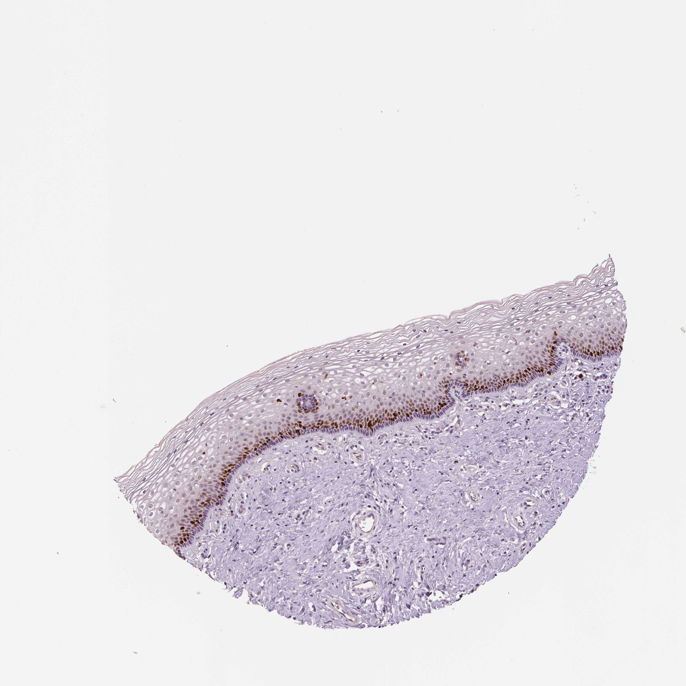

## 문제
34세 여자가 자궁경부 세포검사 이상으로 왔다. 세포검사는 비정형 편평세포(ASC-US)였고 고위험 인유두종바이러스(HPV) 검사는 양성(16·18형 음성)이었다. 이전 검진 결과는 모두 정상이었고 흡연하지 않으며 면역저하 질환은 없다. 질확대경검사에서 변형대가 모두 보였고 옅은 아세트산 백색 부위에서 조직검사를 하였다. 헤마톡실린-에오신 염색에서 편평상피는 표층까지 정상적으로 성숙하였다. 자궁경부 조직 절편의 Ki-67 면역조직화학염색 결과는 그림과 같다. 다음 처치로 가장 적절한 것은?

- A. 1년 뒤 HPV 검사 또는 병합검사
- B. 고리전기절제술(LEEP)
- C. 냉동요법
- D. 6개월마다 세포검사 3회
- E. 자궁절제술

_조직 마이크로어레이 코어의 면역조직화학염색(DAB 갈색, 헤마톡실린 대조염색), 원 배율 (Human Protein Atlas, CC BY 4.0 — 크롭·보정 없음)_

## 정답 및 해설
> 정답: A

- **정답 핵심**: 그림에서 Ki-67 양성 핵은 기저막 위 방기저층 1~2층의 띠에만 있고 중간층·표층은 음성이며 세포가 위로 갈수록 넓어진다 — 증식이 아래쪽에 국한된 정상 성숙이다. 고등급 병변(CIN2·3)이면 증식 세포가 상피 중간층 이상까지 올라온다. ASC-US·HPV 양성에서 조직검사가 CIN2 미만이면 즉시 치료하지 않고 1년 뒤 HPV 기반 검사로 추적한다(ASCCP 2019).
- **원리**: <b>Ki-67 은 무엇을 보여 주나</b>: Ki-67 은 세포주기 G1·S·G2·M 기에 있는 세포의 핵에만 있고 휴지기(G0)에는 없다. 정상 중층편평상피는 기저층·방기저층의 줄기·전구세포만 분열하고, 위로 올라가며 분화해 분열을 멈춘다. 그래서 정상에서는 <b>아래쪽 띠에만</b> 갈색 핵이 있다.  <b>이형성에서 무엇이 달라지나</b>: 고위험 HPV 의 E7 이 Rb 를 불활성화하면 분화 중인 세포도 계속 세포주기에 머문다. 그 결과 Ki-67 양성 세포가 상피 두께의 1/3(CIN1)을 넘어 2/3(CIN2)·전층(CIN3)까지 올라오고, p16 이 미만성 강양성이 된다. 즉 <b>증식 세포가 얼마나 위까지 올라왔는가</b>가 등급의 대리 지표다.  <b>관리로 이어지는 논리</b>: HPV 감염의 대부분은 1~2년 안에 면역으로 사라지고 저등급 변화도 대부분 저절로 좋아진다. 그래서 CIN2 미만이면 치료로 얻는 이득보다 절제술의 해(조산·경관 협착)가 커서 1년 뒤 HPV 검사로 지켜본다. CIN2 이상일 때 절제술을 한다.
- **비교**: <table><thead><tr><th style="width:26%">항목</th><th style="width:37%">1년 뒤 HPV 검사(정답)</th><th>고리전기절제술(가장 가까운 오답)</th></tr></thead><tbody> <tr><td>조직 결과</td><td><b>CIN2 미만(정상·CIN1)</b></td><td>CIN2·CIN3(HSIL)</td></tr> <tr><td>Ki-67 분포</td><td><b>방기저층 띠에 국한</b></td><td>중간층 이상·전층</td></tr> <tr><td>근거</td><td>대부분 저절로 소실</td><td>진행 위험이 있어 제거</td></tr> <tr><td>대가</td><td>추적 부담</td><td>조산·경관 협착 위험</td></tr> </tbody></table> 세포검사가 HSIL 이었거나 HPV16 양성이면 위험이 올라가 판단이 달라진다. 이 환자는 ASC-US·16/18 음성·조직 CIN2 미만이라 추적이 맞다.
- **오답 이유**:
  - ② 고리전기절제술은 조직검사에서 CIN2·CIN3 가 확인되었을 때의 치료다. 증식 세포가 중간층 이상까지 올라왔다면 정답이 되지만, 이 조직은 방기저층에 국한되어 있어 과잉 치료다.
  - ③ 냉동요법은 변형대가 모두 보이는 CIN2 이상에서 제거술 대신 쓸 수 있는 파괴술이다. 병변 등급이 확인되지 않은 채 조직을 없애는 것이라 CIN2 미만에는 쓰지 않는다.
  - ④ 6개월 간격 세포검사는 HPV 검사를 쓸 수 없던 옛 추적 방식이다. 지금은 HPV 기반 검사가 민감도가 높아 1년 뒤 HPV 검사가 표준이고, HPV 검사를 할 수 없는 곳에서만 고려한다.
  - ⑤ 자궁절제술은 CIN 의 일차 치료가 아니며 반복 재발한 고등급 병변에 다른 적응증이 겹칠 때나 고려한다. 34세의 CIN2 미만에는 해당하지 않는다.
- **함정**: HPV 양성이라는 말에 끌려 절제하지 않는다 — 조직이 CIN2 미만이면 추적이다. Ki-67 이 아래쪽에만 있으면 고등급이 아니다.
- **학습목표**: Ki-67 양성 세포가 방기저층에 국한되고 위쪽이 정상 성숙하는 소견을 고등급 병변이 아닌 것으로 읽고, ASC-US·HPV 양성에서 CIN2 미만이면 1년 뒤 재검으로 추적한다
- **근거·출처**: Perkins RB et al. 2019 ASCCP Risk-Based Management Consensus Guidelines for Abnormal Cervical Cancer Screening Tests and Cancer Precursors. J Low Genit Tract Dis 2020;24:102 · Darragh TM et al. The Lower Anogenital Squamous Terminology Standardization Project (LAST). Arch Pathol Lab Med 2012;136:1266 · Human Protein Atlas — MKI67, cervix (normal), 34세 여 (teacher-only) · 작성자 판독(2026-10-01): Ki-67 양성 핵이 방기저층 1~2층 띠에만, 중간층·표층 음성, 정상 성숙

## 출처
- Human Protein Atlas, MKI67 / Cervix (CC BY 4.0), https://images.proteinatlas.org/58/155454_B_9_3.jpg · Creative Commons Attribution 4.0 International · https://www.proteinatlas.org/about/licence
