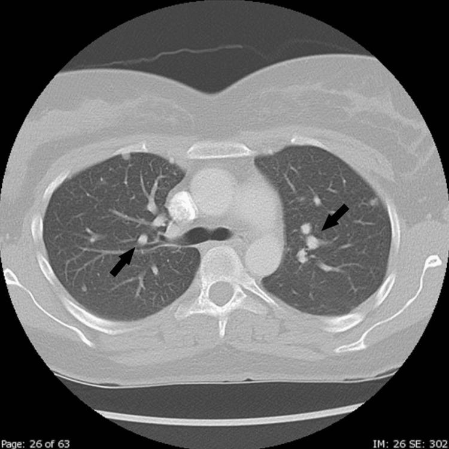

## 문제
31세 여자가 포상기태 추적 검사를 위해 왔다. 3개월 전 완전포상기태로 흡입소파술을 받았고 그 뒤 매주 혈청 β-hCG 를 측정하였다. 최근 3주 동안 β-hCG 는 4,200 → 6,800 → 9,600 mIU/mL 로 계속 올랐다. 질 출혈은 조금 있고 기침·객혈·두통은 없다. 항암치료를 받은 적이 없고 다음 임신을 원한다. 혈압 118/74 mmHg, 맥박 76회/분이다. 질경 검사에서 질 병변은 없다. 질초음파에서 자궁근층에 지름 2 cm 의 혈류가 풍부한 병변이 있다. 뇌 MRI 와 복부 CT 는 정상이고, 흉부 CT 에서 결절은 모두 4개, 가장 큰 것이 1 cm 였다. 흉부 CT 의 한 단면은 그림과 같다. 치료로 가장 적절한 것은?

- A. 폐 결절 쐐기절제술
- B. 두 번째 흡입소파술
- C. 메토트렉세이트 단독 항암화학요법
- D. EMA-CO 복합 항암화학요법
- E. 전자궁절제술

_흉부 CT 축상면 폐창 — 출판된 증례 그림 한 컷 그대로, 화살표는 원 그림의 것 (PMC Open Access Subset, CC BY — 크롭·보정 없음)_

## 정답 및 해설
> 정답: C

- **정답 핵심**: 그림에서 양폐에 경계가 매끈한 작은 결절이 여러 개 보인다(화살표) — 포상기태 뒤 β-hCG 가 3주 연속 오르므로 임신영양막종양(GTN)의 폐 전이이며 FIGO III 기다. 치료는 병기가 아니라 WHO 위험점수로 정한다: 나이 40세 미만 0, 선행 임신 포상기태 0, 간격 4개월 미만 0, 치료 전 hCG 10³~10⁴ 1, 최대 종양 3 cm 미만 0, 전이 부위 폐 0, 전이 수 1~4개 1, 이전 항암 실패 0 → 합계 2점, 저위험이다. 저위험 GTN 은 메토트렉세이트(또는 악티노마이신 D) 단독요법이 표준이고 완치율이 거의 100 %다.
- **원리**: <b>왜 조직검사 없이 치료하나</b>: 포상기태 뒤 GTN 은 β-hCG 만으로 진단한다(3주 이상 정체 또는 2주 이상 상승, 융모막암종 조직, 전이). 영양막 조직은 혈관이 매우 풍부해 폐·질 병변을 생검하면 대량 출혈이 날 수 있고, β-hCG 가 종양량을 거의 그대로 반영하는 표지자라서 조직 없이도 치료 반응을 정확히 추적할 수 있다.  <b>병기와 위험점수는 하는 일이 다르다</b>: FIGO 병기(I 자궁, II 골반, III 폐, IV 뇌·간 등)는 해부학적 범위를 말하고, WHO 예후점수는 <b>단일 약제에 내성일 가능성</b>을 말한다. 폐는 영양막 세포가 정맥을 타고 가장 먼저 걸리는 곳이라 폐 전이 자체는 0점이다. 점수를 올리는 것은 높은 hCG(10⁵ 이상 4점), 긴 간격(12개월 이상 4점), 뇌·간 전이(4점), 많은 전이 수(8개 초과 4점), 만삭 임신 뒤 발생, 이전 항암 실패다.  <b>그래서</b> 0~6점은 메토트렉세이트 단독, 7점 이상은 EMA-CO 같은 복합요법이다. 단독요법이 실패해도 2차 약제로 거의 모두 완치되므로, 처음부터 독성이 큰 복합요법을 쓰지 않는다. 자궁을 남길 수 있어 임신을 원하는 환자에게도 맞다.
- **비교**: <table><thead><tr><th style="width:26%">항목</th><th style="width:37%">메토트렉세이트 단독(정답)</th><th>EMA-CO 복합요법(가장 가까운 오답)</th></tr></thead><tbody> <tr><td>WHO 점수</td><td><b>0~6점(저위험)</b> — 이 환자 2점</td><td>7점 이상(고위험)</td></tr> <tr><td>전형적 상황</td><td>포상기태 뒤 짧은 간격, hCG 10⁵ 미만, 폐 전이 소수</td><td>만삭 뒤 융모막암종, 뇌·간 전이, hCG 10⁵ 이상</td></tr> <tr><td>독성</td><td>구내염·간효소 상승 정도</td><td>골수억제·탈모·이차 백혈병 위험</td></tr> <tr><td>완치율</td><td>단독 실패 후 2차까지 포함해 거의 100 %</td><td>고위험군에서 약 85~90 %</td></tr> </tbody></table> 「폐 전이 = III 기 = 강한 항암」이라는 연결이 함정이다. III 기라도 점수가 낮으면 단독요법이고, I 기라도 점수가 7 이상이면 복합요법이다.
- **오답 이유**:
  - ① 폐 결절 절제는 항암에 끝까지 남는 약제 내성 단일 병소를 없애는 구제 수술이다. 첫 치료에서 항암 없이 폐를 절제하면 다른 미세 전이가 남는다.
  - ② 두 번째 소파술은 자궁강 안 잔여 조직이 원인인 일부 저위험 예에서 논의되지만, 이미 폐 전이가 있는 GTN 의 표준 치료가 아니고 자궁 천공·출혈 위험만 더한다.
  - ④ EMA-CO 는 WHO 점수 7점 이상 고위험 GTN 의 표준이다. 이 환자가 hCG 10⁵ 이상이거나 전이가 8개를 넘었거나 간·뇌 전이가 있었다면 정답이 된다.
  - ⑤ 자궁절제술은 임신을 더 원하지 않는 저위험 비전이 GTN 에서 항암 횟수를 줄이려 고려하거나, 조절되지 않는 자궁 출혈·약제 내성 자궁 병변에 쓴다. 임신을 원하고 폐 전이가 있는 이 환자의 일차 치료가 아니다.
- **함정**: 폐 전이를 보고 복합 항암·수술로 가지 않는다 — WHO 점수를 세면 2점, 저위험이다.
- **학습목표**: 포상기태 뒤 β-hCG 가 상승하면 임신영양막종양으로 진단하고, 폐 전이가 있어도 WHO 위험점수가 0~6 이면 메토트렉세이트 단독요법으로 치료한다
- **근거·출처**: Ngan HYS et al. Diagnosis and management of gestational trophoblastic disease: 2021 update. Int J Gynaecol Obstet 2021;155 Suppl 1:86 · NCCN Clinical Practice Guidelines in Oncology: Gestational Trophoblastic Neoplasia (2024) · PMC12133212 Figure 2 — 31세 여 증례 보고의 흉부 CT (teacher-only) · 작성자 판독(2026-10-02): 대동맥궁·기관 분기 높이 폐창에서 양폐에 경계 매끈한 작은 결절 여러 개, 흉수 없음

## 출처
- Rapid Progression of Molar Pregnancy to Choriocarcinoma With Pulmonary Metastases. Cureus. 2025 May 4;17(5):e83452. doi: 10.7759/cureus.83452 (CC BY) — Figure 2 · CC BY · https://creativecommons.org/licenses/
