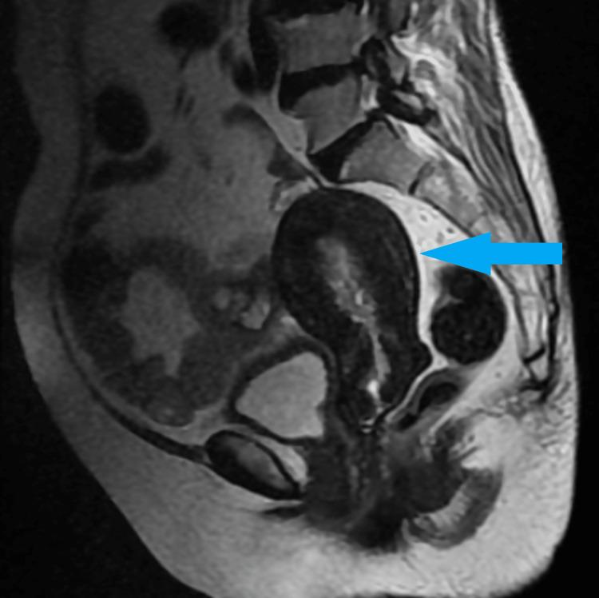

## 문제
A 65-year-old woman comes to the physician because of intermittent vaginal bleeding for 3 weeks. Menopause occurred at age 51 years, and she has never taken hormone therapy. She also reports new tenderness of both breasts. She has hypertension controlled with amlodipine. Her BMI is 24 kg/m2. Abdominal examination shows mild lower abdominal fullness. Pelvic examination shows a smooth, mobile, nontender right adnexal mass. There is no hirsutism, voice change, or clitoromegaly. Serum CA 125 concentration is 18 U/mL (N<35). Transvaginal ultrasonography shows a 9-cm, predominantly solid right ovarian mass with small cystic spaces and no ascites. A sagittal T2-weighted MRI of the pelvis is shown. Which of the following is the most likely diagnosis of the ovarian mass?

- A. Adult granulosa cell tumor
- B. Sertoli-Leydig cell tumor
- C. High-grade serous carcinoma
- D. Ovarian fibroma
- E. Dysgerminoma

_Sagittal T2-weighted MRI of the pelvis — single-panel figure as published, arrow as in the original (PMC Open Access Subset, CC BY; no cropping or color change)_

## 정답 및 해설
> 정답: A

- **정답 핵심**: The MRI shows a markedly thickened, high-signal endometrium surrounded by dark myometrium (arrow) — endometrial proliferation in a woman 14 years after menopause without hormone therapy. Together with breast tenderness and a solid ovarian mass, this points to an estrogen-secreting sex cord–stromal tumor. Adult granulosa cell tumor is the most common estrogen-producing ovarian tumor, typically in perimenopausal and postmenopausal women; up to half have endometrial hyperplasia and some have endometrial carcinoma.
- **원리**: <b>Where the estrogen comes from</b>: granulosa cells normally convert theca-derived androgens to estradiol with aromatase (FSH-driven). A tumor of granulosa cells keeps doing this autonomously, so a postmenopausal woman suddenly has premenopausal-range estradiol. The <b>end organs respond</b>: the endometrium proliferates (hyperplasia, sometimes endometrioid carcinoma — 5–10 %), breasts become tender, and bleeding resumes.  <b>Reading the MRI</b>: on T2-weighted images the normal postmenopausal endometrium is a thin bright stripe (a few millimeters). Here it is a thick bright band filling the cavity inside the dark myometrium — the imaging sign of estrogen stimulation. The image therefore tells you what the tumor <b>does</b>, which is what separates it from tumors of similar size and texture.  <b>Why the others fail</b>: Sertoli-Leydig tumors make androgens (virilization). Fibromas are hormonally inactive (Meigs syndrome with ascites and effusion). Serous carcinoma is the most common ovarian malignancy at this age but usually has high CA 125 and ascites and does not stimulate the endometrium. Dysgerminoma is a young-woman germ cell tumor (LDH, hCG). Inhibin is the serum marker used to follow granulosa cell tumors after surgery.
- **비교**: <table><thead><tr><th style="width:26%">Feature</th><th style="width:37%">Granulosa cell tumor (answer)</th><th>High-grade serous carcinoma (closest rival)</th></tr></thead><tbody> <tr><td>Hormone</td><td><b>Estrogen</b> — endometrial thickening, bleeding, breast tenderness</td><td>None</td></tr> <tr><td>Typical age</td><td>Peri- and postmenopausal (adult type)</td><td>Postmenopausal (60s)</td></tr> <tr><td>Imaging</td><td>Solid or solid-cystic mass, usually unilateral</td><td>Complex bilateral masses, ascites, peritoneal implants</td></tr> <tr><td>Marker</td><td>Inhibin, estradiol</td><td><b>CA 125 high in about 80 % of advanced cases</b></td></tr> </tbody></table> Both occur in 65-year-old women with an adnexal mass. The thick endometrium and normal CA 125 without ascites are what shift the answer from the most common malignancy to the hormonally active one.
- **오답 이유**:
  - (B) Sertoli-Leydig cell tumors secrete androgens and cause hirsutism, deepening voice, and clitoromegaly, usually in women under 40. It would be the answer if this patient had new virilization instead of estrogen effects.
  - (C) High-grade serous carcinoma is the most common ovarian malignancy at this age, but it typically presents with ascites, bilateral complex masses, and high CA 125, and it does not produce estrogen; it fits if CA 125 were markedly elevated with ascites.
  - (D) Ovarian fibroma is a solid hormonally inactive stromal tumor; it can cause ascites and pleural effusion (Meigs syndrome). It would be the answer if the endometrium were thin and there were ascites with a right pleural effusion.
  - (E) Dysgerminoma is a germ cell tumor of adolescents and young women, often with raised LDH and sometimes hCG. A 65-year-old with estrogen effects is far outside its usual setting; it fits a 20-year-old with a rapidly growing solid mass.
- **함정**: Do not default to the most common ovarian cancer at 65 — the thick endometrium is the clue that the tumor makes estrogen.
- **학습목표**: 에스트로겐을 만드는 난소 과립막세포종이 폐경 후 자궁내막 증식·출혈을 일으킴을 알고, 영상의 두꺼운 내막을 종양의 호르몬 효과로 연결한다
- **근거·출처**: Schumer ST, Cannistra SA. Granulosa cell tumor of the ovary. J Clin Oncol 2003;21:1180 · Williams Gynecology, 4th ed. — ovarian sex cord–stromal tumors · PMC9721141 Figure 2 — 65세 여 증례 보고의 골반 MRI (teacher-only) · 작성자 판독(2026-10-02): 시상면 T2 에서 저신호 근층 안에 두껍고 고신호인 자궁내막(화살표), 방광·직장 정상 위치

## 출처
- A Rare Case of Granulosa Cell Tumor Associated With Endometrial Carcinoma - A Case Report. Cureus. 2022 Nov 5;14(11):e31122. doi: 10.7759/cureus.31122 (CC BY) — Figure 2 · CC BY · https://creativecommons.org/licenses/
