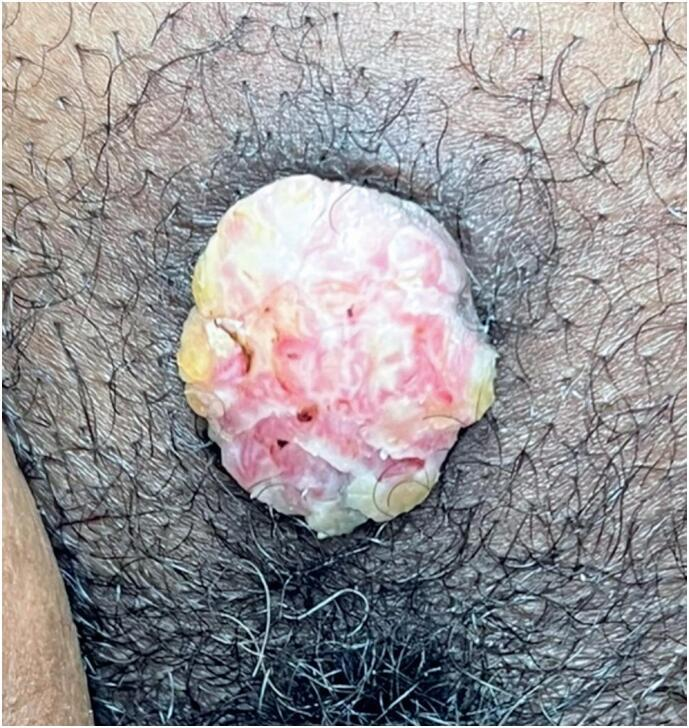

## 문제
42세 여자가 6개월 전부터 점점 커지는 치구의 혹으로 왔다. 처음에는 쌀알만 한 돌기였는데 최근 2개월 동안 빠르게 커졌고 속옷에 닿으면 피가 묻는다. 통증이나 가려움은 심하지 않다. 흡연하지 않으며 1년 전 자궁경부 세포검사는 정상이었다. 체온 36.7 ℃, 혈압 120/76 mmHg 이다. 치구의 병변은 그림과 같다. 다른 외음부 피부·질·자궁경부 진찰은 정상이고 양쪽 서혜부에 만져지는 림프절은 없다. 다음 단계로 가장 적절한 것은?

- A. 3개월 뒤 재진찰
- B. 병변 조직검사
- C. 이미퀴모드 크림 도포
- D. 냉동치료
- E. 근치적 국소절제술

_임상 사진 — 출판된 증례 그림 한 컷 그대로 (PMC Open Access Subset, CC BY — 크롭·보정 없음)_

## 정답 및 해설
> 정답: B

- **정답 핵심**: 그림은 치구의 지름 3~4 cm 단발성 외장형 종괴로 표면이 울퉁불퉁하고 미란·출혈점이 있다. 빠르게 커지고 접촉 출혈이 있는 단발성 외음부 종괴는 외음부암(대부분 편평세포암)을 배제할 수 없다. 외음부 병변은 모양만으로 양성·악성을 가를 수 없으므로 치료 전에 병변의 대표 부위(가장자리 포함)를 펀치 또는 쐐기 조직검사해 진단과 침윤 깊이를 확인한다.
- **원리**: <b>왜 먼저 조직인가</b>: 외음부의 융기성 병변은 곤지름, 지루각화증, 피부섬유종, 외음부 상피내종양(VIN), 편평세포암이 모두 비슷하게 보일 수 있다. <b>치료가 진단을 지워 버린다</b> — 이미퀴모드·냉동치료로 표면을 없애면 침윤암이었을 때 침윤 깊이를 잴 수 없고 진단이 늦어진다.  <b>침윤 깊이가 치료를 정한다</b>: 외음부 편평세포암은 침윤 깊이 1 mm 이하(IA)이면 광범위 국소절제만, 1 mm 를 넘으면 서혜부 림프절 평가(감시림프절 또는 절제)를 더한다. 그래서 진단 생검은 병변 가운데의 괴사 부위가 아니라 <b>정상 피부와의 경계를 포함</b>해 깊이까지 얻도록 하고, 병변 전체를 미리 잘라 내지 않는다(절제연·림프절 계획이 어긋난다).  <b>조직검사를 해야 하는 외음부 병변</b>: 빠른 성장, 출혈·궤양, 단발성 비대칭 병변, 색소 변화, 폐경 후 새 병변, 곤지름 치료에 반응하지 않는 경우다. 이 환자는 앞의 세 가지를 모두 가진다.
- **비교**: <table><thead><tr><th style="width:26%">항목</th><th style="width:37%">조직검사(정답)</th><th>이미퀴모드(가장 가까운 오답)</th></tr></thead><tbody> <tr><td>전제</td><td><b>진단이 확정되지 않은 의심 병변</b></td><td>임상적으로 전형적인 곤지름</td></tr> <tr><td>병변 모양</td><td>단발성·빠른 성장·출혈·궤양</td><td>여러 개의 작은 꽃양배추 모양 사마귀</td></tr> <tr><td>얻는 것</td><td>조직형·침윤 깊이 → 수술 범위 결정</td><td>면역 반응으로 HPV 병변 소실</td></tr> <tr><td>위험</td><td>작은 상처</td><td>암이면 진단 지연·병기 판정 불가</td></tr> </tbody></table> 곤지름처럼 보여도 단발성·출혈·빠른 성장이면 먼저 조직이다. 여러 개의 전형적인 작은 사마귀라면 국소 치료부터 할 수 있다.
- **오답 이유**:
  - ① 경과 관찰은 작고 변화 없는 전형적 양성 병변(예: 피지낭종)에서나 가능하다. 2개월 사이 빠르게 커지고 출혈하는 병변을 미루면 침윤암의 진단이 늦어진다.
  - ③ 이미퀴모드는 임상적으로 전형적인 곤지름이나 조직으로 확인된 VIN 에 쓴다. 여러 개의 작은 전형적 사마귀였다면 정답이 되지만, 출혈하는 단발성 종괴에서 진단 없이 쓰면 암을 놓친다.
  - ④ 냉동치료는 작고 전형적인 곤지름을 파괴하는 방법이다. 조직을 남기지 않아 침윤 깊이를 알 수 없게 되므로, 조직으로 양성이 확인된 작은 병변에서만 적절하다.
  - ⑤ 근치적 국소절제술은 조직검사로 침윤성 외음부암이 확인된 뒤 침윤 깊이에 따라 서혜부 림프절 처치와 함께 계획하는 치료다. 진단 전에 먼저 하면 절제연과 림프절 계획이 맞지 않는다.
- **함정**: 곤지름처럼 보인다고 바로 바르거나 얼리지 않는다 — 단발성·빠른 성장·출혈은 조직검사의 적응증이다.
- **학습목표**: 빠르게 커지고 출혈하는 외음부 단발성 종괴는 치료 전에 조직검사로 외음부암을 확인해야 함을 안다
- **근거·출처**: ACOG Practice Bulletin No. 224: Management of vulvar intraepithelial neoplasia / NCCN Vulvar Cancer (Squamous Cell Carcinoma) Guidelines 2024 · Olawaiye AB et al. FIGO staging for carcinoma of the vulva: 2021 revision. Int J Gynaecol Obstet 2021;155:43 · PMC12539858 Figure 1 — 42세 여 증례 보고의 임상 사진 (teacher-only) · 작성자 판독(2026-10-02): 치구의 약 3~4 cm 외장형 융기 종괴, 표면 울퉁불퉁·분홍·황백색, 미란·출혈점

## 출처
- HPV-independent vulvar squamous cell carcinoma: a case report and review of the literature. Einstein (Sao Paulo). 2025 Oct 13;23:eRC1482. doi: 10.31744/einstein_journal/2025RC1482 (CC BY) — Figure 1 · CC BY · https://creativecommons.org/licenses/
